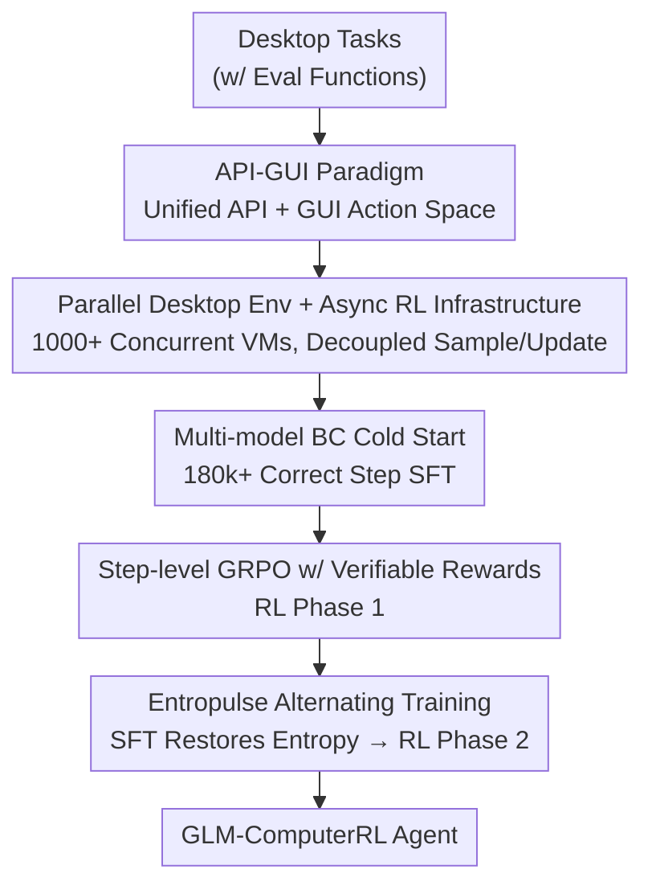

# ComputerRL: Scaling End-to-End Online Reinforcement Learning for Computer Use Agents

**Conference**: ICLR2026  
**OpenReview**: [https://openreview.net/forum?id=oEVfNf0w4B](https://openreview.net/forum?id=oEVfNf0w4B)  
**Code**: https://github.com/THUDM/ComputerRL  
**Area**: Reinforcement Learning / Computer Use Agents / GUI Agent  
**Keywords**: End-to-end Online RL, API-GUI, Desktop Agent, Entropy Collapse, step-level GRPO

## TL;DR
ComputerRL proposes an end-to-end online RL framework for desktop computer use agents. It unifies programmatic API calls and human-like GUI operations into a single action space via the API-GUI paradigm, establishes a distributed asynchronous RL infrastructure capable of running thousands of concurrent virtual desktops, and utilizes Entropulse (alternating RL and SFT) to combat entropy collapse during long training. Consequently, the 9B GLM-ComputerRL achieves a 48.9% success rate on OSWorld, surpassing larger closed/open-source agents such as OpenAI CUA o3, UI-TARS-1.5, and Claude 4.

## Background & Motivation
**Background**: Driving LLM-based agents to autonomously operate desktops (clicking, scrolling, typing, cross-app collaboration) has become a research focus. The mainstream approach involves feeding screenshots into multimodal models for step-by-step GUI operations, primarily trained via behavior cloning (BC)—either through manual trajectory labeling or distillation from stronger teacher models.

**Limitations of Prior Work**: This path faces three bottlenecks. First, GUIs are designed for humans; simulating mouse and keyboard operations is cumbersome and inefficient for machine agents, often requiring dozens of steps for a single task. Second, BC has poor scalability: manual labeling is prohibitively expensive for complex tasks, while model distillation is capped by the teacher model's capability, both leading to weak generalization and an inability to recover from errors. Third, although RL shows potential for desktop automation, the environment is complex with slow convergence and low sampling efficiency, making large-scale online RL engineering difficult. Even when operational, long training sessions suffer from entropy collapse and rising KL divergence, exhausting exploration and capping performance early.

**Key Challenge**: To improve, agents require large-scale end-to-end online RL, but the combination of "human-centric GUI action spaces + non-scalable desktop environments + entropy collapse in long training" makes this approach difficult to scale in practice.

**Goal**: To successfully "run and scale" end-to-end online RL for desktop agents. Specifically: (1) redesign a machine-friendly, efficient action space; (2) build a stable desktop environment and asynchronous training infrastructure capable of thousands of concurrent instances; (3) design an RL algorithm that sustains growth during long training without being stifled by entropy collapse.

**Key Insight**: The authors observe that agents need not strictly follow human interaction paradigms—many desktop operations (highlighting, comparing, playing, spreadsheet calculations) can be completed with a single API call, bypassing step-by-step GUI interactions. Using APIs as "shortcut actions" alongside GUIs retains generality while gaining efficiency. Furthermore, entropy collapse in long training occurs because RL optimization makes policies increasingly deterministic; SFT on successful trajectories can "push back" the entropy, thus alternating RL and SFT extends training viability.

**Core Idea**: Scaling end-to-end online RL for desktop agents using "API-GUI hybrid action space + distributed asynchronous RL with thousands of concurrent desktops + Entropulse alternating RL/SFT," relying on scaled online trial-and-error rather than teacher imitation for capability and generalization.

## Method

### Overall Architecture
ComputerRL is a complete pipeline from "task sets" to "desktop-operating RL agents," divided into a "framework layer" and a "training layer." The framework layer addresses how agents interact with the desktop, how environments parallelize, and how RL samples efficiently: the API-GUI paradigm unifies the action space, a scalable Ubuntu environment provides thousands of concurrent desktops, and a fully asynchronous RL framework decouples sampling from updates. The training layer executes a three-stage curriculum: cold-starting with behavior cloning via multi-model trajectories, a first round of RL using step-level GRPO with verifiable rewards, and finally alternating Entropulse to restore entropy followed by a second round of RL. The input consists of desktop tasks with evaluation functions, and the output is the final GLM-ComputerRL agent.

### Key Designs

**1. API-GUI Paradigm: Replacing human-only GUI operations with a machine-friendly hybrid action space**

To address "GUI being human-centric and pure click simulation being slow," the authors expanded the action space from "GUI only" to "API call + GUI operation." Tasks easily solved via API (e.g., spreadsheet calculations, document highlighting, media playback) use programmatic interfaces, while long-tail operations without API coverage still use GUI, balancing efficiency and generality. To reduce the cost of creating APIs for various apps, they built an LLM-driven automated API construction pipeline. Given "example tasks," the system generates interfaces in three steps: **Requirement Analysis** (LLM analyzes examples, extracts functions, compares with existing ones to find gaps, prioritizing generic functions), **API Implementation** (implementing interfaces using Python libraries with error handling), and **Test Case Generation** (verifying no runtime errors and correctness across parameters; failed interfaces are fed back for LLM self-correction). This allows for low-cost API generation for multiple Ubuntu apps. Ablation shows that API-GUI on GPT-4o achieves a 26.2% success rate, 134% higher than GUI-only (11.2%), with Office domain performance jumping from 6.2% to 27.9%, requiring only ~1/3 the steps of the strongest baseline.

**2. Large-scale Parallel Desktop Environment and Async RL Infrastructure: Making online RL scalable**

To address "slow sampling, unstable environments, and poor scalability," the authors rebuilt the OSWorld infrastructure. The original OSWorld had heavy CPU usage, frequent freezes under high concurrency, and lacked multi-node support. Their modifications include: standardizing environment execution and compute backends via AgentBench API, deploying lightweight qemu-in-docker container VMs to reduce CPU overhead, using gRPC to link CPU nodes into a distributed cluster for centralized scheduling, and adding Web visualization for monitoring. This infrastructure supports over a thousand concurrent desktop instances. On the training side, they utilized the AgentRL asynchronous framework: **Resource Partitioning** isolates data collection and training; **Dynamic Batch Size** allows trainers to consume data with flexible batches; **Module Isolation** runs actor/reference/critic independently via PyTorch distributed groups and NCCL; **Off-policy Bias Suppression** limits replay buffer size and synchronizes trajectories after updates to ensure data remains close to the latest policy. Decoupling sampling and updates significantly improved throughput and GPU utilization.

**3. Multi-model Behavior Cloning Cold Start: Using heterogeneous teachers for high-quality initial trajectories**

To address "homogeneous trajectories from a single teacher," the authors perform BC cold start before RL. They collected 8k tasks (each with evaluation functions) and performed data collection in three steps: **Initial Sampling** using multiple closed-source LLMs to independently sample trajectories for each task; **Result Stratification** categorizing tasks into completely solved (acc=100%), partially solved (0<acc<100%), and unsolved (acc=0%); **Task-oriented Stratified Enhancement** for partially solved tasks by SFT-ing the backbone model and re-sampling to expand coverage. For unsolved tasks, they used a high-level model pool where each action is randomly selected from different models, leveraging "inter-model variance" to create trajectories no single model could generate. After filtering, only successful trajectories (180k+ correct steps) were used for SFT. This provides the model with solid desktop operation and basic reasoning capabilities for subsequent RL exploration.

**4. Step-level GRPO with Verifiable Rewards: Lowering GRPO to step-level with rule-based rewards**

To address "noisy RL signals and difficult trajectory-level credit assignment," the authors extended GRPO to the step-level. For each task $\tau$, the policy $\pi_\theta$ samples $G$ trajectories, where the $i$-th trajectory contains $L_i$ step-level actions $o_{i,1},\dots,o_{i,L_i}$. All steps from the same task are grouped to calculate advantages:

$$A_{i,j} = \frac{r_{i,j} - \mathrm{mean}(R)}{\mathrm{std}(R)}, \quad R = \{r_{u,v} \mid u=1,\dots,G,\; v=1,\dots,L_u\}$$

The objective function averages the PPO-style clipped ratio across all steps and subtracts the $\beta D_{\mathrm{KL}}(\pi_\theta \| \pi_{\mathrm{ref}})$ regularization term. Rewards are verifiable and rule-based: in successful trajectories, each correctly formatted action contributing to the solution receives a reward of 1; failed trajectories or malformed actions receive 0. Unlike traditional methods using Bellman equations, this treats each prompt-response pair as an independent training instance where rewards are directly determined by the final outcome, explicitly coupling agent behavior with task success.

**5. Entropulse Training: Using SFT on correct trajectories to restore entropy during long training**

To address "entropy collapse and performance plateaus after hundreds of steps," the authors proposed Entropulse. Finding that increasing clip thresholds (DAPO-style) slowed performance gains, they observed a fundamental difference: RL optimization causes monotonic entropy decline, while SFT on correct trajectories can increase entropy and trajectory diversity. They retain all successful trajectories generated by various policies and training steps from RL Phase 1 (data typically discarded). They construct a new SFT set by randomly selecting successful trajectories per task. This set is high-quality (complete success), diverse (from heterogeneous policies), and computationally efficient (reused interactions). SFT on this set maintains performance while increasing policy entropy. Resuming with RL Phase 2 then allows the model to break through the initial plateau. Ablations show RL1 improved BC from 31.9% to 42.0%, Entropulse maintained 41.5% while increasing entropy, and RL2 ultimately reached 45.8%.

## Key Experimental Results

### Main Results
On OSWorld and OSWorld-Verified benchmarks, the 9B GLM-ComputerRL achieved SOTA, outperforming larger closed/open-source agents; RL contributed approximately 66% relative improvement.

| Agent | Params | OSWorld | OSWorld-Verified |
|--------|--------|---------|------------------|
| Claude 4.0 Sonnet | - | 30.7 | 43.9 |
| Agent S2 w/ Gemini-2.5-Pro | - | 41.4 | 45.8 |
| UI-TARS-1.5 | - | 42.5 | - |
| OpenAI CUA o3 | - | 42.9 | - |
| **ComputerRL w/ GLM-4-9B-0414** | 9B | **48.1±1.0** | 47.3 |
| **ComputerRL w/ GLM-4.1V-9B-Thinking** | 9B | **48.9±0.5** | **48.0** |

On the self-built OfficeWorld (180 difficult tasks), GLM-ComputerRL averaged 43.3%, significantly higher than GPT-4.1 (25.0%), Claude 4.0 (24.4%), and OpenAI o3 (33.9%).

### Ablation Study
Decomposing framework and training designs across five OSWorld domains:

| Configuration | OS | Office | Daily | Professional | Workflow | Average |
|------|----|--------|-------|--------------|----------|------|
| GUI Only | 41.7 | 6.2 | 12.3 | 14.3 | 7.5 | 11.2 |
| API-GUI | 52.6 | 27.9 | 25.7 | 41.6 | 10.8 | 26.2 |
| Untrained | 20.8 | 17.2 | 19.7 | 22.9 | 3.3 | 15.2 |
| + Behavior Cloning | 54.2 | 35.0 | 37.2 | 45.8 | 10.8 | 31.9 |
| + RL Phase 1 | 83.3 | 46.1 | 45.1 | 56.3 | 16.1 | 42.0 |
| + Entropulse | 75.0 | 42.3 | 50.6 | 52.1 | 18.9 | 41.5 |
| + RL Phase 2 | 83.3 | 46.2 | 46.7 | 60.4 | 27.2 | 45.8 |

### Key Findings
- API-GUI is the largest single gain: +134% over GUI-only (26.2 vs 11.2); +350% in Office, +191% in Professional, while reducing steps to ~1/3 of the strongest baseline.
- Training gains primarily come from RL: BC at 31.9% → RL1 at 42.0% (+10.1); Entropulse maintains performance at 41.5% but restores entropy, allowing RL2 to reach 45.8% (+3.8 over RL1). The improvement in the Workflow domain (10.8 → 27.2) highlights the importance of multi-phase training for difficult tasks.
- Error distribution: Multi-app collaboration failures (34.4%), visual perception errors (25.8%), operation hallucinations (25.6%), and others (14.2%). Cross-app collaboration remains the biggest bottleneck.

## Highlights & Insights
- **Challenging human-centric assumptions**: Agents do not need to mimic human GUI interactions. Using APIs when available provides massive single-point gains, suggesting that "redesigning interaction interfaces for machines" may be more efficient than "teaching machines human interfaces."
- **Entropulse as a lightweight counter to entropy collapse**: Instead of modifying clip thresholds, it reuses successful trajectories that would otherwise be discarded for SFT. This "RL reduces entropy, SFT increases it" cycle is portable to other long-term online RL scenarios.
- **Automated API-building pipeline**: The analysis-implementation-test cycle reduces the labor cost of expanding action spaces to nearly zero, which is critical for generalizing the API-GUI paradigm.
- **Importance of engineering foundations**: Running thousands of concurrent desktops with an asynchronous framework solves the scalability issue of online RL, serving as a necessary precursor for large-scale experiments.

## Limitations & Future Work
- Error analysis reveals that multi-app collaboration (34.4%), visual perception (25.8%), and hallucinations (25.6%) are still major failure modes, indicating cross-app long-horizon tasks are far from solved.
- API-GUI effectiveness depends on the ability to generate usable APIs; for applications without clear programmatic interfaces or highly non-structured interactions, API coverage may be limited.
- Experiments were primarily conducted on 9B/14B models and Ubuntu; stability and generalization on larger models or Windows/macOS remain to be tested.
- The timing for Entropulse (when to insert SFT) is currently empirical; automated triggers based on entropy/KL monitoring would be more robust.

## Related Work & Insights
- **vs. Behavior Cloning / Distillation (PC Agent-E, UI-TARS-SFT)**: These rely on mimicking humans or teachers, capped by teacher performance. This work uses large-scale RL for trial-and-error, allowing a 9B model to exceed 72B models using BC/DPO.
- **vs. Pure GUI Agents (OpenAI CUA, Claude Computer Use, UI-TARS)**: These persist with human-centric GUI actions resulting in long step counts. This work uses API-GUI to complete tasks in ~1/3 the steps with higher success rates.
- **vs. DAPO**: DAPO increases clip thresholds to slow entropy decline but slows convergence. Entropulse uses alternating SFT/RL to restore entropy without sacrificing convergence speed.
- **vs. Synchronous RL**: Traditional synchronous training alternates sampling and updates, causing bottlenecks. This work uses an asynchronous framework with thousands of concurrent desktops to achieve scalable throughput.

## Rating
- Novelty: ⭐⭐⭐⭐ API-GUI paradigm and Entropulse are sharp, practical innovations, though they are more strategic/engineering combinations than entirely new theories.
- Experimental Thoroughness: ⭐⭐⭐⭐⭐ OSWorld/OfficeWorld results + dual ablations + multiple base models + error analysis provide comprehensive coverage.
- Writing Quality: ⭐⭐⭐⭐ Clear descriptions of framework and training stages with effective diagrams; some infrastructure details (power/throughput) are qualitative.
- Value: ⭐⭐⭐⭐⭐ A 9B model reaching the top of the OSWorld leaderboard with open-source code provides high utility for the desktop agent and online RL communities.

<!-- RELATED:START -->

## Related Papers

- [\[CVPR 2026\] EVA: Efficient Reinforcement Learning for End-to-End Video Agent](../../CVPR2026/reinforcement_learning/eva_efficient_reinforcement_learning_for_end-to-end_video_agent.md)
- [\[ICML 2026\] You Can Learn Tokenization End-to-End with Reinforcement Learning](../../ICML2026/reinforcement_learning/you_can_learn_tokenization_end-to-end_with_reinforcement_learning.md)
- [\[ICLR 2026\] Use the Online Network If You Can: Towards Fast and Stable Reinforcement Learning](use_the_online_network_if_you_can_towards_fast_and_stable_reinforcement_learning.md)
- [\[ICLR 2026\] Adaptive Scaling of Policy Constraints for Offline Reinforcement Learning](adaptive_scaling_of_policy_constraints_for_offline_reinforcement_learning.md)
- [\[ICLR 2026\] AutoTool: Automatic Scaling of Tool-Use Capabilities in RL via Decoupled Entropy Constraints](autotool_automatic_scaling_of_tool-use_capabilities_in_rl_via_decoupled_entropy_.md)

<!-- RELATED:END -->
