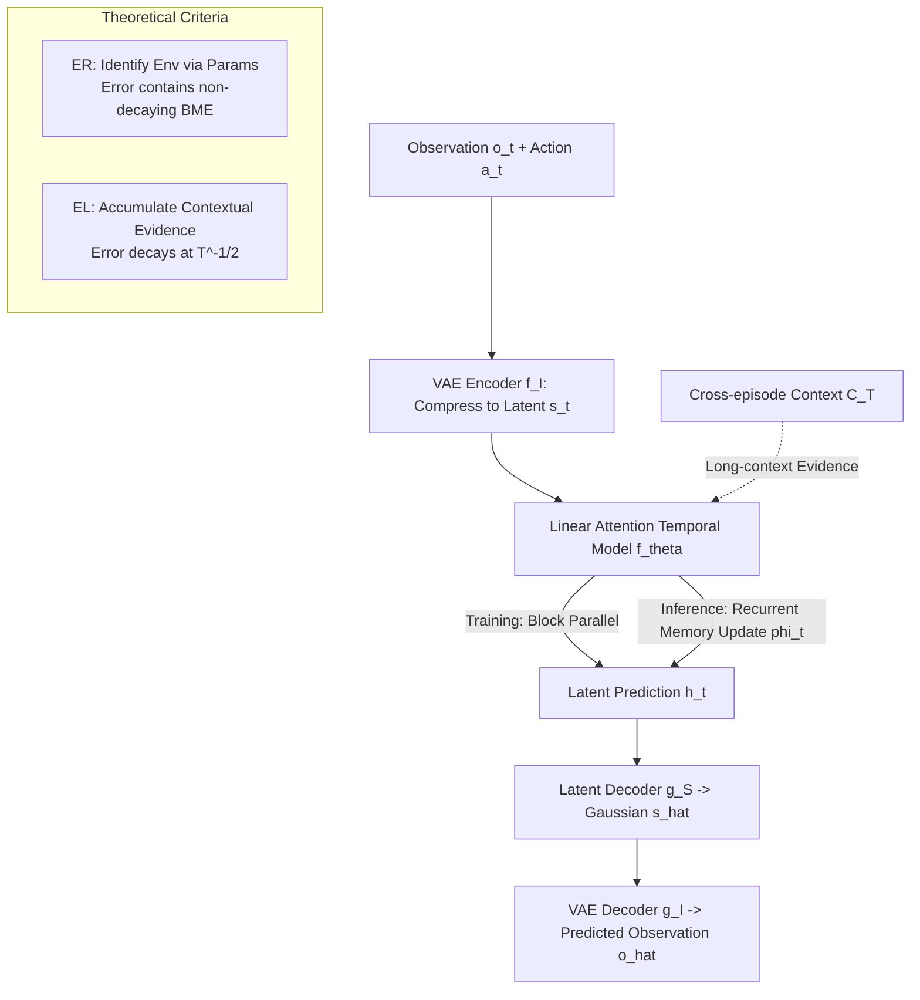

# Context and Diversity Matter: The Emergence of In-Context Learning in World Models

**Conference**: ICLR 2026  
**OpenReview**: [https://openreview.net/forum?id=0GNBqoYcAP](https://openreview.net/forum?id=0GNBqoYcAP)  
**Code**: [https://github.com/airs-cuhk/airsoul/tree/main/projects/MazeWorld](https://github.com/airs-cuhk/airsoul/tree/main/projects/MazeWorld)  
**Area**: Reinforcement Learning / World Models / In-Context Learning  
**Keywords**: World Models, In-Context Learning, Environment Recognition (ER), Environment Learning (EL), Long Context, Linear Attention, Adaptability  

## TL;DR
This paper reformulates the "adaptability of world models" as an In-Context Learning (ICL) problem, decomposing it into two mechanisms: "Environment Recognition (ER)" and "Environment Learning (EL)". By deriving error upper bounds for both, the authors demonstrate that only **sufficiently long contexts + sufficiently diverse environments** can catalyze genuine EL. They empirically validate this theory using L2World, a linear attention long-context world model, on cart-pole and indoor navigation tasks.

## Background & Motivation
**Background**: World models are the cornerstone of embodied intelligence—predicting future environmental states via historical observations to support planning and decision-making in tasks like navigation, autonomous driving, and robotics. However, mainstream approaches focus on **static world models** optimized for zero-shot / few-shot / immediate performance, which often fail in rare environments unseen during training, requiring re-training (in-weight learning, IWL) for adaptation.

**Limitations of Prior Work**: Humans and animals achieve real-time adaptation through "predictive coding"—where prediction errors drive attention, generate feedback, and trigger immediate calibration. Static models lack this "continuous learning at inference time" capability. While LLMs have demonstrated ICL (generalizing to new tasks via context without parameter updates), study of ICL is concentrated on simple tasks like language and few-shot classification/regression. **ICL in world models remains nearly unexplored**, and theoretical characterizations of when it emerges are lacking.

**Key Challenge**: Researchers have focused on "zero/few-shot single-frame reconstruction quality with short contexts" (where diffusion methods are SOTA), while neglecting what world models learn and their asymptotic limits as the **context grows indefinitely**. Strong few-shot performance does not equate to strong many-shot generalization; the two may even be mutually exclusive.

**Goal**: Shift the focus from "zero-shot performance" to the "growth curve and asymptotic limits of world models as context grows," answering **what mechanisms drive the emergence of ICL and what factors determine it**.

**Core Idea**: **Mechanism Decomposition** — Following the Bayesian hypothesis for ICL, ICL in world models is split into two modes: **ER (Environment Recognition)**, which relies on parameter memory to identify which training environment is current, and **EL (Environment Learning)**, which accumulates evidence directly from the context without relying on environment identity. **Theoretical Criteria** — By deriving error upper bounds, the study proves that EL error decays at $T^{-1/2}$, whereas ER has a non-decaying "Best Matching Residual." Thus, "low environment complexity + many environments + long context + high diversity" are key for EL to outperform ER.

## Method

### Overall Architecture
The paper formalizes the world model $\hat o_{t+1}\sim f_\theta(q_t)$ on POMDP $e:\langle O,S,A,T_e,Z_e\rangle$ and introduces cross-episode context $C_T=(o_1^{(C)},a_1^{(C)},\dots)$, defining ICL capability as the convergence of the predicted distribution to the true environment distribution as context grows. It then splits ICL into ER/EL paths and derives upper bounds (theoretical part). Finally, it introduces **L2World**, a long-context implementation using a lightweight VAE for observations and linear (gated slot) attention for temporal modeling, featuring block-parallel training and recurrent inference (empirical part). The theory predicts "what data/architectures lead to EL," while experiments validate these predictions in cart-pole and maze navigation.

### Key Designs

**1. Decomposition of ER and EL: Splitting world model ICL into two analyzable paths.** In a finite environment set $E=\{e_1,\dots,e_{|E|}\}$, the ER mode formulates prediction as a weighted sum: $\hat p_{\theta,ER}(o_{t+1}|q_t,C_T)=\sum_{e\in E}\hat p_\theta(e|q_t,C_T)\cdot\hat p_{\theta,e}(o_{t+1}|q_t)$—context is only used to identify the current environment, while environment-specific models are frozen during inference. EL bypasses environment identity to accumulate evidence: $\hat p_{\theta,EL}(o_{t+1}|q_t,C_T)=\frac{p(q_t,o_{t+1}|C_T)}{p(q_t|C_T)}$, essentially acting as a "contextual memory." This decomposition serves as the analytical framework: ER is limited by training environments, while EL has the potential to learn new environments cross-domain.

**2. ER/EL Error Upper Bounds (Theorem 1): Using an inequality to predict mechanism emergence.** Under simplifying assumptions (discrete space, ideal state estimation, uniform context distribution), total-variation distance is used to derive bounds:

$$\mathrm{TV}(\hat p_{ER},p_{e_0})\le \min\Big[\tfrac{\alpha}{3}(|E|-1)T^{-1/2},\ \max_{e_1,e_2\in E}\mathrm{TV}(p_{e_1},p_{e_2})\Big]+\min_{e\in E}\mathrm{TV}(\hat p_{\theta,e},p_{e_0})$$

$$\mathrm{TV}(\hat p_{EL},p_{e_0})\le \sqrt{2|O||S||A| \log(4|O|/\delta)}\cdot T^{-1/2}$$

Key insights: EL's bound decays at $T^{-1/2}$ and is modulated by **environmental complexity** $|O||S||A|$. ER includes a **Best Matching Error (BME)** $\min_{e\in E}\mathrm{TV}(\hat p_{\theta,e},p_{e_0})$, which does not decay with $T$, forming a hard ceiling for generalization. Three falsifiable insights emerge: (i) **Lower complexity and higher environment count $|E|$** favor EL; (ii) **Long context + high diversity** are prerequisites for both—if diversity is too low, ER's identification error vanishes and suppresses EL; (iii) **Over-training + strong IWL** pull models from EL back to ER (as BME approaches zero).

**3. L2World: Trading high-fidelity for temporal scalability.** To handle the required "long context," L2World **sacrifices per-frame fidelity for temporal scalability**. Observations are compressed into latent states using a lightweight ResNet-based VAE ($f_I/g_I$). Temporal modeling employs **gated slot attention (linear attention)**—enabling block-parallel training $\phi_t,h_1,\dots,h_t=f_\theta(s_1,a_1,\dots,s_t,a_t)$ and recurrent inference $\phi_t,h_{t+1}=f_\theta(\phi_{t-1},s_t,a_t)$. Adaptation is achieved by efficiently updating memory $\phi_t$ within the context. This "linear complexity + long context" trade-off allows it to outperform heavy diffusion-backbone methods on long sequences.

## Key Experimental Results

### Main Results
**Maze Navigation 1-step Prediction PSNR (Selected, higher is better)**:

| Model (Training Set) | Seen T=1 | Seen T=10000 | Unseen T=1 | Unseen T=100 | Unseen T=10000 |
|---|---|---|---|---|---|
| L2World (Maze-32K-L) | 16.80 | 25.05 | 16.37 | 23.17 | **24.65** |
| L2World (Maze-128-L) | 18.54 | **26.00** | 17.54 | 20.96 | 21.52 |
| L2World (Maze-32K-S) | 18.57 | 20.48 | 18.45 | 19.63 | 20.31 |
| Dreamer (Maze-32K-L) | 16.40 | 21.89 | 16.81 | 21.40 | 22.12 |
| NWM (Maze-32K-L) | 20.84 | 21.89 | 16.20 | 17.00 | 17.85 |

Takeaway: **32K-L (many environments + long trajectories) generalizes best on unseen environments**, with peak performance at the asymptotic stage (large T). **128-L (few environments + long trajectories) is stronger on "seen" tasks**, a typical ER trait. Dreamer (LSTM) and NWM (4-frame window) cannot utilize long contexts, falling behind in the long range.

**ProcTHOR Transfer 1-step PSNR (Unseen, higher is better)**:

| Model | Pre-training | T=10 | T=1000 | T=10000 |
|---|---|---|---|---|
| L2World | Maze-32K-L | 22.81 | **25.40** | 23.94 |
| L2World | — (ProcTHOR-5K) | 18.22 | 19.74 | 19.81 |
| Dreamer | — (ProcTHOR-40K) | 22.61 | 23.51 | 22.76 |
| NWM | — | 21.41 | 21.02 | 20.08 |

**EL exhibits stronger transferability**: The model pre-trained on Maze-32K-L (EL mode) significantly outperforms other models even when transferred to entirely new ProcTHOR scenes.

### Ablation Study
**Cart-pole (Randomized g/Mass/Length) Environment Count × Range Ablation**:

| Training Config | Phenomenon | Mechanism Determination |
|---|---|---|
| 1-Env / 4-Envs | Massive gap between seen/unseen; no generalization | No ICL / Pure ER |
| 16-Envs (Scope1+2) | Improved but limited generalization | Bias toward ER |
| 8K-Envs (Scope1) | Similar to 16-Envs | Insufficient range |
| **8K-Envs (Scope1+2)** | Best generalization; only outperforms 4-Envs after T>10 | **EL** |

### Key Findings
- **Both quantity and range matter**: Only "many environments + large range" catalyze EL; long context is the "cost" of generalization—wider generalization only manifests after longer contexts (T>10).
- **BME Validation (Fig. 3)**: Error for the 4-Env model tracks the $error=BME$ line. As environmental count increases, the error dips below BME, confirming BME as the ER bottleneck and the "ER → EL switch."
- **Over-training harms generalization**: Early checkpoints of 4-Env models generalize better on unseen data despite being sub-optimal on seen data, confirming that prolonged training causes models to revert to IWL/ER.
- **EL is more sensitive to context perturbation (Fig. 5)**: Shuffling 20%/50% of context observations harms Maze-32K-L (EL) more than 128-L (ER)—proving EL truly "reads" the context, whereas ER relies on parameters.

## Highlights & Insights
- **Reformulating world model adaptation as a solvable ICL problem**: The ER/EL dichotomy + error bounds provide a unified language to explain generalization beyond simple benchmark scores.
- **Empirical validation of theoretical predictions**: The roles of complexity, context length, and diversity are verified from discrete assumptions to continuous high-dimensional POMDPs.
- **Counter-intuitive divergence**: Models with broader generalization perform worse at short contexts, cautioning the community against over-optimizing for zero/few-shot metrics.
- **Evidence-based architecture choice**: Linear attention's long-context capability is the hardware prerequisite for EL emergence; the failure of LSTM/short-window baselines reinforces this.

## Limitations & Future Work
- **Dynamics only**: Reward and policy models are not included; full In-Context Reinforcement Learning is the next step.
- **Strong theoretical assumptions**: Discrete space and uniform context assumptions differ from high-dimensional real-world scenarios, acting more as qualitative guides.
- **Sacrificed fidelity**: L2World trades reconstruction quality for context length; the Gaussian latent assumption might lose precision in highly stochastic environments.
- **Context length dependency**: Training on ProcTHOR-40K showed degradation at T=1K~10K compared to ProcTHOR-5K, suggesting that short-trajectory data can erode learned long-context ICL capabilities.

## Related Work & Insights
- **ICL Mechanism Research**: This work ports concepts like task learning vs. recognition and the impact of context length to world models, adding theoretical upper bounds.
- **World Models & Model-based RL**: Direct comparison with Dreamer, NWM, and JEPA; this paper argues context length is the decisive factor for cross-environment adaptation.
- **Linear Attention**: Gated slot attention is established as the key carrier for EL, providing a theoretical answer for "which backbone to use for world models."
- **Insight**: For researchers in lifelong learning/robotics, this paper suggests prioritizing **diverse data + long trajectories** paired with long-context architectures to enable models to "learn while acting."

## Rating
- **Novelty**: ⭐⭐⭐⭐⭐ First to rigorously formalize world model adaptation as ER/EL mechanisms with theoretical bounds.
- **Experimental Thoroughness**: ⭐⭐⭐⭐ Solid validation across three environments; however, lacks real-world physical data.
- **Writing Quality**: ⭐⭐⭐⭐ Strong link between theory and experiments; high symbol density may be challenging for generalists.
- **Value**: ⭐⭐⭐⭐ Defines design principles for data and architecture in the pursuit of adaptive embodied agents.

<!-- RELATED:START -->

1. **In-context Learning with Transformers: Software Engineering Perspective** - Analysis of context vs weights.
2. **DreamerV3: Mastering Diverse Domains through World Models** - Baseline for static world models.
3. **Training Data, Capability Relevance and Context Length** - Discussion on ICL emergence and data diversity.

<!-- RELATED:END -->

## Related Papers

- [\[ICLR 2026\] Scalable In-Context Q-Learning](scalable_in-context_q-learning.md)
- [\[ICLR 2026\] LongRLVR: Long-Context Reinforcement Learning Requires Verifiable Context Rewards](longrlvr_long-context_reinforcement_learning_requires_verifiable_context_rewards.md)
- [\[NeurIPS 2025\] Towards Provable Emergence of In-Context Reinforcement Learning](../../NeurIPS2025/reinforcement_learning/towards_provable_emergence_of_in-context_reinforcement_learning.md)
- [\[ICLR 2026\] In-Context Compositional Q-Learning for Offline Reinforcement Learning](in-context_compositional_q-learning_for_offline_reinforcement_learning.md)
- [\[ICLR 2026\] Reward is Enough: LLMs are In-Context Reinforcement Learners](reward_is_enough_llms_are_in-context_reinforcement_learners.md)

<!-- RELATED:END -->
