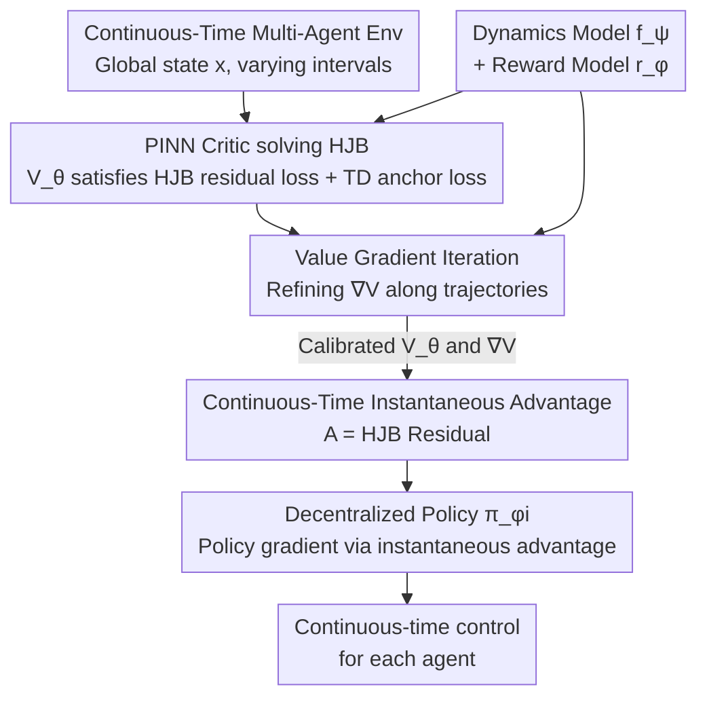

# Continuous-Time Value Iteration for Multi-Agent Reinforcement Learning

**Conference**: ICLR 2026  
**arXiv**: [2509.09135](https://arxiv.org/abs/2509.09135)  
**Code**: Available (GitHub link)  
**Area**: Reinforcement Learning  
**Keywords**: continuous-time RL, MARL, HJB equation, PINN, value gradient iteration  

## TL;DR
The authors propose the VIP (Value Iteration via PINN) framework, which marks the first use of Physics-Informed Neural Networks (PINNs) to solve the HJB partial differential equations in continuous-time multi-agent reinforcement learning. By introducing a Value Gradient Iteration (VGI) module to iteratively refine value gradients, the method consistently outperforms both discrete-time and continuous-time baselines on continuous-time MPE and MuJoCo multi-agent tasks.

## Background & Motivation
**Background**: Most RL methods operate within discrete-time frameworks (fixed-step Bellman updates). However, many real-world scenarios, such as autonomous driving, robotics, and high-frequency trading, are inherently continuous-time with irregular or high-frequency decision intervals.

**Limitations of Prior Work**: Discrete-time RL faces two inherent issues when approximating continuous processes: (1) coarse time steps lead to non-smooth controllers and suboptimal behavior; (2) fine time steps cause the state space and the number of iterations to explode. As $\Delta t \to 0$, the Bellman operator can become ill-posed, with the TD target being dominated by approximation noise.

**Key Challenge**: Utilizing HJB PDEs instead of Bellman recursion in Continuous-Time RL (CTRL) avoids time discretization issues. However, existing CTRL research is almost exclusively limited to single-agent settings. Scaling to multi-agent scenarios is extremely difficult due to the curse of dimensionality (state dimensions grow exponentially with the number of agents) and non-stationarity (simultaneous learning of other agents).

**Goal**: How to extend HJB-based continuous-time RL to multi-agent cooperative scenarios?

**Key Insight**: Utilize PINNs to approximate the viscosity solution of the HJB equation (overcoming the curse of dimensionality) and introduce a VGI module to ensure the accuracy of value gradients (addressing the issue where PINN residual losses cannot guarantee gradient precision).

**Core Idea**: Employs a dual approach of PINN + VGI to accurately learn the value function and its gradients in continuous-time multi-agent systems.

## Method

### Overall Architecture
VIP addresses "continuous-time multi-agent cooperative control" by directly satisfying the HJB PDE of optimal control instead of performing Bellman recursion at fixed time steps. It follows the CTDE (Centralized Training, Decentralized Execution) paradigm: during training, a shared critic observes the global state; during execution, each agent utilizes its own decentralized policy network.

In the data flow, the critic is a PINN $V_\theta(x)$ driven by three losses: an HJB residual loss to satisfy the PDE, a TD anchor loss to anchor the value magnitude, and a VGI consistency loss to calibrate value gradients. On the actor side, each agent's policy $\pi_{\phi_i}$ is updated using the instantaneous advantage function derived directly from the HJB residual. To enable VGI to calculate gradient targets, the framework also learns a dynamics model $f_\psi$ and a reward model $r_\phi$.

### Key Designs

**1. PINN Critic for Solving HJB: Escaping the Curse of Dimensionality via Neural Networks**

The value function in continuous-time optimal control satisfies the HJB equation. However, traditional numerical methods (dynamic programming, level set methods) fail when the state space exceeds 6 dimensions due to the exponential growth of grid points. Multi-agent states naturally exceed this limit. VIP replaces the value function with a neural network $V_\theta(x)$ and treats the HJB residual:

$$\mathcal{R}_\theta(x_t) = -\rho V_\theta + \nabla_x V_\theta^\top f(x,u) + r(x,u)$$

as a physical constraint for the PINN. By minimizing $\|\mathcal{R}_\theta\|_1$, the network approximates the solution to the PDE. Neural networks rely on sample points (Monte Carlo style) rather than dense grids, allowing them to function in high-dimensional spaces. A TD-style anchor loss provides supervision for the absolute magnitude of the value, preventing the PINN from drifting to incorrect scales.

**2. Value Gradient Iteration (VGI): Calibrating Value Gradients Individually**

Minimizing the HJB residual does not guarantee accurate $\nabla_x V(x)$, which is precisely what the policy update requires. In high-dimensional multi-agent systems, small gradient errors are amplified by coupled dynamics, leading to policy divergence. VGI performs a "Bellman expansion in gradient space" for the gradient itself, constructing a target:

$$\hat{g}_t = \nabla_{x_t} r \cdot \Delta t + e^{-\rho\Delta t}\, \nabla_{x_t} f^\top\, \nabla_{x_{t+\Delta t}} V_\theta(x_{t+\Delta t})$$

A consistency loss $\mathcal{L}_{vgi} = \|\nabla_x V_\theta - \hat{g}_t\|^2$ then forces the gradients obtained via automatic differentiation of the PINN to align with this target. The paper proves that the VGI update is a contraction mapping (Theorem 3.4), ensuring convergence.

**3. Continuous-Time Instantaneous Advantage: Residuals as Actor Signals**

Policy updates require an advantage function. VIP discovers that the continuous-time instantaneous advantage is exactly equal to the HJB residual:

$$A(x_t, u_t) = -\rho V(x_t) + \nabla_x V^\top f(x_t, u_t) + r(x_t, u_t)$$

Thus, the same HJB residual computed by the critic is fed into the policy loss of each agent $\mathcal{L}_{p_i} = -A_\theta \log \pi_{\phi_i}$ for decentralized updates. This removes the need for separate advantage estimation used in discrete-time methods. The paper also provides a Policy Improvement Lemma, proving that a gradient update based on this advantage yields monotonically non-decreasing Q-values.

### Loss & Training
The total critic loss combines three terms: $\mathcal{L}_{total} = \mathcal{L}_{res} + \lambda_{anchor}\mathcal{L}_{anchor} + \lambda_g\mathcal{L}_{vgi}$, trained jointly with the dynamics and reward models. A key implementation detail is the requirement of Tanh activation instead of ReLU, as PINNs require smooth differentiability to compute PDE residuals. Weights for the three losses must be balanced to avoid the stiffness issues inherent in PINN training.

## Key Experimental Results

### Main Results (Continuous-Time MuJoCo + MPE)

| Environment | VIP (w/ VGI) | VIP (w/o VGI) | HJBPPO | DPI | Discrete MADDPG |
|------|-------------|--------------|--------|-----|------------|
| Ant 2×4 | **Highest** | Significant drop | Lower | Lower | Extensive reduction |
| HalfCheetah 6×1 | **Highest** | Drop | Lower | Lower | Extensive reduction |
| Cooperative Nav | **Highest** | Drop | Lower | - | Comparable |
| Predator Prey | **Highest** | Drop | Lower | - | Comparable |

### Ablation Study

| Configuration | Effect | Description |
|------|------|------|
| W/o VGI | Significant drop across tasks | VGI is crucial for value gradient accuracy |
| ReLU vs Tanh | ReLU is consistently worse | Smooth activation is necessary for PINN PDEs |
| Unbalanced weights | Performance degradation | Stiffness issues in PINN training |
| Varying intervals | VIP remains stable, MADDPG degrades | CTRL is robust to time step changes |

### Key Findings
- VGI is the core contribution: without it, value function contours deviate severely from the ground truth (analytical solutions of LQR for coupled oscillators).
- All discrete-time baselines (MATD3, MAPPO, MADDPG) degrade significantly in continuous-time settings, particularly on Ant and HalfCheetah.
- VIP performance remains nearly constant across different time intervals, whereas MADDPG performance drops sharply as intervals increase.
- Experiments cover state spaces up to 113 dimensions (Ant 4×2, 6 agents), proving PINN scalability for high-dimensional systems.

## Highlights & Insights
- **First Systematic Continuous-Time MARL Framework**: Fills the gap between single-agent CTRL and multi-agent domains with comprehensive theoretical and experimental validation.
- **Bellman Expansion in Gradient Space**: Combining trajectory-based gradient propagation with global PDE constraints is an elegant design, supported by convergence proofs of the contraction mapping.
- **Clear Diagnosis of Discrete-Time Limitations**: Through varying interval experiments and analytical LQR comparisons, the authors intuitively demonstrate the bias introduced by discretization.

## Limitations & Future Work
- Currently handles cooperative scenarios only (based on HJB); competitive or mixed-motive scenarios require the HJI equation, left for future work.
- Assumption of deterministic systems—stochastic dynamics would require Stochastic HJB (SHJB).
- PINN training stability requires careful hyperparameter tuning (activations, weight balancing).
- Requires learning dynamics and reward models (model-based), increasing complexity.

## Related Work & Insights
- **vs. HJBPPO (Single-Agent)**: VIP extends PINN-HJB to multi-agent settings and resolves value gradient inaccuracies via VGI.
- **vs. DPI/IPI (Continuous-Time Single-Agent)**: These methods do not scale to high-dimensional multi-agent scenarios, whereas VIP overcomes the curse of dimensionality via PINNs.
- **vs. MADDPG (Discrete-Time MARL)**: MADDPG degrades severely in continuous-time settings, while VIP remains stable.

## Rating
- Novelty: ⭐⭐⭐⭐ First complete framework for continuous-time MARL + PINN + VGI.
- Experimental Thoroughness: ⭐⭐⭐⭐⭐ Two major benchmarks, analytical verification, multi-dimensional ablations, and comparison with discrete methods.
- Writing Quality: ⭐⭐⭐⭐ Solid theoretical derivations and extensive experiments.
- Value: ⭐⭐⭐⭐ Opens a new direction for continuous-time multi-agent control.

<!-- RELATED:START -->

## Related Papers

- [\[ICLR 2026\] Safe Continuous-time Multi-Agent Reinforcement Learning via Epigraph Form](safe_continuous-time_multi-agent_reinforcement_learning_via_epigraph_form.md)
- [\[ICLR 2026\] Distributionally Robust Cooperative Multi-agent Reinforcement Learning with Value Factorization](distributionally_robust_cooperative_multi-agent_reinforcement_learning_with_valu.md)
- [\[ICLR 2026\] Information-based Value Iteration Networks for Decision Making Under Uncertainty](information-based_value_iteration_networks_for_decision_making_under_uncertainty.md)
- [\[ICLR 2026\] Sample-efficient and Scalable Exploration in Continuous-Time RL](sample-efficient_and_scalable_exploration_in_continuous-time_rl.md)
- [\[ICLR 2026\] From Ticks to Flows: Dynamics of Neural Reinforcement Learning in Continuous Environments](from_ticks_to_flows_dynamics_of_neural_reinforcement_learning_in_continuous_envi.md)

<!-- RELATED:END -->
