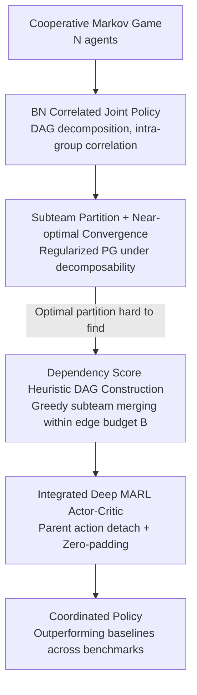

# Correlated Policy Optimization in Multi-Agent Subteams

**Conference**: ICLR2026  
**OpenReview**: [https://openreview.net/forum?id=Tke3BVwUz6](https://openreview.net/forum?id=Tke3BVwUz6)  
**Code**: TBD  
**Area**: Reinforcement Learning / Multi-Agent Collaboration / Policy Gradient Theory  
**Keywords**: Multi-Agent RL, Bayesian Network Policy, Subteams, Policy Gradient Convergence, Decomposability

## TL;DR
The joint policy in cooperative multi-agent systems is decomposed using a Directed Acyclic Graph (DAG/Bayesian Network) where agents are fully correlated within "subteams" and independent across teams. Under the condition of decomposable rewards/transitions, it is proven that regularized policy gradients converge to near-optimal policies. A heuristic for dynamic subteam assembly based on "dependency scores + edge budget" is provided and integrated into MAPPO/MADDPG, outperforming standard baselines across multiple benchmarks.

## Background & Motivation
**Background**: The most common approach in cooperative multi-agent reinforcement learning (MARL) is the **product policy**, where the joint policy is written as the product of local policies: $\pi(a|s)=\prod_i \pi_i(a_i|s)$. This is scalable and communication-free during execution, but at the cost of assuming conditional independence of agent actions.

**Limitations of Prior Work**: Product policies have limited expressiveness. When optimized via policy gradients, they generally **lack guarantees for convergence to global optimality**; most theoretical results only provide equilibrium concepts like Nash, which are weaker than "global optimality." To restore expressiveness, existing works (Chen & Zhang 2023, etc.) use Bayesian Networks (BN)/DAGs to introduce correlations, expressing the joint policy as a product of conditional local policies. However, suboptimality survives as long as the BN is not fully connected, yet full connectivity causes the joint action space to explode exponentially, leading back to the curse of dimensionality.

**Key Challenge**: There is a direct opposition between expressiveness (denser correlation $\rightarrow$ higher optimality potential) and scalability/optimability (denser $\rightarrow$ dimension explosion, harder training). Existing BN methods are either not expressive enough or not scalable, and there is little theoretical characterization of "when a sparse BN can still be optimal."

**Key Insight**: Inspiration is drawn from human team organization—real-world tasks often exhibit **cluster-like weak coupling**: tight coordination within small groups with minimal interaction between groups (e.g., UAVs in search and rescue operating in zones). If the environment's reward/transition can be approximately decomposed by this cluster structure, retaining full correlation within groups while enforcing group independence theoretically saves dimensions with minimal loss of optimality.

**Core Idea**: The BN joint policy is constrained by a DAG that partitions agents into "subteams"—**fully connected within teams (full correlation) and no edges between teams (conditional independence)**. It is proven that under the "decomposability" assumption, regularized policy gradient ascent converges to a near-optimal policy with explicitly quantified suboptimality determined by "decomposition error + subteam size."

## Method

### Overall Architecture
The problem addressed is: **what joint policy structure preserves the coordination capability lost by product policies without regressing to unscalable fully-connected BNs, while providing convergence and optimality guarantees**. The method consists of four steps: defining the joint policy as a BN policy using a DAG; constraining the DAG into "subteam partitions" and proving near-optimal convergence under decomposability; proposing a greedy heuristic using dependency scores and edge budgets to dynamically construct the DAG; and integrating this dynamic BN policy as an actor into deep actor-critic frameworks (MAPPO/MADDPG).

### Key Designs

**1. BN Correlated Joint Policy: A spectrum between "Product" and "Full Joint"**

To address the limited expressiveness of product policies without resorting to unscalable full joint policies, a joint policy is defined by a DAG $G=(N,E)$: agents are vertices, and an edge $(j,i)\in E$ indicates $j$ is a parent of $i$. Each local policy considers the global state and parent actions $\pi_G^i(a_i|s, a_{P_i})$, such that $\pi_G(a|s)=\prod_{i\in N}\pi_G^i(a_i|s, a_{P_i})$. This structure is **continuous**: it regresses to a product policy when $G$ has no edges and can express any joint distribution when $G$ is dense. To provide finite-time guarantees, local policies use tabular softmax parameterization with a **log-barrier regularizer**:

$$L_\lambda(\theta) := V_\theta(\mu) - \lambda \sum_{i\in N} \mathbb{E}_{s,a_{P_i}\sim \mathrm{Unif}}\big[\mathrm{KL}(\mathrm{Unif}_{A_i},\, \pi_{\theta^i}^i(\cdot|s,a_{P_i}))\big]$$

The regularizer prevents probabilities from collapsing to zero. The authors define an equilibrium gap for BN policies, $\mathrm{gap}(\pi_G)=\max_i \big(\max_{\bar\pi^i_G} V_{\bar\pi^i_G,\pi^{-i}_G}-V_{\pi_G}\big)$, which differs from Nash as it allows the deviating local policy to remain conditioned on parent actions.

**2. Subteam Partition + Near-optimal Convergence: Upgrading "Equilibrium" to "Optimality"**

Equilibrium guarantees are insufficient as they can be highly suboptimal. The core theoretical contribution is characterizing a class of DAG structures that ensure optimality. A **subteam** (Definition 1) is defined as a set of vertices $C$ in the DAG where any two agents are connected by a directed edge (clique). **Environmental decomposability** (Definition 2) requires transitions and rewards to decompose according to a partition $\{C_k\}_{k=1}^K$ into local components plus an error:

$$P(s'|s,a)=\sum_{k=1}^K P^k(s'|s,a_{C_k})+\epsilon_P(s'|s,a),\quad r(s,a)=\sum_{k=1}^K r^k(s,a_{C_k})+\epsilon_r(s,a)$$

Assumption 3 requires the DAG to be a subteam partition matching this decomposition with **no edges across subteams**. Theorem 1 provides a finite-time rate for tabular softmax BN policy gradients to converge to $\epsilon$-equilibrium. Main result Theorem 2 strengthens this to **near-optimality**:

$$\min_{t\le T}\mathrm{subopt}(\pi_{\theta_t}) \le \epsilon + 2K\Big(\tfrac{|\epsilon_r|}{1-\gamma}+\tfrac{\gamma|S||\epsilon_P|}{(1-\gamma)^2}\Big)$$

The second term represents the asymptotic bias from decomposition error. This reveals a core trade-off: **finer partitions (larger $K$)** converge faster (complexity factor $g(\{C_k\})=\sum_k 2^{|C_k|}-K$) but suffer higher decomposition error and asymptotic suboptimality.

**3. Dependency-Driven Dynamic Subteam Construction: Greedily merging for low error**

Since the optimal partition is hard to find, a heuristic merges agents starting from single-agent subteams using a budget of $B$ edges. At each step, two subteams with the highest average pairwise **dependency score** $\{d_{ij}\}$ are merged:

$$d(C,C') := \frac{1}{|C||C'|}\sum_{i\in C, j\in C'} d_{ij}$$

Merging involves adding all possible edges between the two groups until the budget $B$ is exhausted. Using the "average" prevents biased merging of large groups. Dependency scores can be **dynamic** based on states or episodes (e.g., spatial distance).

**4. Deep Actor-Critic Integration: Parent actions and variable inputs**

To apply this to MAPPO or MADDPG, parent actions are **detached** from the computational graph during training to stabilize credit assignment. To handle variable parent counts in dynamic DAGs, a fixed-length input vector $N\cdot\sum_i|A_i|$ is used with **zero-padding** for actions of non-parent agents, ensuring consistent batch processing. This heuristic is also applied to centralized training (VAST) for sub-group value decomposition.

## Key Experimental Results

### Main Results
The experiments combine tabular exact gradients (theory validation) and deep MARL (utility). In deep settings, four topologies were compared:

| Environment | Base Algo | Edge Budget B | Performance Ranking |
|------|----------|----------|------------------------------|
| Coordination Game (N=5) | MAPPO | 4 | heuristic ≈ full > random ≈ product |
| Aloha (N=10) | MAPPO | 10 | heuristic, full learned fastest |
| Predator-Prey (N=15) | MADDPG | 50 | heuristic performed best; full was worst |

### Ablation Study
The relationship between "decomposition error $\leftrightarrow$ final performance" in fixed DAGs (Table 1):

| Config (N=5) | Fitted $\lvert\epsilon_P\rvert$ | Fitted $\lvert\epsilon_r\rvert$ | Relative Performance |
|------|------|------|------|
| full ($K=1$) | 7.13e-08 | 3.73e-08 | Best |
| 1+4 | 3.38e-01 | 1.44e+00 | Close to full |
| 2+3 | 4.80e-01 | 2.38e+00 | Medium |
| product | 6.03e-01 | 1.56e+00 | Worst |

### Key Findings
- **Partitions with smaller decomposition errors generally perform better**, validating Theorem 2.
- **Denser is not always better**: In Predator-Prey, `full` performed worst, indicating that in complex continuous environments, optimization difficulties of full connectivity outweigh expressiveness gains.
- The **heuristic** achieved performance close to `full` with significantly fewer edges, demonstrating efficiency.

## Highlights & Insights
- Using a DAG to create a **continuous spectrum between product and joint policies** is elegant; expressiveness is controlled by a tunable "graph density" knob.
- Treating parent actions as **augmented states** allows BN policy analysis to leverage mature results from single-agent/product policy theories.
- The **trade-off between $K$ and error** is explicitly quantified, providing a theoretical basis for choosing partition granularity.
- The dependency heuristic + edge budget transforms abstract "low-error searching" into an executable greedy process that can be context-aware.

## Limitations & Future Work
- **Strong Decomposability Assumption**: While Definition 2 formally holds for any partition, it requires small error terms to be meaningful, which is hard to verify a priori.
- **Tabular vs. Deep Gap**: Theoretical results apply to tabular softmax with exact gradients, whereas the deep implementation relies on neural approximations and heuristics.
- **Dependency Score Engineering**: $\{d_{ij}\}$ often relies on domain knowledge (e.g., spatial distance); automated learning of dependency scores is an open direction.
- **Scale Limits**: Experiments go up to N=40; scalability in even larger, complexly coupled scenarios remains to be tested.

## Related Work & Insights
- **vs. Product Policy Methods (MAPPO/HAPPO)**: These assume conditional independence. This work introduces BN correlations and provides the first optimality guarantees for non-independent policies.
- **vs. Existing BN Methods**: Previous works either lacks finite-time convergence or doesn't characterize optimal sparse structures. This work identifies "subteams + decomposability" as a near-optimal class.
- **vs. Value Decomposition (QMIX/VAST)**: This work operates at the policy level but demonstrates that its heuristic can improve value decomposition methods like VAST.

## Rating
- Novelty: ⭐⭐⭐⭐⭐ 
- Experimental Thoroughness: ⭐⭐⭐⭐ 
- Writing Quality: ⭐⭐⭐⭐ 
- Value: ⭐⭐⭐⭐ 

<!-- RELATED:START -->

- Chen & Zhang, "On the Convergence of Correlated Policy Gradient," 2023.
- Dou et al., "Theoretical Analysis of Value Decomposition," 2022.

<!-- RELATED:END -->

## Related Papers

- [\[ICLR 2026\] Multi-Agent Guided Policy Optimization](multi-agent_guided_policy_optimization.md)
- [\[ICLR 2026\] Heterogeneous Agent Q-weighted Policy Optimization](heterogeneous_agent_q-weighted_policy_optimization.md)
- [\[ICLR 2026\] Boosting Multi-Domain Reasoning of LLMs via Curvature-Guided Policy Optimization](boosting_multi-domain_reasoning_of_llms_via_curvature-guided_policy_optimization.md)
- [\[ICLR 2026\] Inter-Agent Relative Representations for Multi-Agent Option Discovery](inter-agent_relative_representations_for_multi-agent_option_discovery.md)
- [\[AAAI 2026\] HCPO: Hierarchical Conductor-Based Policy Optimization in Multi-Agent Reinforcement Learning](../../AAAI2026/reinforcement_learning/hcpo_hierarchical_conductor-based_policy_optimization_in_multi-agent_reinforceme.md)

<!-- RELATED:END -->
