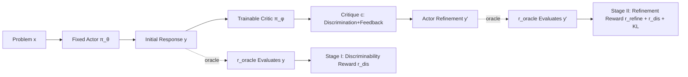

# Critique-RL: Training Language Models for Critiquing Through Two-Stage Reinforcement Learning

**Conference**: ICLR 2026  
**OpenReview**: [https://openreview.net/forum?id=SsUjdSVdUl](https://openreview.net/forum?id=SsUjdSVdUl)  
**Code**: [https://github.com/WooooDyy/Critique-RL](https://github.com/WooooDyy/Critique-RL)  
**Area**: Reinforcement Learning / LLM Scalable Oversight  
**Keywords**: critique model, scalable oversight, two-stage RL, discriminability, helpfulness, actor-critic  

## TL;DR
Critique-RL employs an online RL scheme to train "critique models" without relying on annotations from stronger supervisors. It first stabilizes discriminability using direct rule-based rewards, then enhances helpfulness via indirect rewards based on refinement accuracy while maintaining discriminability through regularization, enabling weak models to produce accurate and helpful feedback.

## Background & Motivation
- **Background**: Training a "critic" to evaluate and provide feedback on actor outputs is an effective path toward scalable oversight. Refinement based on such feedback can significantly enhance performance in complex reasoning, coding, and decision-making tasks.
- **Limitations of Prior Work**: ① Fine-tuning methods (e.g., Saunders et al.) depend on high-quality critique data annotated by stronger supervisors (e.g., GPT-4o), which is expensive, hard to scale, and suffers from distribution mismatch. ② Prompting methods (e.g., Self-Refine, CoVe) often assume the presence of an oracle verifier at test time, allowing the critic to bypass "discrimination" and focus solely on suggestions, leading to performance bottlenecks without external verifiers.
- **Key Challenge**: In a dual-player actor-critic framework, the most intuitive approach is using the accuracy of the actor's two attempts (original + refined) as an **indirect reward** to train the critic. This work empirically finds that this approach fails: while **helpfulness** improves, **discriminability is not optimized**. This leads to critics being either overly conservative (reluctant to suggest changes, low $\Delta_{i\to c}$) or overly aggressive (suggesting unnecessary changes, high $\Delta_{c\to i}$), resulting in minimal Acc@Refine gains or RL collapse.
- **Goal**: To train a critique model with both high discriminability and high helpfulness **without relying on stronger annotators or test-time oracle verifiers**.
- **Core Idea**: **Decoupling discriminability and helpfulness for two-stage optimization**. Stage I uses direct rule-based rewards to stabilize discriminability; Stage II introduces indirect refinement rewards to enhance helpfulness, while retaining discriminability rewards and KL regularization with the Stage I model to prevent degradation.

## Method

### Overall Architecture
The system follows a "Response-Critique-Refine" dual-player cycle: a fixed actor $\pi_\theta$ generates an initial response $y=\pi_\theta(x)$ for a problem $x$; a trainable critic $\pi_\phi$ takes $(x,y)$ to produce a critique $c=\pi_\phi(x,y)$, which must include both a **discrimination** of the response's correctness and **helpful** natural language feedback; the actor then refines the response to $y'=\pi_\theta(x,y,c)$. An oracle verifier $r_{\text{oracle}}$ evaluates $y$ and $y'$ only during training to construct rewards. Training proceeds in two serial stages: Discriminability (Stage I) followed by Helpfulness (Stage II).

### Key Designs

**1. Motivation Diagnosis: Why indirect rewards fail to train a good critic.** The authors analyzed three pure indirect rewards: $r_{\text{refine}}(x,y,c,y')=r_{\text{oracle}}(x,y')$ focusing only on refinement accuracy; $r_\Delta=r_{\text{oracle}}(x,y')-r_{\text{oracle}}(x,y)$ focusing on the accuracy delta; and a segmented $r_{\text{correction}}$ (1.0 for correcting an error, 0.2 for maintaining a correct answer, and 0 for introducing an error). Tracking training dynamics on GSM8K with Qwen2.5-3B revealed that $r_{\text{refine}}$ and $r_\Delta$ reduce $\Delta_{c\to i}$ but fail to increase $\Delta_{i\to c}$ (overly conservative), while $r_{\text{correction}}$ increases $\Delta_{i\to c}$ but fails to suppress $\Delta_{c\to i}$ (overly aggressive). The root cause is that these rewards only target helpfulness and fail to optimize the core discriminability of whether the response is correct, leading to degradation on one side and eventual training collapse.

**2. Stage I —— Stabilizing discriminability via direct rule-based rewards.** The key transition is shifting the reward from "looking at actor refinement" to "evaluating the critic's own judgement." Given $(x,y)$, the critic is required to judge the correctness of each step and the final answer. Let $f(x,y,c)$ be the critic's verdict; the discriminability reward is a direct signal:

$$r_{\text{dis}}(x,y,c)=\mathbb{1}\big(f(x,y,c)=r_{\text{oracle}}(x,y)\big)$$

Stage I maximizes $\mathbb{E}_{c\sim\pi_\phi^{\text{I}}}\big[r_{\text{dis}}(x,y,c)-\beta\,\mathrm{KL}(\pi_\phi^{\text{SFT}}\Vert\pi_\phi^{\text{I}})\big]$. Since the reward no longer depends on the actor's refinement but directly supervises the judgement, discriminability is optimized stably and symmetrically.

**3. Stage II —— Enhancing helpfulness while locking discriminability.** Initialized with the Stage I model, an indirect reward $r_{\text{refine}}=r_{\text{oracle}}(x,y')$ based on refinement accuracy is introduced. To prevent the degradation of discriminability during this stage, $r_{\text{dis}}$ is retained along with a KL regularization towards the Stage I model. The objective is:

$$\mathbb{E}_{c\sim\pi_\phi^{\text{II}},\,y'\sim\pi_\theta}\Big[r_{\text{refine}}+\beta_1 r_{\text{dis}}(x,y,c)-\beta_2\,\mathrm{KL}\big(\pi_\phi^{\text{I}}(c|x,y)\Vert\pi_\phi^{\text{II}}(c|x,y)\big)\Big]$$

The direct reward $r_{\text{dis}}$ and KL regularization anchor discriminability at Stage I levels, while $r_{\text{refine}}$ drives $\Delta_{i\to c}$ up and $\Delta_{c\to i}$ down, steadily improving Acc@Refine. RLOO is used as the base RL algorithm.

## Key Experimental Results

Datasets: MATH/GSM8K/AQuA (in-domain), SVAMP/TheoremQA (OOD); Models: Qwen2.5-3B/7B. Metrics: Acc@Refine, $\Delta$ (improvement over no critic), Acc@Dis (discrimination accuracy).

### Main Results (Acc@Refine / Acc@Dis, in-domain)

| Model | Method | MATH Acc | MATH Acc@Dis | GSM8K Acc | GSM8K Acc@Dis | AQuA Acc |
|------|------|----------|--------------|-----------|---------------|----------|
| Qwen2.5-3B | No Critic | 36.90 | – | 66.03 | – | 50.00 |
| | SFT | 44.24 | 66.51 | 69.14 | 76.34 | 46.46 |
| | STaR | 44.38 | 66.97 | 71.95 | 74.79 | 50.39 |
| | CTRL | 46.14 | 69.29 | 70.58 | 76.71 | 53.54 |
| | **Critique-RL** | **48.60** | **82.80** | **75.89** | **87.44** | **56.69** |
| Qwen2.5-7B | No Critic | 45.74 | – | 75.66 | – | 63.39 |
| | CTRL | 53.86 | 71.42 | 81.35 | 83.44 | 64.96 |
| | **Critique-RL** | **58.40** | **85.20** | **87.72** | **90.43** | **65.75** |

Discriminability gains are significant: for the 3B model on MATH, Acc@Dis rose from 66.51% (SFT) to 82.80%. For the 7B model, in-domain accuracy improved by an average of +9.02% and OOD by +5.70%.

### Ablation Study (Qwen2.5-3B, Acc@Refine / Acc@Dis)

| Method | MATH Acc | MATH Acc@Dis | AQuA Acc | AQuA Acc@Dis |
|------|----------|--------------|----------|--------------|
| Critique-RL (Full) | 48.6 | 82.8 | 56.7 | 69.9 |
| w/o Stage I | 47.6 | 79.7 | 53.9 | 66.5 |
| w/o Stage II | 45.9 | 78.7 | 54.7 | 68.2 |
| Stage II w/o discrimination | 47.3 | 77.7 | 53.5 | 61.6 |

### Key Findings
- **Both stages are indispensable**: Removing either stage leads to performance drops. Specifically, removing discriminability rewards in Stage II causes AQuA Acc@Dis to plummet from 69.9 to 61.6.
- **RL > SFT**: SFT and STaR often show marginal or negative gains on AQuA, whereas Critique-RL remains robust, suggesting online RL better activates critiquing capabilities.
- **Iterative Enhancement**: Alternating the two stages further boosts performance; the 3B model on MATH improved from 48.6 (Iter 1) to 51.0 (Iter 2).
- **Inference Scalability**: Serial "Response-Critique-Refine" sampling is more efficient than parallel $3K\times$ sampling and achieves a higher performance ceiling.

## Highlights & Insights
- **Decouples critiquing into discriminability and helpfulness**, using training dynamics to visualize and solve "overly conservative/aggressive" failure modes.
- **Direct rule-based reward $r_{\text{dis}}$** is the core innovation, preventing rewards from being bypassed and ensuring discriminability is explicitly optimized.
- **Scalable and autonomous**: Does not require stronger supervisors or test-time oracle verifiers, starting instead from same-sized base model SFT data.
- The use of both $r_{\text{dis}}$ and Stage I KL regularization during Stage II provides a robust "learning new without forgetting old" engineering paradigm.

## Limitations & Future Work
- Tasks are concentrated on mathematical reasoning; effectiveness in coding or open-domain generation remains to be verified.
- Training still requires an oracle verifier $r_{\text{oracle}}$; how to transfer this to tasks without reliable automated verifiers is an open question.
- The actor remains fixed; co-evolution of the actor and critic was not explored.
- OOD gains (5.70%) are lower than in-domain gains, indicating room for improved generalization.

## Related Work & Insights
- Compared to prompt-based critiquing (e.g., Self-Refine), this work does not assume a test-time oracle. Compared to fine-tuning methods (e.g., Saunders et al.), it avoids reliance on expensive high-quality labels.
- Compared to indirect RL methods (e.g., Retroformer, CTRL), Critique-RL addresses the neglect of discriminability by introducing a dedicated two-stage optimization.
- **Insight**: When a capability can be decomposed into "judgment" and "improvement," first training the judgment with direct supervision followed by refinement with indirect signals and regularization is a stable paradigm applicable to self-correction and RM training.

## Rating
- Novelty: ⭐⭐⭐⭐
- Experimental Thoroughness: ⭐⭐⭐⭐
- Writing Quality: ⭐⭐⭐⭐
- Value: ⭐⭐⭐⭐

<!-- RELATED:START -->

## Related Papers

- [\[ICLR 2026\] Representation-Based Exploration for Language Models: From Test-Time to Post-Training](representation-based_exploration_for_language_models_from_test-time_to_post-trai.md)
- [\[ICLR 2026\] Improving Human-AI Coordination through Online Adversarial Training and Generative Models](improving_human-ai_coordination_through_online_adversarial_training_and_generati.md)
- [\[ICLR 2026\] R1-Reward: Training Multimodal Reward Model Through Stable Reinforcement Learning](r1-reward_training_multimodal_reward_model_through_stable_reinforcement_learning.md)
- [\[ICLR 2026\] Post-training Large Language Models for Diverse High-Quality Responses](post-training_large_language_models_for_diverse_high-quality_responses.md)
- [\[ICLR 2026\] On Predictability of Reinforcement Learning Dynamics for Large Language Models](on_predictability_of_reinforcement_learning_dynamics_for_large_language_models.md)

<!-- RELATED:END -->
