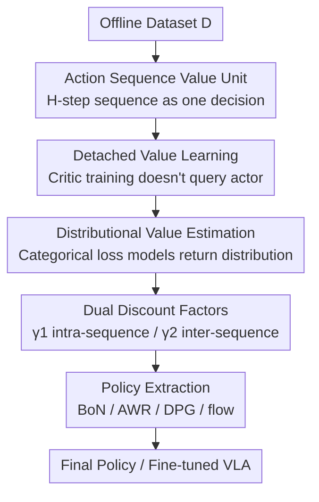

# DEAS: DEtached value learning with Action Sequence for Scalable Offline RL

**Conference**: ICLR2026  
**OpenReview**: [https://openreview.net/forum?id=bVTaAXeBmE](https://openreview.net/forum?id=bVTaAXeBmE)  
**Code**: https://changyeon.site/deas (Project page, including open-source implementation)  
**Area**: Reinforcement Learning / Offline RL / Robotics  
**Keywords**: Offline Reinforcement Learning, Action sequence, Detached value learning, Value overestimation, VLA fine-tuning

## TL;DR
DEAS treats "continuous H-step actions" as the input unit for value functions in offline RL, compressing the effective planning horizon similar to n-step TD. To avoid value overestimation caused by action space expansion, it employs IQL-style "detached value learning" (critic training is completely independent of the actor) + categorical distributional value estimation + dual discount factors to stabilize training. It significantly outperforms baselines like FQL/Q-Chunking on OGBench long-horizon tasks and can be directly integrated into large-scale VLAs such as GR00T and π0 to improve real- robot manipulation success rates.

## Background & Motivation

**Background**: Offline RL allows learning policies from static datasets without online interaction or expensive expert demonstrations. However, mainstream methods are mostly validated on short-horizon, dense-reward tasks. Recent work (the OGBench series by Park et al.) indicates that the key to success in complex long-horizon tasks is **shortening the effective planning horizon**—reducing the time span an agent must plan ahead—by using large-$n$ n-step TD updates and hierarchical policies.

**Limitations of Prior Work**: This "horizon shortening" route currently relies heavily on **goal-conditioned RL**, requiring explicit expert goals which are often unavailable in reality. Without explicit goals, increasing $n$ in standard RL introduces additional bias and bootstrap errors, leading to performance degradation. Another intuitive approach is using **action sequences** (which already capture temporal dependencies in behavior cloning), but feeding sequences into standard actor-critic frameworks triggers **severe value overestimation**: the actor maximizes the critic's inaccurate estimates in the expanded action space, while distribution shift in offline scenarios further amplifies extrapolation errors.

**Key Challenge**: Action sequences naturally provide horizon-shortening benefits, but the combination of "actor exploiting critic errors" and "exponential action space expansion" causes critic estimations to spiral out of control. Existing compromises are suboptimal: Q-Chunking maintains actor-critic coupling, failing to solve overestimation; CQN-AS removes the actor entirely for pure value-based learning, but discretization errors accumulate, limiting performance on complex tasks and preventing the use of expressive policy classes (e.g., flow/diffusion policies, VLAs).

**Goal**: To obtain the benefits of horizon shortening using action sequences **without requiring explicit goals**, while **avoiding value overestimation and maintaining compatibility with any expressive policy architecture**.

**Key Insight**: The authors observe that the root of overestimation lies in "critic training depending on actor outputs." If the critic's training target converges only toward **real, high-return action sequences present in the dataset** without querying the actor, the actor has no opportunity to feed errors back into the critic.

**Core Idea**: Use IQL-style in-sample expectile regression to **completely detach** critic training from the actor (detached value learning), and change the value function input from single actions to H-step action sequences—the former addresses overestimation, the latter addresses long horizons.

## Method

### Overall Architecture
DEAS is an offline RL framework that takes a fixed dataset $D$ and outputs a policy $\pi$ (or a fine-tuned VLA) capable of long-horizon tasks. Its core is shifting value learning from "single-step actions" to "H-step action sequences": the critic $Q(s_t, \mathbf{a}_t;\theta)$ estimates the expected return of executing the entire sequence $\mathbf{a}_t := a_{t:t+H-1}$ from state $s_t$ according to the data collection policy. The pipeline consists of two parts: 4.1 generalizes TD learning to action sequences (for horizon shortening), and 4.2 stabilizes this sequence value learning using "Detached + Distributional + Dual-discount" components (to handle overestimation and variance). Finally, the value function is converted into an executable policy using any policy extraction method; since value training never queries the policy, the two can be trained separately.

### Key Designs

**1. Action Sequence Value Unit: Using H-step sequences as decision units for horizon shortening**

Addressing the pain point that single-action information is too sparse and planning horizons are too long, DEAS treats each fixed-length H-step action sequence $\mathbf{a}_t = (a_t, \dots, a_{t+H-1}) \in A^H$ as **one decision unit**. The value function is defined over sequences $Q(s, \mathbf{a})$. Executing $\mathbf{a}_t$ means applying these H atomic actions sequentially and collecting the discounted return:

$$\tilde{R}(s_t, \mathbf{a}_t, \gamma) := \mathbb{E}\Big[\sum_{k=0}^{H-1}\gamma^k R(s_{t+k}, a_{t+k}) \,\big|\, s_t, \mathbf{a}_t\Big],$$

and then transitioning to $s_{t+H}$. TD updates are performed directly on $Q(s_t, \mathbf{a}_t)$ using $\tilde{R}$ as a multi-step target, equivalent to "making a decision every H steps using temporally extended actions." This compresses the effective horizon like large-$n$ n-step TD, but with a difference: action sequences themselves carry richer temporal information than single actions, thus gaining the benefits of horizon shortening **without explicit goal conditioning** while maintaining unbiased estimates of H-step returns. Ablations show the method struggles with H=1 or 2, requiring sufficiently long sequences (8 for scene/puzzle, 4 for cube) to be effective.

**2. Detached Value Learning: Detaching critic training from the actor to solve overestimation**

This is the "DEtached" in the name, targeting the root cause of overestimation: "the actor exploiting critic errors." Sequences expand the action space, making it harder for the critic to estimate accurately, while coupled actor-critic leads to a vicious cycle where the actor picks overestimated regions. Borrowing from IQL, DEAS introduces a critic $Q(s_t,\mathbf{a}_t;\theta)$ and a state-only value network $V(s_t;\psi)$. Using in-sample expectile regression, $V$ is pulled toward high-return sequences **within the dataset**:

$$L_V(\psi) = \mathbb{E}_{(s_t,\mathbf{a}_t)\sim D}\big[L_2^\tau(\bar{Q}(s_t,\mathbf{a}_t;\bar\theta) - V(s_t;\psi))\big],$$
$$L_Q(\theta) = \mathbb{E}\big[(\tilde{R}(s_t,\mathbf{a}_t, \gamma_1) + \gamma_2^H V(s_{t+H};\psi) - Q(s_t,\mathbf{a}_t;\theta))^2\big],$$

where $L_2^\tau(u) = |\tau - \mathbb{1}(u<0)|u^2$ is the expectile loss. For $\tau>0.5$, positive errors are weighted more heavily, making $V$ approximate the upper expectile of in-distribution TD targets. The key point: **the critic's target never involves actor outputs**, preventing the actor from feeding back errors. Thus, even with long sequences, overestimation is avoided. Appendix E provide theoretical proof for incorporating action sequences into detached value learning. This is also useful as a side effect—since value training does not query the policy, the final policy can use **any** extraction method (Design 5).

**3. Distributional Value Estimation: Modeling return distributions with categorical loss to suppress multi-step variance**

Even with decoupling, when H is large, the variance of cumulative returns $\tilde{R}$ is high, affecting stability. DEAS converts both the critic and value networks into **categorical distribution** formats (distributional RL), discretizing a fixed support $[v_{\min}, v_{\max}]$ into $m$ bins:

$$Q(s,\mathbf{a};\theta) = \mathbb{E}[Z(s,\mathbf{a};\theta)], \quad \hat p_i(s,\mathbf{a};\theta) = \frac{e^{l_i(s,\mathbf{a};\theta)}}{\sum_j e^{l_j(s,\mathbf{a};\theta)}}.$$

Value learning changes from regression to **classification** (cross-entropy), while retaining IQL's expectile weighting:

$$L_V(\psi) = \mathbb{E}\Big[-\alpha_t \sum_i \hat p_i(s_t,\mathbf{a}_t;\bar\theta)\log \hat p_i(s_t;\psi)\Big], \quad \alpha_t = \begin{cases}\tau & \bar Q \ge V\\ 1-\tau & \text{otherwise}\end{cases}$$

The target distribution $p_i$ is a truncated normal centered at the Bellman target with $\sigma = 0.75\cdot(v_{\max}-v_{\min})/m$ (following HL-Gauss by Farebrother et al.). Ablations (Table 4c) show that using only distributional (HLG) or only regression (IQL) gives limited improvement, but **combining both** raises the success rate from 63/75 to 88, proving that decoupling and distributional estimation are complementary.

**4. Dual Discount Factors: Managing intra-sequence and inter-sequence discounting separately**

Long sequence returns can cause value explosion or collapse if a single discount factor is used. DEAS splits two discount factors: $\gamma_1$ for **intra-sequence** step-wise rewards, and $\gamma_2$ for returns **between sequence-level decision points**. The TD target is thus written as $\tilde{R}(s_t,\mathbf{a}_t,\gamma_1) + \gamma_2^H \max Q(s_{t+H},\cdot)$. The authors found that **decreasing $\gamma_1$ and increasing $\gamma_2$** significantly stabilizes training, especially for longer sequences; the paper uses $\gamma_1=0.9$ and $\gamma_2=0.999$ throughout (Table 4d: increasing $\gamma_1$ from 0.9 to 0.99/0.999 drops 7~8 points). Intuitively, a small $\gamma_1$ keeps intra-sequence returns at a manageable scale, while a large $\gamma_2$ ensures long-range credit assignment across decision points is not overly attenuated.

**5. Compatibility with Any Policy Extraction: The "Plug-and-Play" dividend of decoupling**

Since value training doesn't query the policy, the final policy $\pi(s;\phi)$ can be updated using any extraction method—Weighted BC (AWR), Deterministic Policy Gradient (DPG), best-of-N sampling, or flow-matching. This is directly utilized in VLA experiments: for large models like GR00T N1.5 and π0 that predict long action chunks (H=16 or even 50), DEAS uses **best-of-N sampling**—sampling multiple action sequences from the VLA and executing the one with the highest Q-value. This overlays the offline RL value signal onto pre-trained VLAs without modifying the VLA's policy class. This is something pure discrete value-based methods like CQN-AS cannot achieve.

### Loss & Training
Training Loop (Algorithm 1): Sample batch $(s_t, \mathbf{a}_t, R_{t:t+H-1}, s_{t+H})$ from $D$ → Calculate H-step discounted return $\tilde R$ → Update $V$ using Eq. (7) and $Q$ using Eq. (8) (both categorical cross-entropy) → Update actor with any extraction algorithm → Soft update target critic $\bar\theta \leftarrow (1-\beta)\bar\theta + \beta\theta$. OGBench data scales from 1M to 100M transitions depending on difficulty.

## Key Experimental Results

### Main Results
6 categories of OGBench manipulation tasks (5 subtasks each, success rate % over 4 runs):

| Task Category | #Data | FQL | N-step FQL | QC-FQL | CQN-AS | DEAS |
|--------|------|-----|-----------|--------|--------|------|
| scene-play | 1M | 50 | 36 | 73 | 1 | **76** |
| cube-double-play | 1M | 14 | 4 | 41 | 2 | **48** |
| puzzle-3x3-play | 1M | 44 | 36 | 62 | 0 | **91** |
| cube-triple-play | 10M | 10 | 23 | 83 | 0 | 82 |
| puzzle-4x4-play | 10M | 32 | 19 | 69 | 0 | **82** |
| cube-quadruple-play | 100M | 17 | 36 | 45 | 0 | **64** |

DEAS achieved the best performance in 5 out of 6 categories, with the most significant advantages in the hardest puzzle and cube-quadruple tasks. Notably, N-step FQL generally **performed worse** than FQL, confirming that blindly increasing n without goals introduces bias. CQN-AS failed almost entirely, which the authors attribute to the accumulation of discretization errors and strong BC regularization on suboptimal data.

VLA Experiments (RoboCasa Kitchen, success rate % over 50 episodes, 3 seeds):

| Model | Avg Success Rate |
|------|----------|
| GR00T N1.5 (Base) | 12.0 |
| + Filtered BC | 18.5 |
| + IQL | 20.2 |
| + QC | 17.5 |
| **+ DEAS** | **25.2** |
| π0 + DEAS | 21.8 (Base 12.3) |

Real Robot (Franka, pick-and-place, partial success rate %): DEAS averaged 78.4, significantly higher than Base (64.0) and IQL (66.3), while QC dropped to 39.6 (unstable with small data and long sequences).

### Ablation Study
Conducted on OGBench puzzle-4x4 (success rate %):

| Config | Key Metric | Description |
|------|---------|------|
| H=1 / H=2 | 21 / 25 | Single/double-step actions barely learn; sequences are essential |
| H=8 (Default) | 88 | Optimal; H=16 requires a larger actor to reach 84 |
| IQL only (No Dist) | 63 | Lacks distributional estimation |
| HLG only (No Detach) | 75 | Lacks decoupling |
| IQL + HLG (Full) | 88 | Both are complementary and necessary |
| $\gamma_1$=0.9 (Default) | 88 | Increasing to 0.99/0.999 drops performance to 81/80 |

### Key Findings
- **Decoupling + Distribution provide multiplicative gains**: Neither alone reaches 88 (63 and 75 respectively), indicating they solve different problems (overestimation vs variance).
- **Sequence length has a sweet spot**: H=8 is optimal; longer sequences (16) require scaling the actor network to handle increased action dimensions, showing a trade-off between sequence length and computation.
- **Better value calibration**: On unseen trajectories in puzzle-4x4/cube-quadruple, DEAS’s predicted Q-values align much more closely with Monte Carlo ground truths ($y=x$) compared to QC-FQL.
- **Robust to data quality**: DEAS outperforms QC-FQL across various ratios of play and noisy data mixtures with better calibration.

## Highlights & Insights
- **"Decoupling" solves two problems at once**: By removing the critic's dependency on the actor, it stops the overestimation feedback loop and allows the final policy to use any extraction method—a prerequisite for its integration with large VLAs.
- **Action sequences = Goal-free horizon shortening**: Traditionally, horizon shortening required large $n$ (bias) or explicit goals (unavailable). Action sequences provide a third way by embedding temporal information without goal-conditioning constraints.
- **Best-of-N connects offline RL to large VLAs**: Using Q-values to rank candidate action chunks without modifying the VLA policy is a lightweight "value-guided" approach transferable to any large model outputting multiple candidates.
- **Engineering intuition of dual discount factors**: Small intra-sequence discounts prevent numerical explosion, while large inter-sequence discounts maintain long-term credit. This is a clean trick for handling multi-step return scales.

## Limitations & Future Work
- **Sequence length constrained by actor capacity**: For H > 8, the actor network must be enlarged to maintain performance; the paper acknowledges a trade-off without a mechanism for adaptive H selection.
- **Fixed H assumption**: Actions are sliced into equal blocks, which might not be optimal for tasks with highly varying sub-task durations.
- **Purely offline**: The method is validated only on static datasets and does not cover offline-to-online fine-tuning, whereas Q-Chunking was originally designed for that purpose.
- **Sensitivity of distributional hyperparameters**: Bin count $m$, support range $[v_{\min}, v_{\max}]$, and $\sigma$ must be set manually; the paper does not fully analyze their sensitivity (⚠️ subject to the original text).

## Related Work & Insights
- **vs IQL**: DEAS builds on IQL's in-sample expectile regression but extends the input to H-step sequences and replaces regression with categorical distributional estimation; it inherits the "critic independent of actor" spirit to solve sequence-induced overestimation.
- **vs Q-Chunking (QC)**: QC-FQL also uses action chunks but **retains actor-critic coupling**, thus suffering from overestimation in expanded action spaces. DEAS is more stable in calibration and long-horizon tasks.
- **vs CQN-AS**: CQN-AS avoids overestimation by removing the actor (pure value-based), but suffers from iterative discretization errors and cannot use expressive policies. DEAS outperforms it significantly while remaining compatible with Flow/VLA.
- **vs N-step FQL**: Both aim to shorten the horizon, but N-step FQL introduces bias when increasing $n$ in standard offline RL without goals, while DEAS succeeds by using action sequences for temporal embedding.

## Rating
- Novelty: ⭐⭐⭐⭐ The "Decoupling + Action Sequence" combo addresses overestimation and long horizons effectively with a clear path to large VLAs, though individual components are elegant reassemblies of existing techniques.
- Experimental Thoroughness: ⭐⭐⭐⭐⭐ Comprehensive coverage across 30 OGBench tasks, RoboCasa, Franka real robot, full ablations, calibration curves, and data robustness.
- Writing Quality: ⭐⭐⭐⭐ Motivations are clear and figures are wellplaced; some equation notations (e.g., $\hat R$ and $\tilde R$) are slightly dense.
- Value: ⭐⭐⭐⭐⭐ Provides a practical recipe for connecting offline RL with large-scale VLAs with real-robot validation, significant for practical robotics.

<!-- RELATED:START -->

## Related Papers

- [\[ICLR 2026\] Scalable Offline Model-Based RL with Action Chunks](scalable_offline_model-based_rl_with_action_chunks.md)
- [\[ICLR 2026\] Learning to Reason as Action Abstractions with Scalable Mid-Training RL](learning_to_reason_as_action_abstractions_with_scalable_mid-training_rl.md)
- [\[ICLR 2026\] Beyond Penalization: Diffusion-based Out-of-Distribution Detection and Selective Regularization in Offline Reinforcement Learning](beyond_penalization_diffusion-based_out-of-distribution_detection_and_selective_.md)
- [\[ICLR 2026\] Recurrent Action Transformer with Memory](recurrent_action_transformer_with_memory.md)
- [\[ICLR 2026\] Peng's Q($\lambda$) for Conservative Value Estimation in Offline Reinforcement Learning](pengs_qlambda_for_conservative_value_estimation_in_offline_reinforcement_learnin.md)

<!-- RELATED:END -->
