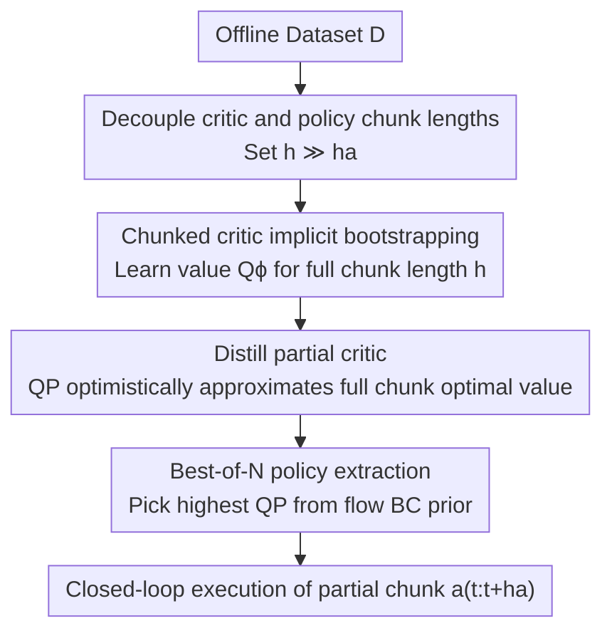

# Decoupled Q-Chunking

**Conference**: ICLR2026  
**OpenReview**: [https://openreview.net/forum?id=aqGNdZQL9l](https://openreview.net/forum?id=aqGNdZQL9l)  
**Code**: https://github.com/ColinQiyangLi/dqc  
**Area**: Reinforcement Learning  
**Keywords**: Offline Reinforcement Learning, Action Chunking, Temporal Difference, Value Bootstrapping Bias, Goal-Conditioned RL

## TL;DR
Addressing the contradiction where "chunked critics accelerate value propagation but require the policy to output a whole open-loop action chunk—which is hard to learn and inflexible," this paper proposes Decoupled Q-Chunking (DQC). By decoupling the critic's action chunk length $h$ from the policy's action chunk length $h_a$ ($h_a \ll h$), the policy only predicts a short section of actions. This policy is guided by a "partial critic" optimistically distilled from a larger critic, thereby retaining the multi-step value propagation advantages of chunked critics while bypassing the difficulty of learning long-chunk policies. This approach consistently outperforms previous SOTA on the most challenging long-horizon goal-conditioned tasks in OGBench.

## Background & Motivation
**Background**: Temporal Difference (TD) methods achieve efficient off-policy learning by "regressing the current value against its own value prediction for the next step," serving as a cornerstone for offline RL and sample-efficient online RL. However, this bootstrapping naturally introduces **bootstrapping bias**: single-step prediction errors accumulate over time steps, which is particularly fatal in long-horizon, sparse-reward tasks.

**Limitations of Prior Work**: There are two traditional ways to mitigate bootstrapping bias, both with inherent flaws. First is $n$-step return, which pushes the regression target further into the future to effectively shorten the horizon. However, it requires accumulating rewards along off-policy trajectories, introducing extra off-policy bias; while importance sampling can theoretically correct this, it suffers from high variance and requires heuristics like truncation for stability. Second is the recent **chunked critic**: directly estimating the value $Q(s_t, a_{t:t+h})$ of a short action sequence ("chunk") $a_{t:t+h}$. This naturally supports multi-step returns without the systematic pessimistic bias of $n$-step methods.

**Key Challenge**: While chunked critics accelerate value learning, they shift the burden to the policy side. To extract a policy from a chunked critic, the policy must **output a full open-loop action chunk of length $h$ at once**. As the chunk length increases, this action distribution becomes increasingly complex and difficult to model; furthermore, open-loop execution sacrifices reactivity, which is sub-optimal in tasks requiring real-time adjustments. In other words, there is a trade-off between fast value learning (requiring large $h$) and policy learnability/flexibility (requiring small $h$).

**Goal**: This work aims to decompose this into two sub-problems: (1) Theoretically clarify when chunked Q-learning converges and when closed-loop execution is near-optimal. (2) Algorithmically enable the policy to avoid predicting entire long action chunks while still benefiting from the value acceleration of large critic chunks.

**Key Insight**: The authors observe that the critic's chunk length and the policy's chunk length **do not inherently need to be equal**. Value propagation requires a large chunk length $h$ to shorten the effective horizon, but the policy only needs to output a small segment (or even a single action) for closed-loop execution. By targeting the "first half of the optimal long-chunk action" as the policy objective, one can obtain the benefits of both sides.

**Core Idea**: Decouple the critic chunk length $h$ from the policy chunk length $h_a$ ($h_a \ll h$), allowing the policy to predict only a partial action chunk. A **partial critic** $Q^P$ is then trained via optimistic distillation from the full critic to estimate the "maximum value achievable if this short chunk is completed into a full long chunk," which is used to guide the short-chunk policy.

## Method

### Overall Architecture
DQC is an offline RL pipeline built around "decoupling." Given an offline dataset $D$ (state-action-reward trajectory segments), the output is a closed-loop policy that **predicts only short action chunks** $a_{t:t+h_a}$. The pipeline consists of four steps: first, learn a chunked critic $Q_\phi(s_t, a_{t:t+h})$ on the full chunk length $h$ (benefiting from accelerated value propagation); second, **optimistically distill** this large critic into a partial critic $Q^P_\psi$ that only takes short chunks $a_{t:t+h_a}$ as input, approximating the value of the short chunk if optimally completed; third, instead of explicit policy modeling, use a flow-matching behavior cloning prior $\pi_\beta$ to sample $N$ candidate short chunks and select the one with the highest $Q^P_\psi$ (Best-of-N extraction, IDQL-style); finally, execute only the first $h_a$ actions and re-plan in a closed-loop manner.

### Key Designs

**1. Decoupling Critic and Policy Chunk Lengths: Separating "Fast Value Learning" from "Learnable Policies"**

This step addresses the core contradiction. Previous methods (like Q-chunking) shared the same chunk length $h$ for both the critic and policy: large $h$ favored value propagation but made the policy difficult to learn and inflexible; small $h$ made the policy learnable but sacrificed multi-step acceleration. DQC introduces two independent lengths: $h$ for the critic and $h_a \ll h$ for the policy. Theoretically, the authors formalize the difference between the trajectory distribution $P^\circ_D$ under open-loop execution and the data distribution $P_D$ as **open-loop consistency (OLC)**. If the total variation distance between them is bounded by $\varepsilon_h$, the value estimation bias of the chunked critic is bounded by terms like $\varepsilon_h H \bar{H}$ (where $H=1/(1-\gamma)$ and $\bar H = 1/(1-\gamma^h)$ are the single-step and $h$-step horizons). Under stronger OLC, chunked Q-learning converges to a near-optimal chunked policy, and **closed-loop execution** (executing only the first action of a long chunk) further reduces sub-optimality when "optimality variability" is bounded. This theory justifies the "decoupled closed-loop execution of short chunks," showing that the short policy + large critic combination does not sacrifice optimality.

**2. Partial Critic Distillation: Calculating "Short Chunk Potential" via Optimistic Regression**

Decoupling alone is insufficient: the policy objective targets $Q_\phi(s_t, [a_{t:t+h_a}, a^\star_{t+h_a:t+h}])$, which is the value of the short chunk concatenated with the optimal second half. Solving for $a^\star_{t+h_a:t+h}=\arg\max_{a_{t+h_a:t+h}} Q_\phi$ would seemingly require learning a long-chunk policy again. DQC resolves this by learning a separate **partial critic** $Q^P_\psi(s_t, a_{t:t+h_a})$ that takes only short chunks but approximates the maximum value achievable if the chunk were completed optimistically:

$$Q^P_\psi(s_t, a_{t:t+h_a}) \approx Q_\phi(s_t, [a_{t:t+h_a}, a^\star_{t+h_a:t+h}]).$$

Training utilizes **implicit maximization**, regressing against the original critic using an optimistic (expectile) loss: $L(\psi)=f^{\kappa_d}_{\text{imp}}(\bar Q_\phi(s_t, a_{t:t+h})-Q^P_\psi(s_t, a_{t:t+h_a}))$. The expectile loss $f^\kappa_{\text{expectile}}(c)=|\kappa-\mathbb{I}_{c<0}|c^2$ biases towards overestimation when $\kappa>0.5$, ensuring $Q^P$ converges to the "potential optimal value" of the short chunk rather than the mean. This simplifies the policy objective to a hill-climbing task on the short-chunk partial critic: $L(\pi)=-\mathbb{E}_{a_{t:t+h_a}\sim\pi}[Q^P_\psi(s_t,a_{t:t+h_a})]$.

**3. Implicit Value Bootstrapping for Chunked Critic: Stable Multi-step TD**

The TD target for the original chunked critic $Q_\phi(s_t, a_{t:t+h})$ requires taking a $\max$ starting from the next chunk's state, which depends on the current policy (Best-of-N sampling) and is computationally expensive. DQC adopts **implicit value bootstrapping** from IQL/IDQL: learning a state-value function $V_\xi(s_t)$ to approximate the maximum of the partial critic, then using $V_\xi$ as the bootstrap target. A **quantile loss** $f^{\kappa_b}_{\text{quantile}}$ is used here. Interestingly, Best-of-N sampling estimates the $\frac{N-1}{N}$-quantile of the behavior Q-value distribution. By setting $\kappa_b=\frac{N-1}{N}$, $V_\xi$ optimally aligns with the Best-of-N extraction target. This design ensures that large-chunk critic learning is both stable and mathematically consistent with policy extraction.

**4. Best-of-N Policy Extraction: Implicit Policy via Behavior Prior Sampling**

The final step is extracting an executable policy from $Q^P_\psi$. DQC does not explicitly train a parametric policy $\pi$. Instead, like IDQL, it trains a **behavior cloning prior** $\pi_\beta$ using flow-matching on the offline data. During execution, $N$ candidate short chunks are sampled from $\pi_\beta(\cdot|s_t)$, and the one with the highest partial critic value is selected:

$$a^\star_{t:t+h_a}\leftarrow \arg\max_{\{a^i_{t:t+h_a}\}_{i=1}^N} Q^P_\psi(s_t, a^i_{t:t+h_a}),\quad a^i_{t:t+h_a}\sim\pi_\beta(\cdot|s_t).$$

This is equivalent to maximizing $Q^P$ under the constraint of the behavior distribution (avoiding distribution shift) while fully exploiting the benefit that short-chunk distributions are much easier to cover with $\pi_\beta$ than long-chunk ones.

### Loss & Training
Three synergistic objectives: ① Chunked critic $Q_\phi$ uses implicit value bootstrapping (quantile loss, $\kappa_b$) for multi-step TD; ② Partial critic $Q^P_\psi$ uses expectile optimistic regression ($\kappa_d$) distilled from $Q_\phi$; ③ Behavior prior $\pi_\beta$ is trained via flow-matching, with Best-of-N extraction at test time. Key hyperparameters: $\kappa_b=0.93, \kappa_d=0.8$ (optimism is mandatory), $N=32$, and a batch size of 4096.

## Key Experimental Results

### Main Results
On the six most difficult environments of OGBench (a long-horizon goal-conditioned offline RL benchmark including manipulation and locomotion), results are reported over 10 random seeds with 95% confidence intervals. DQC outperforms previous SOTA (SHARSA) and various baselines in nearly all environments.

| Task | SHARSA (Prev. SOTA) | NS ($n$-step) | QC (Q-chunking) | DQC-naïve | DQC (Ours) |
|------|------|------|------|------|------|
| cube-triple-100M | 83 | 93 | 20 | 27 | **98** |
| cube-quadruple-100M | 64 | 27 | 35 | 40 | **92** |
| cube-octuple-1B | 34 | 9 | 0 | 3 | **34** |
| humanoidmaze-giant | 19 | 95 | 48 | 80 | 92 |
| puzzle-4x5 | 1 | 93 | 20 | 33 | **96** |
| puzzle-4x6-1B | 64 | 91 | 28 | 33 | 83 |

(Success Rate %). Per cumulative scores: DQC 82 vs QC 25 vs NS 68 vs SHARSA 44 vs HIQL 18. Notably, QC (where critic and policy share chunk length) collapses in multiple tasks (e.g., cube-octuple 0), confirming the difficulty of learning long-chunk policies. DQC-naïve (using long-chunk policy but only executing short segments) improves but remains inferior to DQC, indicating the problem lies in the **policy objective itself**—it must be paired with the distilled partial critic.

### Ablation Study

| Configuration | Key Finding | Description |
|------|---------|------|
| DQC vs. No distillation critic ($h{=}25, h_a{=}1 \to$ NS; $h_a{=}5 \to$ QC-NS) | DQC is equivalent or better | The distilled partial critic is a key source of efficacy. |
| Implicit Loss Types (Distillation x Bootstrap combination) | Exp. Distill + Quan. Bootstrap (Ours) is best | Less sensitive to the bootstrap method itself, but the combination matters. |
| Optimism Parameters $(\kappa_b, \kappa_d)$ | Both = 0.5 (No optimism) causes significant drop | Some form of optimism is necessary. |
| Best-of-N $N$ | $N=32$ is sufficient, 128 shows no gain | Too small is detrimental; too large is unnecessary. |
| Batch Size | 4096 is required for stability | Large batch sizes are critical for performance. |

### Key Findings
- **The "Decoupling + Partial Critic Distillation" combination is the primary contributor**: Simply decoupling execution (DQC-naïve) is insufficient, and removing the distilled critic hurts performance. Both are essential.
- **Optimism is indispensable**: Performance collapses when $\kappa_b = \kappa_d = 0.5$, indicating the partial critic must optimistically estimate the "upper bound of short-chunk potential" rather than the mean.
- **QC collapses with long chunks**: The fact that QC fails in multiple tasks where DQC succeeds provides direct empirical evidence for the decoupling motivation.

## Highlights & Insights
- **The "Decoupling" observation is simple yet strikes the core problem**: Value propagation needs a large horizon, while policy execution needs small chunks for flexibility. Decoupling them and adding a partial critic resolves this dilemma efficiently.
- **Optimistic distillation transforms the "optimal long-chunk completion" problem**: The problematic $\arg\max$ of the second-half actions is bypassed using an expectile implicit maximization trick, which is a highly reusable technique.
- **Elegant alignment of $\kappa_b = \frac{N-1}{N}$ and Best-of-N**: Linking the statistical fact that "quantile regression optimal solution = expectation of the maximum order statistic of N samples" ensures mathematical consistency between value bootstrapping and policy extraction.
- **Strong coupling between theory and algorithm**: The OLC and optimality variability analysis directly justify why a short policy with a long critic remains near-optimal, paving the way for future work on adaptive chunk lengths.

## Limitations & Future Work
- **Fixed Chunk Lengths**: The chunk lengths $h$ and $h_a$ are fixed globally. However, the optimal length might change with the state; state-adaptive chunking is a natural next step.
- **Focus on Offline RL**: Experiments were conducted only on OGBench offline tasks. Online, offline-to-online, or non-continuous control scenarios (e.g., real robots, visual inputs) have not been verified.
- **Strong Theoretical Assumptions**: Whether OLC and bounded optimality variability hold in complex real-world data remains to be measured. The gap between near-optimality guarantees and practice needs quantification.
- **Dependency on Behavior Prior**: Best-of-N extraction is limited by the coverage of $\pi_\beta$. If the data never observes an optimal short chunk, no amount of sampling will find it—a common challenge in offline RL.

## Related Work & Insights
- **vs. Q-chunking (QC, Li et al. 2025b)**: QC ties the critic and policy to the same chunk length $h$. It gets value acceleration but fails at policy learning for large $h$. DQC decouples these and provides the missing convergence theory.
- **vs. $n$-step return (NS)**: NS uses single-step critics with multi-step reward accumulation, introducing systematic pessimistic bias. DQC uses chunked critics to avoid this and theoretically defines when chunked targets outperform $n$-step.
- **vs. SHARSA (Park et al. 2025b)**: SHARSA uses multi-step bootstrapping with single-step critics. DQC outperforms it on almost all difficult OGBench environments.
- **vs. IQL/IDQL (Kostrikov 2022 / Hansen-Estruch 2023)**: DQC inherits implicit value bootstrapping and Best-of-N from this lineage but extends them to a dual-critic framework for action chunking.

## Rating
- Novelty: ⭐⭐⭐⭐⭐ Decoupling plus optimistic distillation is a clean, insightful idea with a first-of-its-kind convergence theory for chunked Q-learning.
- Experimental Thoroughness: ⭐⭐⭐⭐ Extensive testing on the hardest OGBench tasks, but lacks online or real-robot validation.
- Writing Quality: ⭐⭐⭐⭐⭐ Excellent integration of theory and algorithm; clear chain of motivation and solution.
- Value: ⭐⭐⭐⭐⭐ Enables chunked critics to scale to long-horizon tasks and provides a theoretical foundation for adaptive planning.

<!-- RELATED:START -->

## Related Papers

- [\[ICLR 2026\] Chunking the Critic: A Transformer-based Soft Actor-Critic with N-Step Returns](chunking_the_critic_a_transformer-based_soft_actor-critic_with_n-step_returns.md)
- [\[ICLR 2026\] AutoTool: Automatic Scaling of Tool-Use Capabilities in RL via Decoupled Entropy Constraints](autotool_automatic_scaling_of_tool-use_capabilities_in_rl_via_decoupled_entropy_.md)
- [\[ICLR 2026\] Beyond Penalization: Diffusion-based Out-of-Distribution Detection and Selective Regularization in Offline Reinforcement Learning](beyond_penalization_diffusion-based_out-of-distribution_detection_and_selective_.md)
- [\[ICLR 2026\] Recurrent Action Transformer with Memory](recurrent_action_transformer_with_memory.md)
- [\[ICLR 2026\] ADM-v2: Pursuing Full-Horizon Roll-out in Dynamics Models for Offline Policy Learning and Evaluation](adm-v2_pursuing_full-horizon_roll-out_in_dynamics_models_for_offline_policy_lear.md)

<!-- RELATED:END -->
