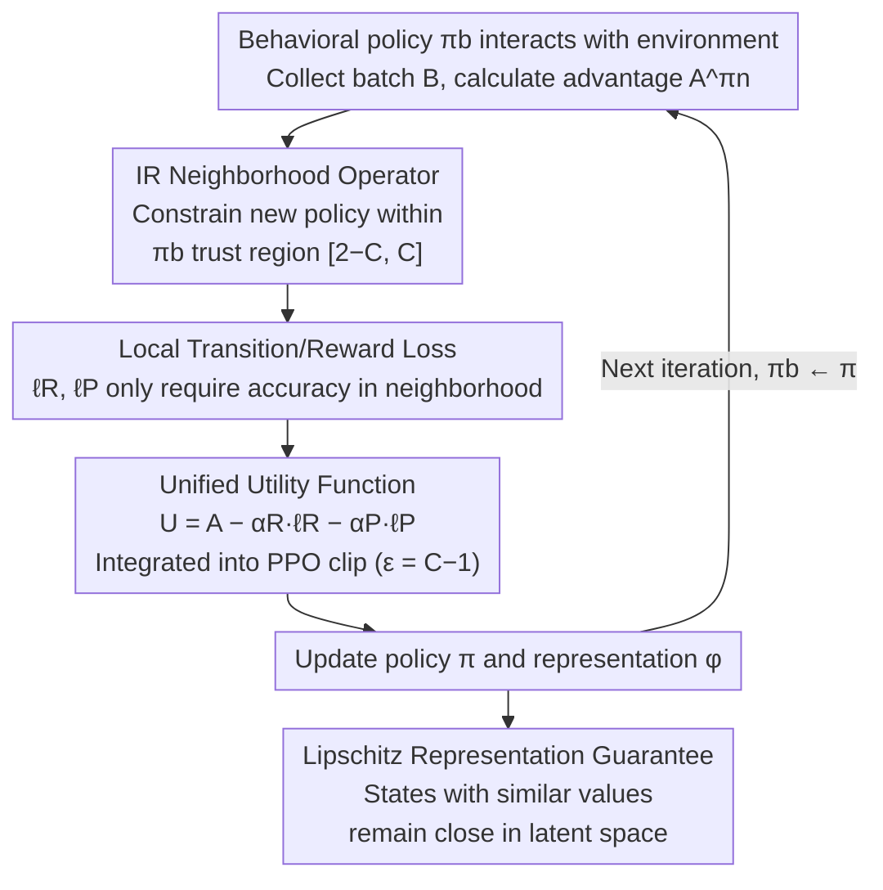

# Deep SPI: Safe Policy Improvement via World Models

**Conference**: ICLR 2026  
**arXiv**: [2510.12312](https://arxiv.org/abs/2510.12312)  
**Area**: Reinforcement Learning / Safe Policy Improvement / World Models  
**Keywords**: safe policy improvement, world model, representation learning, PPO, importance ratio

## TL;DR

This work constructs a theoretical framework for Safe Policy Improvement (SPI), unifying world models and representation learning with policy update guarantees. By constraining policy updates through a neighborhood operator based on importance ratios, it ensures monotonic improvement and convergence. Combined with local transition/reward losses to control world model quality and representation stability, the proposed DeepSPI algorithm matches or exceeds PPO and DeepMDP on the ALE-57 benchmark.

## Background & Motivation

**Background**: Safe Policy Improvement (SPI) provides theoretical guarantees by constraining policy updates to avoid catastrophic performance degradation. However, classical SPI methods are limited to offline, tabular RL, requiring exhaustive state-action coverage, which cannot scale to high-dimensional continuous spaces.

**Limitations of Prior Work 1 — OOT Problem**: When a policy deviates from the behavioral policy and the training distribution of the world model, the model may produce "hallucinations" in unexplored regions, leading to failed policy updates. For instance, the model might erroneously assign a high reward (e.g., +20) to a state that should yield a negative reward.

**Limitations of Prior Work 2 — Confounding Policy Updates**: When policies and representations are updated simultaneously, poor representations may collapse distinct states into the same latent representation. If policy selection changes based on these merged representations, it may result in catastrophic negative rewards in certain actual states.

**Core Idea**: Use Importance Ratio (IR) constraints as a neighborhood operator for policy updates, limiting the deviation of the new policy from the behavioral policy within the range $[2-C, C]$. Combined with local reward and transition losses, this simultaneously ensures: (1) the world model is accurate within the policy neighborhood, and (2) representation learning maintains Lipschitz stability.

## Method

### Overall Architecture

DeepSPI aims to solve a specific problem: extending Safe Policy Improvement (SPI) guarantees—previously only valid in offline, tabular settings—to online, high-dimensional deep RL. The challenge lies in two online pitfalls: "hallucinations" in world models within unexplored regions (the OOT problem) and the "confounding problem" where synchronized representation and policy updates collapse states that should be distinguished.

The overall mechanism of DeepSPI is to install a "safety gate" on the standard PPO training cycle. In each iteration, the current (behavioral) policy interacts with the environment to collect data and calculate the advantage function $A^{\pi_n}$ as usual. Simultaneously, the world model calculates transition/reward losses over the local region covered by this data. These two losses are subtracted directly from the advantage to form a unified utility $U$, which replaces all instances of $A$ in the PPO objective. The intrinsic clipping mechanism of PPO serves as an approximation of the Importance Ratio (IR) neighborhood operator, confining each update step within a trust region near the behavioral policy. Consequently, even with synchronous updates, the policy and representation remain within the reliable range of the world model, addressing both OOT and confounding issues through a single set of constraints while ensuring well-structured representations. The following four designs correspond to the four theorems in the paper:

### Key Designs

**1. IR Neighborhood Operator: Constraining policy updates via importance ratios**

Classical SPI fails to scale because it requires exhaustive coverage of all state-action pairs and globally valid error bounds. DeepSPI adopts a different metric: it characterizes deviation using the supremum and infimum of the probability ratio (importance ratio) between the new and old policies for every state-action pair. This defines a trust region $\mathcal{N}^C(\pi) = \{ \pi' \in \Pi \mid 2 - C \leq D_{\text{IR}}^{\inf}(\pi, \pi') \leq D_{\text{IR}}^{\sup}(\pi, \pi') \leq C \}$, where the constant $C \in (1, 2)$ acts as a knob for exploration-exploitation. Each step selects a new policy that maximizes advantage within this neighborhood:

$$\pi_{n+1} = \arg\sup_{\pi' \in \mathcal{N}^C(\pi_n)} \mathbb{E}_{s \sim \mu_{\pi_n}} \mathbb{E}_{a \sim \pi'} A^{\pi_n}(s, a)$$

Since the deviation is strictly bounded within $[2-C, C]$, the state distribution visited by the new policy always overlaps with the behavioral policy (i.e., the training distribution of the world model), preventing the model from producing hallucinations in unexplored areas. **Theorem 1** proves this update scheme is an instance of Mirror Learning, thus the value sequence $\{V^{\pi_n}\}$ improves monotonically and converges to the optimal $V^*$.

**2. Local Transition/Reward Loss: Requiring accuracy only within the policy neighborhood**

Requiring global accuracy for a world model is neither realistic nor necessary. DeepSPI only requires accuracy in the local regions visited by the current policy. It characterizes model quality using local reward loss and transition loss (based on the Wasserstein distance $\mathcal{W}$) over a batch $\mathcal{B}$:

$$L_R^\mathcal{B} = \mathbb{E}_{s,a \sim \mathcal{B}} |R(s,a) - \bar{R}(\bar{s}, a)|, \quad L_P^\mathcal{B} = \mathbb{E}_{s,a \sim \mathcal{B}} \mathcal{W}\big(\phi_\sharp P(\cdot|s,a),\, \bar{P}(\cdot|\phi(s), a)\big)$$

Both losses are local and optimizable via SGD. **Theorem 2** proves that if the IR deviation is strictly less than $1/\gamma$, the return difference between the real environment and the world model is linearly controlled by these local losses. **Theorem 3** (Deep, Safe Policy Improvement) further converts this bound into a safe improvement guarantee: $\rho(\bar{\pi}\circ\phi, \mathcal{M}) - \rho(\pi_b, \mathcal{M}) \geq \rho(\bar{\pi}, \bar{\mathcal{M}}) - \rho(\bar{\pi}_b, \bar{\mathcal{M}}) - \zeta$, where the modeling error $\zeta$ decreases as local losses decrease. This confirms that local accuracy and neighborhood constraints are sufficient to ensure that improvements in the world model translate to the real environment.

**3. Unified Utility Function: Embedding model losses into the advantage function**

Simply adding local losses as auxiliary terms to the PPO objective is insufficient; updating the representation $\phi$ to minimize these losses might move the policy $\bar{\pi}\circ\phi$ outside the safe neighborhood. DeepSPI subtracts the losses directly from the advantage function to form a unified utility:

$$U^{\pi_n}(s, a, s') = A^{\pi_n}(s, a) - \alpha_R \cdot \ell_R(s, a) - \alpha_P \cdot \ell_P(s, a, s')$$

where $\ell_R, \ell_P$ are per-transition reward/transition losses, and $\alpha_R, \alpha_P \in (0, 1]$. By replacing $A$ with $U$ in the PPO objective, and since PPO clipping (with $\epsilon = C - 1$) is equivalent to a soft IR constraint, the policy update inherently balances model loss. Consequently, the representation and policy updates are naturally aligned in a safe direction.

**4. Lipschitz Representation Guarantee: Preventing erroneous state merging**

The root of "confounding updates" is when a poor representation compresses distinct states into the same latent point. **Theorem 4** proves that when the aforementioned local losses are sufficiently small, the updated representation maintains an approximate Lipschitz property with high probability:

$$|V^{\bar{\pi}}(s_1) - V^{\bar{\pi}}(s_2)| \leq K_V \cdot \bar{d}(\phi(s_1), \phi(s_2)) + \varepsilon$$

Intuitively, states with similar values remain close in the latent space, while states with large value differences are not forced together, preventing representation collapse. In practice, architectures like GroupSort are used to strictly constrain the Lipschitz constant.

## Key Experimental Results

### ALE-57 Aggregate Results

| Metric | PPO | DeepMDP | **DeepSPI** |
|------|-----|---------|-------------|
| Mean | Baseline | Slightly > PPO | **Optimal** |
| Median | Baseline | Comparable to PPO | **Optimal** |
| IQM | Baseline | Slightly > PPO | **Optimal** |
| Optimality Gap↓ | Baseline | Slightly < PPO | **Lowest** |

### Ablation: World Model Quality (Median Training Loss)

| Metric | DeepMDP | **DeepSPI** |
|------|---------|-------------|
| Transition Loss $L_P$↓ | Higher | **Lower** |
| Reward Loss $L_R$↓ | Comparable | **Comparable** |

### Toy Maze Verification

| Method | Return from Start I | ⋆State Rep. Distance |
|------|-----------------|-------------|
| PPO | ~4.8 (Collapse) | ~0 (Merged) |
| **DeepSPI** | **~8** (Distinct⋆) | **>0 (Separated)** |

### Key Findings

- DeepSPI matches or exceeds PPO and DeepMDP across all aggregate metrics on ALE-57.
- DeepSPI consistently achieves lower transition loss, indicating a more accurate world model.
- In a custom Toy Maze, DeepSPI successfully avoids representation collapse, increasing return by approximately 67%.
- No competition was observed between transition loss and reward loss (unlike in offline settings).
- DreamSPI (a pure model-based planning variant) showed feasibility in certain environments.

## Highlights & Insights

1. **Theory-Practice Bridge**: Extends strict SPI guarantees from offline tabular settings to online deep RL with world models and representation learning.
2. **Unified Solution for OOT and Confounding**: Two distinct problems are addressed simultaneously through the same IR neighborhood constraint mechanism.
3. **Embedded Auxiliary Losses**: Embedding model losses into the advantage rather than optimizing them independently prevents representation updates from pushing policies out of bounds.
4. **Theoretical Roots for PPO**: Proves that PPO's clipping mechanism is essentially a relaxed version of the neighborhood constraint, providing an SPI perspective for its success.

## Limitations & Future Work

- Aggregate performance gains over PPO/DeepMDP require careful inspection of confidence intervals; differences may be insignificant in certain environments.
- Lipschitz constraints require specific architectural designs (e.g., GroupSort), increasing implementation complexity.
- DreamSPI (pure model-based planning) underperforms compared to online methods, highlighting challenges in on-policy world model learning and planning.
- Testing is limited to Atari; applicability to continuous control (e.g., MuJoCo) has not been verified.
- Theoretical results rely on assumptions such as $\gamma > 1/2$ and $K_{\bar{P}}^{\bar{\pi}} < 1/\gamma$, which may not always hold in practice.

## Related Work & Insights

- Relationship with classical SPI (SPIBB, Laroche, etc.): Transitioning from offline tabular to online deep settings.
- Comparison with DeepMDP (Gelada et al., 2019): DeepMDP does not constrain the impact of policy updates, thus lacking SPI guarantees.
- Formal connection to PPO/TRPO: Proving IR neighborhood constraints are a rigorous version of clipping operations.
- Connection to Bisimulation (Castro et al.): Representation guarantees align with equivalence concepts in state abstraction.

## Rating

- **Novelty**: ⭐⭐⭐⭐⭐ — First to extend SPI guarantees to online deep RL with world models and representation learning.
- **Experimental Thoroughness**: ⭐⭐⭐⭐ — Comprehensive on ALE-57 but restricted to the Atari domain.
- **Writing Quality**: ⭐⭐⭐⭐ — Rigorous theoretical derivation with intuitive examples, though mathematically dense.
- **Value**: ⭐⭐⭐⭐⭐ — Provides a solid theoretical foundation and a practical algorithm for safety in deep RL.

## Related Papers

- [\[ICLR 2026\] Safe Exploration via Policy Priors](safe_exploration_via_policy_priors.md)
- [\[ICLR 2026\] SHAPO: Sharpness-Aware Policy Optimization for Safe Exploration](shapo_sharpness-aware_policy_optimization_for_safe_exploration.md)
- [\[ICLR 2026\] Mastering Sparse CUDA Generation through Pretrained Models and Deep Reinforcement Learning](mastering_sparse_cuda_generation_through_pretrained_models_and_deep_reinforcemen.md)
- [\[ICLR 2026\] Off-Policy Safe Reinforcement Learning with Constrained Optimistic Exploration](off-policy_safe_reinforcement_learning_with_cost-constrained_optimistic_explorat.md)
- [\[ICLR 2026\] One Model for All Tasks: Leveraging Efficient World Models in Multi-Task Planning](one_model_for_all_tasks_leveraging_efficient_world_models_in_multi-task_planning.md)

<!-- RELATED:END -->

<!-- RELATED:START -->

## Related Papers

- [\[ICLR 2026\] Safe Exploration via Policy Priors](safe_exploration_via_policy_priors.md)
- [\[ICLR 2026\] SHAPO: Sharpness-Aware Policy Optimization for Safe Exploration](shapo_sharpness-aware_policy_optimization_for_safe_exploration.md)
- [\[ICLR 2026\] Mastering Sparse CUDA Generation through Pretrained Models and Deep Reinforcement Learning](mastering_sparse_cuda_generation_through_pretrained_models_and_deep_reinforcemen.md)
- [\[ICLR 2026\] Off-Policy Safe Reinforcement Learning with Constrained Optimistic Exploration](off-policy_safe_reinforcement_learning_with_cost-constrained_optimistic_explorat.md)
- [\[ICLR 2026\] Composition of Memory Experts for Diffusion World Models](composition_of_memory_experts_for_diffusion_world_models.md)

<!-- RELATED:END -->
