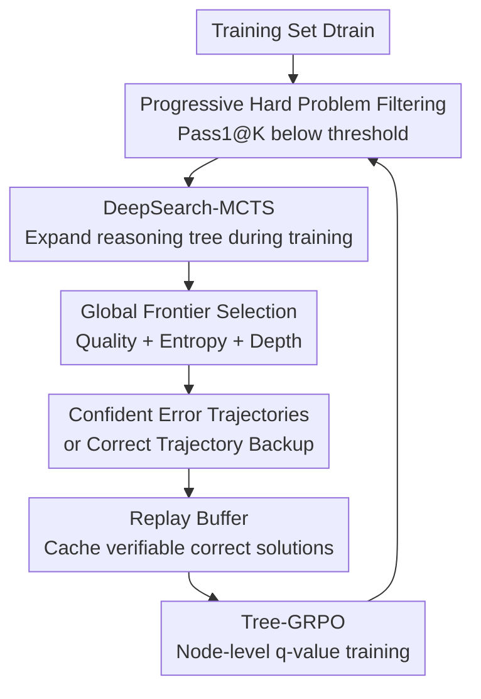

# DeepSearch: Overcome the Bottleneck of Reinforcement Learning with Verifiable Rewards via Tree-based Search

**Conference**: ICLR2026  
**OpenReview**: [https://openreview.net/forum?id=Kx0G6v2c2S](https://openreview.net/forum?id=Kx0G6v2c2S)  
**Code**: https://github.com/smiles724/DeepSearch  
**Area**: Reinforcement Learning / RLVR / LLM Reasoning  
**Keywords**: Verifiable Rewards, Monte Carlo Tree Search, Training-time Search, Mathematical Reasoning, Tree-GRPO  

## TL;DR
DeepSearch shifts MCTS from the inference phase forward into the RLVR training loop, utilizing global frontier selection, confident error trajectory supervision, and replay buffer caching to enhance exploration efficiency in mathematical reasoning. It surpasses extended training baselines on a 1.5B model with a 62.95% average accuracy while significantly reducing GPU overhead.

## Background & Motivation
**Background**: One primary direction in LLM mathematical reasoning over the past two years is employing reinforcement learning with verifiable rewards (RLVR) to allow models to learn from automatically gradable answers. For mathematical problems, the final answer can be checked via a rule-based verifier; thus, methods like DAPO, GRPO, DeepScaleR, and ProRL can train models directly using outcome rewards without human preference annotations. A parallel line of work is test-time compute scaling: sampling more chains-of-thought during inference, filtering with verifiers or reward models, or even using Tree-of-Thought / MCTS to search across multiple reasoning paths.

**Limitations of Prior Work**: There is a distinct disconnect between these two paths: RLVR training typically relies on limited direct rollouts, while structured search is only applied during inference. Sampling during the training phase is consequently sparse, causing models to repeatedly observe high-probability but low-diversity paths. If the current policy cannot bypass a specific erroneous reasoning pattern from the start, increasing training steps merely over-samples the same distribution. The paper refers to this phenomenon as the training plateau of RLVR: increasing compute for longer RL yields rapidly diminishing returns.

**Key Challenge**: Although RLVR rewards are verifiable, the reward itself is sparse. Models need to learn multi-step search-like reasoning but rarely observe "how the search unfolds, which intermediate steps lead to correct answers, or which high-confidence errors should be corrected" during training. Providing only a $+1/-1$ at the end results in coarse credit assignment for intermediate steps. Relying solely on direct rollouts means many deep reasoning frontiers are never accessed.

**Goal**: DeepSearch aims to address three sub-problems simultaneously: first, covering more candidate reasoning branches during training than direct rollouts; second, back-propagating verifier outcome rewards to intermediate reasoning nodes to identify valuable prefixes; third, ensuring the search is not so expensive that it becomes prohibitive for RL training, thereby concentrating the MCTS budget on difficult, unsolved samples.

**Key Insight**: The authors observe that while test-time MCTS has proven that structured exploration aids reasoning, if it is treated only as an inference enhancer, the model itself does not learn from the search process. Consequently, DeepSearch embeds MCTS into the training data generation process: building trees for hard problems in each round, identifying correct trajectories or informative error trajectories, and training the policy model using tree-level q-values.

**Core Idea**: Replace simple direct rollouts with training-time MCTS, transforming RLVR from "sampling multiple endpoints" into "systematically exploring reasoning trees and learning the value of intermediate nodes."

## Method

### Overall Architecture
The input to DeepSearch is a verifiable mathematical problem $x$ and the current policy model $\pi_\theta$. The output is not a standard rollout but an MCTS search tree composed of step-by-step reasoning nodes. Each node corresponds to an intermediate reasoning step, and terminal nodes are judged as correct, incorrect, or incomplete by a verifier. Trajectories derived from the tree enter Tree-GRPO training, and the updated policy is used to re-screen the hard subset in the next round.

The overall process can be summarized as "filtering hard problems → performing MCTS on unsolved problems → converting search trees into training signals → caching found correct solutions → updating the policy." MCTS here is not a direct copy of the classic root-to-leaf UCT; instead, it uses UCT for local sibling comparisons and a global frontier score for the next expansion across the entire tree. Furthermore, training does not rely solely on final outcome rewards but uses a heuristic backup to assign q-values to intermediate nodes.

### Key Designs
**1. Training-time DeepSearch-MCTS: Shifting RLVR exploration from endpoint sampling to tree search**

Traditional RLVR samples several complete answers for a problem $x$ and uses a verifier to give each trajectory an outcome reward. DeepSearch decomposes this into a tree: the root is the problem, and child nodes are the next steps $s_i$ generated by the model under the current prefix observation $o_i=x\oplus s_1\oplus\cdots\oplus s_{i-1}$. A root-to-leaf path $t=x\oplus s_1\oplus\cdots\oplus s_{end}$ represents a candidate solution. Terminal nodes are scored by $V(s)\in\{0,1\}$, where correct is $+1$ and incorrect or incomplete is $-1$.

The critical aspect of this design is exposing intermediate MCTS states to training. Direct rollouts only tell the model "if the whole answer is correct," but tree search records which prefixes were expanded, which branches eventually led to correct solutions, and which branches remained incorrect. This allows sparse signals from the verifier to back-propagate along the tree to reasoning steps, changing training samples from isolated answers into structured exploration records.

**2. Global Frontier Selection: Moving beyond repeated root-to-leaf local optimal branches**

Classic MCTS often uses UCT to select from the root to the leaves layer by layer. While natural for game trees, this wastes many repeated traversals in LLM reasoning and can get stuck in locally promising subtrees. DeepSearch retains UCT for sibling comparison (comparing multiple candidate steps generated under the same parent) using $Q(s)+\lambda\sqrt{\ln N_{parent}(s)/N(s)}$; however, the next node to be expanded is selected directly from the global set of frontiers.

The paper defines a frontier as $F=\{s\in T\mid \xi(s)=0, s\notin S_{end}, d(s)<d_T\}$, i.e., leaf nodes that are not yet expanded, not terminal, and within the depth limit. The priority of each frontier node is:

$$
F(s)=\lambda_1\tanh(Q_{parent}(s))+\lambda_2 H(\pi_\theta(s\mid o_s))+\lambda_3D(d(s)).
$$

The three terms represent parent quality potential, policy entropy guidance, and depth reward, respectively. $\tanh$ smoothly maps potentially negative $Q$ values to $[-1,1]$ to prevent extreme q-values from dominating the search. $H(\pi_\theta)$ allows the algorithm to choose between more or less certain regions, and $D(d(s))=\sqrt{d(s)/d_T}$ encourages exploration of deeper reasoning chains. The practical implication is that the training budget is no longer bound by a fixed root-to-leaf process; instead, it asks at each step, "Which unexpanded prefix in the entire tree is most worth continuing the compute?"

**3. Confident error trajectories and asymmetric q-value backup: Turning errors into useful supervision**

If a correct terminal node is found after an MCTS round, DeepSearch back-propagates the correct trajectory. If no correct solution is found, it does not pick an error trajectory at random but selects the incorrect terminal with the lowest average entropy:

$$
s^*_{neg}=\arg\min_{s\in S^{(k)}_{incorrect}} \bar H(t(s)),\quad
\bar H(t(s))=\frac{1}{|t(s)|}\sum_i H(\pi_\theta(s_i\mid o_i)).
$$

Low-entropy errors imply the model is confidently wrong. Compared to random or high-entropy errors, these trajectories represent systematic misconceptions: the model is not hesitating but consistently believing in an incorrect reasoning path. Including these in supervision allows for more direct correction of bad habits in the current policy.

During back-propagation, terminal rewards are assigned to nodes on the path with depth-based decay; deeper nodes have higher weights because they are closer to the final conclusion. The paper uses $\gamma(i,l)=\max(i/l,\gamma_{min})$, where $l$ is the terminal position and $\gamma_{min}=0.1$. Crucially, it employs asymmetric updates: if a node has ever appeared in a correct trajectory, it remains non-negative; if it was negative but later appears in a correct trajectory, it is overwritten with a positive value; if it is already positive, subsequent accidental errors do not pull it negative. This distinguishes between "prefixes proven to lead to correct solutions" and "prefixes currently observed only to lead to dead ends," reducing the damage caused by random expansion failures on valuable nodes.

**4. Adaptive training and Tree-GRPO: Concentrating MCTS budget on truly difficult samples**

Running full MCTS for every training sample is prohibitively expensive, so DeepSearch first filters a hard subset using Pass1@K. The initial policy $\pi_{\theta^{(0)}}$ performs $K=4$ direct rollouts on the training set. If $Pass1@K(x,\pi)<\delta$, $x$ is placed into $D^{(0)}_{hard}$. After each training round, the set is re-filtered to retain only problems the current model cannot solve stably. The default threshold is approximately 25%, aiming to remove mastered problems from the high-cost MCTS pipeline.

The replay buffer stores correct trajectories found by MCTS. If a problem has a cached solution, MCTS is not run fully in the next round; instead, $t_{cached}$ is used along with a few direct rollouts. If no cache exists, full MCTS is executed. The policy is formalized as:

$$
Rollout(x)=
\begin{cases}
 t_{cached}\cup DirectRollouts(x,\beta), & (x,t_{cached})\in R^{(i)},\\
 MCTS_{full}(x), & otherwise.
\end{cases}
$$

The training objective is Tree-GRPO. It first applies soft clipping to intermediate node q-values, $q(s_j)=\tanh(q^{(k_{max})}(s_j)/\epsilon_q)\cdot q_{max}$, to prevent numerical explosion after multiple backups. It then optimizes the token-level policy using PPO/GRPO-style ratio clipping. The advantage function is defined as the node q-value minus the average reward of terminal nodes in the tree $\mu_t$: $\hat A_{j,k}=q(s_j)-\mu_t$. Thus, the model can distinguish whether an intermediate step "is more like a correct path" or "is already deviating" within a single long reasoning chain.

### Loss & Training
DeepSearch is initialized with Nemotron-Research-Reasoning-Qwen-1.5B v2 and trained on the DeepMath-103K dataset within the veRL framework. The maximum MCTS depth is set to 64, calculated from a response length budget of 16,384 tokens and 256 tokens per node expansion ($16384/256\approx64$). Each expansion generates 8 children, with the local UCT exploration coefficient at 2.0. Global frontier defaults use $\lambda_1=0.4, \lambda_3=0.01$, and $D(d)=\sqrt{d/d_T}$.

Optimization uses AdamW with a learning rate of $1\times10^{-6}$, a global batch size of 256, and 16 H100 96GB GPUs for training. Evaluation is performed on 128 H100 96GB GPUs. Tree-GRPO inherits the Clip-Higher strategy from DAPO with lower/higher clipping thresholds of 0.2 and 0.28, removes KL regularization, and applies a penalty for buffers exceeding 4096. Evaluation uses temperature 0.6 and top-p 0.95, reporting Pass1@1 for $n=32$ samples.

## Key Experimental Results

### Main Results
The paper compares 1.5B-class models on 6 math reasoning benchmarks, including AIME 2024/2025, AMC2023, MATH500, Minerva, and Olympiad. DeepSearch-1.5B outperforms the initialization model Nemotron-Research-Reasoning-Qwen-1.5B v2 across all benchmarks, with average accuracy rising from 61.70% to 62.95%.

| Model | AIME24 | AIME25 | AMC23 | MATH | Minerva | Olympiad | Avg |
|------|--------|--------|-------|------|---------|----------|-----|
| DeepSeek-R1-Distill-Qwen-1.5B | 31.15 | 24.06 | 72.81 | 85.01 | 32.18 | 51.55 | 49.46 |
| DeepScaleR-1.5B | 38.54 | 30.52 | 80.86 | 88.79 | 36.19 | 58.95 | 55.64 |
| Nemotron-Research-Reasoning-Qwen-1.5B v1 | 45.62 | 33.85 | 85.70 | 92.01 | 39.27 | 64.56 | 60.17 |
| Nemotron-Research-Reasoning-Qwen-1.5B v2 | 51.77 | 32.92 | 88.83 | 92.24 | 39.75 | 64.69 | 61.70 |
| DeepSearch-1.5B | **53.65** | **35.42** | **90.39** | **92.53** | **40.00** | **65.72** | **62.95** |

Efficiency comparisons highlight the paper's thesis: simply extending DAPO training for 1,875 additional steps yields only 62.02%, while DeepSearch achieves 62.95% after only 50 extra steps. It consumes approximately 330 GPU hours, roughly 5.7x more efficient than the 1,883.2 GPU hours required for extended training.

| Method | RLVR | Extra Steps | GPU Hours | Math Score |
|------|------|----------|-----------|------------|
| DeepSeek-R1-Distill-Qwen-1.5B | - | - | - | 49.46 |
| Nemotron-Research-Reasoning-Qwen-1.5B v1 | DAPO | 2000 | 16000 | 60.10 |
| Nemotron-Research-Reasoning-Qwen-1.5B v2 | DAPO | 3000 | 24000 | 61.70 |
| Extended Training | DAPO | +325 | 326.4 | 61.78 |
| Extended Training | DAPO + KL | +785 | 788.8 | 62.08 |
| Extended Training | DAPO + KL | +1875 | 1883.2 | 62.02 |
| DeepSearch-1.5B | Tree-GRPO | +50 | **330** | **62.95** |

### Ablation Study
The component evolution table shows that simply integrating MCTS is not automatically effective; Vanilla DeepSearch even performs below the baseline. Real gains come from the new q-value update, node-level advantage normalization, and final frontier selection. Adding frontier selection in the final step improved the average score from 62.32% to 62.95%, proving critical for reaching SOTA.

| Configuration | Avg | Description |
|------|-----|------|
| Nemotron-Research-Reasoning-Qwen-1.5B v2 | 61.70 | Initial RLVR model |
| + Vanilla DeepSearch | 60.27 | MCTS integration with simple q-update, unstable |
| + New q Update & Coarse-grained Token Scores | 61.38 | Uses new backup but outcome-level token scores |
| + New q Update & Fine-grained Token Scores | 61.85 | Node-level q-values improve credit assignment |
| + Standard Advantages Normalization | 62.27 | Standard normalization further stabilizes training |
| + Mean-only Advantages Normalization | 62.32 | Mean normalization mitigates GRPO miscalibration |
| + Frontier Selection | **62.95** | Global frontier selection provides the final boost |

Search strategy ablations further explain the necessity of global frontier selection. Compared to vanilla UCT, global frontier selection reduces the average iterations from 209.6 to 187.7 while maintaining similar depth and entropy, and increases the trajectory reward from -0.82 to -0.65. Among depth rewards, linear $d(s)$ is most efficient but yields worse rewards, while $\sqrt{d(s)/d_T}$ provides the best efficiency-quality balance.

| Search Configuration | Depth | Entropy | Reward | Num. Iter. | Time Per Tree |
|----------|------|---------|--------|-----------|---------------|
| Vanilla UCT | 20.11 | 1.23 | -0.82 | 209.6 | 1179.6s |
| Global Frontier, $\lambda_1=0.4$ | 20.28 | 1.23 | -0.65 | 187.7 | 1087.7s |
| + $D(d)=d(s)$ | 21.55 | 1.24 | -0.76 | 85.7 | 480.9s |
| + uncertainty + $\sqrt{d/d_T}$ | 20.83 | 1.31 | -0.79 | 92.5 | 505.2s |
| default $\sqrt{d/d_T}$ | 20.29 | 1.24 | -0.65 | 189.3 | 1070.7s |

### Key Findings
- DeepSearch's gains come from higher-quality training-time exploration rather than longer training. Extended Training GPU hours increased from 326.4 to 1883.2 for a score increase of only 61.78 to 62.02; DeepSearch reached 62.95% at a cost roughly equal to the shortest extended training.
- "Most confident errors" are more valuable for training than random or least confident errors. Selecting the lowest-entropy incorrect trajectory yields an average score of 62.95, higher than 62.09 for random incorrect and 61.90 for least confident incorrect.
- The replay buffer effectively reduces redundant searching across rounds. Appendix data shows cached problems increased from 0 in Round 1 to 2894 in Round 5 (33.2% of the hard subset), while unsolved problems dropped from 13,658 to 5,829, indicating the MCTS budget is concentrating on the tail of difficult problems.
- Profiling shows that CPU-side MCTS logic is rarely a bottleneck; over 99% of per-tree runtime comes from policy inference/generation. This implies future optimizations should focus on batching, KV-cache reuse, or speculative decoding rather than micro-tuning search code.

## Highlights & Insights
- The most significant insight is treating search as a training data generation mechanism rather than an inference-time plugin. This allows the model not only to rely on search at test-time but also to learn "which prefixes are worth expanding" and "which confident errors should be avoided" during training.
- Global frontier selection is simple yet addresses a practical pain point in LLM MCTS: reasoning trees are not game trees with clear rules and cheap transitions; repeated root-to-leaf traversals are expensive. Directly comparing unexpanded leaves across the entire tree shifts the budget faster to informative prefixes.
- Lowest-entropy negative selection is a transferable trick. Many RLVR or verifier-based training methods focus solely on correct samples, but for the model, the most dangerous instances are often high-confidence errors. Explicitly incorporating these into training is akin to automated hard negative mining.
- The asymmetric q-value backup design fits reasoning tasks well: an intermediate step that has ever led to a correct solution should not be entirely invalidated by other failed expansions. This is more stable than averaging terminal rewards across all prefixes and aligns with the reality that "prefixes are reusable while subsequent expansions may fail."
- The paper suggests a broader direction: the bottleneck of RLVR may not be the quality of rewards or the duration of training, but rather a weak exploration interface. Integrating algorithmic search, caching, and curriculum-style hard filtering into the training cycle may be more cost-effective than simply scaling GPU resources.

## Limitations & Future Work
- Current validation is focused on mathematical reasoning. Math problems have clear answer verifiers, which MCTS and replay buffers rely on; migrating to open-ended writing, dialogue, code design, or multimodal tasks would require approximate verifiers, human feedback, or other process verification mechanisms.
- The method still incurs significant inference generation costs. Although more efficient than extended training in terms of GPU hours, the main overhead for each MCTS tree is policy generation, alongside maintaining trees, caches, and hard subsets. Project complexity will likely increase for larger models or longer tasks.
- Frontier priority still relies on manual heuristics; $\lambda_1, \lambda_2, \lambda_3$, depth rewards, and expansion widths were selected via offline tuning. The paper notes that these search components could be learned in the future, though that becomes a joint optimization problem similar to an AlphaZero controller.
- Experiments utilized 1.5B models; whether conclusions migrate proportionally to 7B, 32B, or larger reasoning models remains to be verified. Larger models' direct rollouts might be stronger, meaning marginal MCTS gains and costs curves may differ.
- Training objectives rely on explicit reasoning traces and long outputs. For applications where long chains-of-thought are undesirable or high-throughput short answers are needed, the behavioral changes brought by training-time search require additional evaluation.

## Related Work & Insights
- **vs DAPO / GRPO-style RLVR**: DAPO-class methods primarily learn from outcome rewards of multiple direct rollouts. DeepSearch organizes rollouts into search trees and assigns q-values to intermediate nodes, offering finer exploration coverage and credit assignment at the cost of more complex data generation.
- **vs DeepScaleR / ProRL prolonged training**: While prolonged RL focuses on increasing training steps and sampling budgets, DeepSearch changes the data structure observed during each training step. Experimentally exceeding 1,875 steps of extended training with only 50 extra steps suggests algorithmic efficiency is more critical than training depth in the plateau region.
- **vs Tree-of-Thought / inference-time MCTS**: These methods largely search during inference, where the model parameters do not necessarily learn the search process. DeepSearch feeds search results back into policy training, turning test-time search philosophy into training-time supervision.
- **vs AlphaGo-style policy + MCTS**: Both combine policy models with tree search, but DeepSearch deals with natural language reasoning trajectories where states and actions are generated text and rewards come from answer verifiers. It borrows the structure of MCTS but redesigns frontier selection, entropy negatives, and Tree-GRPO for LLMs.
- **Inspiration for future research**: One could try applying DeepSearch’s hard-negative selection to code RL, theorem proving, or tool-use agents. The replay buffer could also be expanded into a cross-problem solution memory, allowing models to reuse verifiable reasoning templates rather than just caching single-problem answers.

## Rating
- Novelty: ⭐⭐⭐⭐⭐ Systematically embedding MCTS into the RLVR training loop with frontier selection, confident error trajectories, and Tree-GRPO is a clear and solid direction.
- Experimental Thoroughness: ⭐⭐⭐⭐ Covers main results, efficiency, search strategies, component evolution, and qualitative cases, though limited to math reasoning and 1.5B models.
- Writing Quality: ⭐⭐⭐⭐ The structure is clear, and formulas/algorithmic diagrams are complete; a few q-value update explanations require the appendix for full clarity.
- Value: ⭐⭐⭐⭐⭐ Provides a methodologically robust solution to the RLVR plateau beyond "increasing steps," especially suitable as a reference for combining training-time search with verifier-based RL.

<!-- RELATED:START -->

## Related Papers

- [\[ICLR 2026\] Lookahead Tree-Based Rollouts for Enhanced Trajectory-Level Exploration in Reinforcement Learning with Verifiable Rewards](lookahead_tree-based_rollouts_for_enhanced_trajectory-level_exploration_in_reinf.md)
- [\[ICLR 2026\] RLVER: Reinforcement Learning with Verifiable Emotion Rewards for Empathetic Agents](rlver_reinforcement_learning_with_verifiable_emotion_rewards_for_empathetic_agen.md)
- [\[ICLR 2026\] LongRLVR: Long-Context Reinforcement Learning Requires Verifiable Context Rewards](longrlvr_long-context_reinforcement_learning_requires_verifiable_context_rewards.md)
- [\[ICLR 2026\] Rubrics as Rewards: Reinforcement Learning Beyond Verifiable Domains](rubrics_as_rewards_reinforcement_learning_beyond_verifiable_domains.md)
- [\[ICLR 2026\] RLVMR: Reinforcement Learning with Verifiable Meta-Reasoning Rewards for Robust Long-Horizon Agents](rlvmr_reinforcement_learning_with_verifiable_meta-reasoning_rewards_for_robust_l.md)

<!-- RELATED:END -->
