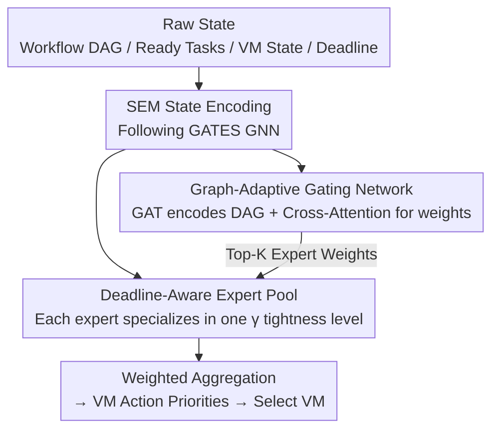

# Deft Scheduling of Dynamic Cloud Workflows with Varying Deadlines via Mixture-of-Experts

**Conference**: ICLR2026  
**OpenReview**: [https://openreview.net/forum?id=yVFOdLjd7V](https://openreview.net/forum?id=yVFOdLjd7V)  
**Code**: https://github.com/yashenCS/DEFT  
**Area**: Reinforcement Learning / Cloud Workflow Scheduling  
**Keywords**: Mixture-of-Experts, Deep Reinforcement Learning, Cloud Workflow Scheduling, Deadline-aware, Graph-adaptive Gating

## TL;DR
DEFT introduces the Mixture-of-Experts (MoE) architecture to dynamic cloud workflow scheduling for the first time. It replaces the single-path feed-forward policy head in traditional DRL schedulers with a set of experts specialized in different "deadline tightness levels," coupled with a graph-adaptive gating network that understands DAG structures and urgency for step-by-step routing. In large-scale scenarios, it reduces total scheduling costs by nearly 30% compared to the SOTA.

## Background & Motivation
**Background**: Many applications in cloud computing consist of interdependent tasks forming workflows, naturally modeled as Directed Acyclic Graphs (DAGs). Each workflow has an SLA deadline, and violations incur penalties. Solving this "Cost-Aware Dynamic Workflow Scheduling" (CADWS) problem using Deep Reinforcement Learning (DRL) has become mainstream——modeling the scheduler as an agent that selects a Virtual Machine (VM) for each ready task to minimize the total cost of "VM rent + deadline violation penalties." Recent DRL schedulers (e.g., Transformer policies in SPN-CWS, GNN policies in GATES) have significantly outperformed traditional heuristics.

**Limitations of Prior Work**: Policy networks of these DRL schedulers are typically split into two parts: a State Embedding Module (SEM, encoding raw environment states into embeddings) and a Priority Mapping Module (PMM, mapping embeddings to priorities for each VM action). Research has focused almost exclusively on SEM design, while the PMM remains **a fixed Feed-Forward Network (FFN)**, following a single, rigid reasoning path. Once trained, this path applies the same decision rules uniformly across all scheduling scenarios.

**Key Challenge**: In reality, workflow deadlines vary dramatically—some are very loose (allowing for cheaper, slower VMs to save money), while others are extremely tight (requiring the fastest VMs immediately). A fixed single-path architecture cannot satisfy both extremes: it is either too conservative (causing tight tasks to miss deadlines) or too aggressive (wasting money on loose tasks). This lack of "deadline awareness" in single-path architectures creates a performance ceiling in scenarios with a wide range of temporal pressures.

**Goal**: To enable the policy network to **adaptively switch** between reasoning behaviors based on the current urgency of each workflow at each decision step, rather than applying a "one-size-fits-all" rule.

**Key Insight**: Borrowing the MoE concept from Large Language Models—since a single expert cannot cover the entire deadline spectrum, a set of experts should be trained, each specialized in a specific tightness level, and activated via gating as needed. The critical observation is that the choice of "which expert to activate" cannot rely solely on a scalar urgency value; it must understand the DAG topology, the position of the current task, and the VM states. Thus, the gating must be "graph-adaptive."

**Core Idea**: Replace the single-path PMM with a set of deadline-specialized experts and use a graph-adaptive gating network that integrates DAG structure and urgency for step-by-step routing, allowing the scheduling policy to be dynamically modulated at a fine-grained level.

## Method

### Overall Architecture
DEFT is a new structure designed to **replace the PMM component in DRL scheduler policy networks**. The skeleton of the scheduling pipeline (SEM state encoding, environment interaction, VM selection via priority) follows the SOTA method GATES: the SEM remains GATES' GNN, responsible for encoding raw workflow/VM states. The innovation in DEFT is that the PMM, previously a single FFN, is replaced by "a pool of experts (MoE) + a graph-adaptive gating network."

At each decision step, the process is: the environment provides ready tasks, the DAG, and VM states → SEM encodes state embeddings → the graph-adaptive gating network reads the DAG, task features, VM states, and urgency to calculate weights for each expert → the selected Top-K experts map embeddings to VM priorities → weighted aggregation yields final priorities for VM selection. The policy is trained using OpenAI-ES with a two-stage scheme: "individual expert pre-training followed by joint gating training."

### Key Designs

**1. Deadline-Aware Expert Pool: Replacing a "generalized" PMM with specialized experts**
To address the inability of a single FFN to handle both loose and tight deadlines, DEFT splits the PMM into multiple lightweight MLP experts, each bound to a specific "deadline tightness level." Specifically, deadlines are controlled by a slack coefficient $\gamma$: the deadline for workflow $W_i$ is $d_i = a_i + \gamma \cdot \text{minMakespan}(W_i)$, where $a_i$ is arrival time and $\text{minMakespan}(W_i)$ is the shortest runtime using the fastest VMs. Smaller $\gamma \ge 1$ implies tighter deadlines. A discrete set of $\gamma \in \{1.25, 1.75, 2.25, 5.0\}$ is used to instantiate and **pre-train** each expert $\text{EXP}_i$ exclusively on workflows with that $\gamma$. Consequently, each expert learns optimal behavior for a specific urgency level—tight experts learn "aggressive early scheduling," while loose experts learn "delay tolerance to save VM costs." This differes fundamentally from simply making an FFN deeper or wider; ablations show that replacing GATES' PMM with a deeper MLP yields almost no gain (see Table 3), proving benefits stem from "on-the-fly specialized strategy selection."

**2. Graph-Adaptive Gating Network: Enabling routing to understand DAG structure and urgency**
Traditional MoE gating uses simple linear layers or shallow MLPs, which fail to capture topological dependencies and dynamic context, leading to incorrect expert selection in CADWS. DEFT designs a graph-adaptive gate: first, a Graph Attention Network (GAT) encodes the current DAG, weighting adjacent tasks to capture dependencies and producing informative DAG embeddings. Then, a **Cross-Attention** mechanism performs expert selection—concatenating the "DAG embedding + current task features + VM embeddings from SEM + dynamic deadline info" into a Query $Q$, while using expert representations as Key $K$ and Value $V$. Normalized attention scores provide the distribution for expert activation. This allows routing to **evolve per decision step** rather than being fixed per workflow, achieving fine-grained, deadline-sensitive activation. This is the first gating design to combine graph neural representations with MoE routing in a DRL scheduler.

**3. Two-Stage Training: Specializing experts before training the "coordinator"**
Simultaneous training of the gate and experts from scratch often fails to produce clear specialization. DEFT uses a two-stage pipeline: **Phase 1 (Expert Pre-training)** trains policy networks for each fixed $\gamma \in \{1.25, 1.75, 2.25, 5.0\}$ using OpenAI-ES until convergence, using these parameters to initialize the experts. **Phase 2 (Gating Training + Expert Fine-tuning)** integrates pre-trained experts and trains the gating network and SEM **simultaneously**, while fine-tuning the experts. Training instances in this phase sample $\gamma$ from a denser mixture $\{1.0, 1.25, 1.5, 1.75, 2.0, 2.25, 3.0\}$, forcing the gate to learn appropriate routing across various urgencies.

### Loss & Training
DEFT optimizes parameters directly using **OpenAI-ES** (Evolution Strategies) instead of backpropagation: population size 40, 3000 generations, initial learning rate 0.01, and noise standard deviation 0.05. The objective is to maximize total reward (negative total cost): $R(\tau) = -\sum_{t=0}^{T-1} C^{\text{vm}}_t - C^{\text{sla}}_T(W)$, where VM rent per step $C^{\text{vm}}_t = c_j \cdot \lceil cd_{O_{n^*}} / (v_j \cdot 3600) \rceil$ and SLA penalty $C^{\text{sla}}_T(W_i) = \beta \cdot \max\{0, C_T(W_i) - d_i\}$. Experts are pre-trained on S-scale instances (10 workflows/instance, identical $\gamma$, Poisson arrival $\lambda = 0.01$). For fairness, all baselines are trained on the same mixed-deadline data as DEFT Phase 2.

## Key Experimental Results

### Main Results
Evaluated on a widely used cloud simulator with CyberShake, Montage, Inspiral, and SIPHT workflows across S/M/L scales ($\lambda=0.01$, $\beta=0.24/\text{hour}$). Compared against ProLis, GRP-HEFT, ES-RL, SPN-CWS, and GATES.

Total cost under dynamic deadlines (lower is better):

| Scale | ES-RL | SPN-CWS | GATES (Prev. SOTA) | DEFT | Gain vs GATES |
|------|-------|---------|--------------------|------|------------------|
| S | 65.39 | 54.99 | 52.95 | **52.46** | 0.49 (0.9%) |
| M | 109.23 | 87.69 | 97.76 | **86.60** | 11.16 (11.4%) |
| L | 225.46 | 149.26 | 195.65 | **137.69** | 57.96 (29.6%) |

DEFT achieves the lowest cost at all scales, with the **advantage expanding as scale increases**. While performance is similar at S-scale (in-distribution), DEFT shows significant generalization on larger M/L scales unseen during training. Analysis of VM/SLA components shows DEFT adaptively balances trade-offs: prioritizing SLA penalties at S-scale and aggressively minimizing VM costs at M/L scales.

### Ablation Study
Comparing different gating mechanisms and a deeper PMM (all reporting average inference latency):

| Method | Total Cost S | Total Cost M | Total Cost L | Avg Inference Latency (sec/step) |
|------|---------|---------|---------|----------------------------|
| GATES (Original PMM) | 52.95 | 97.76 | 195.65 | 0.2159 |
| GATES + Deeper MLP-PMM | 52.91 | 98.41 | 194.77 | 0.2973 |
| DEFT + Linear Gate | 52.85 | 88.41 | 142.27 | 0.2176 |
| DEFT + MLP Gate | 52.70 | 87.34 | 141.62 | 0.2523 |
| **DEFT + Graph-Adaptive Gate (Ours)** | **52.46** | **86.60** | **137.69** | 0.2218 |

### Key Findings
- **Gains stem from "step-by-step expert selection," not just capacity**: Deeper MLP-PMM showed negligible improvement, whereas all DEFT variants improved significantly, proving the value of urgency-based strategy switching.
- **Gating design determines the ceiling**: Linear < MLP < Graph-adaptive. Graph-adaptive gating performs best across all scales, confirming the need to understand workflow structure and temporal pressure.
- **Minimal overhead**: The MoE with graph-adaptive gating is only marginally slower than the original GATES (0.2218 vs 0.2159 sec/step), whereas a deeper MLP is significantly slower (0.2973 sec/step).
- **Strong Generalization**: The advantage of DEFT is most prominent at scale L (-29.6%) and under tight deadlines.

## Highlights & Insights
- **Reinterpreting MoE as an "Adaptive Strategy Modulator"**: This is the first work to use MoE for dynamic cloud scheduling. Experts aren't just "more parameters"; they represent semantic urgency levels, turning routing into "style switching" based on pressure—a transferable insight for any RL problem with wide input difficulty ranges.
- **Graph-Adaptive Gating is a Clever Design**: By using DAG embeddings, task features, and VM states as Queries and expert representations as Keys/Values for Cross-Attention, the routing actually "understands" the scheduling context.
- **Temporal Expert Activation**: Experts can switch within a single workflow over time. This implements fine-grained deadline awareness and explains the stability across mixed-deadline scenarios.
- **OpenAI-ES for Stability**: Using evolution strategies avoids the instability of policy gradients in long-horizon tasks with sparse episodic penalties (SLA penalties are only settled at the end).

## Limitations & Future Work
- **Discrete Manual Expertise**: $\gamma$ levels and the number of experts are manually defined; there is no mechanism to automatically determine optimal tightness bins.
- **Scale Distribution Shift**: The gate and experts are trained on S-scale and migrate to M/L. While it works well, robustness at even more extreme scales remains to be verified.
- **Explainability**: Gating decisions remain a black box. Future work aims to add interpretability to expert routing for "trustworthy" scheduling.
- **Single-Tenant Assumption**: Current experiments ignore multi-tenant fairness and resource isolation.
- **Training Cost**: OpenAI-ES with population 40 and 3000 generations involves high computational overhead.

## Related Work & Insights
- **vs. GATES**: GATES uses GNN for SEM but a rigid PMM. DEFT inherits the GNN and proves that the bottleneck was in the PMM's rigidity, reducing costs by 11%~30% at scale.
- **vs. SPN-CWS**: SPN-CWS uses a Transformer policy that aggressively minimizes VM costs but often violates SLAs; DEFT balances both ends more effectively.
- **vs. MoE in Static Optimization**: Unlike VRP-focused MoEs with linear gates, DEFT handles continuous arrivals and varying deadlines through graph-adaptive gating.
- **vs. Heuristics (ProLis, GRP-HEFT)**: Heuristics either fail on SLA penalties or over-provision expensive VMs, resulting in costs several times higher than DERL.

## Rating
- Novelty: ⭐⭐⭐⭐ First introduction of MoE + Graph-Adaptive Gating to dynamic cloud scheduling; clear mapping of experts to deadline levels.
- Experimental Thoroughness: ⭐⭐⭐⭐ 5 baselines across 3 scales + 3 ablation sets; solid evidence chain, though limited to one simulator and single-tenant.
- Writing Quality: ⭐⭐⭐⭐ Logical flow from motivation to method; clear figures and modules.
- Value: ⭐⭐⭐⭐ Significant cost reduction (11%~30%) with low latency overhead; high practical value for cost-sensitive cloud scheduling.

<!-- RELATED:START -->

## Related Papers

- [\[ICML 2026\] SPHERE: Mitigating the Loss of Spectral Plasticity in Mixture-of-Experts for Deep Reinforcement Learning](../../ICML2026/reinforcement_learning/sphere_mitigating_the_loss_of_spectral_plasticity_in_mixture-of-experts_for_deep.md)
- [\[ICLR 2026\] Composition of Memory Experts for Diffusion World Models](composition_of_memory_experts_for_diffusion_world_models.md)
- [\[ICML 2026\] Parameter-free Dynamic Regret: Time-varying Movement Costs, Delayed Feedback, and Memory](../../ICML2026/reinforcement_learning/parameter-free_dynamic_regret_time-varying_movement_costs_delayed_feedback_and_m.md)
- [\[ICLR 2026\] On-Policy RL Meets Off-Policy Experts: Harmonizing Supervised Fine-Tuning and Reinforcement Learning via Dynamic Weighting](on-policy_rl_meets_off-policy_experts_harmonizing_supervised_fine-tuning_and_rei.md)
- [\[ICLR 2026\] Balancing the Experts: Unlocking LoRA-MoE for GRPO via Mechanism-Aware Rewards](balancing_the_experts_unlocking_lora-moe_for_grpo_via_mechanism-aware_rewards.md)

<!-- RELATED:END -->
