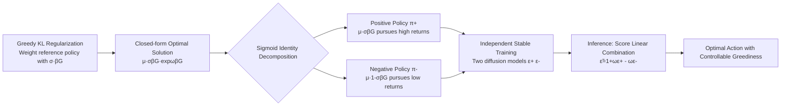

# Dichotomous Diffusion Policy Optimization

**Conference**: ICLR 2026  
**OpenReview**: [https://openreview.net/forum?id=R8y089OGoo](https://openreview.net/forum?id=R8y089OGoo)  
**Code**: [https://lrmbbj.github.io/DIPOLE/](https://lrmbbj.github.io/DIPOLE/)  
**Area**: Reinforcement Learning / Diffusion Policy Optimization  
**Keywords**: Diffusion Policy, KL-regularized RL, Weighted Regression, Dichotomous Policy Decomposition, classifier-free guidance, Offline/Offline-to-Online RL, VLA Autonomous Driving  

## TL;DR
DIPOLE decomposes the exponential weight of the optimal policy in KL-regularized RL into a pair of bounded "dichotomous policies" (one pursuing high returns, the other low returns), stabilizes training using sigmoid weighting, and linearly combines their scores at inference—similar to classifier-free guidance—to achieve stable diffusion policy optimization with controllable greediness.

## Background & Motivation
**Background**: Diffusion/flow-matching models have become the mainstream policy class for decision-making tasks such as robotics and autonomous driving due to their ability to model multi-modal action distributions and controllable generation at inference. However, training large-scale diffusion policies via reinforcement learning to exceed the performance of the underlying data remains a recognized challenge.

**Limitations of Prior Work**: Existing routes for training diffusion policies with RL have inherent drawbacks: (1) Direct gradient backpropagation through multi-step denoising (e.g., DDPO, DRaFT) suffers from high noise, instability, and high computational costs; (2) Freezing the diffusion model and searching noise at inference (Inference-time Scaling) is limited by the upper bound of the pre-trained policy; (3) Modeling the denoising process as a multi-step MDP and using Gaussian approximations for policy gradients (e.g., DPPO) is only accurate when steps are small, leading to large exploration spaces, slow training, and accumulated approximation errors.

**Key Challenge**: KL-regularized RL provides an elegant closed-form weighted regression solution $\pi^\star(a|s)\propto\mu(a|s)\cdot\exp(\beta G(s,a))$, where the optimal policy can be extracted by multiplying the diffusion regression loss by an exponential weight. However, the exponential function grows too fast: greedily maximizing returns requires a large temperature $\beta$, which causes weight explosion and loss instability. Furthermore, the loss becomes dominated by a few high-return samples, leading to inefficient learning and poor scalability. This creates a dilemma between "optimality vs. stability."

**Goal**: To build a stable and greediness-controllable diffusion policy RL method while retaining the simplicity and scalability of weighted regression.

**Core Idea**: **Greedy KL Regularization + Dichotomous Policy Decomposition**—mathematically decompose the unstable exponential weight into two bounded, smooth sigmoid weights. This decomposes the optimal policy into a pair of stably trainable dichotomous policies, which are then linearly combined at inference using a greediness factor $\omega$ in a CFG-style score combination to recover the optimal policy.

## Method

### Overall Architecture
DIPOLE starts from a "greedier" objective than standard KL regularization and derives the closed-form optimal solution. It finds that the solution can be decoupled into two policies (positive and negative) weighted by sigmoids, trained independently and stably, and then reconstructed as optimal actions via CFG-style score combination.

### Key Designs

**1. Greedy KL-regularized Objective: Injecting "Value Awareness" into the Reference Policy**. Standard KL regularization constrains policy $\pi$ to a reference policy $\mu$, yielding an exponential solution $\mu\cdot\exp(\beta G)$. DIPOLE does not regularize against the raw $\mu$; instead, it replaces it with a sigmoid-weighted "value-aware reference policy" $\mu(a|s)\cdot\sigma(\beta G(s,a))/Z(s)$ and introduces an extra greediness factor $\omega$:

$$\max_\pi \mathbb{E}_{s\sim d^\pi}\Big[\mathbb{E}_{a\sim\pi}[G(s,a)]-\tfrac{1}{\omega\beta}D_{\mathrm{KL}}\big(\pi(\cdot|s)\,\|\,\tfrac{\mu(\cdot|s)\sigma(\beta G)}{Z(s)}\big)\Big]$$

Bounded, smooth sigmoids are used as weighing functions to give higher weights to high-return samples without numerical explosion. The resulting closed-form optimal solution (Theorem 1) is:

$$\pi^\star(a|s)\propto\mu(a|s)\cdot\sigma(\beta G(s,a))\cdot\exp(\omega\beta G(s,a))$$

Here, $\beta$ and $\omega$ jointly control greediness—specifically parameterizing the "greediness factor" for subsequent decomposition and controllable generation.

**2. Dichotomous Policy Decomposition: Splitting Unstable Exponential into Bounded Sigmoids**. Using the identity $\exp(x)=\sigma(x)/(1-\sigma(x))$, the optimal solution can be rewritten as a ratio of two weighted reference policies:

$$\pi^\star(a|s)\propto[\mu(a|s)\sigma(\beta G)]^{1+\omega}\big/[\mu(a|s)(1-\sigma(\beta G))]^{\omega}$$

This naturally defines a pair of **dichotomous policies**: the positive policy $\pi^+\propto\mu\cdot\sigma(\beta G)$ learns high-return samples to maximize rewards; the negative policy $\pi^-\propto\mu\cdot(1-\sigma(\beta G))$ learns low-return samples to minimize rewards. The optimal policy is expressed as $\pi^\star\propto[\pi^+]^{1+\omega}/[\pi^-]^\omega$. Since the weights of both policies are strictly bounded sigmoids, loss explosion is eliminated at its root. Furthermore, by utilizing both "good" and "bad" data, the method solves the limitation of weighted regression being dominated by a few samples. Each policy is trained independently (Eq. 9) using separate diffusion models $\epsilon^+_{\theta_1}$ and $\epsilon^-_{\theta_2}$.

**3. CFG-style Controllable Generation: Score Linear Combination**. Since $\log\pi^\star=(1+\omega)\log\pi^+-\omega\log\pi^-+\text{const}$, the scores (gradients w.r.t. action) follow the same linear relationship:

$$\nabla_a\log\pi^\star=(1+\omega)\nabla_a\log\pi^+-\omega\nabla_a\log\pi^-$$

Leveraging the correspondence between scores and noise predictors, sampling is performed using $\tilde\epsilon=(1+\omega)\epsilon^+_{\theta_1}-\omega\epsilon^-_{\theta_2}$ in the reverse process. This form is strikingly similar to classifier-free guidance $\tilde\epsilon=(1+\omega)\epsilon_\theta(x,c)-\omega\epsilon_\theta(x)$: the positive policy acts as the "conditional distribution" and the negative as the "unconditional," where pushing away from the negative enhances the positive. $\omega$ becomes a greediness knob—allowing inference-time adjustment of optimality without retraining. Compared to CFGRL, DIPOLE’s asymmetric weighting provides stronger greediness and theoretical backing.

**Implementation**: In multi-step RL, $G(s,a)$ is the advantage function $A(s,a)$. In offline settings, $\mu$ is the behavior policy $\pi_\beta$. In offline-to-online settings, $\mu$ is the previous policy $\pi_{k-1}$. For autonomous driving, the method was scaled to a 1-billion parameter VLA model (DP-VLA), using independent LoRA modules for the positive/negative policies and fine-tuned in an offline-to-online manner.

## Key Experimental Results

### Main Results: Offline RL (ExORL & OGBench)

ExORL (Average Score, 8 seeds):

| Domain/Task | IQL | ReBRAC | CFGRL | IFQL | FQL | DIPOLE |
|---|---|---|---|---|---|---|
| Walker-stand | 603 | 461 | 782 | 873 | 801 | **953** |
| Walker-walk | 444 | 208 | 608 | 844 | 755 | **910** |
| Walker-run | 247 | 98 | 282 | 406 | 294 | **442** |
| Quadruped-walk | 776 | 344 | 762 | 883 | 739 | **928** |
| Cheetah-run | 168 | 97 | 216 | 269 | 222 | **274** |
| Cheetah-run-backward | 146 | 85 | 262 | 310 | 231 | **350** |

OGBench (Success Rate across categories, 8 seeds):

| Task Category | IQL | ReBRAC | IDQL | IFQL | FQL | DIPOLE |
|---|---|---|---|---|---|---|
| humanoidmaze-medium (5) | 33 | 2 | 1 | 60 | 58 | **68** |
| antsoccer-arena (5) | 8 | 0 | 12 | 33 | **60** | 57 |
| cube-double-play (5) | 7 | 12 | 15 | 14 | 29 | **44** |
| scene-play (5) | 28 | 41 | 46 | 30 | 56 | **60** |

DIPOLE achieves optimal or near-optimal performance across most domains, outperforming Gaussian-weighted IQL. Even without inference-time rejection sampling (DIPOLE w/o rs), it exceeds CFGRL, validating the value of the asymmetric greedy design.

### Offline-to-Online RL (OGBench, Before/After 1M Online Updates)

| Task Category | IFQL | FQL | DIPOLE |
|---|---|---|---|
| humanoidmaze-m | 56→82 | 12→22 | 61→**97** |
| antsoccer-arena | 26→39 | 28→86 | 43→**90** |
| scene | 0→60 | 82→100 | 97→**100** |

DIPOLE shows a higher performance upper bound than IFQL and remains competitive with direct value maximization (FQL), balancing greediness with stability.

### Autonomous Driving (NAVSIM Closed-loop, PDMS↑)

| Method | Input | NC | DAC | EP | PDMS |
|---|---|---|---|---|---|
| Hydra-MDP | Cam&Lidar | 98.3 | 96.0 | 78.7 | 86.5 |
| DP-VLA (ours) | Cam | 98.0 | 97.0 | 82.5 | 88.3 |
| DP-VLA w/ DPPO (navtest) | Cam | 97.9 | 97.6 | 83.5 | 89.0 |
| DP-VLA w/ DIPOLE (navtrain) | Cam | 98.2 | 98.0 | 83.6 | **89.7** |
| DP-VLA w/ DIPOLE (navtest) | Cam | **99.2** | **98.7** | **94.2** | **94.8** |

The vision-only DP-VLA baseline already outperforms multi-modal Hydra-MDP. Fine-tuning with DIPOLE further enhances PDMS, outperforming DPPO and demonstrating scalability to billion-parameter VLAs in complex real-world scenarios.

### Key Findings
- Splitting exponential weights into bounded sigmoid dichotomous terms is the source of stability: it prevents loss explosion while utilizing both good and bad data.
- The greediness factor $\omega$ serves as an adjustable knob at inference, equivalent to a CFG guidance scale.
- The method scales from low-dimensional state-based tasks to pixel-level autonomous driving with 1B VLA models.

## Highlights & Insights
- **Elegant Mathematical Decomposition**: Using $\exp(x)=\sigma(x)/(1-\sigma(x))$ to transform "unstable exponential weights" into a "ratio of two bounded sigmoid weights" solves stability structurally rather than through engineering tricks (like clipping or small $\beta$).
- **Unified Perspective**: Reveals an intrinsic link between greedy policy extraction in KL-regularized RL and CFG in diffusion models—mapping RL greediness and diffusion guidance intensity to the same $\omega$.
- **Better Data Utilization**: By training a positive policy on good samples and a negative policy on bad samples, it avoids the inefficiency of weighted regression being dominated by outliers.

## Limitations & Future Work
- Requires training two diffusion policies (partially mitigated by using two LoRA modules on a shared VLA), which increases training/storage overhead.
- Performance depends on the estimation quality of the advantage/value function $G(s,a)$; value bias will affect both positive and negative branches.
- Evaluations in AD use non-reactive pseudo-closed-loop simulation; robustness in multi-agent interaction scenarios remains to be verified.
- Adaptive selection of/interactions between $\beta$ and $\omega$ are left for future work.

## Related Work & Insights
- **Weighted Regression RL**: AWR/AWAC, IQL, and CFGRL provide closed-form solutions for KL regularized RL; DIPOLE addresses their stability issues via greediness-aware dichotomous decomposition.
- **Diffusion Policy RL**: Compared to DDPO/DRaFT (direct backprop), DPPO (Gaussian policy gradient), and IDQL/IFQL/FQL (rejection sampling/distillation), DIPOLE avoids backprop instability and likelihood approximation errors.
- **Classifier-Free Guidance**: Reinterprets CFG from a quality-enhancement tool in generation to a "greediness control" mechanism for RL, providing a transferable design paradigm.

## Rating
- **Novelty**: ⭐⭐⭐⭐ Dichotomous decomposition and the unification of RL greediness with CFG is clever and structural.
- **Experimental Thoroughness**: ⭐⭐⭐⭐ Covers 39 tasks in ExORL/OGBench plus 1B VLA verification on NAVSIM. Strong evidence across scales, though some ablations are in the appendix.
- **Writing Quality**: ⭐⭐⭐⭐ Clear logic from motivation to derivation; the CFG analogy is helpful for intuition.
- **Value**: ⭐⭐⭐⭐ Provides a simple, scalable, and theoretically grounded solution for training large-scale diffusion policies, highly practical for robotics and autonomous driving.

<!-- RELATED:START -->

<!-- RELATED:END -->

## Related Papers

- [\[ICLR 2026\] Heterogeneous Agent Q-weighted Policy Optimization](heterogeneous_agent_q-weighted_policy_optimization.md)
- [\[ACL 2026\] d-TreeRPO: Towards More Reliable Policy Optimization for Diffusion Language Models](../../ACL2026/reinforcement_learning/d-treerpo_towards_more_reliable_policy_optimization_for_diffusion_language_model.md)
- [\[ICLR 2026\] Single-stream Policy Optimization](single-stream_policy_optimization.md)
- [\[ICLR 2026\] SPG: Sandwiched Policy Gradient for Masked Diffusion Language Models](spg_sandwiched_policy_gradient_for_masked_diffusion_language_models.md)
- [\[ICLR 2026\] Relative Entropy Pathwise Policy Optimization](relative_entropy_pathwise_policy_optimization.md)

<!-- RELATED:END -->
