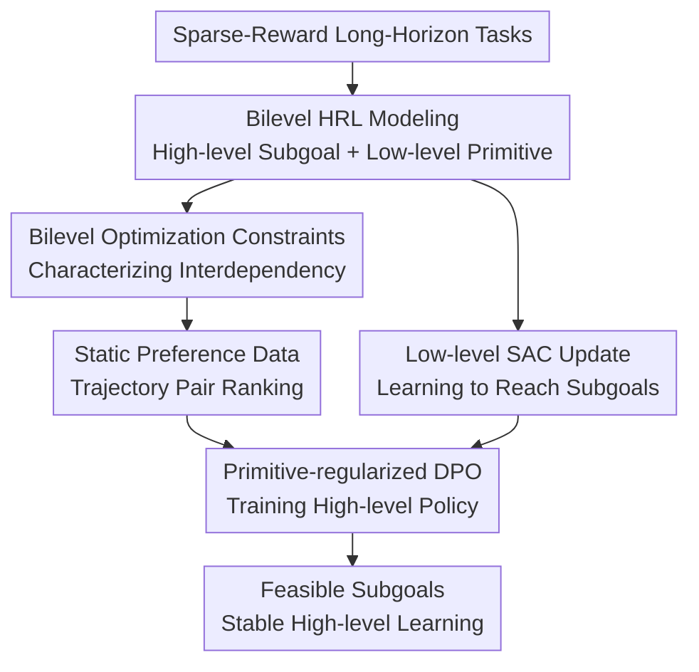

# Direct Preference Optimization for Primitive-Enabled Hierarchical RL: A Bilevel Approach

**Conference**: ICLR2026  
**OpenReview**: [https://openreview.net/forum?id=wleUyyqTz2](https://openreview.net/forum?id=wleUyyqTz2)  
**Code**: To be released  
**Area**: Hierarchical Reinforcement Learning / Preference Optimization / Robot Control  
**Keywords**: Hierarchical Reinforcement Learning, DPO, Bilevel Optimization, Feasible Subgoals, Sparse Rewards  

## TL;DR
DIPPER formulates goal-conditioned hierarchical reinforcement learning (HRL) as a bilevel optimization problem. It trains the high-level subgoal policy using DPO with primitive regularization based on the low-level value function. This simultaneously mitigates non-stationarity caused by low-level policy evolution and the generation of unreachable subgoals by the high-level policy. It significantly outperforms various HRL, DPO, and flat RL baselines on sparse-reward robot navigation and manipulation tasks.

## Background & Motivation
**Background**: The fundamental promise of Hierarchical Reinforcement Learning (HRL) is to decompose long-horizon tasks into a two-layer structure: "high-level decides subgoals, low-level executes atomic actions." The high-level outputs a subgoal $g_t$ every $K$ time steps, and the low-level policy $\pi_L(a\mid s,g_t)$ attempts to reach it within that window. Compared to flat RL, this temporal abstraction is better suited for sparse-reward and long-horizon tasks, such as navigating mazes, pushing blocks, pick-and-place, or completing sequential operations in the Franka Kitchen.

**Limitations of Prior Work**: While conceptually elegant, this structure faces two persistent issues during training. First is non-stationarity: since the low-level policy $\pi_L$ is constantly evolving, the high-level's observation of "where it will end up and how much reward it will get after giving a certain subgoal" also changes. Consequently, old experiences in the high-level replay buffer quickly become obsolete, causing the learning signal to drift. Second is infeasible subgoals: the high-level may propose a $g_t$ that is currently unreachable by the low-level. When the low-level fails, the high-level receives no clear credit assignment and continues to struggle around incorrect subgoals.

**Key Challenge**: These two problems stem from the same coupled structure. High-level actions determine what the low-level learns, while low-level capabilities determine if high-level actions are meaningful. Traditional HRL often trains both layers as standard RL without an explicit mathematical constraint to express that "the high-level should serve the final task without exceeding the current executable capacity of the low-level."

**Goal**: The paper seeks to answer three questions: how to formulate the interdependence between layers as a principled optimization form; how to make high-level learning no longer directly dependent on environmental rewards that fluctuate with the low-level policy; and how to explicitly incorporate the low-level's "feasibility" into high-level subgoal generation.

**Key Insight**: The authors observe that preference data can provide more stable high-level supervision than environmental rewards. As long as preference labels come from fixed trajectory comparisons rather than a shifting low-level policy, the high-level can learn "which subgoal sequences are better" via Direct Preference Optimization (DPO). However, directly applying DPO to robotic HRL is insufficient, as DPO only prefers ultimately better trajectories without automatically guaranteeing that each intermediate subgoal is reachable for the low-level.

**Core Idea**: The key to DIPPER is "training the high-level with static preference comparisons and constraining it with the low-level value function." Specifically, a primitive regularization term is added to the DPO objective, encouraging the high-level to move toward final task preferences while proposing subgoals that are currently high-value and executable for the low-level.

## Method

### Overall Architecture
DIPPER maintains the two-layer structure of goal-conditioned HRL: the high-level policy $\pi_H(g_t\mid s_t,g^*)$ provides subgoals, and the low-level primitive policy $\pi_L(a\mid s,g_t)$ executes them using off-policy RL like SAC. The difference lies in the high-level: it no longer uses standard RL dependent on low-level behavior rewards but instead performs DPO on preference labels from high-level trajectory pairs. Simultaneously, the implicit reward of the high-level DPO is regularized by the low-level value function to encourage feasible subgoals.

The training process involves three parallel lines. The first line collects high-level trajectories and low-level transitions: high-level trajectories enter the preference dataset $D$, and low-level interactions enter the replay buffer $R_L$. The second line updates $\pi_L$ and its value function $V^L$ using $R_L$. The third line samples paired high-level trajectories $(\tau^1,\tau^2,y)$ from $D$ to update $\pi_H$ using DIPPER's DPO objective. Thus, the primary supervision for the high-level comes from fixed preference comparisons, while the feasibility of subgoals is continuously constrained by the low-level value function.

### Key Designs
**1. Bilevel Optimization Perspective: Modeling HRL Coupling as Constraints**

In standard HRL, the high-level maximizes task returns while the low-level maximizes subgoal reaching, but they usually only alternate updates. DIPPER first formulates this as bilevel optimization: the high-level maximizes $J(\pi_H,\pi_L^*(\pi_H))$, where the low-level $\pi_L^*(\pi_H)$ is the optimal primitive policy under the high-level's subgoal distribution. Formally:

$$
\max_{\pi_H,\pi_L} J(\pi_H,\pi_L^*(\pi_H))\quad
\text{s.t.}\quad
\pi_L^*(\pi_H)=\arg\max_{\pi_L}V^L(\pi_H).
$$

The significance of this formula is to transform the intuition that "high-level actions must consider the low-level's best response" into a formal constraint. The authors rewrite this using an approximate Lagrangian, adding $V^L(s_t,g_t)-V^{L*}(s_t,g_t)$ to the high-level objective. Since $V^{L*}$ represents the optimal reachable value for that subgoal, the high-level is penalized if it proposes subgoals with poor current low-level value.

**2. Static Preference DPO: Avoiding Reward Signal Drift**

The core of HRL non-stationarity is that both high-level rewards and transitions depend on the low-level policy. DIPPER replaces high-level RL with preference-based trajectory comparisons: given two high-level trajectories $\tau^1$ and $\tau^2$, if a static scoring function yields $\hat R(\tau^1)>\hat R(\tau^2)$, then $\tau^1\succ\tau^2$ is labeled. DPO is then used to increase the likelihood of preferred trajectories and decrease others. The preference labels are designed to be independent of the evolving low-level policy, using sparse progress relative to the final goal $g^*$, such as $\hat r(s_{t*k},g^*,g_t)=1\{\lVert s_{t*(k+1)}-g^*\rVert_2\le\epsilon\}$.

**3. Primitive Regularization: Filtering "Good but Impossible" Subgoals**

Pure DPO might lead the high-level to learn subgoal sequences that are tempting from a preference perspective but unreachable for the current low-level. DIPPER adds a low-level value function term to the DPO implicit reward:

$$
\hat r(s_t,g_t,g^*)=\beta\log \pi_H(g_t\mid s_t,g^*)-
\lambda\bigl(V^L(s_t,g_t)-V_m^L(s_t,g_t)\bigr),
$$

where $V_m^L$ approximates the optimal low-level value via multi-step updates, and $\lambda$ controls regularization strength. This ensures the high-level favors subgoals that are both useful for the task and feasible for the primitive.

**4. Diagnostic Metrics: Measuring Non-stationarity and Infeasibility**

The paper introduces the Subgoal Distance Metric and Lower Q-Function Metric. The former calculates the distance between high-level subgoals and actually reached states; smaller distances indicate better feasibility. The latter monitors the low-level Q-values for high-level subgoals; higher values signify more reachable subgoals. Figure 3 shows that DIPPER consistently yields lower subgoal distances and higher low-level Q-values compared to baselines like HAC, RAPS, and HIER.

### Loss & Training
The high-level objective is derived from DPO. For trajectory pairs $(\tau^1,\tau^2,y)$ in $D$:

$$
L_O=-\mathbb{E}_{(\tau^1,\tau^2,y)\sim D}
\left[\log\sigma\left(\sum_{t=0}^{T-1}
\left(\beta\log\pi_H(g_t^1\mid s_t^1,g^*)-
\beta\log\pi_H(g_t^2\mid s_t^2,g^*)-
\lambda\Delta V_t\right)\right)\right],
$$

where $\Delta V_t=(V^L(s_t^1,g_t^1)-V_m^L(s_t^1,g_t^1))-(V^L(s_t^2,g_t^2)-V_m^L(s_t^2,g_t^2))$. For low-level training, SAC optimizes the primitive policy using transitions $(s_{t+k},g_t,a_k,r_L,s_{t+k+1})$ from the low-level replay buffer.

## Key Experimental Results

### Main Results
Evaluation was conducted on Maze navigation, Pick and Place, Push, and Franka Kitchen.

| Task | Major Baselines | DIPPER Performance | Key Finding |
|------|--------------|-------------|----------|
| Maze navigation | HAC, SAGA, RAPS, HIER | Comparable, not strongest | Existing HRL/prior methods work well; DIPPER’s advantage is less pronounced. |
| Pick and Place | HAC, SAGA, PIPER | Significantly better | Feasible subgoals are crucial for sparse grasping; regularization shows value. |
| Push | HAC, RAPS, FLAT | Significant lead | Flat RL fails to explore; HRL structure + preference supervision is more stable. |
| Franka Kitchen | HAC, DAC, PIPER | Significant lead | Long-horizon tasks benefit most from solving non-stationarity and infeasibility. |

### Ablation Study
| Configuration | Change in Performance | Explanation |
|-------------|--------------|------|
| DIPPER-No-V | Success rate drops | Without low-level value regularization, the high-level proposes more infeasible subgoals. |
| DPO-FLAT | Significantly weaker | Single-layer DPO lacks temporal abstraction and the exploration benefits of primitives. |
| Small $\lambda$ | Performance drops | Weak regularization allows high-level to ignore low-level feasibility. |
| Large $\lambda$ | Conservative behavior | High-level over-caters to current low-level limits, producing trivial subgoals. |

### Key Findings
- DIPPER's advantages are most evident in complex tasks like Pick and Place, Push, and Kitchen.
- Diagnostic results confirm that DIPPER policies propose subgoals that are closer to reachable states (lower distance) and have higher expected low-level returns (higher Q-value).
- Compared to PIPER (HRLHF style), DIPPER is more direct by avoiding explicit reward model training while inherited preference stability.

## Highlights & Insights
- Formulating HRL's core issues as bilevel optimization provides a clear theoretical foundation.
- Transitioning DPO from token-level generation in LMs to temporal-step subgoal generation in control is a natural yet effective extension.
- Primitive regularization ensures that preference learning is grounded in what the low-level can actually execute, preventing "hallucinated" plans.

## Limitations & Future Work
- While preference data is static, it still requires acquisition. In real robots, defining and collecting preference pairs without the sparse-progress heuristic might be difficult.
- It remains unclear if DIPPER generalizes better to out-of-distribution states than reward-model-based HRLHF.
- High-dimensional goal spaces (e.g., images) may make low-level value function regularization more difficult to stabilize.

## Related Work & Insights
- **vs HAC / HIRO**: Instead of relabeling or simulated transitions, DIPPER uses static preference supervision to bypass reward drift and adds an explicit feasibility constraint.
- **vs SAGA**: While SAGA works well on Mazes, DIPPER's combination of DPO and value regularization appears more robust for complex manipulation.
- **vs PIPER**: DIPPER simplifies the RLHF pipeline by using DPO directly on the high-level policy, eliminating the reward modeling step.

## Rating
- Novelty: ⭐⭐⭐⭐☆
- Experimental Thoroughness: ⭐⭐⭐⭐☆
- Writing Quality: ⭐⭐⭐⭐☆
- Value: ⭐⭐⭐⭐☆

<!-- RELATED:START -->

## Related Papers

- [\[ICLR 2026\] Offline Preference-based Value Optimization](offline_preference-based_value_optimization.md)
- [\[ICLR 2026\] Preference-based Policy Optimization from Sparse-reward Offline Dataset](preference-based_policy_optimization_from_sparse-reward_offline_dataset.md)
- [\[ICLR 2026\] A Hierarchical Circuit Symbolic Discovery Framework for Efficient Logic Optimization](a_hierarchical_circuit_symbolic_discovery_framework_for_efficient_logic_optimiza.md)
- [\[ICML 2026\] Bilevel Optimization over Saddle Points of Zero-Sum Markov Games](../../ICML2026/reinforcement_learning/bilevel_optimization_over_saddle_points_of_zero-sum_markov_games.md)
- [\[ICLR 2026\] DuPO: Enabling Reliable Self-Verification via Dual Preference Optimization](dupo_enabling_reliable_self-verification_via_dual_preference_optimization.md)

<!-- RELATED:END -->
