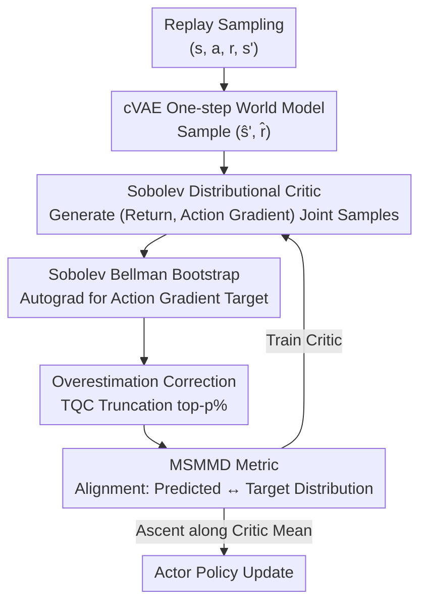

# Distributional value gradients for stochastic environments

**Conference**: ICLR2026  
**OpenReview**: [https://openreview.net/forum?id=6hZAo6fZvJ](https://openreview.net/forum?id=6hZAo6fZvJ)  
**Code**: https://github.com/BaptisteDebes/Distributional-value-gradients (Available, JAX)  
**Area**: Reinforcement Learning  
**Keywords**: Distributional Reinforcement Learning, Value Gradients, Sobolev Training, World Models, Maximum Mean Discrepancy

## TL;DR
Addressing the failure of "value gradient for credit assignment" methods like MAGE in stochastic/noisy environments, this paper extends distributional RL from "modeling return distributions" to "jointly modeling the return and its action-gradient distribution." It proposes a Sobolev distributional Bellman operator, a differentiable world model, and the max-sliced MMD metric, providing the first contraction proof for gradient-aware RL and demonstrating superior robustness over deterministic gradient methods on noisy MuJoCo tasks.

## Background & Motivation
**Background**: Off-policy actor-critic methods in continuous control (DDPG/TD3/SAC) rely on critics providing action gradients $\nabla_a Q(s,a)$ for policy improvement. A promising direction is "value gradients"—methods like MAGE (D'Oro & Jaskowski, 2020) learn a differentiable transition-reward world model and inject gradient information (Sobolev training) into critic training. This explicitly optimizes the critic's action gradients rather than just its predicted values, significantly improving sample efficiency. Another direction is distributional RL, which uses return distributions instead of expectations to characterize irreducible environmental uncertainty, providing more stable and richer learning signals.

**Limitations of Prior Work**: These two directions have remained separate. Value gradient methods (MAGE) use **deterministic** gradients, assuming the world model only needs to fit the conditional expectation $(\hat s', \hat r)=\mathbb{E}[s',r\mid s,a]$ and backpropagating through this deterministic proxy. Once the environment itself is stochastic (noisy transitions or rewards), the gradient to be modeled becomes a **random variable**. Deterministic gradient methods smooth out this randomness, leading to a loss of sample efficiency advantages in high-dimensional action spaces.

**Key Challenge**: Stochasticity pollutes not only the returns but **also the gradients of returns with respect to actions**. Existing works either model return distributions while ignoring gradients (distributional RL) or model gradients as deterministic quantities (value gradients). No method characterizes both the return and its gradient at the "distributional" level.

**Goal**: (i) Define a Bellman operator capable of jointly bootstrapping return and action-gradient distributions; (ii) design a differentiable generative critic that outputs samples of both values and input gradients; (iii) identify a distributional distance that is computable and guarantees contraction; (iv) remove the unrealistic assumption of "differentiable environments."

**Key Insight**: The authors incorporate the idea of Sobolev training ("fitting the gradient of a true function with the gradient of an approximator") into distributional RL. Since distributional RL already models the return as a random variable, it is extended here to a $(|A|+1)$-dimensional random variable, treating the action gradient as a stochastic quantity to be bootstrapped via TD.

**Core Idea**: Replace "deterministic gradient modeling" with "distributional gradient modeling"—proposing **Distributional Sobolev RL**. The critic directly generates joint "return-gradient" samples, uses max-sliced MMD for contractive distributional TD, and utilizes a cVAE world model to make stochastic environments differentiable.

## Method

### Overall Architecture
The method is called **DSDPG (Distributional Sobolev Deterministic Policy Gradient)**: it replaces the standard critic in off-policy actor-critic with a "distributional Sobolev critic" paired with a differentiable cVAE one-step world model, trained jointly. During an update, the system samples next-state rewards from the world model, allows the critic to generate joint samples of "return + action gradient," and bootstraps the target distribution using the Sobolev Bellman operator (where the action gradient term is obtained via automatic differentiation of the Bellman target). After overestimation correction, MSMMD aligns the predicted distribution with the target distribution. The actor performs gradient ascent along the expected return estimated by the critic.

The core is a random variable termed the "Stochastic Action Sobolev Return," which concatenates the scalar return and the gradient of the return with respect to the initial action into a high-dimensional random variable:

$$Z^{Sa}(s,a)=\Big[\sum_{t=0}^{\infty}\gamma^t r(s_t,a_t);\ \nabla_a\sum_{t=0}^{\infty}\gamma^t r(s_t,a_t)\Big],\quad s_0=s,a_0=a.$$

The pipeline is as follows:

### Key Designs

**1. Sobolev Distributional Bellman Operator: Bootstrapping Action Gradients into TD**

To address the issue of gradients being smoothed by deterministic modeling, this paper no longer treats the action gradient as an auxiliary regularization term during critic training but includes it in the TD target along with the scalar return. The authors define the Sobolev distributional Bellman operator $\mathcal{T}^{Sa}_\pi$ acting on a $(|A|+1)$-dimensional random variable. After sampling $s'\sim P,\ r\sim R,\ X'\sim\eta^{Sa}(s',a')$, a pointwise affine mapping pushes the next-step distribution forward. Its two components are:

$$f^{return}(x)=r+\gamma\,x^{return},$$
$$f^{action}(x)=\frac{\partial r}{\partial a}(s,a)+\gamma\Big(\frac{\partial f}{\partial a}(s,a)\Big)^{T}\big(\partial_s x^{return}+(\partial_s\pi(s'))^{T}x^{action}\big).$$

The action gradient component is new—it results from the derivative of the Bellman target, characterizing how the gradient of the return transforms under transitions $P(s',r\mid s,a)$. The entire backup can be written as a single affine operator $Z^{Sa}(s,a)=b(s,a)+\mathcal{L}^{Sob}(s,a)[Z^{Sa}(s',a')]$, where $b(s,a)=(r(s,a),\partial_a r(s,a))$ collects immediate rewards and their action gradients. Since $f, r, \pi$ are differentiable, these updates are implemented via backpropagation through reparameterized simulators.

**2. Reparameterized Generative Sobolev Critic: One Network for Joint Value and Input Gradient Samples**

To model "return + gradient" at the distributional level, a critic is needed that can both sample and be cheaply differentiated with respect to the input $(s,a)$. The authors model the joint return-gradient distribution as a generative model mapping noise to samples:

$$Z^{Sa}_\phi:(s,a,\xi)\mapsto\big(Z_\phi(s,a,\xi),\ \nabla_a Z_\phi(s,a,\xi)\big),\quad \xi\sim\mathcal{N}(0,I).$$

This sample-based critic avoids intractable likelihoods and naturally fits high-dimensional actions. Since the output is simply a sample from the network, the gradient with respect to $a$ is essentially a second pass through the same computation graph (Sobolev inductive bias).

**3. MSMMD (Max-sliced MMD): A Computable and Contractive Distributional Metric**

While Wasserstein distance is natural for distributional RL, its multivariate optimal transport cost is $O(m^3\log m)$, making it difficult to use for training. MMD is a kernel-based, sample-efficient metric, but standard MMD is not proven to be contractive for the Sobolev operator. The authors "uplift" MMD using a max-sliced framework: taking one-dimensional projections $P_\theta(x)=\langle\theta,x\rangle$ for directions $\theta$ on the unit sphere:

$$\mathrm{MSMMD}(\mu,\nu)=\sup_{\theta\in S^{d'-1}}\mathrm{MMD}\big((P_\theta)_\#\mu,(P_\theta)_\#\nu\big),$$

approximating the supremum via gradient optimization of $\theta$. The paper proves (Theorem 2) that under appropriate smoothness assumptions, $\mathcal{T}^{Sa}_\pi$ is a strict contraction under MSMMD with a unique fixed point (under $\gamma\kappa<1$). Here $\kappa$ depends on the Jacobian bounds of the environment and policy sensitivity, revealing a **fundamental smoothness trade-off**: one must either reduce $\kappa$ (constraining Jacobians/Lipschitz coupling) or shorten the effective horizon (reduce $\gamma$).

**4. cVAE One-step World Model: Transforming Stochastic Non-differentiable Environments**

Real environments are typically non-differentiable. Unlike MAGE, which fits conditional expectations, the authors learn a **stochastic, differentiable** simulator $g$ such that its push-forward distribution approximates the true transition-reward distribution: $(\hat s',\hat r)=g(s,a,\varepsilon),\ \varepsilon\sim\rho_w(\varepsilon),\ \mathrm{Law}[g(s,a)]\approx\mathrm{Law}[s',r\mid s,a]$. This is implemented using a conditional VAE. cVAE is chosen because Sobolev TD requires sampling many model transitions and taking gradients for each; world models must support cheap sampling and cheap reparameterization gradients.

**5. Overestimation Bias Correction: Distributional TQC Truncation**

Overestimation is common, and even gradient-regularized critics inherit this issue. The authors follow the TQC approach: training two distributional critics, sampling $N$ samples from each, dropping the top $p\%$ by magnitude, and concatenating the remainder as the target distribution.

### Loss & Training
The critic training objective is the MSMMD (or standard MMD) between the predicted distribution and the bootstrapped target. $N$ predicted Sobolev return samples $X$ are sampled from one critic; $(\hat s',\hat r)$ are sampled from the world model; target samples $Y$ are generated by two target critics using the $r+\gamma\cdot$ logic and automatic differentiation. Actor updates follow the gradient ascent of the critic's expected return. Experiments use a Dyna setting with UTD=10 and a multiquadric kernel.

## Key Experimental Results

### Main Results
The paper primarily reports results via figures. The following table summarizes findings from Figures 2 and 3.

**Toy Task: 2D Point Mass (N reward locations; larger N implies more multi-modal return distributions)**

| Method | Small N (Near Deterministic) | Large N (Multi-modal High Variance) | Conclusion |
|------|------|------|------|
| MSMMD Sobolev (Ours, Provably Contractive) | Good | **Best** | Consistently leads as N increases |
| MMD Sobolev (Ours) | Good | Good (slightly worse than MSMMD) | Robust to multi-modality |
| Huber Sobolev / MAGE (Det. Gradient) | Average | No significant advantage | No gain over non-gradient critics |

**MuJoCo (6 tasks, 3 settings)**

| Setting | DSDPG (MSMMD/MMD Sobolev) | Det. Sobolev (MAGE) / Baseline |
|------|------|------|
| Noise-free | On par with baselines | On par |
| Multiplicative Obs. Noise $n\sim U[0.8,1.2]$ | Leads in **3 of 6** (especially Ant-v2, Humanoid-v2) | MAGE drops significantly in Walker2d/Humanoid |
| Additive Gaussian Dynamics Noise | Leads in **3 of 6** | Baselines degrade; Ant-v2 becomes significantly harder |

### Ablation Study

| Configuration | Key Observation |
|------|---------|
| Full DSDPG | Robust in noisy environments; larger gains in high-dim tasks |
| w/o Overestimation Correction | Stability and final performance both decrease significantly |
| cVAE → Normalizing Flow | Qualitative behavior remains similar across MuJoCo tasks |
| MSMMD vs. Standard MMD | MSMMD slightly superior |

### Key Findings
- Removing overestimation correction causes the largest performance drop, identifying it as a key for stable training in sample-based distributional settings.
- Advantages scale with environment stochasticity and action dimensionality: results are on par in noise-free settings but diverge in noisy high-dimensional tasks (Ant, Humanoid).
- The provably contractive MSMMD is consistently slightly better than heuristic MMD, validating the utility of theoretical contraction guarantees.

## Highlights & Insights
- **Bootstrapping Gradients as Random Variables**: While previous "value gradient" works treated action gradients as deterministic quantities or auxiliary regularizers, this work concatenated them with returns into a joint random variable for bootstrapping—a novel perspective and the foundation for contraction proofs.
- **$\gamma\kappa<1$ Smoothness Trade-off**: This quantifies when gradient-aware RL converges, suggesting that when environmental physical gradients are large, the only recourse is to reduce $\gamma$.
- **World Model Selection via Gradient Constraints**: Explains why cVAE/flows work while diffusion does not (calculating diffusion Jacobians requires backpropagating through the entire denoising chain), a logic transferable to other "input-gradient-heavy" generation scenarios.

## Limitations & Future Work
- **Computational Overhead**: Policy evaluation and improvement both require multiple samples and input gradients from the distributional critic, which is costly.
- **Action-Gradient Only**: A full Sobolev TD would include state-gradients, but joint processing is computationally non-trivial; this work focuses on the action-gradient variant for clarity and feasibility.
- **Showcase Positioning**: The MuJoCo experiments are intended to demonstrate that distributional gradients are better under specific difficult stochastic settings, rather than outperforming SOTA in every standard benchmark.

## Related Work & Insights
- **vs. MAGE / Deterministic Sobolev**: These fit conditional expectations; the current work models gradients as distributions and uses stochastic differentiable world models, avoiding gradient smoothing.
- **vs. Distributional RL**: Standard methods model only return distributions; this work extends modeling to multi-dimensional gradients using distances like MSMMD.
- **vs. PINNs / Uncertainty-aware PINNs**: These similarly treat random processes and their derivatives as random variables. The combination of Sobolev inductive bias, reparameterized generation, and computable distributional distances presented here is applicable to these fields.

## Rating
- Novelty: ⭐⭐⭐⭐⭐ First to model return gradients as distributions for direct TD; provides the first contraction proof for gradient-aware RL.
- Experimental Thoroughness: ⭐⭐⭐⭐ Systematic across toy and MuJoCo tasks with various noise settings, though positioned more as a showcase than a leaderboard sweep.
- Writing Quality: ⭐⭐⭐⭐ Clear motivation and algorithmic chain; symbols are rigorous.
- Value: ⭐⭐⭐⭐ Provides a robust gradient-aware critic for stochastic high-dimensional control.

<!-- RELATED:START -->

## Related Papers

- [\[ICML 2026\] DRIVE: Distributional and Retrieval-Augmented Bidding with Value Evaluation](../../ICML2026/reinforcement_learning/drive_distributional_and_retrieval-augmented_bidding_with_value_evaluation.md)
- [\[ICLR 2026\] One Life to Learn: Inferring Symbolic World Models for Stochastic Environments from Unguided Exploration](one_life_to_learn_inferring_symbolic_world_models_for_stochastic_environments_fr.md)
- [\[ICLR 2026\] Flow Matching Policy Gradients](flow_matching_policy_gradients.md)
- [\[ICLR 2026\] Does “Do Differentiable Simulators Give Better Policy Gradients?” Give Better Policy Gradients?](does_do_differentiable_simulators_give_better_policy_gradients_give_better_polic.md)
- [\[ICML 2026\] Distributional Inverse Reinforcement Learning](../../ICML2026/reinforcement_learning/distributional_inverse_reinforcement_learning.md)

<!-- RELATED:END -->
