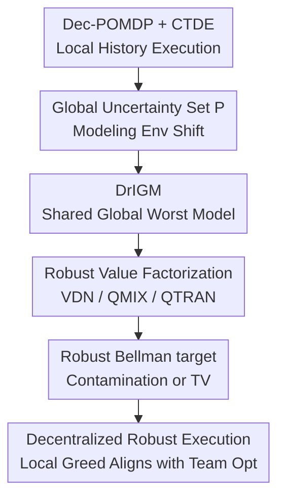

# Distributionally Robust Cooperative Multi-agent Reinforcement Learning with Value Factorization

**Conference**: ICLR 2026  
**OpenReview**: [https://openreview.net/forum?id=2T3LOpqIOO](https://openreview.net/forum?id=2T3LOpqIOO)  
**Code**: https://github.com/crqu/robust-coMARL  
**Area**: Multi-agent Reinforcement Learning / Robust Reinforcement Learning  
**Keywords**: Distributionally Robust Reinforcement Learning, Multi-agent Cooperation, Value Factorization, CTDE, DrIGM  

## TL;DR
This paper introduces distributionally robust reinforcement learning into cooperative multi-agent value factorization and proposes the DrIGM principle. This ensures that the robust greedy actions of individual agents can still be combined into a globally robust optimal joint action. Based on this, the authors implement robust versions of VDN, QMIX, and QTRAN that are more stable under environmental distribution shifts.

## Background & Motivation
**Background**: In cooperative multi-agent reinforcement learning, Centralized Training with Decentralized Execution (CTDE) is a standard paradigm: during training, the system can access global states, joint actions, and team rewards, while during execution, each agent acts independently based on its local history. To avoid mismatch between training and execution, value factorization methods like VDN, QMIX, and QTRAN rely on the IGM (Individual-Global-Max) principle, which ensures that the joint action composed of local greedy actions is also the global joint action maximizing the total Q-value.

**Limitations of Prior Work**: While this paradigm is mature in games and grid worlds, real-world systems often face inconsistencies between training and deployment environments. For example, building HVAC control is affected by city, climate, season, and sensor noise; similarly, observational perturbations can be artificially added in StarCraft. Single-agent distributionally robust RL (DR-RL) addresses this by placing environment transitions into an uncertainty set to learn policies that perform well under the worst-case scenario. However, directly applying this to cooperative MARL encounters an additional difficulty: agents share a common team goal rather than independent rewards, and the local worst-case scenario may not align with the global one.

**Key Challenge**: Robustness requires "conservative reliability in the face of the worst environment," while value factorization requires "the ability to combine local greedy actions into a global greedy action." If each agent independently identifies its own worst-case model, the actions deemed safe by Agent 1 and Agent 2 might correspond to different adversaries. The resulting joint action may fail to be the team's robust optimal action. In other words, independent robustification disrupts the alignment required for coordination.

**Goal**: The objective is not to reinvent a brand-new MARL architecture but to provide a distributionally robust extension to existing value factorization methods. Specifically, the paper aims to define "Robust IGM," prove what kind of individual robust Q-functions guarantee decentralized alignment with the global robust optimum, and implement this principle within the TD training targets of VDN, QMIX, and QTRAN.

**Key Insight**: Cooperation in MARL is concerned with the team's worst-case performance under environmental uncertainty, rather than each agent facing its own private worst-case environment. Therefore, individual robust values should not be defined by "individual worst cases" but anchored to the "global environment model that minimizes the joint team value." As long as all agents factorize their values around the same global worst-case model, decentralized greediness can maintain team consistency.

**Core Idea**: Use the global worst-case joint Q-function to define the robust individual Q-values for each agent, and embed this definition into the robust Bellman targets of VDN/QMIX/QTRAN. This yields distributionally robust value factorization algorithms without changing the CTDE execution structure.

## Method

### Overall Architecture
The proposed method consists of two layers: a theoretical layer that transforms the classical IGM into DrIGM, explaining when "robust individual greedy actions" align with the "robust global greedy joint action"; and an algorithmic layer that reformulates value factorization training targets under this principle. During execution, each agent still relies only on its local history to perform greedy or $\epsilon$-greedy actions using its $Q_i^{rob}(h_i,a_i)$, requiring no communication during deployment.

Formalizing the environment as a cooperative Dec-POMDP, each agent $i$ has a local history $h_i$ and action $a_i$, with joint history $h=(h_1,\ldots,h_N)$ and joint action $a=(a_1,\ldots,a_N)$. During training, an uncertainty set $\mathcal{P}$ exists around a nominal model $P^0$. The paper adopts a history-action rectangular uncertainty set: each $(h,a)$ maps to an independently perturbable transition set $\mathcal{P}_{h,a}$. The robust joint Q-function is given by the Bellman fixed point under the worst-case model:

$$
(TQ)(h,a)=r(s,a)+\gamma \inf_{P_{h,a}\in \mathcal{P}_{h,a}} \mathbb{E}_{h'\sim P_{h,a}}\left[\max_{a'} Q(h',a')\right].
$$

In this framework, there is no need to design separate rewards for each agent or exchange information during deployment. Training uses global states and team rewards to learn robust joint values, while execution follows the standard value factorization of local Q-networks.

### Key Designs
**1. DrIGM: Extending "Individual Greed equals Team Greed" to Robust Scenarios**

Classical IGM only considers nominal environments: if a combination of greedy actions from each $Q_i(h_i,a_i)$ falls within $\arg\max_a Q_{tot}(h,a)$, decentralized execution is valid. The proposed DrIGM replaces the right side with the robust joint value $Q_{tot}^{\mathcal{P}}$, requiring:

$$
\left(\arg\max_{a_1} Q_1^{rob}(h_1,a_1),\ldots,\arg\max_{a_N} Q_N^{rob}(h_N,a_N)\right)
\subseteq \arg\max_a Q_{tot}^{\mathcal{P}}(h,a).
$$

While this definition adds the term "robust," its significance lies in identifying the object of robustness in cooperative MARL: it is not about each agent finding the safest action independently, but about all agents' local actions serving the same team worst-case. The paper demonstrates via counterexamples that if one simply applies single-agent DR-RL as $Q_i^{rob}=\inf_{P\in\mathcal{P}}Q_i^P$, the infimum for different agents might be realized by different environment models, causing the combination of local optima to deviate from the global robust optimum.

**2. Global Worst-case Model Anchoring: Individual Robust Values without Separate Adversaries**

The core theorem provides a sufficient condition: first find a robust joint greedy action $\bar a\in\arg\max_a Q_{tot}^{\mathcal{P}}(h,a)$, then identify the model that minimizes the team value for that joint action:

$$
P^{worst}(h,\bar a)\in \arg\inf_{P\in\mathcal{P}}Q_{tot}^P(h,\bar a),
$$

and define the robust individual Q-values for each agent under this same $P^{worst}$:

$$
Q_i^{rob}(h_i,a_i):=Q_i^{P^{worst}(h,\bar a)}(h_i,a_i).
$$

The intuition is that team failure usually stems from a mismatch in joint dynamics and cooperation rather than an agent facing a private adverse environment. Anchoring all individual Q-values to the global team worst-case model ensures agents plan local actions on the same "worst-case map."

**3. Compatibility with VDN/QMIX/QTRAN: Implementing Theoretical Conditions**

The paper proves that the structural conditions of VDN, QMIX, and QTRAN can support DrIGM. VDN corresponds to additive decomposition $Q_{tot}=\sum_i Q_i$; QMIX corresponds to a mixing network monotonic in each individual Q, i.e., $\partial Q_{tot}/\partial Q_i\ge 0$; QTRAN aligns general joint Q with individual Q via equality constraints at the optimal action and inequality constraints elsewhere. This allows DrIGM to be a robustification patch for existing CTDE training targets without reorganizing communication or execution protocols.

**4. Robust Bellman Targets for Two Uncertainty Sets: Resisting Environment Shift with Conservative Bootstrap**

Two types of uncertainty sets are implemented. For $\rho$-contamination, the robust target becomes:

$$
y=r+\gamma(1-\rho)Q_{tot}^{\mathcal{P}}(h',\bar a';\theta^-),
$$

where $\bar a'_i=\arg\max_{a_i'}Q_i^{rob}(h_i',a_i';\theta^-)$. This discounts the bootstrap portion by $1-\rho$. For Total Variation (TV) uncertainty, the robust Bellman operator is expressed via a dual variable $\eta(s,a)$ and hinge terms like $[\eta-Q_{tot}(h',\bar a')]_+$. Both targets ensure that the next-step action is composed of individual greedy actions guaranteed by DrIGM.

### Loss & Training
The algorithms follow off-policy TD learning. Each agent uses a DRQN-style network: local observations and previous actions are encoded via MLP, passed through an LSTM, and output as Q-values. Sub-trajectories are sampled from a replay buffer with burn-in steps for LSTM hidden states.

For QMIX, a hypernetwork generates non-negative mixing weights based on the global state. For QTRAN, a separate joint Q and $V_{tot}(h)$ are learned with alignment losses $L_{opt}$ and $L_{nopt}$. The overall TD loss is:

$$
L_{TD}=\left(Q_{tot}^{\mathcal{P}}(h,a;\theta)-(TQ_{tot}^{\mathcal{P}})(h,a;\theta^-)\right)^2.
$$

For TV uncertainty, a dual network $\eta_\xi$ is updated before the Q-network. Training utilizes $\epsilon$-greedy exploration and periodic target updates.

## Key Experimental Results

### Main Results
Testing was conducted in SustainGym's BuildingEnv (HVAC control) and SMAC (3s vs 5z). SustainGym shifts include climate, city, and seasonal changes, while SMAC includes observational noise.

| Setting | Method | VDN | QMIX | QTRAN |
|------|------|-----|------|-------|
| Seasonal shift | Non-robust | 0.877 ± 0.012 | 0.895 ± 0.008 | 0.816 ± 0.036 |
| Seasonal shift | GroupDR baseline | 0.624 ± 0.040 | 0.499 ± 0.022 | 0.508 ± 0.048 |
| Seasonal shift | Robust TV | 0.898 ± 0.008 | 0.916 ± 0.006 | 0.861 ± 0.006 |
| Seasonal shift | Robust $\rho$-contam | 0.869 ± 0.013 | 0.911 ± 0.005 | 0.825 ± 0.028 |
| Climate + season shift | Non-robust | 0.440 ± 0.040 | 0.478 ± 0.052 | 0.654 ± 0.066 |
| Climate + season shift | Robust TV | 0.627 ± 0.049 | 0.520 ± 0.048 | 0.733 ± 0.026 |

Under the most severe "Climate + season" shift, "Robust TV" improves VDN from 0.440 to 0.627 and QTRAN from 0.654 to 0.733.

### Ablation Study
- **Non-robust value factorization**: Performance degrades significantly under dynamics changes (e.g., HVAC cooling/heating trade-offs in different cities).
- **GroupDR baseline**: While helpful for VDN, it is unstable for QMIX/QTRAN, suggesting that merely estimating worst-case rewards from a training set is insufficient for robust value factorization alignment.
- **Robust TV vs. Contamination**: TV uncertainty is generally more stable in seasonal shifts, while contamination is effective for simple noise in SMAC.
- **Robust Parameter $\rho$**: In SMAC, there is a "sweet spot" for $\rho$; small values improve win rates by countering noise, but excessive values lead to over-conservatism and performance drops.

### Key Findings
- Robust methods maintain higher normalized team rewards across multiple test environments (env 1 to env 6) compared to non-robust baselines.
- TV uncertainty outperforms contamination in seasonal shifts, particularly in stabilizing QTRAN.
- Robust training doesn't necessarily sacrifice performance in the training environment, possibly because the robust target acts as a regularizer against coordination errors caused by partial observability.

## Highlights & Insights
- The primary highlight is shifting the granularity of robustness from the "individual agent" to the "joint team system," preventing mismatch between agents.
- The theoretical-to-engineering pipeline is seamless: DrIGM defines the target, and current structures (VDN/QMIX/QTRAN) are proven sufficient to carry it.
- Utilizing HVAC control provides a realistic multi-agent scenario beyond games, demonstrating the practical value of distributionally robust MARL.
- An actionable insight: For CTDE + value factorization systems, prioritize a "shared global worst-case target" over individual adversarial regularization when dealing with deployment shifts.

## Limitations & Future Work
- The theory relies on history-action rectangular uncertainty sets and specific fail-state assumptions for simplified robust Bellman derivations.
- The use of a global uncertainty set is effective but could be extended to "agent-wise" uncertainty sets for scenarios where perturbations are localized to specific sensors or actuators.
- While HVAC and SMAC were used, validation on larger heterogenous robot swarms or power grids with continuous action spaces is still needed.
- Selecting the robustness parameter $\rho$ remains an empirical challenge if representative validation environments are unavailable during training.

## Related Work & Insights
- **Contrast with standard factorization**: Unlike VDN/QMIX/QTRAN which assume a stable nominal model, this work proves that their structural constraints are compatible with robust targets.
- **Contrast with single-agent DR-RL**: Identifies the hazard of independent robustification in teams (model mismatch across agents).
- **Contrast with risk-sensitive RL**: While risk-sensitive methods care about the return tail in a fixed environment, this method addresses changes in the environment model itself (dynamics or transition shifts).

## Rating
- Novelty: ⭐⭐⭐⭐☆ Successfully promotes IGM to the robust regime and identifies the critical issue of model alignment in teams.
- Experimental Thoroughness: ⭐⭐⭐⭐☆ Strong coverage of realistic HVAC shifts and game noise.
- Writing Quality: ⭐⭐⭐⭐☆ Clear logical flow from theory to algorithm.
- Value: ⭐⭐⭐⭐⭐ Highly practical for researchers using standard value factorization who need robustness to environmental shifts.

<!-- RELATED:START -->

## Related Papers

- [\[ICLR 2026\] Bayesian Robust Cooperative Multi-Agent Reinforcement Learning Against Unknown Adversaries](bayesian_robust_cooperative_multi-agent_reinforcement_learning_against_unknown_a.md)
- [\[ICLR 2026\] When Is Diversity Rewarded in Cooperative Multi-Agent Learning?](when_is_diversity_rewarded_in_cooperative_multi-agent_learning.md)
- [\[ICLR 2026\] Continuous-Time Value Iteration for Multi-Agent Reinforcement Learning](continuous-time_value_iteration_for_multi-agent_reinforcement_learning.md)
- [\[ICLR 2026\] Potentially Optimal Joint Actions Recognition for Cooperative Multi-Agent Reinforcement Learning](potentially_optimal_joint_actions_recognition_for_cooperative_multi-agent_reinfo.md)
- [\[ICML 2026\] LLM-Guided Communication for Cooperative Multi-Agent Reinforcement Learning](../../ICML2026/reinforcement_learning/llm-guided_communication_for_cooperative_multi-agent_reinforcement_learning.md)

<!-- RELATED:END -->
