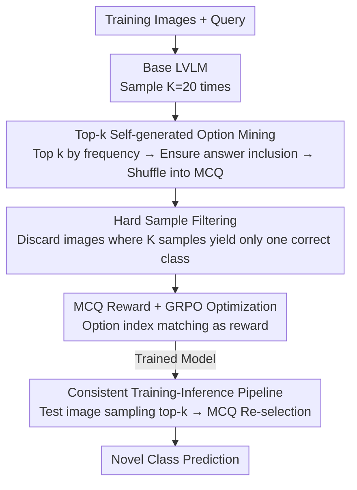

# DiVE-k: Differential Visual Reasoning for Fine-grained Image Recognition

**Conference**: ICLR2026  
**arXiv**: [2511.18305](https://arxiv.org/abs/2511.18305)  
**Code**: [raja-kumar/DiVE-k](https://github.com/raja-kumar/DiVE-k)  
**Area**: Reinforcement Learning  
**Keywords**: fine-grained recognition, reinforcement-learning, GRPO, visual reasoning, multiple-choice question, LVLM

## TL;DR

The DiVE-k framework is proposed, which leverages the top-k generation results of Large Vision-Language Models (LVLMs) to construct multiple-choice questions (MCQs). Through GRPO reinforcement learning, the model is trained to perform differential visual reasoning, significantly outperforming existing methods in base-to-novel generalization for fine-grained image recognition.

## Background & Motivation

While Large Vision-Language Models (LVLMs) possess rich textual knowledge, they perform poorly in fine-grained image recognition and struggle to distinguish between visually highly similar categories. The authors observe two key phenomena:

1.  **Significant gap between Pass@1 and Pass@K**: Models often cover the correct answer within K samples, but the Pass@1 accuracy is low. This suggests that models rely excessively on coarse-grained salient features and lack refined differential reasoning capabilities.
2.  **LVLMs actually contain detailed knowledge of fine-grained categories** (e.g., part attributes, appearance descriptions), but existing methods fail to effectively activate this knowledge to distinguish similar categories.

Existing RL-based methods like ViRFT use exact string matching as a reward signal, which suffers from three issues: (a) fragile string matching (inconsistency between scientific and common names); (b) encouraging rote memorization of training category names; and (c) inability to incentivize attribute-level differential reasoning. These flaws lead to poor generalization from base classes to novel classes.

## Core Problem

How can an LVLM be enabled to perform effective differential reasoning in fine-grained image recognition—specifically, selecting the correct answer by comparing key distinguishing attributes among multiple visually similar candidate categories—and ensure this reasoning capability generalizes to unseen novel categories?

## Method

### Overall Architecture

DiVE-k addresses the issue where LVLMs "can sample the answer but cannot answer correctly in one go" for fine-grained recognition, and where open-ended generation stalls RL rewards on fragile string matching. The approach reconstructs open-set recognition into a closed-set MCQ task where the model "creates its own questions." First, the base LVLM samples each image multiple times to identify the top-k categories it most frequently confuses, forming an MCQ. Simple images without ambiguity are filtered out, and the model is then trained via GRPO on these hard negatives to perform attribute-level differential reasoning. Crucially, training and inference share the same "sampled options → MCQ re-selection" two-step pipeline, simplifying the reward from "string matching" to "option index correctness," which is both reliable and resistant to category name memorization.

### Key Designs

**1. Top-k Self-generated Option Mining: Exposing the Model's Own Confusion Points**

Existing RL methods (e.g., ViRFT) use fixed or random negative classes, which are either too simple or irrelevant to the image, failing to stimulate differential reasoning. DiVE-k allows the model to generate its own distractors: for each training image $I$ and query $q$, the base model $\pi_\theta$ is sampled $K=20$ times. The frequencies of all predicted categories are calculated, and the top $k=\min(5,|\mathcal{C}|)$ most frequent ones form the option set $\mathcal{O}_{top\text{-}k}$. If the correct answer is not sampled, it replaces the lowest-frequency option to ensure its presence. Finally, options are randomly shuffled into a standard A/B/C format. These options represent the modes of the model's own confusion distribution, naturally serving as visually similar hard negatives that force the model to compare fine-grained attributes (e.g., inflorescence shape, beak form) rather than guessing based on salient features.

**2. Hard Sample Filtering: Concentrating Training on Truly Confusing Images**

If the model yields only the unique correct category across $K$ samples, the image is too easy, and training on it would only reinforce simple shortcuts and dilute the gradient signal for differential reasoning. DiVE-k removes such samples, keeping only ambiguous images in the training set to ensure GRPO updates focus on hard cases where differential reasoning is truly required.

**3. MCQ Reward + GRPO Optimization: Bypassing Fragile String Matching**

By compressing the answer into an option index, reward determination is no longer affected by string inconsistencies. In the constructed MCQ dataset $\mathcal{D}=\{(I,q,\mathcal{O}_{enum},\hat{a})\}$, each sample generates $N$ rollouts. The reward consists of two parts: the MCQ reward $r_{mcq}$ (1.0 if the correct option is selected, 0.0 otherwise) and the format reward $r_{format}$ (encouraging standardized `<think>` and `<answer>` tags), weighted as follows:

$$r=\lambda_f\, r_{format}+\lambda_m\, r_{mcq}$$

This is fed into standard GRPO, where standardization within each rollout group yields the advantage:

$$A_i=\frac{r_i-\text{mean}\{r_1,\dots,r_N\}}{\text{std}\{r_1,\dots,r_N\}+\delta}$$

Since the reward only checks for the correct option index, it avoids misjudgment due to string inconsistency and does not reward memorization of training category names, directly incentivizing the reasoning process of "comparing key attributes among candidates."

**4. Training-Inference Consistent Pipeline: Real Novel Generalization**

The inference process mirrors the training: the trained model samples the test image $K$ times to derive top-k options, which are then formatted into an MCQ for the final answer. Unlike training, no ground-truth is manually inserted during inference; the model relies entirely on its own candidates. This consistency ensures the differential comparison capability learned during training is invoked identically during inference, reflecting true generalization to unseen (novel) categories without test-side information leakage.

## Key Experimental Results

### Experimental Setting
- Base Model: Qwen2.5-VL-7B-Instruct
- Datasets: OxfordFlowers-102, CUB-200, OxfordPets-37, StanfordCars-196, FGVC Aircraft-100
- Training: 3x A6000 GPUs, batch size 6, 4 GRPO rollouts
- Evaluation Metrics: Base/Novel Accuracy and Harmonic Mean (HM)

### Main Results: Base-to-Novel Generalization (Table 1)

| Method | Base | Novel | HM |
|------|------|-------|-----|
| QWEN2.5-VL-7B | 68.9 | 70.5 | 69.7 |
| ViRFT | 73.0 | 74.2 | 73.6 |
| **Ours (DiVE-k)** | **80.8** | **78.8** | **79.8** |

Ours (DiVE-k) achieves a **+6.2%** Gain in HM over ViRFT and **+10.1%** over QWEN2.5-VL-7B. The improvement is most significant on the CUB dataset (HM +14.9). Performance is close to Gemini2.5-flash-lite (80.0 HM) and slightly below GPT-5-mini (83.4 HM).

### Hybrid Dataset Generalization (Table 2)
Training a single model on merged base classes across all datasets, DiVE-k reaches 78.7 HM, which is +4.0 over ViRFT and +9.0 over QWEN2.5. ViRFT even performs worse than the original QWEN2.5 on novel classes when using two-step reasoning (76.2 vs 77.0), whereas DiVE-k reaches 78.8.

### Few-shot (4-shot, Table 3)
DiVE-k achieves an average accuracy of 74.75%, a gain of +7.73% over ViRFT and +10.85% over QWEN2.5.

## Highlights & Insights

1.  **Ingenious Training Signal Design**: Using the model's own top-k predictions as MCQ options provides meaningful hard negatives from the model's confusion distribution and constructs simple, verifiable reward signals, avoiding the fragility of string matching.
2.  **Emergence of Differential Reasoning**: Through MCQ training, the model learns to compare fine-grained attribute differences (e.g., bird beak shapes) between candidate categories instead of relying on coarse-grained features.
3.  **Solving the Memorization Issue in ViRFT**: While ViRFT shows almost no improvement on novel classes using two-step reasoning (77.0→77.1), DiVE-k shows substantial gains (+1.8), indicating it learns generalized reasoning rather than category name memorization.
4.  **Clear Ablation Design**: Detailed ablations on option generation strategies (random vs text-emb vs top-k), the roles of visual/textual components, and the impact of $K$ provide strong evidence for the method's effectiveness.

## Limitations & Future Work

1.  **Slight Regression on OxfordPets**: DiVE-k is slightly lower than ViRFT on the Pet dataset (HM 91.6 vs 92.9). The authors believe more options increase the error probability in the second step for simpler datasets where MCQs introduce unnecessary interference.
2.  **Increased Inference Computational Cost**: Inference requires $K$ samples followed by one selection, increasing computation by roughly $K+1$ times, which may be a bottleneck for deployment.
3.  **Validation Limited to Qwen2.5-VL-7B**: Although Gemma-3 experiments are mentioned in the appendix, the lack of validation on larger scale models (e.g., 72B) leaves open whether the gains persist for stronger base models.
4.  **Fixed Number of Options**: $m=5$ is a fixed hyperparameter; different datasets may have different optima. Adaptive option counts could further enhance performance.
5.  **Offline Options vs Online Training**: Confusion distributions change as training progresses, but top-k options are generated offline using the initial model, potentially leading to distribution shift.

## Related Work & Insights

| Method | Mechanism | Reward Signal | Novel Generalization |
|------|---------|---------|-----------|
| CLIP | Vision-text embedding matching | None (Zero-shot) | Limited |
| Prompt Learning | Learning text prompt vectors | Cross-entropy | Moderate |
| FuDD | LLM generates offline discriminative features | No RL | Fixed strategy |
| ViRFT | Open-ended generation + string matching | Fragile | Weak (Memorization) |
| SFT (Full) | Supervised fine-tuning | Cross-entropy | Poor (Novel -33.5%) |
| **Ours (DiVE-k)** | Top-k MCQ + GRPO | Simple & Verifiable | **Strong** |

The key distinction of DiVE-k is transforming open-set classification into a self-generated closed-set MCQ task, simplifying the reward signal from "string matching" to "option index matching," fundamentally addressing reward fragility and memorization.

## Related Work & Insights

1.  **Top-k Self-refinement Paradigm**: The idea of using a model's own output distribution as a training signal can be extended to other classification tasks (medical imaging, remote sensing) or even VQA MCQ training.
2.  **MCQ as a Universal Reasoning Interface**: Restructuring open-ended questions into MCQs provides verifiable rewards and reduces RL difficulty.
3.  **Connection to Best-of-N Sampling**: The inference pipeline resembles best-of-N but goes further—performing explicit attribute-level comparative reasoning rather than simple majority voting.
4.  **Automated Hard-negative Mining**: Obtaining hard negatives directly from model sampling without external labels or retrieval is concise and elegant.

## Rating
- Novelty: ⭐⭐⭐⭐ — The combination of top-k self-generated MCQs and RL is novel and solves ViRFT's key flaws.
- Experimental Thoroughness: ⭐⭐⭐⭐ — 5 datasets × 3 settings + detailed ablation, though model scale validation is limited.
- Writing Quality: ⭐⭐⭐⭐ — Clear motivation, intuitive diagrams, and rational comparative experiments.
- Value: ⭐⭐⭐⭐ — Proposes a practical RL training paradigm for fine-grained recognition with well-validated generalization.

<!-- RELATED:START -->

## Related Papers

- [\[ICLR 2026\] RewardMap: Tackling Sparse Rewards in Fine-grained Visual Reasoning via Multi-Stage Reinforcement Learning](rewardmap_tackling_sparse_rewards_in_fine-grained_visual_reasoning_via_multi-sta.md)
- [\[ICLR 2026\] Reasoning as Representation: Rethinking Visual Reinforcement Learning in Image Quality Assessment](reasoning_as_representation_rethinking_visual_reinforcement_learning_in_image_qu.md)
- [\[CVPR 2026\] Specificity-aware Reinforcement Learning for Fine-grained Open-world Classification](../../CVPR2026/reinforcement_learning/specificity-aware_reinforcement_learning_for_fine-grained_open-world_classificat.md)
- [\[ICLR 2026\] Q-Learning with Fine-Grained Gap-Dependent Regret](q-learning_with_fine-grained_gap-dependent_regret.md)
- [\[ICLR 2026\] PreferThinker: Reasoning-based Personalized Image Preference Assessment](preferthinker_reasoning-based_personalized_image_preference_assessment.md)

<!-- RELATED:END -->
