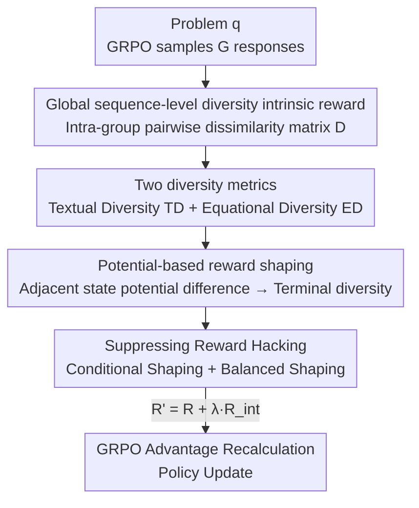

# Diversity-Incentivized Exploration for Versatile Reasoning

**Conference**: ICLR2026  
**OpenReview**: [https://openreview.net/forum?id=9G7AbBrd27](https://openreview.net/forum?id=9G7AbBrd27)  
**Code**: https://github.com/NJU-RL/DIVER  
**Area**: Reinforcement Learning / LLM Reasoning  
**Keywords**: RLVR, Deep Exploration, Sequence-level Diversity, Intrinsic Reward, Potential-based Reward Shaping

## TL;DR
DIVER identifies a strong positive correlation between "global sequence-level diversity of a set of responses" and the reasoning capability of LLMs. By formulating this diversity as an intrinsic reward, applying potential function shaping to preserve optimal policy invariance, and using conditional shaping to prevent reward hacking, RLVR significantly improves Pass@k and cross-domain generalization in mathematical reasoning without compromising Pass@1.

## Background & Motivation
**Background**: Reinforcement Learning with Verifiable Rewards (RLVR) has become the mainstream paradigm for eliciting reasoning capabilities in LLMs. Given a problem, a 0/1 reward is assigned based on answer correctness, and the policy is updated using algorithms like GRPO.

**Limitations of Prior Work**: The state-action space for reasoning tasks grows exponentially with sequence length. Combined with extremely sparse rewards (vast "reward deserts" where models rarely receive meaningful feedback), existing methods suffer from insufficient exploration and low sample efficiency, often prematurely converging to a narrow set of fixed solution patterns.

**Key Challenge**: Current exploration techniques are mostly confined to the "local token level"—such as mitigating policy entropy collapse or maintaining gradients only for high-entropy tokens. These approaches essentially inject stochastic jitter into the action distribution to escape local optima but only create uncertainty at individual decision points. They cannot guarantee directional "deep exploration" across multiple time steps. True expansion of solution paths requires elevating diversity to the entire reasoning sequence level.

**Goal**: Elevate exploration from the local token level to the global sequence level, enabling models to perform deep exploration in a semantically structured space to discover novel and effective solution patterns. Simultaneously, address three engineering challenges: quantifying diversity, ensuring the optimal policy remains unchanged after incorporating rewards, and preventing "reward hacking" by the model.

**Key Insight**: The authors conducted a confirmatory experiment by splitting GRPO rollouts into high/low sequence-level diversity groups for training. Results showed that training on high-diversity samples yielded stronger test performance (+1.8 in-domain, +2.6 cross-domain), with cross-domain gains being more significant. This suggests that global diversity is not noise but a signal positively correlated with reasoning ability, particularly benefiting generalization.

**Core Idea**: Explicitly incorporate "global sequence-level diversity among a set of responses" as an intrinsic reward to incentivize deep exploration, using potential-based reward shaping to ensure the original task's optimal policy is not disrupted.

## Method

### Overall Architecture
DIVER is built upon GRPO. For each problem $q$, GRPO samples a group of $G$ responses $\{o_1, \dots, o_G\}$. A rule-based verifier assigns a binary reward $r_i \in \{0, 1\}$, and advantages are computed via group-relative normalization: $A_i = (r_i - \mu_r)/\sigma_r$. DIVER inserts a "diversity intrinsic reward" branch: it utilizes two metrics (Textual Diversity TD, Equational Diversity ED) to calculate intra-group pairwise dissimilarity, forming a $G \times G$ diversity matrix $D$. The row-wise average $d(o_i)$ is taken for each response. This $d(\cdot)$ is converted into an intrinsic reward $R_{\text{int}}$ via potential-based reward shaping, which is then linearly combined with the correctness reward: $R' = R + \lambda R_{\text{int}}$. Finally, the intrinsic reward is only assigned to "correct" responses (conditional shaping) and undergoes clipping and decay (balanced shaping) before $R'$ replaces $r_i$ for advantage calculation.

### Key Designs

**1. Global sequence-level diversity as an intrinsic reward: Elevating exploration from tokens to full sequences**

Addressing the limitation that "local token-level jitter cannot support deep exploration," DIVER moves beyond the entropy of individual tokens to measure **how different a set of responses are from one another overall**. For a group of $G$ responses, pairwise dissimilarity is calculated to form matrix $D$ (where $d_i^j$ represents the diversity between $o_i$ and $o_j$). The group diversity for response $i$ is the average of its row: $d(o_i) = \frac{1}{G-1}\sum_{j \neq i} d_i^j$. This $d(\cdot)$ serves as the source for intrinsic rewards. The fundamental difference from local methods is that token-level approaches only inject uncertainty at specific decision points, whereas sequence-level diversity encourages the model to produce **structurally distinct reasoning paths**, facilitating directed exploration across multiple steps in a semantically structured space.

**2. Textual Diversity (TD) and Equational Diversity (ED): Two scales for measuring diversity**

To quantify diversity, the authors provide two easy-to-implement metrics. **Textual Diversity (TD)** uses the inverse of BLEU to measure textual similarity: since BLEU scores increase with n-gram overlap, the TD for response $o_i$ is the average of its inverted BLEU similarity with other responses:

$$\mathrm{TD}(o_i) = \frac{1}{G-1} \sum_{j \in [G] \setminus \{i\}} \big(1 - \mathrm{BLEU}(o_i, o_j)\big).$$

**Equational Diversity (ED)** targets mathematical problems where multiple solutions often correspond to different equation forms. Let $F(o_i)$ be the set of equations extracted from response $o_i$, and $F_{-i} = \bigcup_{j \neq i} F(o_j)$ be the union of equations from other responses. ED is the proportion of "unique equations" in a response relative to its total equations:

$$\mathrm{ED}(o_i) = \frac{|F(o_i) \setminus F_{-i}|}{|F(o_i)|} \quad (|F(o_i)| > 0, \text{ otherwise } 0).$$

TD focuses on "variety in expression," while ED focuses on "variety in solution paths." Both are plug-and-play; the framework is compatible with other diversity metrics, and DIVER-MIX combines both for optimal results.

**3. Potential-based reward shaping: Ensuring optimal policy invariance and simplified computation**

Directly adding diversity as an extra reward can alter the optimal policy and bias the model (as per Ng et al., 1999). DIVER adopts **potential-based reward shaping**: treating sequence-level diversity $d(\cdot)$ as a potential function over states, the intrinsic reward is defined as the discounted difference in potential between adjacent states:

$$R_{\text{int}}(s_t, a_t, s_{t+1}) = \gamma d(s_{t+1}) - d(s_t),$$

where $s_t := [q, o_{i, \le t}]$ and $a_t := o_{i, t+1}$ in the LLM setting. Because GRPO uses sequence-level policy gradients, the intrinsic reward for the entire response is the sum of these steps. This sequence of discounted differences results in a **telescoping sum**, eventually leaving only the terminal state diversity: $R_{\text{int}}([q, o_i]) = \gamma^T d([q, o_i])$ (assuming $d(q) = 0$). This step is elegant: it is guaranteed by Theorem 1 to maintain optimal policy invariance—any optimal policy in the transformed MDP remains optimal in the original MDP—and it eliminates the overhead of calculating diversity for all intermediate steps, requiring only one calculation for the final response. The new reward is $R'([q, o_i]) = R([q, o_i]) + \lambda R_{\text{int}}([q, o_i])$, where $\lambda$ is the shaping coefficient balancing correctness and diversity.

**4. Suppressing Reward Hacking: Conditional and balanced shaping**

While potential shaping ensures optimal policy invariance, the model might still over-exploit intrinsic rewards during training while ignoring the primary objective—especially in difficult tasks where correctness rewards are sparse. Models might favor "diversity for the sake of diversity" (e.g., generating excessively long responses to cheat diversity bonuses). Two heuristics prevent this: **Conditional Shaping** assigns diversity rewards only to **correct** responses within the group: $r_i' = r_i + \lambda \cdot r_i^{\text{int}} \cdot \mathbb{I}(r_i)$, where $\mathbb{I}(r_i)$ is the indicator function for correctness. This locks diversity incentives to valid solutions, aligning shaping rewards with the true goal. **Balanced Shaping** clips the intrinsic reward to an upper bound $r_i^{\text{int}} = \mathrm{clip}(r_i^{\text{int}}; 0, \sigma)$ to prevent over-exploitation and **gradually decays $\lambda$** during training, consistent with the RL philosophy of "early exploration, late exploitation." Ablations show that rewarding incorrect or all responses leads to length explosion and performance collapse, while only conditional shaping provides stability.

### Loss & Training
The core utilizes the GRPO objective (with the KL term removed, $\beta=0$), replacing the original reward $r_i$ in the advantage with the shaped reward $r_i'$. Training uses a subset of OpenR1-Math-220k (prompts from NuminaMath 1.5). Sampling batch is 128, update batch is 32, with 8 rollouts per prompt. A higher clip of 0.28 is used (following GRPO w/ Clip-higher).

## Key Experimental Results

### Main Results
Based on Qwen2.5-Math-7B, averaged across six mathematical benchmarks (AIME24/25, AMC, MATH-500, Minerva, OlympiadBench) for in-domain and three benchmarks (ARC-c, GPQA*, MMLU-Pro) for cross-domain performance.

| Method | In-domain Avg | Cross-domain Avg | Description |
| :--- | :--- | :--- | :--- |
| Qwen2.5-Math-7B (base) | 26.7 | 27.3 | No RL |
| OpenReasoner-Zero | 41.0 | 51.6 | Strong RLVR baseline |
| Entropy-RL | 41.8 | 56.0 | Strongest local exploration baseline |
| Pass@k Training | 41.5 | 55.3 | Global exploration via intra-group bootstrap |
| **DIVER-TD** | **42.3** | **58.4** | Textual Diversity |
| **DIVER-ED** | **43.0** | 56.5 | Equational Diversity |
| **DIVER-MIX** | **43.1** | **58.8** | Mixed metrics, optimal |

DIVER outperforms OpenReasoner-Zero by +2.0 in-domain and up to +6.8 cross-domain (+10.1 on ARC-c, +12.5 on GPQA). Compared to Entropy-RL, it gains +1.2 in-domain (+4.6 on OlympiadBench) and +2.4 cross-domain.

### Pass@k and Ablation Study

| Configuration / Setting | Key Metric | Description |
| :--- | :--- | :--- |
| DIVER vs Entropy-RL @AIME25 Pass@32 | **+6.7** | Exploration advantage most evident with more attempts |
| DIVER @AIME24 Pass@1024 | 86.7% | +6.7 over second best; gap widens as k increases |
| Reward "Correct Responses" | Optimal | Conditional Shaping, stable accuracy |
| Reward "All / Wrong Responses" | Fails | Performance collapse, length explosion (Reward Hacking) |
| All responses + Length Penalty | Poor accuracy | Length penalty addresses symptoms, not the root cause |
| Horizon: Full vs Prefix (200/500/1000) | Full Response | Longer horizon → higher diversity → better performance |

### Key Findings
- DIVER boosts Pass@k significantly without sacrificing Pass@1, indicating it expands the exploration range/reasoning upper bound rather than just shifting the distribution.
- Benefits are more pronounced in **cross-domain** tasks, validating the motivation that "diversity → broader solution patterns → stronger generalization."
- Training dynamics show that while Pass@k Training and Entropy-RL diversity decreases over time (exploration decay), DIVER maintains high diversity and reasonable entropy, achieving "controlled exploration."
- Gains are consistent across Qwen2.5-Math-1.5B, Qwen2.5-7B-Base, LLaMA-3.1-8B-Instruct, and DeepSeek-R1-Distill-Qwen-7B (long responses of 2500-3500 tokens).

## Highlights & Insights
- **The "Diversity = Intrinsic Reward" via potential shaping is elegant**: The telescoping sum removes the need to calculate diversity for every intermediate state; the terminal diversity $\gamma^T d([q,o_i])$ is sufficient. This provides theoretical invariance of the optimal policy while simplifying engineering.
- **Conditional Shaping prevents reward hacking**: Binding the diversity reward to correctness avoids the common pitfall of "sacrificing correctness for diversity." This trick is directly applicable to any "primary reward + auxiliary shaping reward" RLVR setup.
- **Proactive Research Paradigm**: Validating the positive correlation between global diversity and reasoning ability before designing the reward mechanism ensures a grounded motivation.
- **TD/ED Plug-and-Play**: The framework is decoupled from specific metrics. BLEU inversion and unique equation ratios are lightweight and effective.

## Limitations & Future Work
- Evaluation is concentrated on mathematical reasoning. How to quantify diversity for code, theorem proving, or open-domain reasoning remains to be explored.
- Performance is sensitive to hyperparameters like $\sigma$, $\lambda$, decay rates, and exploration horizon length, requiring tuning costs.
- Effectiveness of intrinsic rewards depends on reliable "correct/incorrect" signals for conditional shaping. In tasks without reliable verifiers (soft rewards), this guardrail against hacking may fail.
- Diversity calculation involves $G \times G$ matrices, increasing costs as group size $G$ or response length grows.

## Related Work & Insights
- **vs Local Token-level Exploration (Entropy-RL / Clip-higher)**: These inject uncertainty at decision points to escape local optima but struggle with multi-step deep exploration. DIVER's sequence-level approach is superior for generalization and Pass@k.
- **vs Pass@k Training**: Both are "global," but Pass@k training doesn't explicitly optimize candidate diversity. DIVER directly quantifies and rewards diversity while preserving the optimal policy.
- **vs Classic RL Intrinsic Rewards (count-based / Information Gain)**: DIVER ports "intrinsic reward-driven exploration" from small state spaces to the high-dimensional text space of LLM reasoning, solving the optimal policy shift issue via potential shaping.
- **vs Frontier Diversity RL (Unsupervised Skill Learning)**: DIVER systematically introduces the principle of promoting global diversity for deep exploration in LLM reasoning, filling a gap in efficient exploration mechanisms for this domain.

## Rating
- Novelty: ⭐⭐⭐⭐⭐ First to introduce global sequence-level diversity as an intrinsic reward in RLVR with potential-based invariance guarantees.
- Experimental Thoroughness: ⭐⭐⭐⭐⭐ Extensive benchmarks, high k-values, multiple backbones, and detailed ablations on hacking and horizons.
- Writing Quality: ⭐⭐⭐⭐ Clear logical loop: motivation → metrics → shaping → anti-hacking. Derivations are well-explained.
- Value: ⭐⭐⭐⭐⭐ Substantial boost to Pass@k and generalization without hurting Pass@1. Reusable tricks like conditional shaping are highly practical.

<!-- RELATED:START -->

## Related Papers

- [\[AAAI 2026\] Reasoning with Exploration: An Entropy Perspective](../../AAAI2026/reinforcement_learning/reasoning_with_exploration_an_entropy_perspective.md)
- [\[ICLR 2026\] Controllable Exploration in Hybrid-Policy RLVR for Multi-Modal Reasoning](controllable_exploration_in_hybrid-policy_rlvr_for_multi-modal_reasoning.md)
- [\[ACL 2026\] Semantic-Space Exploration and Exploitation in RLVR for LLM Reasoning](../../ACL2026/reinforcement_learning/semantic-space_exploration_and_exploitation_in_rlvr_for_llm_reasoning.md)
- [\[ICLR 2026\] Beyond Noisy-TVs: Noise-Robust Exploration Via Learning Progress Monitoring](beyond_noisy-tvs_noise-robust_exploration_via_learning_progress_monitoring.md)
- [\[ICLR 2026\] The Choice of Divergence: A Neglected Key to Mitigating Diversity Collapse in Reinforcement Learning with Verifiable Reward](the_choice_of_divergence_a_neglected_key_to_mitigating_diversity_collapse_in_rei.md)

<!-- RELATED:END -->
