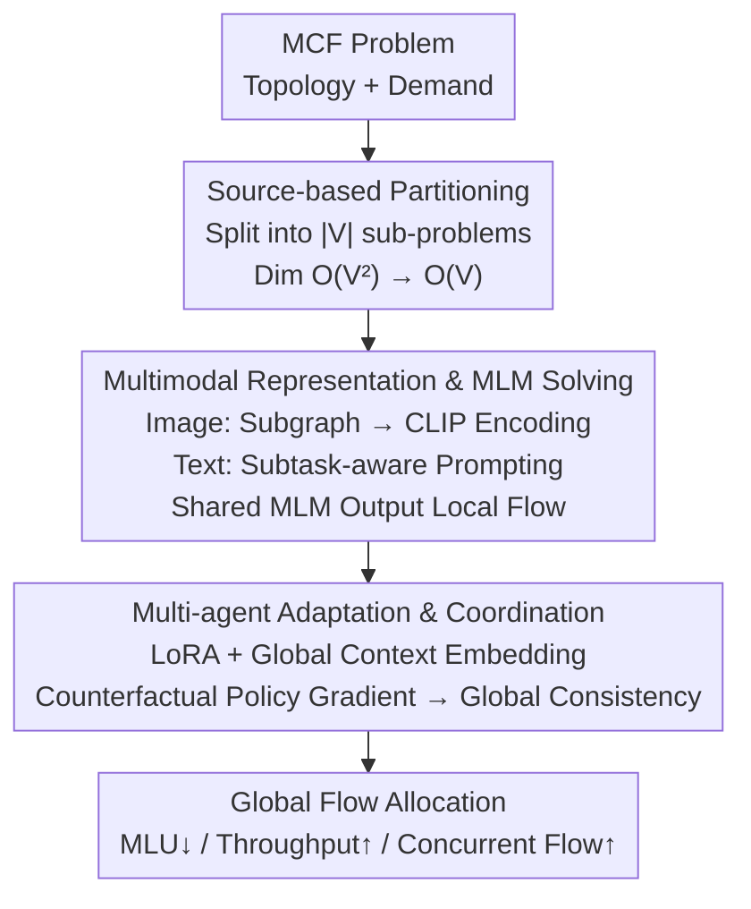

# Divide, Harmonize, Then Conquer It: Shooting Multi-Commodity Flow Problems with Multimodal Language Models

**Conference**: ICLR 2026  
**arXiv**: [2602.11057](https://arxiv.org/abs/2602.11057)  
**Code**: [GitHub](https://github.com/Y-debug-sys/Pram)  
**Area**: Reinforcement Learning  
**Keywords**: Multi-commodity flow, multimodal language models, multi-agent reinforcement learning, network optimization, partition-based solving

## TL;DR

This paper proposes the Pram framework, the first to utilize Multimodal Language Models (MLM) to solve Multi-Commodity Flow (MCF) problems. By partitioning the original problem into sub-problems and using Multi-Agent Reinforcement Learning (MARL) to coordinate global consistency, the method is theoretically proven to converge to the optimal solution. Empirical results show it is 1-2 orders of magnitude faster than LP solvers while achieving near-optimal performance.

## Background & Motivation

The Multi-Commodity Flow (MCF) problem is a fundamental topic in network flow and combinatorial optimization, with extensive applications in transportation, communication, and logistics. Objectives include minimizing Maximum Link Utilization (MLU), maximizing throughput, and maximizing concurrent flow.

Existing methods face two major pain points:

**Scalability bottleneck of LP solvers**: LP complexity is approximately $\mathcal{O}(d^{2.3729})$. When the variable scale reaches the millions, execution time becomes excessive (hours), and accurate future demand predictions are required.

**Limitations of ML methods**: (a) Specialized networks like GNN/RL involve high engineering costs and require repeated tuning; (b) They exhibit poor generalization to unseen environments; (c) Output dimensions grow quadratically with the number of nodes ($\mathcal{O}(|\mathcal{V}|^2)$), still suffering from the curse of dimensionality.

**Key Insight**: **Divide and Conquer**—decomposing MCF into sub-problems reduces variables by $k^2$ times, while the powerful mathematical reasoning and generalization of MLMs can replace specialized networks without frequent retraining.

## Method

### Overall Architecture

Pram (Partitioned Resource Allocation with MLMs) follows a "divide, harmonize, then conquer" three-step process: first, the entire network is partitioned into $|\mathcal{V}|$ sub-problems based on source nodes (**Source-based partitioning**); each sub-problem is represented through image and text modalities and solved by a shared MLM backbone to provide local flow allocations (**Multimodal sub-problem representation and MLM solving**); finally, Multi-Agent Reinforcement Learning ensures these local decisions are globally coordinated (**Multi-agent adaptation and coordination**). This pipeline reduces the solving dimension from $\mathcal{O}(|\mathcal{V}|^2)$ to $\mathcal{O}(|\mathcal{V}|)$ while leveraging MLM reasoning capabilities to replace hand-crafted specialized networks.

### Key Designs

**1. Source-based Partitioning: Breaking the curse of dimensionality by source nodes**

MCF output dimensions grow quadratically with the number of nodes. Direct end-to-end learning is difficult to train and causes VRAM exhaustion (the non-partitioned version consumes 31.6 GB on large networks). Pram partitions at the source node level—each source node, along with its demands to all other nodes, forms a sub-problem, reducing complexity to $\mathcal{O}(|\mathcal{V}|)$. This reduces the variable scale of a single sub-problem by orders of magnitude, decomposing a large problem into $|\mathcal{V}|$ isomorphic small problems.

**2. Multimodal sub-problem representation and MLM solving: Enabling general models to "understand" and solve network sub-problems**

Sub-problems require a solver capable of cross-topology generalization without re-engineering for each network—a task where dedicated GNN/RL networks often underperform. Pram represents each sub-problem in two modalities: an image modality that plots routing links as a sub-graph encoded via a CLIP visual encoder, allowing the model to "see" the topology; and a text modality using subtask-aware prompting that pairs demands with descriptions (source info, historical averages, etc.). MLMs are chosen for their emergent mathematical reasoning, allowing the same backbone to handle hybrid inputs and output flow allocations without per-structure tuning.

**3. Multi-agent adaptation and coordination: Global alignment under a shared backbone**

Since all sub-problems share an MLM backbone but only see local observations, coordination is critical. Pram adapts at two levels: internally using **LoRA** to fine-tune MLM attention weights with minimal parameters; and externally using learnable "global context" embeddings as prompt prefixes (inspired by in-context learning). These context parameters act as queries that align with frozen tokenizer embeddings via cross-attention, distilling global information into each sub-agent's prompt. This allows sub-agents to perceive the global state while the parameter count remains independent of network scale. Visualizations show these embeddings correlate with core MCF terms like Flow, Demand, and Capacity.

### Loss & Training

The adaptation uses Counterfactual Policy Gradient. MCF has a specific single-step property where a flow allocation action does not change subsequent states; thus, the expected return simplifies to an immediate reward $R(s,a)$. The advantage of each sub-agent $i$ is measured using a counterfactual baseline—replacing its action with others sampled from the current policy to see the reward change: $A_i(s,a) = R(s,a) - \sum_{a_i'} \pi_\theta(a_i'|s_i) R(s,(a_{-i},a_i'))$. This leads to the policy gradient $g = \mathbb{E}_\pi[\sum_i A_i(s,a) \nabla_\theta \log \pi_\theta(a_i|s_i)]$.

The methodology is supported by a theoretical framework: MCF objectives are convex/concave with respect to path weights, ensuring convergence to the optimum via gradient descent (Theorem 1); Pram’s policy iteration converges under bounded rewards (Lemma 1); and an adapted constant-depth MLM can simulate multi-step gradient descent through its forward pass via ICL mechanisms (Theorem 2).

## Key Experimental Results

### Main Results: Real Datasets

| Method | MLU (↓) | Total Flow (↑) | Concurrent Flow (↑) | Needs Real Demand |
|------|---------|----------------|---------------------|-----------|
| LP (Gurobi) | Optimal Baseline | Optimal Baseline | Optimal Baseline | Yes |
| Pram | **Runner-up** (sometimes >LP) | **Runner-up** | **Runner-up** | No |
| DRL | Poor (Unstable) | Poor | Poor | No |
| POP | Suboptimal | Suboptimal | Suboptimal | Yes |
| LP-top | Close to LP but unstable | Close to LP | Close to LP | Yes |

**Key Findings**: Pram even outperforms LP on the MLU metric in some cases (21% lower on CERNET, 45% lower on GÉANT), consistent with MLU's strong convexity.

### Main Results: Large-scale Datasets (100-800 nodes)

| Topology | Nodes | Pram Time | LP Time | Speedup | Pram vs. LP Performance |
|------|-------|----------|---------|-------|-----------------|
| GtsCe | ~100 | Fast | Slow | ~10× | >90% |
| Colt | ~150 | Fast | Slow | ~50× | >90% |
| Kdl | 754 | <25s | ~2500s | **100×** | >90% |

Pram is 100x faster than LP on the largest topology (754 nodes, 1.9M path weights). It outperforms HARP by 6.1%/16.6%/24.8% and Aether by 17.2%/7.3%/13.5% across MLU, throughput, and concurrent flow.

### Ablation Study

| Variant | Description | Effect |
|------|------|------|
| w/o MLM | Replaced with GNN+FC | Significant drops, especially MLU |
| w/o Context | Removed global context embeddings | Performance drop |
| w/o LoRA | Removed Low-Rank Adapters | Performance drop |
| w/o MARL | Direct end-to-end fine-tuning | Performance drop |
| w/o Partition | No partitioning | Slightly better on small, OOM on large (31.6GB) |

### Key Findings

- **Generalization**: Performance drop is <10% under link failures and <15% under demand fluctuations ($\alpha=2$).
- **Parameter Efficiency**: LoRA+Context parameters do not grow with network size.
- Visualizations confirm that learned context embeddings are highly correlated with MCF-related vocabulary (Flow, Demand, Capacity).

## Highlights & Insights

1. **Partitioning + MLM**: Partitioning solves the dimension explosion, while MLM provides reasoning and generalization; the two are complementary.
2. **Theoretical Closure**: Logic flows from MCF convexity to GD convergence and MLM simulation of GD, providing a complete framework.
3. **Practical Utility**: The method is objective-agnostic, integrates seamlessly into flow allocation systems, and is open-sourced.
4. Counterfactual policy gradients are inherently suited for the single-step nature of MCF, avoiding the credit assignment issues of multi-step RL.

## Limitations & Future Work

1. Fine-tuning remains resource-intensive, even when truncating the backbone to 8 layers.
2. Visual encoding may introduce bias depending on how sub-graphs are rendered.
3. Current focus is on static demand; dynamic online scenarios are yet to be explored.
4. Partitioning is fixed at the source-node level; adaptive partitioning strategies might further improve efficiency.

## Related Work & Insights

- Aligned with the partitioning logic of POP (Cohen et al. 2021) but replaces LP sub-solvers with MLMs.
- The combination of LoRA + ICL Context provides a lightweight paradigm for adapting pre-trained large models to domain-specific optimization tasks.
- Offers a theoretical instance for the "LLM as an Optimizer" concept.
- MARL counterfactual gradients can be generalized to other multi-agent coordination problems with single-step decisions.

## Rating

- Novelty: ⭐⭐⭐⭐⭐
- Experimental Thoroughness: ⭐⭐⭐⭐⭐
- Writing Quality: ⭐⭐⭐⭐
- Value: ⭐⭐⭐⭐⭐

<!-- RELATED:START -->

## Related Papers

- [\[ICLR 2026\] transitive rl value learning via divide and conquer](transitive_rl_value_learning_via_divide_and_conquer.md)
- [\[ICLR 2026\] Robust Multi-Objective Controlled Decoding of Large Language Models](robust_multi-objective_controlled_decoding_of_large_language_models.md)
- [\[ICLR 2026\] Towards Strategic Persuasion with Language Models](towards_strategic_persuasion_with_language_models.md)
- [\[CVPR 2026\] See It, Say It, Sorted: An Iterative Training-Free Framework for Visually-Grounded Multimodal Reasoning in LVLMs](../../CVPR2026/reinforcement_learning/see_it_say_it_sorted_an_iterative_training-free_framework_for_visually-grounded_.md)
- [\[ICLR 2026\] On Predictability of Reinforcement Learning Dynamics for Large Language Models](on_predictability_of_reinforcement_learning_dynamics_for_large_language_models.md)

<!-- RELATED:END -->
