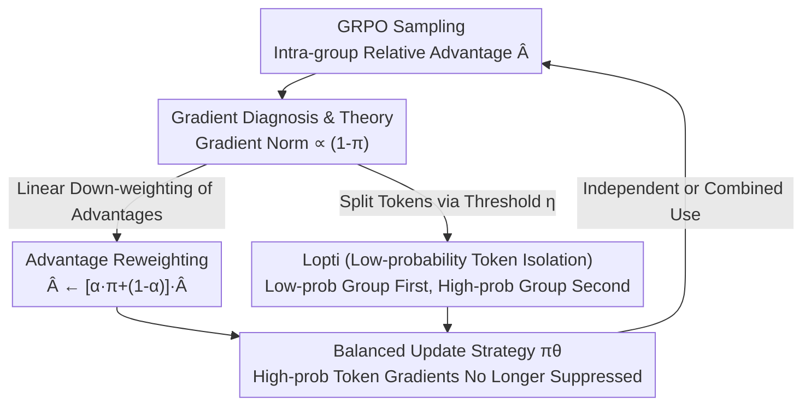

# Do Not Let Low-Probability Tokens Over-Dominate in RL for LLMs

**Conference**: ICLR 2026  
**OpenReview**: [https://openreview.net/forum?id=FOnAdLo0tM](https://openreview.net/forum?id=FOnAdLo0tM)  
**Code**: https://github.com/zhyang2226/AR-Lopti  
**Area**: Alignment RLHF / LLM Reasoning  
**Keywords**: GRPO, Reinforcement Learning, Gradient Bias, Low-probability tokens, token weighting

## TL;DR
This paper points out that during RL training for LLMs (such as GRPO), low-probability tokens dominate parameter updates due to excessively large gradient magnitudes, suppressing equally important high-probability tokens. The authors propose two simple methods—Advantage Reweighting (linearly scaling down low-probability token weights based on probability) and Lopti (updating low-probability tokens before high-probability tokens)—improving GRPO by up to 46.2% on K&K logic puzzles.

## Background & Motivation
**Background**: RL (especially GRPO, popularized by DeepSeek-R1) has become a standard post-training method for enhancing LLM reasoning capabilities. GRPO removes the value network of PPO and estimates advantages through intra-group relative success, showing prominent results in math and coding tasks, which has led to numerous follow-up improvements.

**Limitations of Prior Work**: Existing improvements for GRPO primarily focus on three directions: sample quality, response length bias (where longer responses receive skewed weights), and entropy collapse prevention. Previous researchers (Yu et al., Liu et al., Xiong et al.) identified "update weight biases" in the GRPO objective that significantly affect training results, but these biases were analyzed from the response level or prompt difficulty level.

**Key Challenge**: This paper uncovers an overlooked **gradient-level bias** that is orthogonal to the aforementioned biases and strongly correlated with token probability. By grouping tokens into quartiles based on probability, the authors observed that the gradient norm of low-probability tokens is significantly larger than that of high-probability tokens (Figure 1d). Since each RL update averages gradients across hundreds of thousands of tokens, gradient interference occurs; low-probability tokens dominate the update direction, suppressing the gradients of high-probability tokens. More critically, the proportion of "correct direction" updates (where probability should increase) for high-probability positive sample tokens is lower—tokens with probability $> 0.75$ update in the correct direction less than 50% of the time (Figure 3).

**Goal**: Without breaking the GRPO framework, weaken the over-dominance of low-probability tokens to allow high-probability token gradients to be properly reflected, thereby facilitating "cross-probability balanced" parameter updates.

**Key Insight**: Starting with theoretical derivations of gradients induced by single tokens, the authors prove that the gradient norm of any layer's activation is bounded by terms proportional to $(1-\pi)$. Specifically, lower probability leads to larger gradients, while the gradient approaches zero as the probability approaches 1. This provides a rigorous explanation for "low-probability token dominance" and indicates that "probability-based weighting" can serve as a targeted solution.

**Core Idea**: Since the root cause is "gradient magnitude $\propto (1-\pi)$", the authors propose directly down-weighting advantages/updates based on token probability (Advantage Reweighting) or splitting tokens of different probabilities into a two-phase update process (Lopti) to dismantle the dominance of low-probability tokens.

## Method

### Overall Architecture
The method is built upon GRPO without length normalization (normalization is performed across all tokens in the entire query-batch). The authors first expand the GRPO objective gradient into a "weighted cross-entropy" form $\nabla_\theta J = \mathbb{E}\big[\sum w_{i,t}\cdot \nabla_\theta \log \pi_\theta(o_{i,t})\big]$, where the weight $w_{i,t}$ is approximately equal to the advantage $\hat{A}_{i,t}$ in most cases. They then prove that for any layer activation $a_\ell$, the single-token gradient norm is bounded by two terms proportional to $(1-\pi_\theta(o_{i,t}))$ (Proposition 4.2). This property is the root cause of the "low-probability token gradient dominance."

Based on this diagnosis, the authors provide two independent and combinable interventions: **Advantage Reweighting** linearly scales down the advantage of low-probability tokens based on their probability with nearly zero extra overhead; **Lopti** uses a threshold $\eta$ to split a mini-batch of tokens into low-probability and high-probability groups, **updating the low-probability group first, followed by the high-probability group**. The update sequence ensures that high-probability token gradients receive attention in the second phase. Both methods attenuate the gradients of low-probability tokens and shift the update focus toward high-probability tokens.

### Key Designs

**1. Diagnosis of Gradient Imbalance and the $(1-\pi)$ Theoretical Bound**

The core contribution of this paper is **clarifying the problem**. After rewriting the GRPO objective as weighted cross-entropy, the authors conduct layer-wise Jacobian analysis. Under the mild assumption that "Jacobian singular values for each layer are bounded" (Assumption 4.1), they prove Proposition 4.2: for any layer $\ell$, the gradient norm of a single token with respect to that layer's activation satisfies:

$$\prod_{j=\ell+1}^{L} c_j \cdot |w_{i,t}| \cdot \sqrt{\tfrac{N}{N-1}}\cdot\big(1-\pi_\theta(o_{i,t})\big) \le \|\delta_\ell(o_{i,t})\| \le \prod_{j=\ell+1}^{L} d_j \cdot |w_{i,t}|\cdot\sqrt{2}\cdot\big(1-\pi_\theta(o_{i,t})\big),$$

where all terms except $(1-\pi_\theta(o_{i,t}))$ are approximately constant ($w_{i,t}\approx\hat{A}_{i,t}$, $N$ is vocabulary size). This implies the gradient norm is roughly proportional to $(1-\pi)$: lower probability results in larger gradients. Combined with empirical measurements in Figure 1 and Figure 3, this confirms that low-probability tokens dominate updates and hinder fine-grained adjustment of the probability distribution.

**2. Advantage Reweighting: Smoothing Weights via One-line Advantage Scaling**

The most direct approach to "excessive low-probability token weight" is reweighting advantages. The authors recalculate the advantage for each token as:

$$\hat{A}_{i,t} \leftarrow \big[\alpha\cdot\pi_\theta(o_{i,t}) + (1-\alpha)\big]\cdot\hat{A}_{i,t},$$

where $\alpha\in[0,1]$ is a manual hyperparameter. This linear scaling applies a smaller coefficient to tokens with lower probability (returning to original GRPO when $\alpha=0$), thereby linearly reducing their update weight. The benefit is nearly zero additional computational cost—simply multiplying by a coefficient during advantage calculation—while significantly reducing the "update direction error rate" for high-probability positive tokens (Figure 3, top). $\alpha$ is task-sensitive: $[0.2, 0.3]$ is recommended for K&K puzzles, while $0.1$ is used for math tasks.

**3. Lopti (Low-probability Token Isolation): Promoting High-probability Gradients via Update Order**

Lopti adopts a different strategy: instead of modifying advantage values, it splits tokens into two phases. Given a mini-batch, a threshold $\eta\in(0,1)$ (typically $\eta=0.5$) is used to categorize tokens into low and high probability groups. **The low-probability group is updated first, followed by the high-probability group** (Algorithm 1, lines 11–19, implemented via advantage masking). The intuition is that updating low-probability tokens first indirectly influences the distribution of the high-probability tokens. If a positive high-probability token is moved in the right direction (increasing probability), its gradient decreases in the second phase, giving room to others; if moved in the wrong direction, its gradient becomes more prominent in the high-probability group and receives more attention in the second phase. **The update order cannot be reversed**—ablations show that "high then low" is significantly worse than the GRPO baseline. The trade-off is higher computational cost due to two update rounds (a limitation acknowledged by the authors).

### Loss & Training
The base is the GRPO objective without length normalization (including the clipped trust-region term $\text{clip}(r_{i,t};1-\epsilon_l,1+\epsilon_h)$ and KL regularization $\beta D_{KL}[\pi_\theta\|\pi_{ref}]$). Advantage Reweighting only modifies advantage calculation; Lopti splits each RL step into "low-probability group $\rightarrow$ high-probability group" via masking ($\hat{A}_{i,t}=\hat{A}^{old}_{i,t}\odot \mathbb{I}(\pi_{old}\le\eta)$ and its complement).

## Key Experimental Results

### Main Results
K&K logic puzzles (Mixed 3–7 player training set, Logic-RL rule rewards, 5 epochs), evaluation averages the last three checkpoints:

| Model | Method | Avg. Accuracy | Gain vs GRPO |
|----------|------|------------|----------------|
| Qwen2.5-3B-Instruct | GRPO | 0.39 | — |
| | GRPO + Reweight | 0.53 | ↑35.9% |
| | GRPO + Lopti | 0.54 | ↑38.5% |
| | GRPO + Reweight + Lopti | **0.57** | **↑46.2%** |
| Qwen2.5-7B-Instruct-1M | GRPO | 0.77 | — |
| | GRPO + Reweight | 0.89 | ↑15.6% |
| | GRPO + Lopti | 0.86 | ↑9.1% |
| | GRPO + Reweight + Lopti | **0.91** | **↑18.2%** |

Math tasks (Qwen2.5-7B, DSR-Uniform / ORZ datasets, average of 5 benchmarks):

| Dataset | Method | Avg. all |
|--------|------|----------|
| DSR-Uniform | GRPO | 38.98 |
| | GRPO + Reweight | **40.01** |
| | GRPO + Lopti | 39.59 |
| ORZ | GRPO | 39.83 |
| | GRPO + Reweight | **41.09** |
| | GRPO + Lopti | 40.66 |

### Ablation Study
| Configuration | Result / Explanation |
|------|-------------|
| Only update high-prob tokens | Performance drops significantly—high-prob gradients are necessary, validating that "balance," not "exclusion," is needed. |
| Reverse Lopti order (high then low) | Significantly worse than baseline; training crashes after epoch 4. |
| $\alpha$ for Advantage Reweighting | Recommended $[0.2, 0.3]$ for K&K, $0.1$ for math; task-sensitive. |
| $\eta$ for Lopti | Robust within $[0.3, 0.5]$; more stable than Reweighting across hyperparams. |

### Key Findings
- **Higher difficulty leads to higher gains**: On difficult problems with many players and sparse positive samples, the gap between this method and GRPO is most pronounced.
- **Update order is critical for Lopti**: "Low then high" works, while the reverse fails—confirming the mechanism of highlighting high-probability gradients in the second phase.
- **Linguistic Evidence**: Responses generated by the proposed method show higher frequencies of reward-positive word categories (analysis, logic, causal indicators) and lower frequencies of reward-negative categories (conclusions without reasoning, assertions), suggesting improved reasoning behavior.

## Highlights & Insights
- **Diagnosis > Method**: The most valuable contribution is uncovering the "low-probability dominance" bias ($\propto (1-\pi)$) with a clean theoretical explanation. The methods are simple (one formula or one mask) but target the root cause.
- **Zero-cost Advantage Reweighting**: Simply multiplying by $[\alpha\pi+(1-\alpha)]$ during advantage calculation provides stable gains without increasing forward/backward computation—a "free" trick for policy-gradient RL.
- **Generalizability**: The methods are not limited to GRPO and are applicable to any policy-gradient RL (e.g., REINFORCE++) as they focus on rebalancing token-level gradients.

## Limitations & Future Work
- **Lopti Computational Overhead**: Splitting updates into two groups doubles the updates per step, increasing cost compared to original GRPO.
- **Hyperparameter Sensitivity**: $\alpha$ in Advantage Reweighting is task-dependent and requires tuning for different datasets.
- **Inconsistent Stacking Benefits**: Stacking the two methods only further improves performance on "continuous learning" tasks like K&K and provides no extra gain in fast-converging math tasks.

## Related Work & Insights
- **vs Length Bias (Yu et al. / Liu et al.)**: These focus on "longer response = larger weight"; this paper's bias is at the token probability level and is orthogonal to length bias.
- **vs Difficulty Bias (Xiong et al.)**: They focus on GRPO discarding hard prompts via intra-prompt normalization; this paper looks at single-token gradient magnitudes—a finer-grained source of bias.

## Rating
- Novelty: ⭐⭐⭐⭐⭐ First to reveal and correct token-level update bias from the gradient imbalance $\propto (1-\pi)$ perspective.
- Experimental Thoroughness: ⭐⭐⭐⭐ Covers K&K and math benchmarks across multiple base models and ablations.
- Writing Quality: ⭐⭐⭐⭐⭐ Clear "diagnosis—theory—method—verification" logic.
- Value: ⭐⭐⭐⭐⭐ High practical value due to simplicity, low cost, and portability.

<!-- RELATED:START -->

## Related Papers

- [\[ICLR 2026\] QeRL: Quantization-enhanced Low-rank Reinforcement Learning for LLMs](qerl_beyond_efficiency_-_quantization-enhanced_reinforcement_learning_for_llms.md)
- [\[ICLR 2026\] Principled RL for Diffusion LLMs Emerges from a Sequence-Level Perspective](principled_rl_for_diffusion_llms_emerges_from_a_sequence-level_perspective.md)
- [\[ICLR 2026\] From f(x) and g(x) to f(g(x)): LLMs Learn New Skills in RL by Composing Old Ones](from_fx_and_gx_to_fgx_llms_learn_new_skills_in_rl_by_composing_old_ones.md)
- [\[ICLR 2026\] Task Tokens: A Flexible Approach to Adapting Behavior Foundation Models](task_tokens_a_flexible_approach_to_adapting_behavior_foundation_models.md)
- [\[ICLR 2026\] Online Prediction of Stochastic Sequences with High Probability Regret Bounds](online_prediction_of_stochastic_sequences_with_high_probability_regret_bounds.md)

<!-- RELATED:END -->
