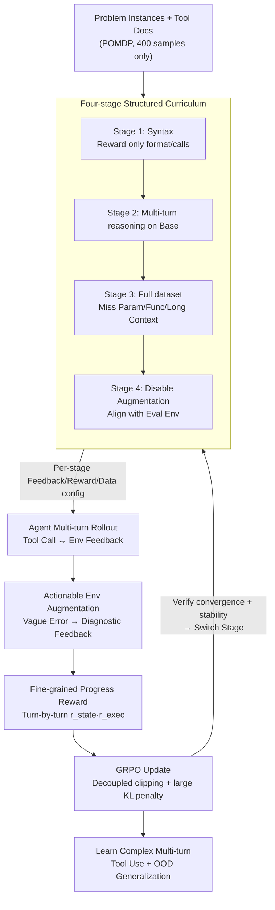

# Don't Just Fine-tune the Agent, Tune the Environment

**Conference**: ICLR 2026  
**arXiv**: [2510.10197](https://arxiv.org/abs/2510.10197)  
**Code**: [https://github.com/inclusionAI/AWorld-RL/tree/main/EnvTuning](https://github.com/inclusionAI/AWorld-RL/tree/main/EnvTuning)  
**Area**: Reinforcement Learning / LLM Agent  
**Keywords**: Environment Tuning, LLM Agent, Multi-turn Tool Use, Curriculum Learning, Reinforcement Learning

## TL;DR

Proposes the Environment Tuning training paradigm, utilizing structured curricula, actionable environment-enhanced feedback, and fine-grained progress rewards to enable LLM agents to learn complex multi-turn tool use from scratch with only 400 training samples, while achieving superior out-of-distribution generalization.

## Background & Motivation

LLM agents face three core challenges in multi-turn tool use tasks: (1) **Data extreme scarcity**—the BFCL V3 multi-turn dataset contains only 800 samples, and high-quality manual annotation is costly; (2) **Complex environments**—8 different domains and 84 tool types require cross-domain API calls and complex orchestration; (3) **Long interaction chains**—a single task involves multiple user queries, where failure in any turn leads to overall failure.

The Key Challenge of existing solutions is: SFT on synthetic trajectories can quickly acquire capabilities but is prone to overfitting and poor generalization; standard RL training suffers from a severe "cold start" problem—agents with insufficient initial ability cannot explore effectively in a massive action space, falling into a vicious cycle of low-quality rollouts, and long interaction chains lead to training instability and gradient explosion. Experiments show that direct single-stage RL on 400 samples crashes after about 70 steps, yielding only approximately 10% improvement.

The Core Idea of this paper is: **instead of imitating static trajectories, let the agent learn directly within a carefully designed environment**. By "tuning the environment" rather than just "tuning the model," failed explorations are transformed into valuable learning signals.

## Method

### Overall Architecture

Environment Tuning models multi-turn tool use as a POMDP, where inputs are problem instances and tool documentation, and outputs are sequences of tool calls and natural language responses. Instead of performing imitation on static trajectories, it allows the agent to explore directly in a carefully modified environment, supported by three complementary mechanisms: a structured curriculum scales learning difficulty from syntax mastery to unassisted generalization; actionable environment augmentation rewrites vague error messages into instructional diagnostic feedback; and fine-grained progress rewards decompose sparse success signals into turn-by-turn dense signals. The workflow is as follows: the curriculum determines the aids, data, and feedback configurations for each stage; the agent performs multi-turn rollouts in the configured environment; augmentation and progress rewards shape the signals for each turn; and updates are performed using GRPO. Progression to the next stage occurs only after convergence and gradient stability are verified.

### Key Designs

**1. Four-stage Structured Curriculum: Solving the exploration difficulty for cold-start agents in massive action spaces**

Direct single-stage RL on 400 samples leads to gradient explosion and collapse after ~70 steps, yielding only ~10% improvement, because agents with insufficient initial ability cannot find valid trajectories in long interaction chains. The curriculum approach is to "learn syntax first, then reasoning, and finally remove assistance." Stage 1 only requires the agent to produce correctly formatted and valid tool calls, with rewards designed as $R_{\text{Stage1}} = I_{\text{tool}} \cdot (R_{\text{format}} + R_{\text{tool}})$, where $R_{\text{format}}$ measures XML formatting and $R_{\text{tool}}$ measures parameter accuracy. This stage quickly eliminates "empty turns" where agents output dialogue without calling tools. Stage 2 enables progress rewards and environment augmentation on the Base dataset to learn basic multi-turn reasoning. Stage 3 introduces the full dataset with missing parameters, functions, and long contexts, relying on augmented feedback to handle ambiguity. Stage 4 disables augmentation, forcing the agent to rely on its own reasoning to handle standard errors, aligning with the evaluation environment for OOD generalization. Transitioning between stages requires both accuracy convergence and gradient norm stability, which is why the four-stage design prevents the collapses seen in single-stage RL.

**2. Actionable Environment Augmentation: Rewriting vague errors into instructional diagnostic feedback**

Standard environment errors are often vague or misleading. Environment augmentation replaces these with precise, actionable hints to help the agent understand tool dependencies and constraints. For example, when using a city name instead of an airport code, the standard environment returns "No available route," while the augmented environment returns "Invalid airport code[s]: destination airport 'Pinehaven'. Please use valid airport codes. You can use alternative tool to find the correct airport code for a city." This identifies the error and suggests the correct tool. Similarly, for `rm` commands, it corrects misconceptions about path arguments. This "turning dead ends into learning opportunities" approach yields over 20% improvement in complex scenarios like Missing Parameters and Functions.

**3. Fine-grained Progress Rewards: Decomposing sparse binary terminal rewards into turn-by-turn signals**

Sparse success rewards fail to distinguish between "nearly correct" and "completely wrong" trajectories in long chains. Progress rewards score each turn $t$ as the product of state evaluation $r_t^{\text{state}}$ and execution results $r_t^{\text{exec}}$. The total reward is the average success rate across turns: $R_P = \frac{1}{T}\sum_{t=1}^{T} r_t^{\text{state}} \cdot r_t^{\text{exec}}$. Ablations show that replacing this with binary rewards causes Stage 3 training to fail, indicating that dense signals are essential for learning long-chain tasks.

### Loss & Training

Training is based on an improved GRPO algorithm (PPO-like), incorporating a decoupled clipping mechanism and KL divergence penalty:

$$\mathcal{L}(\theta) = -\mathbb{E}_t\left[\min(r_t(\theta)\hat{A}_t, \text{clip}(r_t(\theta), 1-\epsilon_{\text{low}}, 1+\epsilon_{\text{high}})\hat{A}_t)\right] + \beta D_{\text{KL}}(\pi_\theta \| \pi_{\text{ref}})$$

Key hyperparameters: $\beta = 0.1$ (a large KL coefficient is crucial to prevent policy collapse), $\epsilon_{\text{low}} = 0.2$, $\epsilon_{\text{high}} = 0.28$. The advantage function is calculated via group-wise normalization (without a critic network).

## Key Experimental Results

### Main Results

In-distribution results on BFCL V3 multi-turn (trained on only 400 samples):

| Model | Average (%) | Base (%) | Miss Func (%) | Miss Param (%) | Long Context (%) |
|------|----------|----------|-------------|----------------|-----------------|
| GPT-4o | 51.00 | 59.00 | 54.00 | 41.00 | 50.00 |
| o3 | 49.25 | 47.00 | 55.00 | 47.00 | 48.00 |
| xLAM-2-8b (SFT SOTA) | 70.50 | 77.85 | 69.15 | 65.80 | 69.20 |
| Qwen2.5-7B + EnvTuning | 36.92 | 50.33 | 40.33 | 29.33 | 27.67 |
| watt-tool-8B + EnvTuning | **54.34** | - | - | - | - |
| ToolACE-2 + EnvTuning | 47.18 | - | - | - | - |

Out-of-distribution (OOD) results (BFCL V4 + ACEBench):

| Model | Web Search (%) | ACEBench Agent (%) |
|------|---------------|-------------------|
| xLAM-2-8b (SFT) | 5.00 | 1.65 |
| ToolACE-2 | 9.00 | 8.34 |
| ToolACE-2 + EnvTuning | 14.00 | **15.00** |
| Llama + EnvTuning | **15.00** | 4.17 |

### Ablation Study

| Configuration | Average Acc | Description |
|------|----------|------|
| Qwen2.5-7B Base | 7.00% | Direct Inference |
| + Direct GRPO | ~17% | RL without curriculum, limited effect |
| + Full EnvTuning | 36.92% | 19.5% Gain over direct GRPO |
| w/o Env Augmentation | Down >20% | Massive losses in Miss Param/Func |
| Binary Reward instead of Progress | Stage 3 Failed | No learning in complex tasks |

### Key Findings

- **SFT Overfits Heavily**: While xLAM-2 reaches 70.50% in-distribution, its OOD Web Search performance collapses to 5.00%, proving poor generalization of trajectory imitation.
- **Environment Augmentation is Critical**: Provides over 20% Gain in Missing Parameters and Missing Functions scenarios.
- **Large KL Coefficient Required**: $\beta = 0.1$ outperforms the common 0.001, effectively maintaining policy entropy and preventing early collapse.
- **Single-stage RL explodes at ~70 steps**, whereas the four-stage curriculum maintains gradient norm stability throughout.

## Highlights & Insights

- **Paradigm Shift**: Shifting from "imitating trajectories" to "exploring in the environment" represents a major change in LLM Agent training. No expert demonstrations are needed; only problem instances are required.
- **High Data Efficiency**: Just 400 problem instances can train an agent that outperforms several proprietary models, which is significant for data-scarce scenarios.
- **The Importance of Environment Engineering**: The quality of environment feedback directly determines RL exploration efficiency, suggesting that error messages should be actionable and diagnostic.
- **Compelling Case Studies**: Clear demonstrations in file systems, travel APIs, and vehicle control show how augmented feedback turns "dead ends" into "learning opportunities."
- **Curriculum Stage Transition Strategy**: The dual condition of accuracy convergence and gradient stability provides valuable engineering experience for practical implementations.

## Limitations & Future Work

- **Environment Augmentation requires manual design**: Currently, actionable feedback must be manually written for each environment; automated mechanisms are a key future direction.
- **In-distribution performance gap**: A gap remains compared to SFT methods using massive synthetic data (e.g., xLAM-2's 70.50%), suggesting the trade-off between data volume and exploration efficiency can be improved.
- **Limited Generalization Scope**: OOD evaluations are mainly on BFCL V4 and ACEBench; broader multimodal agent scenarios are not yet verified.
- **Validated only on 7-8B models**: Performance on larger models is unknown, and it remains to be seen if the curriculum design must scale with model size.
- **Automated Curriculum determination**: Automating the number of stages and data allocation strategies is a worthwhile research direction.

## Related Work & Insights

- Core findings that **"SFT memorizes, RL generalizes"** (Chu et al., 2025) are fully validated—OOD collapse in SFT is a universal phenomenon.
- Comparison with ReCall and ARTIST highlights the limitations of direct RL in complex multi-turn environments, making curriculum learning a necessity.
- The idea of environment augmentation can be extended to other Agent RL domains: guiding exploration through engineered feedback is more natural than modifying reward functions.
- **Insight**: Environment design and reward engineering are as critical as model architecture in an automated LLM Agent training pipeline.

## Rating

- Novelty: ⭐⭐⭐⭐⭐
- Experimental Thoroughness: ⭐⭐⭐⭐
- Writing Quality: ⭐⭐⭐⭐⭐
- Value: ⭐⭐⭐⭐⭐

<!-- RELATED:START -->

## Related Papers

- [\[ICLR 2026\] TRACED: Transition-aware Regret Approximation with Co-learnability for Environment Design](traced_transition-aware_regret_approximation_with_co-learnability_for_environmen.md)
- [\[ICLR 2026\] Proximal Supervised Fine-Tuning](proximal_supervised_fine-tuning.md)
- [\[ICLR 2026\] Structured In-context Environment Scaling for Large Language Model Reasoning](structured_in-context_environment_scaling_for_large_language_model_reasoning.md)
- [\[ICLR 2026\] Q-Learning with Fine-Grained Gap-Dependent Regret](q-learning_with_fine-grained_gap-dependent_regret.md)
- [\[ACL 2026\] A Goal Without a Plan Is Just a Wish: Efficient and Effective Global Planner Training for Long-Horizon Agent Tasks (EAGLET)](../../ACL2026/reinforcement_learning/a_goal_without_a_plan_is_just_a_wish_efficient_and_effective_global_planner_trai.md)

<!-- RELATED:END -->
