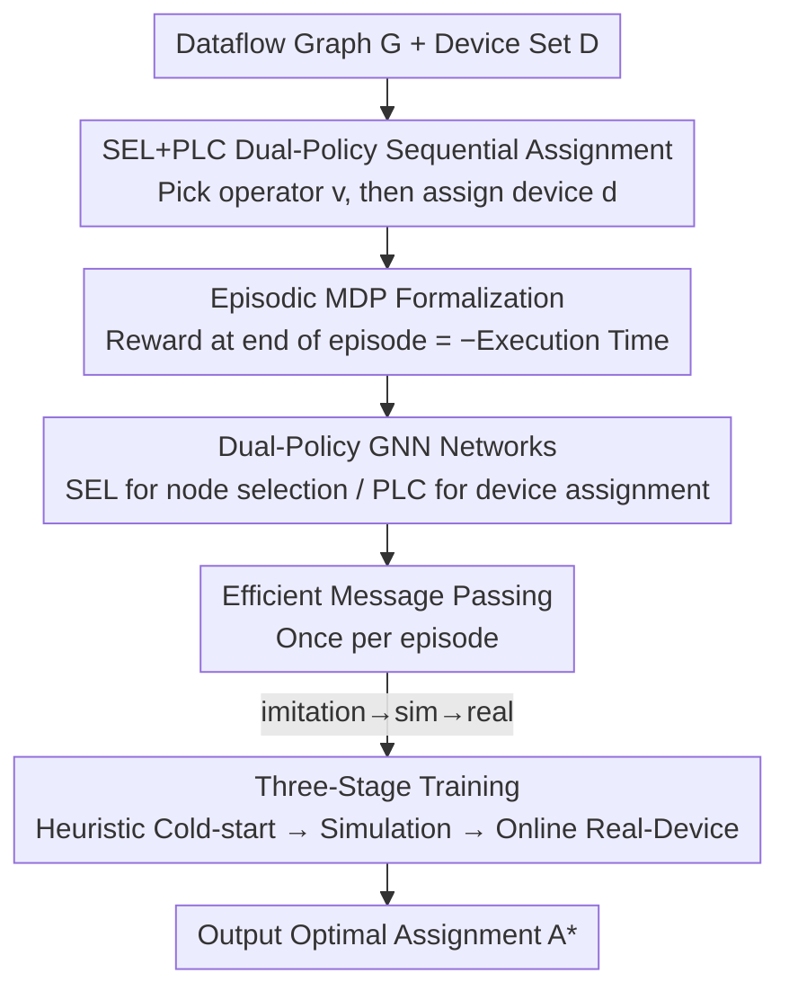

# DOPPLER: Dual-Policy Learning for Device Assignment in Asynchronous Dataflow Graphs

**Conference**: ICLR2026  
**OpenReview**: [https://openreview.net/forum?id=OQQK8gMC5H](https://openreview.net/forum?id=OQQK8gMC5H)  
**Code**: https://github.com/xinyuyao/Doppler  
**Area**: Reinforcement Learning / Device Placement / Graph Scheduling  
**Keywords**: Device Assignment, Work-Conserving Scheduling, Dual-Policy Reinforcement Learning, Graph Neural Networks, Dataflow Graphs

## TL;DR
DOPPLER models the problem of assigning dataflow graph operators across multiple GPUs to minimize execution time as a sequential decision-making problem. By utilizing a pair of policies (SEL to select the next operator and PLC to assign it a device) combined with a three-stage training pipeline (Imitation Learning → Simulator RL → Online Real-Device RL), it reduces execution time by up to 52.7% compared to the strongest baselines in asynchronous, work-conserving (WC) execution environments.

## Background & Motivation
**Background**: Modern deep learning systems (PyTorch, TensorFlow, JAX) generally execute computation graphs in a **bulk-synchronous** manner—execution only proceeds to the next layer's aggregation/communication once all operators in the current layer are finished. For instance, in a triple matrix multiplication $X \times Y \times Z$, each matrix is partitioned into 4 blocks across 8 GPUs; all pairwise sub-matrix multiplications must complete before aggregation and the subsequent step can begin.

**Limitations of Prior Work**: This lock-step execution has two major flaws. First, a single straggler can delay the entire layer as aggregation must wait for the slowest multiplication. Second, the aggregation phase is communication-dominated, leaving GPUs severely idle. Measurements in the paper show that switching to a **work-conserving (WC)** scheduler (which immediately dispatches ready operators whenever resources are available) reduces execution time for CHAINMM workloads from 185.3 ms to 139 ms (33% reduction) and for FFNN from 76.9 ms to 50.2 ms (53% reduction). For long-term deployments like ChatGPT (millions of queries daily), saving tens of milliseconds per query accumulates to over 2.4 million GPU hours annually.

**Key Challenge**: While WC systems are faster, they make **device assignment** extremely difficult. Bulk-synchronous execution uses all-reduce to fix the execution order, whereas WC relies on asynchronous point-to-point communication without global synchronization. Thus, the execution order is hard to control and performance is highly sensitive to hardware heterogeneity and resource contention. A good assignment must balance two conflicting goals: (1) GPU load balancing and (2) minimizing inter-GPU communication. Traditional placement methods focus solely on communication minimization, but under WC schedulers, execution order is stochastic. Consequently, load balancing becomes an inherently **temporal problem**, making it particularly challenging.

**Mechanism of the Key Challenge**: In a WC system, the same assignment $A$ may yield different execution times across runs due to stochastic ordering, making it impossible to derive a closed-form expression for $\text{ExecTime}(A)$. Without a differentiable objective function, direct optimization is infeasible.

**Goal**: To learn a device assignment policy for asynchronous WC systems that captures stochastic execution dynamics while respecting hardware constraints.

**Key Insight**: Given the lack of a closed-form objective, the authors adopt a **learning-by-doing** approach—executing assignments in a WC system (simulated or real) and using the observed runtime as the reward. Furthermore, they decouple the two fundamentally different decisions—"which operator to select first" and "which device to place it on"—into **two separate policies** to model execution dynamics and hardware constraints independently.

**Core Idea**: Replace the traditional single-policy placement with a dual-policy sequential decision process: a selection policy (SEL, determining the next operator to assign, approximating the uncertain "flow of time" in WC systems) and a placement policy (PLC, determining the target GPU). This is complemented by a three-stage training process that transitions from heuristic cold-starting to real-device online adaptation.

## Method

### Overall Architecture
DOPPLER aims to solve the following: given a static dataflow graph $G=\langle V,E\rangle$ (where vertices are kernel calls and edges are dependencies) and a set of devices $D$, find a mapping $A:V\to D$ that minimizes execution time under a WC system. The approach **formalizes the construction of a complete assignment as an episode**. Over $|V|$ steps, SEL picks an unassigned operator $v$ from a candidate set, and PLC assigns it a device $d$, incrementally building the assignment $A$. After the episode, $A$ is executed in a WC system (simulator or real device) to obtain the negative execution time as a reward, which is used to update both policies. Both policies use Graph Neural Networks (GNNs) to encode the dataflow graph and Feed-Forward Networks to decode actions.

Training proceeds in three stages: first, **Imitation Learning** to cold-start the dual policies by mimicking a list-scheduling heuristic (CRITICAL PATH); then, **Simulator Reinforcement Learning**, calculating rewards using a software simulator that implements WC logic; and finally, **Real-Device Reinforcement Learning**, deploying the policies onto a physical multi-GPU system and fine-tuning online using "free" observations of actual runtimes during service requests.

### Key Designs

**1. SEL+PLC Dual-Policy Sequential Decomposition: Decoupling "Scheduling Time" and "Placement"**

Previous learned placement methods (PLACETO, GDP, Mirhoseini, etc.) utilize a **single** placement policy that outputs a device directly given an operator. However, in WC systems, performance depends both on the (approximate) temporal order of scheduling and the device assignment, which have distinct semantic meanings. DOPPLER uses a sequential process $\text{ASSIGN}(\text{SEL}_\theta, \text{PLC}_\theta)$ to construct assignments. At each step, $v \leftarrow \text{SEL}_\theta(A, G)$ selects the next vertex, followed by $d \leftarrow \text{PLC}_\theta(A, G, v, D)$ selecting its device. SEL approximates the uncertain "flow of time" in WC systems by traversing the partially assigned graph, thereby explicitly encoding execution dynamics into the decision order. PLC focuses on load balancing and communication minimization given that order. This separation allows the model to process both execution dynamics and hardware constraints, producing assignments tailored for stochastic WC execution.

**2. Episodic MDP + Bandit Reward: Optimizing Without a Closed-Form Objective**

Device assignment is essentially a bandit problem with $D^{|V|}$ arms (e.g., $2^{300}$ assignments for 100 nodes and 8 GPUs). The authors leverage the **combinatorial structure** of the problem: if two assignments $A_1, A_2$ differ only by a few vertices, their rewards are likely similar, permitting systematic sequential search. By treating $\text{ASSIGN}$ as the arm-selection mechanism at each tick, the problem is rewritten as an **episodic MDP** $(\mathcal{S}, \mathcal{A}, H, P, R)$ with horizon $H = |V|$. The state $s_h$ includes static graph features (node/edge features like bottom-level/top-level path lengths, communication costs), the dynamic candidate node set, and dynamic device features (accumulated computation time). Actions $a_h = (v_h, d_h)$ select both node and device. Rewards are calculated only at the end of the episode $R_{s_H} = (-1) \times \text{ExecTime}(s_H)$, with intermediate rewards set to zero. To stabilize training, a baseline (average historical execution time $\overline{R_{s_H}}$) is subtracted, making the final reward $r_H = R_{s_H} - \overline{R_{s_H}}$.

**3. Dual-Policy GNN Networks + Efficient Message Passing**

Both SEL and PLC are built on a $K$-layer message-passing GNN, where node representations $h_v^{[k]}$ are updated iteratively. GNNs are naturally suited for dataflow graphs as they propagate information along dependency edges to capture critical paths and communication. **SEL (Node Selection)**: Concatenates the GNN representation $H[v]$, critical path embeddings $h_{v,b} \| h_{v,t}$ (aggregation of nodes on the longest paths to entry/exit), and feature representations $Z[v]$. This is passed through an FFNN and softmax to obtain $Q_G(v)$. **PLC (Device Assignment)**: Concatenates node representation $H[v]$, aggregation of nodes already placed on target device $h_d$, device features $Y[d]$, and node features $Z[v]$ to obtain $Q_D(d)$.

A key engineering breakthrough is **efficient message passing approximation**. While a naive approach would run message passing at every MDP step (~2 million steps in experiments), DOPPLER performs **message passing only once per episode**. New assignment information at each step updates only the dynamic device features $X_{D,h}$ without re-propagating through the entire graph. This significantly reduces training time with negligible impact on convergence.

**4. Three-Stage Training: From Heuristic to Online Adaptation**

Direct RL on real devices faces two issues: poor initial policies cause unacceptable runtimes during exploration, and convergence is slow. DOPPLER uses three stages. **Stage I: Imitation Learning (Offline)**: The policies mimic a CRITICAL PATH list-scheduling teacher to learn basic logic (e.g., keeping adjacent vertices on the same device), providing a strong starting point for RL. **Stage II: Simulator RL (Offline)**: Assignments are run in a software simulator implementing WC logic to obtain rewards. **Stage III: Real-Device RL (Online)**: Similar to sim-to-real, the model is fine-tuned on physical multi-GPU systems. Since Stage II provides a high-quality initial policy, deployment avoids long warm-ups or unstable exploration. Reward signals are "free," as execution times are naturally observed during normal service requests.

### Loss & Training
The three stages utilize three objectives: Imitation Learning uses log-likelihood gradients of teacher actions. Both RL stages use REINFORCE-style policy gradients with a baseline, where the reward is the negative execution time minus the historical mean. For hyper-parameters: CHAINMM/FFNN runs for 4k episodes, LLAMA-BLOCK/LLAMA-LAYER for 8k; the learning rate is $1\text{e-}4$ linearly decayed to $1\text{e-}7$.

## Key Experimental Results

### Main Results
Comparison of real-device execution time (ms, lower is better) on 4 NVIDIA Tesla P100 (16GB) GPUs. DOPPLER-SYS uses all three stages, while DOPPLER-SIM uses Stages I+II:

| Model | CRIT. PATH | PLACETO | GDP | ENUMOPT. | DOPPLER-SIM | DOPPLER-SYS | Gain vs Best Baseline |
|------|-----------|---------|-----|----------|-------------|-------------|------|
| CHAINMM | 230.4 | 137.1 | 198.0 | 139.0 | 122.5 | **123.4** | 10.7% |
| FFNN | 217.8 | 126.3 | 100.3 | 50.2 | 49.9 | **47.4** | 52.7% |
| LLAMA-BLOCK | 230.9 | 411.5 | 336.5 | 172.7 | 191.5 | **160.3** | 30.6% |
| LLAMA-LAYER | 292.6 | 295.1 | 231.5 | 174.8 | 167.0 | **150.6** | 48.5% |

DOPPLER-SYS beats all baselines in most settings, reducing time by up to 78.2% vs CRITICAL PATH, 62.5% vs PLACETO, and 52.7% vs GDP. It even outperforms the strong ENUMERATIVEOPTIMIZER baseline by up to 13.8%.

### Ablation Study
**Dual-Policy Ablation**: Replacing one policy with CRITICAL PATH logic—DOPPLER-SEL assigns selected nodes to the earliest available device, while DOPPLER-PLC uses "longest path to exit" for node selection.

| Model | DOPPLER-SYS (Dual) | DOPPLER-SEL | DOPPLER-PLC |
|------|------|------|------|
| CHAINMM | 123.4 | 127.0 | 121.6 |
| FFNN | **47.4** | 59.1 | 63.2 |
| LLAMA-BLOCK | **160.3** | 175.6 | 172.9 |
| LLAMA-LAYER | **150.6** | 161.7 | 159.5 |

The synergy of the dual-policy approach is distinctly more evident as graph complexity increases.

### Key Findings
- **Necessity of Three Stages**: Training only on real devices results in slow convergence and instability; adding imitation and simulation stages provides faster convergence and lower execution times.
- **Transferability**: Moving from simple graphs to Llama structures, the model outperforms baselines with only 2k fine-tuning episodes. In cross-hardware scenarios (4×P100 → 8×V100), intra-GPU communication increased from 82.7% to 94.7% after 2k episodes.
- **Scalability**: Training and inference times scale **linearly** with the number of graph nodes.
- **Interpretability**: Visualization shows DOPPLER balances loads along critical paths while minimizing communication, often overlapping communication with computation to reduce stalls.

## Highlights & Insights
- **Explicit Modeling of "Time"**: By using SEL to determine the consideration order, DOPPLER injects temporal execution dynamics into the decision process—a fundamental shift from single-policy placement.
- **Efficient Message Passing Trick**: Updating only device features instead of re-propagating the whole graph per step is a highly practical engineering trade-off for RL on graphs.
- **"Free" Online Rewards**: Stage III allows continuous self-improvement in production environments without additional overhead or user disruption.
- **Curriculum-like Training**: Heuristic supervision (easy/stable) → Simulator RL (safe) → Real RL (accurate but expensive) effectively stacks benefits while deferring risks.

## Limitations & Future Work
- **Static Graph Dependency**: The method assumes the graph structure is mostly fixed, which may limit its application to highly dynamic workloads.
- **Simulator Fidelity**: A software simulator cannot perfectly capture NVLink jitter or system noise, placing a heavier burden on Stage III fine-tuning.
- **Graph Scale**: While the authors argue large graphs are handled via data parallelism, verification on graphs with tens of thousands of nodes is still needed.
- **Hardware Scale**: Primary experiments were conducted on 4–8 GPUs, which is smaller than industrial-scale clusters.

## Related Work & Insights
- **vs CRITICAL PATH**: DOPPLER can be viewed as a "neuralized list-scheduling heuristic" that learns both select and place steps from observations, consistently outperforming the heuristic by up to 78.2%.
- **vs PLACETO**: While PLACETO is an RL placer, it uses a single policy and suffers from slow training due to per-step message passing. DOPPLER's dual-policy and optimized GNN are much faster.
- **vs GDP**: GDP uses graph embeddings and sequence attention. DOPPLER's decomposition yields up to 52.7% more reduction and better scalability in training/inference.

## Rating
- Novelty: ⭐⭐⭐⭐ Dual-policy decomposition for WC systems is a solid innovation.
- Experimental Thoroughness: ⭐⭐⭐⭐ Covers various workloads and comprehensive ablations, though hardware scale is modest.
- Writing Quality: ⭐⭐⭐⭐ Motivations and algorithms are clearly articulated with structured experiments.
- Value: ⭐⭐⭐⭐ High practical value for optimizing asynchronous WC execution in large-scale inference/training.

<!-- RELATED:START -->

## Related Papers

- [\[ICLR 2026\] Breaking Safety Paradox with Feasible Dual Policy Iteration](breaking_safety_paradox_with_feasible_dual_policy_iteration.md)
- [\[ICLR 2026\] Primal-Dual Policy Optimization for Linear CMDPs with Adversarial Losses](primal-dual_policy_optimization_for_linear_cmdps_with_adversarial_losses.md)
- [\[ICLR 2026\] Dual Goal Representations](dual_goal_representations.md)
- [\[ICLR 2026\] Dual-Objective Reinforcement Learning with Novel Hamilton-Jacobi-Bellman Formulations](dual-objective_reinforcement_learning_with_novel_hamilton-jacobi-bellman_formula.md)
- [\[ICLR 2026\] Occupancy Reward Shaping: Improving Credit Assignment for Offline Goal-Conditioned Reinforcement Learning](occupancy_reward_shaping_improving_credit_assignment_for_offline_goal-conditione.md)

<!-- RELATED:END -->
