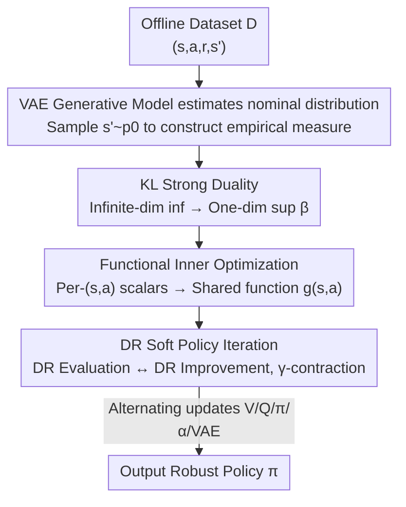

# DR-SAC: Distributionally Robust Soft Actor-Critic for Reinforcement Learning under Uncertainty

**Conference**: ICLR2026  
**OpenReview**: [https://openreview.net/forum?id=a19MA0ksbc](https://openreview.net/forum?id=a19MA0ksbc)  
**Code**: https://github.com/Lemutisme/DR-SAC  
**Area**: Reinforcement Learning / Distributionally Robust Optimization / Offline RL  
**Keywords**: Distributionally Robust RL, Soft Actor-Critic, Maximum Entropy RL, KL Divergence Uncertainty Set, Generative Model

## TL;DR
DR-SAC is the first actor-critic distributionally robust reinforcement learning (DR-RL) algorithm designed for continuous action spaces in offline settings. It performs "worst-case maximum entropy optimization" over a transition distribution uncertainty set characterized by a KL divergence ball. The authors provide a distributionally robust soft policy iteration with convergence guarantees and operationalize the algorithm for continuous control using functional rewriting and VAE generative models. Under perturbations, the average return is up to 9.8× higher than SAC, with training times reduced by over 80% compared to the existing DR-RL method, RFQI.

## Background & Motivation
**Background**: Deep Reinforcement Learning (DRL) has achieved success in gaming and robotic control. Offline RL, which learns policies from fixed datasets without environment interaction, is gaining attention for its safety and data efficiency. Soft Actor-Critic (SAC) is a representative algorithm that adds a policy entropy regularization term $\alpha \cdot H(\pi(s))$ to cumulative rewards, encouraging exploration and supported by maximum entropy RL theory.

**Limitations of Prior Work**: In real-world deployment, the transition distribution of the training environment (or data collection environment) often differs from the deployment environment due to parameter drift, observation noise, actuator noise, and adversarial perturbations. These cause significant performance degradation for policies learned in nominal environments. Distributionally Robust RL (DR-RL) addresses this using Robust Markov Decision Processes (RMDPs), which seek the worst-case optimum across "all MDPs" within an uncertainty set around a nominal distribution.

**Key Challenge**: Existing DR-RL methods are almost exclusively **value-based methods in tabular settings**, making them inapplicable to continuous action spaces. The only method capable of handling continuous actions, Robust Fitted Q-Iteration (RFQI), has two major flaws: first, its uncertainty set is restricted to Total Variation (TV) distance because the TV dual is piecewise linear and analytically convenient, which does not hold for KL or other divergences; second, its non-robust base, FQI, is value-based and learns deterministic policies, which adapt poorly to high-dimensional action spaces and are highly sensitive to Q-function errors. In contrast, actor-critic methods offer both low-variance value estimation and scalable policy optimization but have lacked a distributionally robust version.

**Goal**: To fill this gap by developing the first actor-critic DR-RL algorithm capable of offline learning in continuous action spaces, using a more general KL divergence ball for the uncertainty set. Three sub-problems must be solved: (1) making the infinite-dimensional inner optimization of the "worst-case distribution" computable; (2) estimating the unknown nominal transition distribution $p^0_{s,a}$ in an offline setting; and (3) scaling from "per-$(s,a)$ optimization" to continuous spaces without computational explosion.

**Key Insight**: Robustify maximum entropy RL over a KL ball by first compressing the infinite-dimensional inner optimization into a 1D scalar optimization via strong duality, then engineering it for continuous offline control using functional inner optimization and VAE-based nominal distribution estimation.

## Method

### Overall Architecture
DR-SAC aims to solve the following problem: Given an offline dataset $D=\{(s_i,a_i,r_i,s'_i)\}$, the true transition distribution of the deployment environment lies within a KL ball $P_{s,a}(\delta)=\{p:D_{KL}(p\|p^0_{s,a})\le\delta\}$ centered at a nominal distribution $p^0_{s,a}$. The goal is to learn a policy that maximizes the soft value function (with entropy regularization) under the **worst-case transition distribution**.

The algorithm is structured in three layers: (1) The theoretical layer provides "Distributionally Robust Soft Policy Iteration," replacing SAC's soft Bellman operator with a robust version taking the infimum over the worst-case distribution, proved to be a $\gamma$-contraction. (2) The computable layer uses KL strong duality to transform the "inf over infinite distributions" into a "sup over a scalar $\beta$," then uses the property that "minimization commutes with integration" to merge per-$(s,a)$ scalar optimizations into a shared **functional optimization**, eliminating dependence on state-action dimensions. (3) The implementation layer uses a VAE to estimate the unknown nominal transition distribution and generates next-state samples to construct an empirical measure, bypassing the "double sampling" problem inherent in non-linear KL duals. V/Q/policy are parameterized by neural networks following the SAC training loop.

### Key Designs

**1. Distributionally Robust Maximum Entropy Framework: Integrating the "Worst-case Distribution" into SAC**

To address the lack of robust actor-critic versions in DR-RL, this work modifies the soft Bellman operator of SAC. While the standard operator takes the expectation over the next state, the robust version first takes the infimum over the worst-case transition distribution in the uncertainty set:

$$\mathcal{T}^\pi_\delta Q(s,a) := \mathbb{E}[r] + \gamma\cdot\inf_{p_{s,a}\in P_{s,a}(\delta)}\Big(\mathbb{E}_{p_{s,a},\pi}\big[Q(s',a')-\alpha\log\pi(a'|s')\big]\Big).$$

The algorithm alternates between "DR Soft Policy Evaluation" (repeatedly applying $\mathcal{T}^\pi_\delta$ to estimate robust Q) and "DR Soft Policy Improvement" (updating the policy using robust Q). The paper proves three properties: $\mathcal{T}^\pi_\delta$ is a $\gamma$-contraction mapping, policy improvement monotonically increases robust Q, and the iteration converges to the robust optimal policy $\pi^\star$.

**2. KL Strong Duality: Compressing Infinite-Dimensional Search**

Directly calculating $\mathcal{T}^\pi_\delta$ involves infinite-dimensional optimization. By applying strong duality to the "worst-case expectation over a KL ball," the authors derive an equivalent form dependent only on the nominal distribution and a single scalar $\beta$:

$$\mathcal{T}^\pi_\delta Q(s,a) = \mathbb{E}[r] + \gamma\cdot\sup_{\beta\ge 0}\Big\{-\beta\log\big(\mathbb{E}_{p^0_{s,a}}[\exp(-V(s')/\beta)]\big)-\beta\delta\Big\},$$

where $V(s)=\mathbb{E}_{a\sim\pi}[Q(s,a)-\alpha\log\pi(a|s)]$. Crucially, this dual form **only uses the nominal distribution $p^0_{s,a}$** and reduces the problem to a 1D optimization over $\beta$.

**3. Functional Inner Optimization: Scaling via Shared Function $g(s,a)$**

Although duality reduces the problem to 1D, solving for $\beta$ separately for **every $(s,a)$ pair** is computationally expensive. Using the property that "minimization commutes with integration" (Rockafellar & Wets), the authors merge these point-wise scalar optimizations into a single functional optimization:

$$\mathbb{E}_{(s,a)\sim D}\Big[\sup_{\beta\ge 0} f((s,a),\beta)\Big] = \sup_{g\in\mathcal{G}}\mathbb{E}_{(s,a)\sim D}\big[f((s,a),g(s,a))\big].$$

Instead of finding an optimal $\beta^\star$ for each pair, a neural network $G_\eta$ learns a function $g(s,a)$ to approximate all optimal values simultaneously. This reduces the optimization scale from $|D|$ scalar problems to one functional problem, **eliminating state-action dimension dependence** and reducing training time by over 80% compared to RFQI.

**4. VAE Generative Modeling: Resolving the Double Sampling Problem**

In offline settings, $p^0_{s,a}$ is unknown. The non-linear expectation in the KL dual $\mathbb{E}_{p^0_{s,a}}[\exp(-V(s')/\beta)]$ suffers from the "double sampling problem" when estimated from dataset samples. This work trains a VAE to learn the transition $p^0_{s,a}$ and generates multiple next-state samples $\{\tilde s'_i\}_{i=1}^m$ to construct an empirical measure $\tilde p^0_{s,a}$. Since multiple next-states can be generated for the same $(s,a)$, double sampling is avoided.

### Loss & Training
The algorithm utilizes the SAC-v1 architecture with an explicit V-network and multiple Q-networks to mitigate overestimation bias. Each gradient step updates: VAE weights → Optimal function $\tilde g^\star$ via VAE samples → V-network → Q-networks → Policy → Temperature $\alpha$ → Target network soft updates.

## Key Experimental Results

### Main Results
Evaluated on 5 Gymnasium/MuJoCo tasks (Pendulum, Cartpole, LunarLander, Reacher, HalfCheetah). Models were trained in nominal environments and tested under perturbations (parameter drift, Gaussian observation noise, random actuator noise).

| Environment / Perturbation | Metric | DR-SAC | Comparison | Conclusion |
|--------|------|------|----------|------|
| Pendulum length +20% | Avg Return | — | SAC | 35% higher than SAC |
| LunarLander engine -20% | Avg Return | 240 | Others <180 | Significant lead |
| LunarLander engine -30% | Return Ratio | 9.8× SAC | SAC | Up to 9.8x |
| HalfCheetah damping ±50% | Avg Return | >6300 | SAC <5950 | More stable and higher |

### Ablation Study

| Configuration | Key Metric | Explanation |
|------|---------|------|
| DR-SAC-Functional | Training time <2% of Accurate | Functional approximation is efficient |
| DR-SAC-Accurate | Similar robustness, extremely slow | Validates functional approximation value |
| vs RFQI (Training time) | 4-36 min vs 93-238 min | RFQI requires up to 23.2× more time |
| VAE latent dim 5~20 | Robustness unchanged | Insensitive to latent dimensions |

### Key Findings
- **Functional approximation is the core of efficiency**: DR-SAC-Functional achieves similar robustness in under 2% of the time required by accurate point-wise operators.
- **Robustness to generative model choice**: VAE latent dimensions between 5-20 do not impact performance. While Diffusion models provide similar robustness, they increase training time by $\ge 4.5\times$.
- **FQI/RFQI failures**: In some environments, FQI-based methods fail even in nominal settings due to sensitivity to dataset distribution/coverage, whereas DR-SAC remains stable.

## Highlights & Insights
- **Structured Progress**: The four-step progression (Theory → Duality → Functionalization → Generative Modeling) systematically removes obstacles to practical deployment (infinite dimensions, point-wise optimization, unknown distributions, double sampling).
- **Transferable Functional Optimization**: The technique of replacing point-wise optimizations with a shared function $g(s,a)$ is applicable to other DR problems or distributionally robust supervised learning.
- **Generative Modeling for Statistical Challenges**: Using VAEs to solve double sampling by enabling multiple conditional generations is a novel interface for integrating generative models into robust offline RL.

## Limitations & Future Work
- **Reliance on VAE Accuracy**: Errors in the VAE transition estimation propagate to the robust objective. Performance in high-dimensional or complex transitions needs further investigation.
- **Theoretical Gap**: Convergence proofs assume discrete action spaces (to ensure bounded entropy), while implementation uses neural networks for continuous actions.
- **Uncertainty Set Shape**: The choice of KL balls introduces non-linearity. The trade-offs of using other divergences (e.g., Wasserstein) within this framework remain unexplored.

## Related Work & Insights
- **vs RFQI (Panaganti et al., 2022)**: DR-SAC supports KL balls (vs. only TV), utilizes an actor-critic base for stochastic policies, and is significantly faster (up to 23.2×).
- **vs Tabular DR-RL**: DR-SAC maintains theoretical convergence properties while scaling to continuous spaces through functionalization and generative modeling.
- **vs VAE in Offline RL**: Unlike BCQ which uses VAEs to constrain policies to behavior distributions, DR-SAC uses VAEs to estimate **nominal transition distributions** for robustness.

## Rating
- Novelty: ⭐⭐⭐⭐⭐ 
- Experimental Thoroughness: ⭐⭐⭐⭐ 
- Writing Quality: ⭐⭐⭐⭐⭐ 
- Value: ⭐⭐⭐⭐⭐ 

<!-- RELATED:START -->

## Related Papers

- [\[ICLR 2026\] Chunking the Critic: A Transformer-based Soft Actor-Critic with N-Step Returns](chunking_the_critic_a_transformer-based_soft_actor-critic_with_n-step_returns.md)
- [\[ICLR 2026\] Flow Actor-Critic for Offline Reinforcement Learning (FAC)](flow_actor-critic_for_offline_reinforcement_learning.md)
- [\[ICLR 2026\] Neural+Symbolic Approaches for Interpretable Actor-Critic Reinforcement Learning](neuralsymbolic_approaches_for_interpretable_actor-critic_reinforcement_learning.md)
- [\[ICLR 2026\] Convergence of an actor-critic gradient flow for entropy regularised MDPs in general spaces](convergence_of_an_actor-critic_gradient_flow_for_entropy_regularised_mdps_in_gen.md)
- [\[ICLR 2026\] Information-based Value Iteration Networks for Decision Making Under Uncertainty](information-based_value_iteration_networks_for_decision_making_under_uncertainty.md)

<!-- RELATED:END -->
