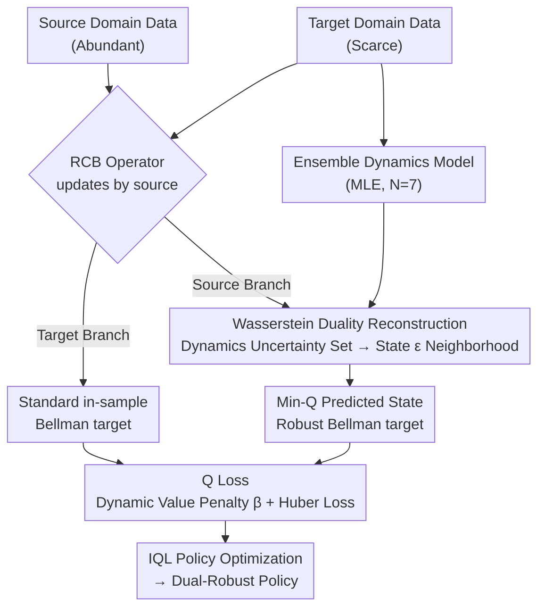

# Dual-Robust Cross-Domain Offline Reinforcement Learning Against Dynamics Shifts

**Conference**: ICLR 2026  
**arXiv**: [2512.02486](https://arxiv.org/abs/2512.02486)  
**Code**: [https://github.com/zq2r/DROCO](https://github.com/zq2r/DROCO)  
**Area**: AI Safety / RL Robustness  
**Keywords**: Offline Reinforcement Learning, Cross-Domain Transfer, Dynamics Shift, Dual Robustness, Bellman Operator

## TL;DR
Ours is the first work to simultaneously address train-time robustness (source-target dynamics mismatch) and test-time robustness (deployment environment dynamics shift) in cross-domain offline RL. The proposed DROCO algorithm centers on the Robust Cross-Domain Bellman (RCB) operator—applying robust Bellman updates to source data and standard in-sample updates to target data. Through dual reconstruction, intractable dynamics uncertainty is mapped to state-space perturbations. On D4RL benchmarks, it achieves a total score of 1105.2, surpassing the runner-up by 14%, with performance degradation under hard-level dynamics perturbations only half that of baselines.

## Background & Motivation

**Background**: The core scenario of cross-domain offline RL is learning policies with the help of abundant source domain data when target domain data is scarce. For instance, in robotic manipulation, the source domain consists of simulator data (abundant), while the target domain consists of real robot data (scarce). Both domains share state spaces, action spaces, and reward functions, but differ in transition dynamics $P$. Existing methods such as DARA (reward correction via domain classifier), IGDF (source data filtering via mutual information), and OTDF (dynamics alignment via optimal transport) focus on resolving the dynamics mismatch between source and target domains, termed "train-time robustness."

**Limitations of Prior Work**: A hidden assumption of these methods is that if source-target differences are handled during training, the policy will function correctly during deployment in the target domain. However, in reality, the dynamics of the deployment environment itself can shift—robot parts wear out, joints loosen, or loads change, causing the actual transition dynamics to deviate from the training-time target domain. Experimental verification shows that a policy trained with IGDF on the hopper task suffers performance drops of 40.9% and 72.4% under medium and hard kinematic perturbations, respectively. Furthermore, when target domain data is reduced to 10%, degradation worsens as the policy overfits more severely to the dynamics features in the limited data.

**Key Challenge**: Train-time robustness and test-time robustness are orthogonal requirements—the former handles known source-target discrepancies (observable in training data), while the latter resists unknown deployment environment perturbations (invisible during training). Existing cross-domain offline RL methods only solve the former, while single-domain robust RL methods solve the latter but cannot handle cross-domain data fusion.

**Goal**: To design a unified framework that guarantees: (1) safe utilization of source domain data without introducing Q-value overestimation caused by OOD dynamics (train-time robustness); (2) maintenance of a performance lower bound for the learned policy when deployment environment dynamics shift (test-time robustness).

**Key Insight**: It is observed that utilizing a robust Bellman operator on source domain data (taking the worst-case within a Wasserstein uncertainty set) inherently implies a "conservative estimation" effect. This both suppresses Q-value inflation caused by OOD dynamics (solving the train-time problem) and makes the policy resistant to dynamics perturbations (solving the test-time problem). For target domain data, standard in-sample Bellman updates are used to fully utilize real dynamics information.

**Core Idea**: A single RCB operator is used to unify dual robustness—performing robust Bellman backups for source domain data and standard backups for target domain data, while transforming dynamics uncertainty into operable state perturbations via Wasserstein duality.

## Method

### Overall Architecture
DROCO aims to solve the problem where target domain data is extremely scarce, necessitating training with abundant source domain data. The policy must neither be biased by source domain dynamics that are unreachable in the target domain (train-time robustness) nor succumb to dynamics shifts during deployment (test-time robustness). The approach bifurcates Q-function updates based on data source: source domain data follows a "worst-case" robust Bellman update, while target domain data follows a standard in-sample update utilizing real dynamics. The challenge lies in the "worst-case" source update, which originally requires iterating over infinite possible transition dynamics. This is addressed by using Wasserstein duality to rewrite it as "finding a Q-minimizing state near the observed next state," approximated by several predicted states generated by an ensemble dynamics model trained on the target domain. Finally, estimation biases from ensemble approximation are patched with dynamic value penalties and Huber loss, all optimized within the IQL framework.

### Key Designs

**1. Robust Cross-Domain Bellman (RCB) Operator: A unified operator for dual robustness**

Mixing source and target data for standard Bellman updates poses risks: source dynamics $P_{\text{src}}$ might transition the agent to states with high rewards that are unreachable in the target domain, leading to severe Q-value overestimation. RCB handles updates based on data source. For target domain data $(s,a,s') \in \mathcal{D}_{\text{tar}}$, it degrades to a standard in-sample Bellman operator $r + \gamma \mathbb{E}_{s'}[\max_{a' \sim \hat{\mu}} Q(s',a')]$, utilizing real dynamics. For source domain data $(s,a,s') \in \mathcal{D}_{\text{src}}$, it takes the worst-case within the Wasserstein uncertainty set $\mathcal{M}_\epsilon$:

$$r + \gamma \inf_{\hat{\mathcal{M}} \in \mathcal{M}_\epsilon} \mathbb{E}_{s' \sim P_{\hat{\mathcal{M}}}}[\max_{a'} Q(s',a')].$$

This "worst-case" operation for the source domain kills two birds with one stone: it suppresses Q-value inflation from OOD dynamics (train-time) and naturally fosters policy resistance to dynamics perturbations (test-time). Theoretically, the RCB is proved to be a $\gamma$-contraction mapping (Proposition 4.1), ensuring convergence to a unique fixed point. Furthermore, Proposition 4.4 (train-time robustness) shows that when $\epsilon$ is large enough to cover the support of $P_{\text{tar}}$, the learned Q-values will not be overestimated. Proposition 4.5 (test-time robustness) shows that if deployment dynamics shift within a Wasserstein distance $c$, actual performance remains above the learned robust value function. Thus, $\epsilon$ serves as the knob connecting both types of robustness.

**2. Wasserstein Duality Reconstruction: Converging "Dynamics Uncertainty Set" optimization to "State Perturbation" search**

While the RCB operator is elegant, the $\inf_{\hat{\mathcal{M}} \in \mathcal{M}_\epsilon}$ term is uncomputable as it requires iterating over infinite MDPs in the uncertainty set of a black-box source environment. The authors utilize the dual form of the Wasserstein distance (Proposition 4.2) to circumvent this, equivalently rewriting the dynamics optimization at the state level:

$$\inf_{\hat{\mathcal{M}} \in \mathcal{M}_\epsilon} \mathbb{E}_{s' \sim P_{\hat{\mathcal{M}}}}[\cdots] \;=\; \mathbb{E}_{s' \sim P_{\mathcal{M}}}\Big[\inf_{\bar{s}:\, d(s',\bar{s}) \leq \epsilon} \max_{a'} Q(\bar{s}, a')\Big].$$

This step transforms "enumerating all possible transition dynamics" into "finding a state $\bar{s}$ that minimizes the Q-value within the $\epsilon$-neighborhood of the observed next state $s'$." An uncomputable functional optimization is thus grounded into a search in finite-dimensional space. In implementation, instead of an explicit $\epsilon$-ball search, $N$ predicted states $\{s'_i\}$ from the ensemble dynamics model are used to approximate the neighborhood, taking $\min_i Q(s'_i, \pi(s'_i))$ as the robust target. Using an ensemble model also provides adaptive uncertainty—wider predictions in unknown regions naturally expand the neighborhood, preventing excessive conservatism from a fixed $\epsilon$.

**3. Dynamic Value Penalty and Huber Loss: Correcting estimation bias from ensemble approximation**

Replacing the dynamics uncertainty set with ensemble approximation is not without cost: Proposition 4.6 proves that ensemble TV distance error $\epsilon$ can introduce Q-value overestimation up to $(1-(1-2\epsilon)^N) \cdot r_{\max}/(1-\gamma)$, while the "inf" operation itself can lead to severe underestimation. Two independent knobs are used as remedies. First, a dynamic value penalty $u(s,a,s') = \mathbb{I}(s' \sim P_{\text{src}}) \cdot (V(s') - \min_i V(s'_i))$ measures the gap between the source-observed $V(s')$ and the minimum ensemble-predicted $V$, adjusted by coefficient $\beta$: $\beta=1$ restores original RCB, $\beta>1$ increases conservatism to suppress overestimation, and $\beta<1$ reduces it to fix underestimation. Second, the Bellman update for source data uses Huber loss instead of L2 loss—retaining L2 for TD errors $|Q - \hat{\mathcal{T}}Q| < \delta$ but switching to L1 when exceeding $\delta$ to prevent outliers in model predictions from destabilizing training.

### Loss & Training
The overall Q-function loss is: $\mathcal{L}_Q = \mathbb{E}_{\mathcal{D}_{\text{src}}}[l_\delta(Q - \hat{\mathcal{T}}_{\text{RCB}} Q)] + \frac{1}{2}\mathbb{E}_{\mathcal{D}_{\text{tar}}}[(Q - \mathcal{T}Q)^2]$. The source domain uses Huber loss $l_\delta$ with the RCB target, while the target domain uses standard L2 loss with the standard Bellman target. The ensemble dynamics model is trained on target domain data via MLE: $\mathcal{L}_{\psi_i} = \mathbb{E}_{\mathcal{D}_{\text{tar}}}[\log \hat{P}_{\psi_i}(s'|s,a)]$. Policy optimization follows the IQL framework. Training runs for 1M steps with $N=7$ ensemble models.

## Key Experimental Results

### Main Results: Normalized scores across 16 tasks under Kinematic shift

| Task | IQL* | CQL* | BOSA | DARA | IGDF | OTDF | **DROCO** |
|------|------|------|------|------|------|------|-----------|
| half-m | 45.2 | 37.7 | 39.6 | 44.1 | 45.2 | 42.2 | **45.3** |
| half-mr | 22.1 | 23.6 | 26.3 | 21.6 | 22.9 | 15.6 | **26.9** |
| half-me | 43.7 | 54.8 | 42.2 | 52.7 | 57.1 | 46.7 | **60.1** |
| hopp-m | 48.8 | 35.7 | 71.4 | 48.8 | 54.3 | 46.3 | **55.4** |
| hopp-mr | 40.2 | 43.2 | 29.5 | 41.6 | 30.0 | 26.2 | **47.3** |
| walk-m | 48.7 | 47.7 | 44.5 | 43.4 | 51.8 | 43.0 | **70.8** |
| walk-mr | 12.6 | 17.8 | 4.8 | 15.6 | 11.2 | 10.7 | **27.7** |
| walk-e | 90.1 | 83.8 | 41.9 | 85.5 | 93.7 | 98.9 | **106.0** |
| ant-me | 106.1 | 100.6 | 102.5 | 104.8 | 112.8 | 105.1 | **119.0** |
| ant-e | 111.0 | 94.3 | 57.6 | 115.1 | 119.2 | 111.6 | **120.0** |
| **Total (16 tasks)** | 925.4 | 789.9 | 774.5 | 923.0 | 964.3 | 969.8 | **1105.2** |

DROCO achieves the best performance in 9 out of 16 tasks, with a total score 14.0% higher than the runner-up OTDF (1105.2 vs 969.8). Significant gains are seen in walker2d-medium (70.8 vs 51.8) and walker2d-medium-replay (27.7 vs 17.8). In a few tasks (e.g., half-expert 67.4 vs BOSA 84.3), it is second-best, which the authors attribute to the inherent trade-off between robustness and performance.

### Test-time Robustness: Performance degradation under different perturbation types and intensities

| Perturbation Type | Intensity | DROCO Deg. | IGDF Deg. | OTDF Deg. |
|----------|------|-------------|-------------|-------------|
| Kinematic | Easy | 19.3% | >50% | >50% |
| Kinematic | Medium | ~30% | ~65% | ~55% |
| Kinematic | Hard | ~45% | ~85% | ~75% |
| Morphological | Easy | 42.1% | 78.9% | 62.4% |
| Min-Q Attack | scale=0.2 | 37.9% | 84.0% | 73.6% |

DROCO's degradation rates are significantly lower than baselines across all perturbation types and intensities. Notably, for adversarial min-Q attacks (finding states that minimize Q-values intentionally), DROCO remains consistently stable, proving the efficacy of the RCB operator's robust design. Degradation is higher under morphological shifts (42.1% vs 19.3% for kinematics) because only kinematic shifts were present in the source domain during training, making morphological shifts an unseen perturbation type.

### Key Findings
- **Necessity of Dual Robustness**: IGDF and OTDF, which only have train-time robustness, perform well in clean environments but degrade severely under deployment shifts—IGDF's degradation exceeds 85% under hard kinematic perturbations. This validates the core motivation.
- **Tuning Laws for $\beta$ and $\delta$**: $\beta \leq 1.0$ is suitable for most tasks (suggesting underestimation from "inf" is more common than overestimation), and $\delta = 30$ or $50$ are stable defaults (L2 loss benefits training, switching to L1 only for extreme outliers).
- **Impact of Target Data Volume**: As target domain data drops from 100% to 10%, test-time robustness of all methods decreases significantly, but DROCO's relative advantage becomes more pronounced, indicating the RCB operator's strength in data-sparse regimes.
- **Task-Specific Hyperparameter Preference**: The hopper task prefers $\beta=0.1$ (requiring less conservatism), while walker2d prefers $\beta=1.0$ (requiring full conservatism), indicating that the direction and degree of value estimation bias are task-dependent.

## Highlights & Insights
- **Elegant Unification via the RCB Operator**: A single operator addresses two robustness needs simultaneously, with theoretical proof of the trade-off controlled by $\epsilon$. This is cleaner and more analytically tractable than two independent mechanisms. The brilliance lies in discovering that applying robust Bellman updates to source data inherently achieves both OOD dynamics conservatism and deployment robustness.
- **Practicality of Dual Reconstruction**: Transforming optimization over a dynamics uncertainty set (requiring infinite MDP enumeration) into an $\epsilon$-ball search in state space (searching for the worst state in finite dimensions), and further approximating with ensemble predictions. This path from "uncomputable" to "practical" is a valuable template for other RL methods involving distributionally robust optimization.
- **Design Logic of Dynamic Penalties**: Instead of fixed conservatism, the penalty is adaptive—$u(s,a,s')$ measures the discrepancy between source-observed dynamics and ensemble predictions. This "data-driven adjustment of conservatism" can be ported to other offline RL methods dealing with domain gaps.

## Limitations & Future Work
- **Lipschitz Q-function Assumption**: Theoretical analysis (Prop 4.4/4.5) relies on the Lipschitz continuity of the Q-function with respect to states. In high-dimensional spaces or with deep network parameterization, this is difficult to verify or guarantee, especially when Q-functions exhibit sharp changes.
- **Bottleneck of Ensemble Model Quality**: The core state perturbation approximation depends entirely on the ensemble dynamics model. When target data is extremely scarce, the model may overfit severely, rendering "perturbed states" meaningless. The paper does not fully discuss this failure mode.
- **Hyperparameter Tuning Burden**: Although empirical guidance ($\beta \leq 1.0, \delta = 30$) is provided, optimal values vary by task. Tuning is still required for new tasks, and $\epsilon$ (implicitly determined by the ensemble) is an implicit hyperparameter.
- **Limited to MuJoCo Validation**: Evaluation on 4 continuous control tasks is narrow. More complex cross-domain RL settings like high-dimensional observations (image input), discrete action spaces, or multi-agent scenarios are not addressed.
- **Future Directions**: The ensemble model could be replaced with a diffusion model for more accurate target domain dynamics modeling; adaptive adjustment of $\epsilon$ based on state regions rather than a global constant could also be considered.

## Related Work & Insights
- **vs IGDF (Wen et al., 2024)**: IGDF filters unreliable source data via mutual information, solving only train-time robustness. DROCO modifies Bellman update rules instead of filtering, gaining test-time robustness and outperforming IGDF by 15% overall.
- **vs OTDF (Lyu et al., 2025)**: OTDF aligns source-target dynamics via optimal transport. It outperforms DROCO on some expert-level tasks (e.g., hopper-expert 97.0 vs 89.3), suggesting that precise alignment might be more effective than conservative robust estimation when data quality is high.
- **vs MICRO (Liu et al., 2024c)**: MICRO is a robust method for single-domain offline RL. DROCO's RCB operator is inspired by MICRO but extends it to cross-domain scenarios and handles source-target mismatches.
- **vs Practical sim-to-real**: DROCO's framework directly maps to the three-tier difference problem in sim-to-real RL: simulator (source) → real robot (target) → actual deployment (potentially shifted environment), making it highly application-oriented.

## Rating
- Novelty: ⭐⭐⭐⭐ The definition of dual robustness is novel and practical; the unified RCB operator via source/target data branching is elegant.
- Experimental Thoroughness: ⭐⭐⭐⭐ 16 D4RL tasks + 3 deployment perturbation types + sensitivity analysis are comprehensive, though missing more complex environments.
- Writing Quality: ⭐⭐⭐⭐⭐ Theoretical derivations are complete and clear; the logic chain from problem definition to theoretical operator to dual reconstruction to practical algorithm is coherent.
- Value: ⭐⭐⭐⭐ Directly guides RL deployment in sim-to-real scenarios; the dual robustness concept is generalizable to other cross-domain learning problems.

<!-- RELATED:START -->

## Related Papers

- [\[ICML 2026\] Unified Value Alignment and Assignment in Cross-Domain Offline Reinforcement Learning](../../ICML2026/reinforcement_learning/unifying_value_alignment_and_assignment_in_cross-domain_offline_reinforcement_le.md)
- [\[ICLR 2026\] MOBODY: Model-Based Off-Dynamics Offline Reinforcement Learning](mobody_model-based_off-dynamics_offline_reinforcement_learning.md)
- [\[ICLR 2026\] Robust Deep Reinforcement Learning against Adversarial Behavior Manipulation](robust_deep_reinforcement_learning_against_adversarial_behavior_manipulation.md)
- [\[ICLR 2026\] Belief-Based Offline Reinforcement Learning for Delay-Robust Policy Optimization](belief-based_offline_reinforcement_learning_for_delay-robust_policy_optimization.md)
- [\[ICLR 2026\] Bayesian Robust Cooperative Multi-Agent Reinforcement Learning Against Unknown Adversaries](bayesian_robust_cooperative_multi-agent_reinforcement_learning_against_unknown_a.md)

<!-- RELATED:END -->
## Related Papers

- [\[ICLR 2026\] MOBODY: Model-Based Off-Dynamics Offline Reinforcement Learning](mobody_model-based_off-dynamics_offline_reinforcement_learning.md)
- [\[ICLR 2026\] Robust Deep Reinforcement Learning against Adversarial Behavior Manipulation](robust_deep_reinforcement_learning_against_adversarial_behavior_manipulation.md)
- [\[ICLR 2026\] Less is More: Clustered Cross-Covariance Control for Offline RL](less_is_more_clustered_cross-covariance_control_for_offline_rl.md)
- [\[ICLR 2026\] In-Context Compositional Q-Learning for Offline Reinforcement Learning](in-context_compositional_q-learning_for_offline_reinforcement_learning.md)
- [\[ICLR 2026\] Tackling Heavy-Tailed Q-Value Bias in Offline-to-Online Reinforcement Learning with Laplace-Robust Modeling](tackling_heavy-tailed_q-value_bias_in_offline-to-online_reinforcement_learning_w.md)

<!-- RELATED:END -->
