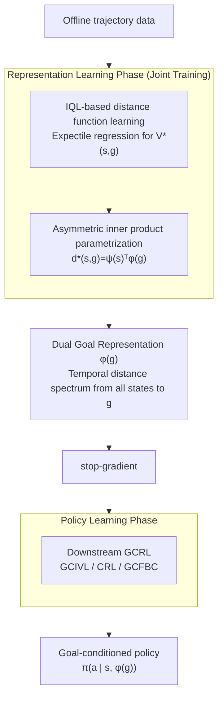

# Dual Goal Representations

**Conference**: ICLR 2026  
**arXiv**: [2510.06714](https://arxiv.org/abs/2510.06714)  
**Code**: None  
**Area**: Reinforcement Learning / Goal-Conditioned RL  
**Keywords**: goal-conditioned RL, dual goal representation, temporal distance, asymmetric inner product parametrization, OGBench

## TL;DR

The paper proposes "dual goal representations," which encode goals using the set of temporal distances from all states to the target state. The authors provide theoretical proof that this representation is sufficient for optimal policy recovery and naturally filters exogenous noise. A practical learning algorithm based on asymmetric inner product parametrization is designed, consistently improving the performance of three mainstream offline GCRL methods as a plug-and-play module across 20 OGBench tasks.

## Background & Motivation

**Background**: Goal-conditioned reinforcement learning (GCRL) requires agents to learn to reach any target state from any arbitrary state. Existing methods typically input raw state observations (e.g., pixel images, joint angle vectors) directly as goals into the policy network or use metric learning methods (TCN, VIP, HILP, etc.) to learn an embedding space where distances are measured using the L2 norm.

**Limitations of Prior Work**: Raw observations contain substantial information irrelevant to "how to reach the goal"—such as background textures, lighting changes, and positions of irrelevant objects—known as exogenous noise. While existing metric learning methods learn state embeddings, L2 norm parametrization has structural limitations: it is inherently symmetric ($\|f(s)-f(g)\| = \|f(g)-f(s)\|$), whereas real-world temporal distances are often asymmetric (e.g., "dropping a block" is much faster than "picking it up"). Furthermore, the L2 norm is constrained by the triangle inequality, limiting its expressivity as a universal approximator for true temporal distance functions.

**Key Challenge**: Existing goal representations are either redundant (raw observations with noise) or limited by the expressivity of their parametrization (L2 metrics are not universal approximators). There is a lack of a goal representation learning framework that is both theoretically grounded and practically effective.

**Goal**: (1) Formally define what constitutes a "good goal representation" and provide theoretical guarantees; (2) Design a more expressive parametrization for practical representation learning; (3) Enable the representation learning module to be integrated into any existing GCRL algorithm.

**Key Insight**: The authors observe that if the distributions of temporal distances from all other states to two goal states are identical, those two goals are equivalent in terms of "reachability," regardless of their raw observations. This naturally leads to a "dual" perspective: instead of directly encoding the features of the goal itself, the goal is characterized indirectly through its relationship with all states.

**Core Idea**: Use the "set of temporal distances from all states to the target" as the goal representation. This representation is theoretically sufficient for optimal policy recovery and invariant to exogenous noise, and it is efficiently learned via asymmetric inner product parametrization in practice.

## Method

### Overall Architecture

The method consists of two stages trained in parallel. **Phase 1 (Representation Learning)**: Using offline trajectory data, a parametrized distance function $d^*(s,g) \approx \psi(s)^\top \phi(g)$ is trained via goal-conditioned Implicit Q-Learning (IQL), where $\psi$ is the state encoder and $\phi$ is the goal encoder. This asymmetric inner product form serves as both the learning objective and the representation carrier; the goal encoder output $\phi(g)$ is extracted as the "dual goal representation." **Phase 2 (Policy Learning)**: The representation $\phi(g)$ is treated as a compressed goal representation (with gradients truncated) and fed into downstream GCRL algorithms (e.g., GCIVL, CRL, GCFBC) to train the policy $\pi(a|s, \phi(g))$. The two phases share the same data and undergo joint gradient updates (rather than pre-training followed by fine-tuning), with state-based tasks trained for 1M steps.

### Key Designs

**1. Dual Goal Representation: Replacing features with a "distance spectrum"**

Traditional representations encode the features of the state—"what is at this location"—inevitably incorporating background, textures, and irrelevant objects. The dual representation shifts the perspective: it does not ask what goal $g$ looks like, but rather "how far it is from every state in the environment." Formally, the dual representation of $g$ is defined as $\phi^\vee(g) = [d^*(s_1,g), d^*(s_2,g), \dots, d^*(s_K,g)]^\top$, which is the vector of optimal temporal distances from $K$ reference states to $g$. In a finite MDP, this corresponds to a column of the distance matrix. This definition naturally preserves only control-relevant information; two goals with different observations are equivalent if their distance spectra are identical, effectively filtering out exogenous noise. In continuous spaces, the distances are implicitly encoded into $\phi(g)$ via the parametrization $\psi(s)^\top\phi(g)$.

**2. Asymmetric Inner Product Parametrization: The universal approximator**

The choice of function form to fit $d^*(s,g)$ determines the representation's upper bound. This paper models $d^*(s,g)$ as $\psi(s)^\top\phi(g)$, where the state encoder $\psi$ and goal encoder $\phi$ are independent and map inputs to $N$-dimensional vectors. The authors compare four forms: (1) Symmetric L2 $\|\phi(s)-\phi(g)\|$, (2) Asymmetric L2 $\|\psi(s)-\phi(g)\|$, (3) Symmetric inner product $\phi(s)^\top\phi(g)$, and (4) Asymmetric inner product $\psi(s)^\top\phi(g)$. Since real temporal distances are asymmetric ($d^*(s,g) \neq d^*(g,s)$), symmetric forms (1) and (3) are ruled out. The L2 norm (2) is constrained by the triangle inequality. Only (4) is a universal approximator; as established in METRA, for a sufficiently large $N$, it can approximate any continuous function with arbitrary precision.

**3. IQL-based Distance Function Learning: Estimating distance as an optimal value function**

The distances are learned from offline trajectories by equating the temporal distance $d^*(s,g)$ to the negative optimal value function $-V^*(s,g)$. Implicit Q-Learning (IQL) is used to approximate this value. IQL utilizes expectile regression to estimate the optimal value function from offline data without querying unseen $(s,a)$ pairs, avoiding the extrapolation issues typical in offline RL. The dot product $\psi(s)^\top\phi(g)$ directly outputs the distance estimate. IQL is theoretically justified as it can accurately recover $V^*$ when the expectile $\tau \to 1$ and data coverage is sufficient.

### Loss & Training

Standard IQL losses are used: expectile regression for the value function $V$, TD loss for the Q-function, and advantage-weighted regression for the policy. The distance function is parametrized as the bilinear form $\psi(s)^\top\phi(g)$. Gradients are truncated (stop-gradient) when passing $\phi(g)$ to the downstream GCRL algorithm; thus, the downstream policy $\pi(a|s,\phi(g))$ does not backpropagate through $\phi$. This is because policy learning requires more detailed state information than the goal representation provides (e.g., in antmaze, the goal representation only needs to encode x-y coordinates, but the policy needs full joint angles).

## Key Experimental Results

### Main Results

Experiments were conducted on 20 tasks from the OGBench suite (13 state-based and 7 pixel-based). The Dual representation was combined with three downstream GCRL algorithms (GCIVL, CRL, GCFBC) and compared against baselines: Original representation, TCN, VIP, and HILP.

| Method | Downstream Algorithm | State-based (13 tasks) Avg | Pixel-based (7 tasks) Avg | Features |
|------|---------|---------------------------|--------------------------|------|
| Original (No Rep) | GCIVL / CRL / GCFBC | Baseline | Baseline (Early fusion available) | No representation bottleneck |
| TCN | GCIVL / CRL / GCFBC | Medium | Medium | Symmetric L2 |
| VIP | GCIVL / CRL / GCFBC | Medium | Medium | Symmetric L2 |
| HILP | GCIVL / CRL / GCFBC | Good | Medium | Symmetric L2 |
| **Dual (Ours)** | GCIVL / CRL / GCFBC | **Best or tied** | **Best on most tasks** | Asymmetric inner product, universal |

In state-based tasks, the Dual representation achieved superior or comparable performance. In pixel-based tasks, it was also optimal in most cases, though all representation learning methods struggled on visual puzzle tasks. This is because these methods use late fusion (encoding $s$ and $g$ separately), whereas the Original baseline can use early fusion (concatenation before encoding), which is necessary for precise pixel-level alignment in puzzles.

### Ablation Study: Comparison of Parametrizations

The authors compared four parametrization forms on 13 state-based tasks, measuring average performance and distance function accuracy (using a monolithic $V(s,g)$ as an "oracle" to calculate MSE):

| Parametrization Form | Universality | Distance Error (↓) | Avg Performance (↑) | Description |
|-----------|--------|-------------|-------------|------|
| (1) Symmetric L2 $\|\phi(s)-\phi(g)\|$ | ✗ | Medium | Medium | Cannot model asymmetry; triangle inequality constraint |
| (2) Asymmetric L2 $\|\psi(s)-\phi(g)\|$ | ✗ | Medium | Medium | Still constrained by norm structure |
| (3) Symmetric Inner Product $\phi(s)^\top\phi(g)$ | ✗ | Highest | Lowest | Forces $d(s,g)=d(g,s)$; worst performance |
| **(4) Asymmetric Inner Product $\psi(s)^\top\phi(g)$** | **✓** | **Lowest** | **Highest** | No structural constraints; highest expressivity |

Key Finding: The ranking of distance errors (3) > (1) ≈ (2) > (4) aligns perfectly with the performance ranking, confirming the causal chain: "More accurate distance estimation → Better goal representation → Better policy performance."

### Key Findings

- **Plug-and-play Capability**: Dual representations improve results for all three GCRL algorithms tested, demonstrating universality.
- **Asymmetry is Essential**: Symmetric parametrizations (whether L2 or inner product) significantly underperform compared to the asymmetric inner product, consistent with the asymmetric nature of temporal distances (e.g., varying movement difficulty in antmaze).
- **Representation $\neq$ Control**: While $\phi(g)$ is an effective goal representation, extracting a policy directly from $\psi(s)^\top\phi(g)$ yields poor results, as policy learning requires richer state information.
- **Scaling Behavior**: Inner product parametrizations benefit from increasing the dimension $N$, whereas metric-based parametrizations hit a performance ceiling due to structural constraints.

## Highlights & Insights

- The **"defining entity through relationship"** dual perspective is researchers: it encodes "how far it is from where" rather than what the goal is. This relationship-based representation naturally preserves control-relevant information and filters out dynamics-irrelevant exogenous noise.
- The proof of **universality of asymmetric inner products vs. the limitations of metrics** is a core technical contribution. The authors construct formal counter-examples showing that L2 norms (including asymmetric variants) are not universal approximators, providing a rigorous basis for parametrization selection.
- The conclusion that **"representation is sufficient to recover policy, but insufficient to directly extract policy"** is insightful: sufficiency is information-theoretic, whereas practical policy extraction requires the parametrization to have high enough functional approximation precision for argmax operations.

## Limitations & Future Work

- **Theory-Practice Gap**: Theorems on invariance and sufficiency assume an ideal infinite-dimensional dual representation, which does not strictly hold for the finite-dimensional $\phi(g)$ used in practice.
- **Weak Noise Robustness Setup**: Theory is based on the Ex-BCMP model, but experiments only used Gaussian noise. Structured interference (e.g., moving irrelevant objects or changing textures) would be more convincing.
- **Early vs. Late Fusion in Pixel Tasks**: Representation methods use late fusion, which may be inherently disadvantaged compared to the early fusion used by the raw observation baseline in tasks requiring pixel-level alignment.
- **Offline Only**: The framework relies on offline trajectories; efficiency in online learning scenarios remains untested.
- **Lack of Real Robot Experiments**: Evaluations are limited to the simulated OGBench environment.

## Related Work & Insights

- **vs. TCN/VIP/HILP**: These also learn embeddings for GCRL but use symmetric L2 norms. Dual representations differ by (1) learning only a goal encoder $\phi(g)$, (2) using a universal inner product form, and (3) having theoretical guarantees for invariance and sufficiency.
- **vs. Quasimetric RL (QRL)**: QRL learns asymmetric distances but uses parametrizations satisfying the triangle inequality. The dual representation sacrifices the triangle inequality for universality, which experiments show is a beneficial trade-off.
- **vs. Contrastive RL (CRL)**: CRL uses contrastive objectives; the dual representation can be stacked on top of CRL for further improvements.

## Rating

- Novelty: ⭐⭐⭐⭐ Combination of dual perspective and universality proof is novel, though implementation resembles existing metric learning.
- Experimental Thoroughness: ⭐⭐⭐⭐ 20 tasks and 3 algorithms, but lacks complex noise tests and real-world robots.
- Writing Quality: ⭐⭐⭐⭐ Clear connection between theory and practice, though some implementation details were clarified post-review.
- Value: ⭐⭐⭐⭐ Plug-and-play module provides direct utility to the GCRL community.

<!-- RELATED:START -->

## Related Papers

- [\[ICLR 2026\] Multistep Quasimetric Learning for Scalable Goal-Conditioned Reinforcement Learning](scaling_goal-conditioned_reinforcement_learning_with_multistep_quasimetric_dista.md)
- [\[ICLR 2026\] Goal Reaching with Eikonal-Constrained Hierarchical Quasimetric Reinforcement Learning](goal_reaching_with_eikonal-constrained_hierarchical_quasimetric_reinforcement_le.md)
- [\[ICLR 2026\] Inter-Agent Relative Representations for Multi-Agent Option Discovery](inter-agent_relative_representations_for_multi-agent_option_discovery.md)
- [\[ICLR 2026\] Wavelet Predictive Representations for Non-Stationary Reinforcement Learning](wavelet_predictive_representations_for_non-stationary_reinforcement_learning.md)
- [\[ICLR 2026\] Primal-Dual Policy Optimization for Linear CMDPs with Adversarial Losses](primal-dual_policy_optimization_for_linear_cmdps_with_adversarial_losses.md)

<!-- RELATED:END -->
