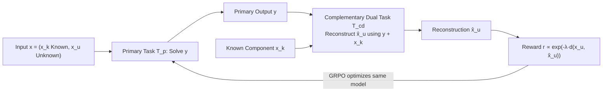

# DuPO: Enabling Reliable Self-Verification via Dual Preference Optimization

**Conference**: ICLR 2026  
**OpenReview**: [https://openreview.net/forum?id=SD8Z231C45](https://openreview.net/forum?id=SD8Z231C45)  
**Code**: TBD  
**Area**: Reinforcement Learning / LLM Self-Supervised Optimization  
**Keywords**: Dual Learning, Preference Optimization, Self-Supervised Rewards, Unlabeled RL, Self-Verification, GRPO  

## TL;DR
DuPO relaxes traditional dual learning from "strictly reversible task pairs" to "complementary dependency relationships"—allowing the dual task to reconstruct only an **unknown component** of the input from the primary task output. By using reconstruction consistency as a self-supervised reward, it achieves RL optimization without any labels for irreversible tasks like mathematical reasoning and multilingual translation.

## Background & Motivation

**Background**: Currently, enhancing LLM capabilities primarily follows two RL paths. RLHF aligns with human preferences, but manual labeling is expensive and inconsistent. RLVR (Reinforcement Learning from Verifiable Rewards) solves objective tasks like math and code using binary correctness rewards, significantly reducing the labeling burden and serving as the core training paradigm for reasoning models like DeepSeek-R1.

**Limitations of Prior Work**: RLVR still relies on external supervision—obtaining "verifiable answers" is itself a bottleneck, limiting scalability. Furthermore, it struggles with generative tasks (e.g., translation) because a single reference translation cannot cover diverse high-quality outputs. Efforts like RLAIF and Constitutional AI merely shift the dependency from "human labels" to a "teacher model or rules" without addressing the core bottleneck.

**Key Challenge**: Dual learning (He et al., 2016) could provide a self-supervised alternative through cycle consistency between primary and dual tasks (e.g., translation and back-translation) without external labels. However, applying it to LLMs faces two major issues: ① **Irreversible tasks lack duality**—the output of a math problem (e.g., the number 8) is insufficient to uniquely reconstruct the input problem, causing the dual loop to break. ② **Asymmetric capability**—LLMs vary in proficiency between primary and dual tasks (e.g., good at solving problems but poor at generating problems from answers), and noisy signals from weak dual tasks can contaminate optimization.

**Goal**: Design a "relaxed duality" framework applicable to general tasks that preserves the advantages of self-supervision and label-free learning while bypassing the hurdles of irreversibility and capability asymmetry.

**Core Idea** (**Generalized Duality**): No longer require the dual task to reconstruct the **entire input** $x$. Instead, the input is decomposed into a **known component** $x_k$ and an **unknown component** $x_u$. The dual task only needs to reconstruct $x_u$ using the primary output $y$ and the known $x_k$. This relaxation simultaneously fixes the information flow breakage (task asymmetry) and the excessive difficulty on the dual end (capability asymmetry).

## Method

### Overall Architecture
DuPO views any task as conditional generation $\pi_\theta(y\mid x)$. For each input $x$, it first separates the known component $x_k$ and the deliberately "emptied" unknown component $x_u$. The primary task produces $y=T_p(x)$ normally. The complementary dual task $T_{cd}:(y,x_k)\mapsto \hat{x}_u$ attempts to reconstruct $x_u$. Higher reconstruction accuracy indicates more reliable primary output $y$. This reconstruction consistency is converted into a self-supervised reward to optimize the same model using GRPO. The entire pipeline uses a single LLM to play both primary and dual roles without any external labels.

### Key Designs

**1. Generalized Dual Reward: Replacing "Entire Input Reconstruction" with "Unknown Component Reconstruction".** This is the root of DuPO and the key to generalizing from reversible tasks (like translation) to irreversible tasks (like math). Traditional duality requires the primary output $y$ to fully encode the input $x$, but $8$ cannot uniquely map back to "How many balls are there if there are 3 red and 5 blue?". DuPO decomposes the input space into disjoint subspaces $X = X_k \times X_u$, requiring only complementary consistency $d\big(x_u, T_{cd}(y, x_k)\big)\le \epsilon$. The reward is formulated as:
$$r(x,y)\propto \exp\big(-\lambda\cdot d(x_u, T_{cd}(y,x_k))\big),$$
where $\lambda>0$ controls sensitivity to reconstruction error. For example, in "sum of two numbers $C=A+B$", if $A$ is $x_k$ and $B$ is $x_u$, the dual task is $B'=C-A$. The reward degenerates into an indicator function $r\propto\exp(-\lambda\cdot \mathbb{I}(B\neq B'))$—maximizing reward when $B=B'$. Here, $x_k$ acts as a strong contextual anchor, strictly constraining the reconstruction solution space so that even a weaker dual capability can provide reliable signals.

**2. Unknown Component Selection strategy: Making the dual task "both answerable and verifiable."** Simply splitting is not enough—which component to empty determines the task difficulty and the signal-to-noise ratio. DuPO uses an auxiliary LLM (Qwen3-4B-Instruct) to select $x_u$ based on two principles: **Answerability of the dual problem** (ensuring the dual task can indeed be solved) and **Uniqueness of correct completion** (ensuring $x_u$ is unique given $y$ and $x_k$ to avoid false negative penalties from "multiple solutions"). This filtering brings the initial dual accuracy in math training to a reasonable level of 52.6%. As the primary task strengthens, more dual problems are solved, continuously "unlocking" reward signals. Ablations show that removing this selection causes a drop of 3.6/5.4 points for 1.5B/4B models respectively.

**3. Task-Specific Distance Metrics + Single Model Dual Roles + GRPO.** DuPO does not lock the reward format: translation uses BLEU scores for back-translation consistency, while math uses variable equality for binary rewards. The optimization objective is to maximize the expected dual reward $J(\theta)=\mathbb{E}_{y\sim\pi_\theta(y\mid x)}[r(x,y)]$. The framework is compatible with PPO and REINFORCE++, but uses GRPO for efficiency. Both roles are instantiated by the **same** $\pi_\theta$—this leverages the broad pre-trained capabilities of the LLM and allows the model's own output to serve as feedback for self-improvement, resolving capability asymmetry more effectively than independent models.

## Key Experimental Results

### Main Results

Multilingual Translation (756 directions / 28 languages, Seed-X-7B-Instruct backbone):

| Model | BLEU | COMET | BLEURT | Avg. |
|---|---|---|---|---|
| Qwen3-235B-22B | 28.4 | 88.8 | 73.9 | 63.7 |
| DeepSeek-R1-0528 | 30.2 | 89.2 | 75.0 | 64.8 |
| Seed-X-7B-Instruct | 28.8 | 87.0 | 72.6 | 62.8 |
| **w/ DuPO (Ours)** | **30.3** | **89.1** | **74.6** | **64.7** |

The 7B model + DuPO gained +1.5/+2.1/+2.0 across three metrics, rivaling or exceeding SOTA closed-source systems. In human evaluation (Seed-X-Challenge), it matched GPT-4o and DeepSeek-R1 and significantly outperformed Google Translate.

Mathematical Reasoning (4 competition-level benchmarks, Avg@32):

| Model | AMC23 | AIME24 | AIME25 | HMMT | Avg. |
|---|---|---|---|---|---|
| DeepSeek-R1-Distill-Qwen-1.5B | 67.5 | 20.0 | 20.0 | 13.3 | 30.2 |
| **w/ DuPO** | 72.5 | 30.0 | 26.7 | 16.7 | **36.5 (+6.3)** |
| Qwen3-4B | 95.0 | 70.0 | 66.7 | 40.0 | 67.9 |
| **w/ DuPO** | 97.5 | 83.3 | 70.0 | 46.7 | **74.4 (+6.5)** |
| OpenReasoning-Nemotron-7B | 95.0 | 83.3 | 73.3 | 56.7 | 77.1 |
| **w/ DuPO** | 97.5 | 83.3 | 90.0 | 66.7 | **84.4 (+7.3)** |

Improvements were observed across all scales, with Qwen3-4B+DuPO surpassing DeepSeek-R1-0120.

### Ablation Study

Cross-Architecture Robustness (Llama series, AMC23 / MATH500):

| Model | AMC23 | MATH500 | Avg. |
|---|---|---|---|
| LlaMA-3.1-8B | 2.5 | 13.6 | 8.1 |
| w/ SimpleRL-Zoo (using oracle labels) | 15.0 | 23.0 | 19.0 |
| **w/ DuPO (Unlabeled)** | 20.0 | 44.2 | **32.1** |
| OctoThinker-8B-Hybrid-Base | 5.0 | 42.6 | 23.8 |
| **w/ DuPO** | 55.0 | 70.0 | **62.5** |

Unlabeled DuPO outperformed SimpleRL-Zoo which uses ground-truth labels (+13.1). Ablation for the unknown component selection strategy is noted above.

### Key Findings
- **Approaching Oracle Upper Bound**: DuPO closely matches Oracle-RLVR throughout training; at step 600, their accuracies nearly overlap (≈35%), showing self-verification rewards are nearly as accurate as ground-truth supervision.
- **Activating Base Model Reasoning**: Training directly on base models (no SFT) increased Forward Acc from 15.2% to 56.5% and AMC23 from 20% to 70%, proving DuPO can activate latent reasoning from scratch.
- **Inference-Time Reranking without Training**: Using dual consistency (Backward Acc) as a scorer for reranking improved Qwen3-4B on AIME by +9.3 (77.7%, surpassing DeepSeek-R1/Claude-Sonnet 4) and the 1.5B model by +18.7, trading compute for accuracy.

## Highlights & Insights
- **Redefining "Duality"**: Relaxing "must be reversible" to "complementary dependence" addresses the core reason dual learning failed to scale to LLMs. The concept is simple yet broadens applicability significantly.
- **Known Components as Anchors**: This clever design solves both "reconstruction uniqueness" and "dual task difficulty," serving as the pivot for stable convergence.
- **Dual Use for Training and Inference**: The same dual reward drives RL training and acts as a zero-cost inference reranker, offering high reuse and flexibility.
- **True Unlabeled Learning**: Achieving performance comparable to oracles in math (an RLVR strength) and remaining effective in translation (an RLVR weakness) validates the potential of self-supervised rewards as a universal paradigm.

## Limitations & Future Work
- **Dependency on Component Selection**: The strategy uses an additional LLM; the quality of $x_u$ selection determines the reward signal-to-noise ratio. How to stably select $x_u$ for complex, open-ended tasks (e.g., long-form writing, dialogue) remains an open question.
- **Limited Task Validation**: Validated only on translation and math; claims for code generation and dialogue remain to be empirically proven.
- **Dual Task Capability Ceiling**: If the primary task is extremely strong but the dual task is inherently weak, rewards may still be distorted despite $x_k$ anchors. The framework alleviates but does not eradicate asymmetry.
- **Decomposition Granularity and Metric Design**: Currently relies on manual/heuristic designs (BLEU, variable equality); lacks an automated, universal distance metric for new tasks.

## Related Work & Insights
- **Dual Learning Lineage**: Derived from dual learning (He et al., 2016) and back-translation (Sennrich et al., 2015), DuPO is the first systematic transfer of this "relaxed" idea to general LLM optimization.
- **Complementing RLVR**: Compared to DeepSeek-R1 or DAPO which rely on verifiable answers, DuPO provides a path to reliable rewards without labels, performing equivalently to Oracle-RLVR in experiments.
- **Reflections on RLAIF/Constitutional AI**: The paper notes these methods shift dependencies rather than eliminating them, prompting thought on whether self-supervised signals can truly reach a closed loop.
- **Insight**: Transforming "difficult-to-verify tasks" into "locally reconstructible sub-problems" is a general reward engineering strategy, applicable to any field where "partial inverse mapping" can be defined; this is a valuable first step toward pushing self-verification to open-ended tasks.

## Rating
- **Novelty**: ⭐⭐⭐⭐⭐ Relaxing duality to "complementary dependence" directly targets the core obstacle for dual learning in LLMs.
- **Experimental Thoroughness**: ⭐⭐⭐⭐ Covers translation/math, scales 1.5B~8B, multiple architectures, and both training/inference use cases with oracle comparisons; however, lacks empirical evidence for code/dialogue.
- **Writing Quality**: ⭐⭐⭐⭐ Clear logic chain (Motivation—Challenge—Method); definitions and examples (summation) are thorough with ample support from formulas and charts.
- **Value**: ⭐⭐⭐⭐⭐ Provides a scalable, unlabeled, cross-task LLM optimization paradigm with practical significance for reducing labeling dependency.

<!-- RELATED:START -->

## Related Papers

- [\[ICLR 2026\] Group Verification-based Policy Optimization for Interactive Coding Agents](group_verification-based_policy_optimization_for_interactive_coding_agents.md)
- [\[ICLR 2026\] Offline Preference-based Value Optimization](offline_preference-based_value_optimization.md)
- [\[ICLR 2026\] FAPO: Flawed-Aware Policy Optimization for Efficient and Reliable Reasoning](fapo_flawed-aware_policy_optimization_for_efficient_and_reliable_reasoning.md)
- [\[ICLR 2026\] Preference-based Policy Optimization from Sparse-reward Offline Dataset](preference-based_policy_optimization_from_sparse-reward_offline_dataset.md)
- [\[ICLR 2026\] Primal-Dual Policy Optimization for Linear CMDPs with Adversarial Losses](primal-dual_policy_optimization_for_linear_cmdps_with_adversarial_losses.md)

<!-- RELATED:END -->
