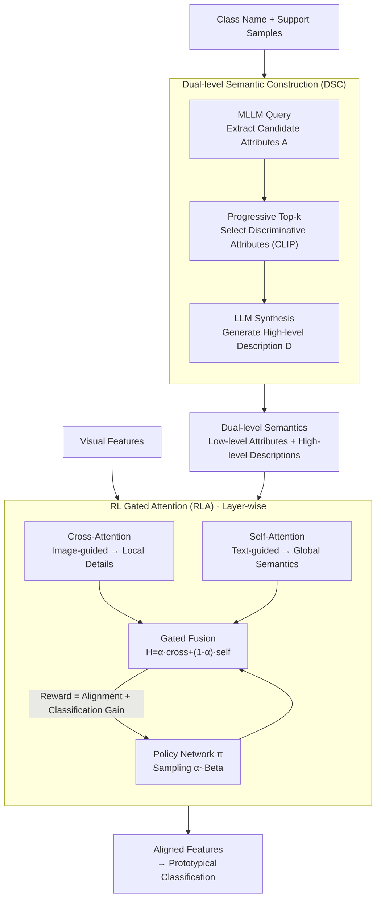

# DVLA-RL: Dual-Level Vision-Language Alignment with Reinforcement Learning Gating for Few-Shot Learning

**Conference**: ICLR 2026  
**arXiv**: [2602.00795](https://arxiv.org/abs/2602.00795)  
**Code**: None  
**Area**: Reinforcement Learning  
**Keywords**: Few-Shot Learning, Vision-Language Alignment, RL Gating, Dual-Level Semantics, Cross-Modal Fusion

## TL;DR

Ours proposes the DVLA-RL framework, which generates complementary low-level attributes and high-level descriptions through Dual-level Semantic Construction (DSC). It utilizes RL-based Gated Attention (RLA) to dynamically balance the contributions of self-attention and cross-attention across different network layers, achieving hierarchical vision-language alignment from low-level to high-level features and reaching SOTA on 9 few-shot learning benchmarks.

## Background & Motivation

Few-shot learning (FSL) aims to generalize to new categories using only a few samples. Current semantic-based FSL methods leverage LLM-generated text semantics to enhance visual representations, but suffer from two critical deficiencies:

**Single-level Semantic Limitations**: Existing methods utilize either only high-level descriptions (e.g., SemFew generating class descriptions) or only low-level attributes (e.g., ECER generating specific entities), failing to provide both fine-grained discrimination and holistic category understanding.

**Static Fusion Modules**: Existing methods use fixed MLP structures to fuse cross-modal information, which cannot adaptively adjust vision-language alignment strategies across different network depths—local details should be targeted in shallow layers, while global semantics should be emphasized in deep layers.

**Core Idea**: (1) Construction of complementary dual-level semantics (attributes + descriptions); (2) the first introduction of RL into vision-language alignment for FSL to dynamically gate cross-modal fusion.

## Method

### Overall Architecture

DVLA-RL decomposes few-shot alignment into two steps: "Semantic Preparation" and "Adaptive Fusion." First, Dual-level Semantic Construction (DSC) creates complementary low-level attributes and high-level descriptions for each category. Then, RL-based Gated Attention (RLA) dynamically determines the weighting of cross-attention versus self-attention at each network layer, aligning both shallow local details and deep global semantics with the visual representation.

### Key Designs

**1. Dual-level Semantic Construction (DSC): Equipping a Class with both Fine-grained Attributes and Holistic Descriptions**

Existing methods only capture single-level semantics—SemFew generates high-level class descriptions but loses details distinguishing similar classes, while ECER lists low-level attributes but lacks holistic understanding. DSC completes both through three steps. The first step is attribute extraction: querying a multimodal LLM (Qwen2.5-VL-32B) conditioned on the class name and support samples with the prompt `"What are the key distinguishing attributes of the CLASS in the given image?"` to obtain a candidate attribute set $A = \{a_1, \dots, a_s\}$. Since LLM outputs may contain hallucinations or redundancies, the second step performs Progressive Top-k selection: using `"A photo of a {CLASS}"` as the initial template $T^{(0)}$, each round encodes candidate attributes with the CLIP text encoder and computes cosine similarity $s_j = \cos(T^{(i)}, a_j)$. The most relevant attribute is selected and embedded into the template `"A photo of a {CLASS}, which has {attribute}"` to update $T^{(i)}$. After $k$ iterations, only the most discriminative attributes remain as low-level alignment signals. The third step provides these selected attributes to the LLM to synthesize a fluent scientific description $D_i$ (e.g., "The Komondor is a … dog with massive size and uniquely corded white coat") as complementary high-level semantics. These two levels perfectly match the requirements for shallow layer detail-focus and deep layer global integration.

**2. RL Gated Attention (RLA): Dynamic Layer-wise Balancing of Alignment Paths via Reinforcement Learning**

The issue with static MLP fusion is that shallow and deep layers require different alignment strategies, yet static modules cannot adjust with depth. RLA runs two dual attention paths in parallel per layer: an image-guided path using text to query the image via cross-attention $\hat{H} = \mathrm{Attn}(W^q_\text{text}\bar{H}_\text{text}, W^k_\text{img}\bar{H}_\text{img}, W^v_\text{img}\bar{H}_\text{img})$, focusing on attribute-level local details; and a text-guided path using self-attention within the text $\tilde{H} = \mathrm{Attn}(W^q_\text{text}\bar{H}_\text{text}, W^k_\text{text}\bar{H}_\text{text}, W^v_\text{text}\bar{H}_\text{text})$, emphasizing holistic semantics. The two paths are fused using a stochastic gating coefficient $H = \alpha \hat{H} + (1-\alpha) \tilde{H}$, where $\alpha$ is sampled from a policy network $\alpha \sim \pi_\theta(\cdot|s)$ rather than being a manual constant. The state is formed by concatenating the global pooling of image-text features and their similarity $s = \phi([\mathrm{GAP}(\bar{H}_\text{img}) \,\|\, \mathrm{GAP}(\bar{H}_\text{text}) \,\|\, \cos(\mathrm{GAP}(\bar{H}_\text{img}), \mathrm{GAP}(\bar{H}_\text{text}))])$. The policy outputs a Beta distribution $\pi_\theta(\alpha|s) = \mathrm{Beta}(\kappa\, p_\theta(s), \kappa(1 - p_\theta(s)))$, with $\kappa$ controlling the balance between exploration and certainty. The Beta distribution naturally supports continuous gating in $[0,1]$, making it more suitable for proportional mixing than Bernoulli or Gaussian distributions. Consequently, the model learns to assign larger $\alpha$ in shallow layers (favoring cross-attention) and smaller $\alpha$ in deep layers (favoring self-attention).

### Loss & Training

The RLA policy is driven by a reward considering both alignment quality and classification gain: $R_t = \lambda_\text{sim} \cdot \cos(U \cdot \mathrm{GAP}(H), \mathbf{t}^\star) + \lambda_\text{imp} \cdot (\mathrm{Acc}_t - \mathrm{Acc}_{t-1})$. The first term promotes vision-text alignment via cosine similarity between fused features and CLIP ground-truth text embeddings $\mathbf{t}^\star$. The second term measures the relative accuracy improvement within an episode. The policy is updated using REINFORCE with entropy regularization $\nabla_\theta \mathcal{J} = \mathbb{E}[(R_t - b_t) \nabla_\theta \log \pi_\theta(\alpha|s)] + \tau \nabla_\theta \mathsf{H}(\pi_\theta(\cdot|s))$, where an exponential moving average baseline $b_t$ reduces gradient variance and the entropy term $\mathsf{H}$ prevents premature convergence to a fixed $\alpha$. The total objective combines supervised and RL losses: $\mathcal{L}_\text{total} = \mathcal{L}_\text{sup} + \lambda \mathcal{L}_\text{RL}$, where $\mathcal{L}_\text{sup}$ is the prototypical classifier's cross-entropy. Training comprises two stages: 300-800 epochs of large-scale pre-training followed by 100 epochs of episodic meta-tuning. RL hyperparameters are set to $\kappa=10$, $\lambda_\text{sim}=0.5$, $\lambda_\text{imp}=1.0$, $\lambda=0.1$, and $\tau=0.2$.

## Key Experimental Results

### Main Results: General Few-Shot Classification

| Method | miniImageNet 1-shot | miniImageNet 5-shot | tieredImageNet 1-shot | CIFAR-FS 1-shot |
|------|-------------------|-------------------|---------------------|----------------|
| SemFew (CVPR'24) | 78.94 | 86.49 | 82.37 | 84.34 |
| ECER (AAAI'25) | 81.14 | - | 81.81 | 86.01 |
| CPL (TPAMI'25) | 72.82 | 87.93 | 78.05 | 78.82 |
| **Ours** | **81.69** | **88.25** | **83.02** | **87.18** |

### Main Results: Fine-grained Few-Shot Classification

| Method | CUB 1-shot | CUB 5-shot | Dogs 1-shot | Cars 1-shot |
|------|-----------|-----------|------------|------------|
| SUITED (AAAI'25) | 86.02 | 94.13 | 76.55 | 89.97 |
| BSFA (TCSVT'23) | 86.00 | 92.53 | 69.58 | 88.93 |
| **Ours** | **91.93** | **95.06** | **89.64** | **92.95** |

On fine-grained tasks, Ours exceeds the runner-up by 5.4%-15.3% (1-shot), demonstrating the effectiveness of dual-level semantics in capturing subtle inter-class differences.

### Cross-domain Few-Shot Classification

| Method | CUB 1-shot | Places 1-shot | ChestX 1-shot |
|------|-----------|--------------|--------------|
| MEFP (NeurIPS'24) | 51.55 | 52.06 | 22.82 |
| SVasP (AAAI'25) | 49.49 | 59.07 | 23.23 |
| **Ours** | **67.46** | **69.26** | **23.47** |

In cross-domain scenarios, Ours outperforms the second-best by 15.9% on CUB and 10.2% on Places, showing strong domain transfer capabilities.

### Ablation Study

Ablation experiments verify the necessity of each component:

- Removing DSC (Category template only): 1-shot performance drops by ~3-5%
- Fixed $\alpha$ (No RL gating): Significant performance decline, indicating adaptive fusion is superior to static fusion
- Removing low-level attributes or high-level descriptions: Both lead to performance drops, proving the complementarity of dual-level semantics
- Removing Progressive Top-k: Decreased attribute quality leads to lower performance

### Key Findings

- Shallow RLA tends toward larger $\alpha$ (more cross-attention → focus on attribute details), while deep RLA tends toward smaller $\alpha$ (more self-attention → integrating global semantics)
- The Beta distribution policy exhibits clear adaptive behavior across different episodic tasks

## Highlights & Insights

1. **First introduction of RL to vision-language alignment in FSL**: The Beta distribution policy combined with the REINFORCE algorithm elegantly achieves hierarchical adaptive fusion.
2. **Complementary Dual-level Semantics**: Low-level attributes provide fine-grained discriminative cues, while high-level descriptions provide holistic category understanding; Progressive Top-k effectively suppresses LLM hallucinations.
3. Substantial improvements (5-16%) in fine-grained and cross-domain scenarios indicate that this method is particularly effective for domain transfer and capturing subtle differences.
4. Lightweight design: The RLA module adds few parameters, and the RL training is stable.

## Limitations & Future Work

1. Dependency on LLM (Qwen2.5-VL-32B) for attribute generation increases latency during inference.
2. While attributes and descriptions can be pre-computed, new categories still require LLM inference.
3. Improvement in extreme cross-domain scenarios like ChestX is limited (<1%), showing that vision-language alignment still faces challenges under extreme domain shifts.
4. RL gating hyperparameters like $\kappa$ require tuning on a validation set.

## Related Work & Insights

- Compared to SemFew (high-level only) and ECER (low-level only), the dual-level design of DSC represents a natural unification.
- The RL gating concept can be generalized to any scenario requiring adaptive cross-modal fusion (e.g., VQA, image-text retrieval).
- The Progressive Top-k selection mechanism is applicable to other tasks requiring the filtering of high-quality information from LLM outputs.
- The Beta distribution policy is more suitable for continuous gating in the [0,1] interval compared to Bernoulli or Gaussian distributions.

## Rating

- Novelty: ⭐⭐⭐⭐ (Innovative combination of RL gating and dual-level semantics)
- Experimental Thoroughness: ⭐⭐⭐⭐⭐ (9 benchmarks, 3 scenarios, 20+ baselines)
- Writing Quality: ⭐⭐⭐⭐ (Clear structure, complete formulas)
- Value: ⭐⭐⭐⭐ (Significant SOTA results, good generalization)

<!-- RELATED:START -->

## Related Papers

- [\[ICLR 2026\] Object-Centric World Models from Few-Shot Annotations for Sample-Efficient Reinforcement Learning](object-centric_world_models_from_few-shot_annotations_for_sample-efficient_reinf.md)
- [\[ICLR 2026\] SSVPO: Toward Effective Step-level Credit Assignment for Language Model RL Training](ssvpo_effective_step-level_credit_assignment_for_rl_training_of_language_models.md)
- [\[ACL 2026\] HEALing Entropy Collapse: Enhancing Exploration in Few-Shot RLVR via Hybrid-Domain Entropy Dynamics Alignment](../../ACL2026/reinforcement_learning/healing_entropy_collapse_enhancing_exploration_in_few-shot_rlvr_via_hybrid-domai.md)
- [\[AAAI 2026\] Vision-Language Reasoning for Geolocalization: A Reinforcement Learning Approach](../../AAAI2026/reinforcement_learning/vision-language_reasoning_for_geolocalization_a_reinforcement_learning_approach.md)
- [\[ICLR 2026\] Principled RL for Diffusion LLMs Emerges from a Sequence-Level Perspective](principled_rl_for_diffusion_llms_emerges_from_a_sequence-level_perspective.md)

<!-- RELATED:END -->
