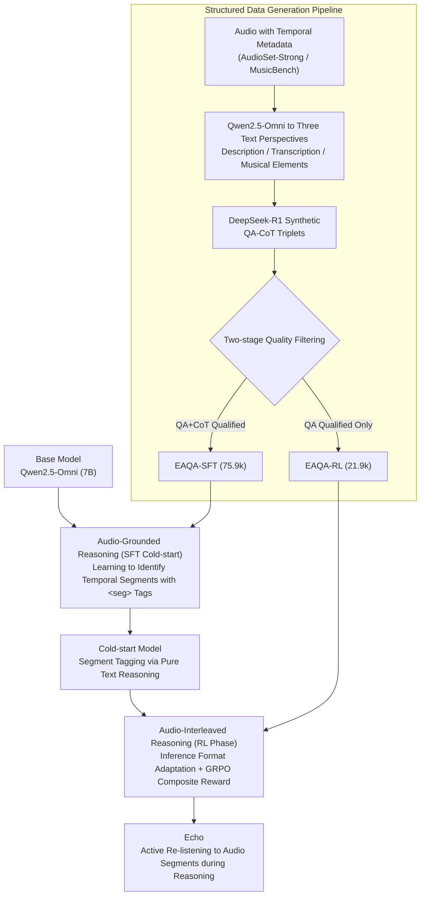

# Echo: Towards Advanced Audio Comprehension via Audio-Interleaved Reasoning

**Conference**: ICLR 2026  
**arXiv**: [2602.11909](https://arxiv.org/abs/2602.11909)  
**Code**: [GitHub](https://github.com/wdqqdw/Echo)  
**Area**: Reinforcement Learning  
**Keywords**: Audio Understanding, Large Audio-Language Models, Audio-Interleaved Reasoning, Reinforcement Learning, Chain-of-Thought

## TL;DR

This paper proposes a new paradigm called audio-interleaved reasoning, where audio is treated as an active component in the reasoning process rather than a static context. This allows Large Audio-Language Models (LALMs) to dynamically locate and re-listen to audio segments during inference. Through a two-stage SFT+RL training framework and a structured data generation pipeline, the Echo model is constructed, surpassing GPT-4o and Gemini-2.0-Flash on both expert-level and general audio understanding benchmarks.

## Background & Motivation

Large Audio-Language Models (LALMs) perform excellently in fundamental audio tasks (speech recognition, sound classification, music analysis), but there remains a significant gap when facing complex audio requiring fine-grained interpretation and reasoning.

The existing reasoning approach—**audio-conditioned text reasoning**—suffers from fundamental information bottlenecks:

1. Audio is converted into context embeddings via one-time encoding, after which reasoning unfolds entirely in the text modality.
2. Audio is a continuous signal carrying richer and more fine-grained information than text; one-time encoding struggles to preserve all subtle details.
3. Experimental evidence: During reasoning, the attention of LALMs on audio tokens drops rapidly to <5% after the first 25 steps.

**Human Cognitive Inspiration**: Human hearing involves cyclic re-listening to key acoustic segments, driven by auditory working memory and top-down attentional control. This paper simulates this mechanism by allowing the LALM to actively re-listen to audio during reasoning.

Core Comparison: Shifting from "thinking about audio" to "**thinking with audio**"—similar to the paradigm shift in the visual reasoning domain from "thinking about images" to "thinking with images."

## Method

### Overall Architecture

The Key Challenge Echo aims to address is that existing LALMs perform reasoning entirely in text after encoding audio into context embeddings once, losing rich acoustic details as attention stops revisiting audio. Echo's Core Idea is to make audio an "active component"—allowing the model to dynamically locate and **re-listen** to key segments during thinking.

The entire pipeline starts from Qwen2.5-Omni (7B) and is transformed in two stages. The first stage (SFT cold-start) utilizes audio-grounded CoT data to fine-tune the model, teaching it to identify temporal intervals using `<seg>start, end</seg>` tags in reasoning text. This results in a cold-start model that can "tag segments" but is still trapped in text-only reasoning. The second stage performs **Inference Format Adaptation**: whenever a pair of `<seg>` tags is decoded, the process pauses, the corresponding audio segment is cropped into tokens and inserted back into the sequence, transforming reasoning into a multi-modal process of alternating text and audio. Reinforcement learning is then used to incentivize the model to learn meaningful repeated listening. High-quality training data for both stages is produced by an automated pipeline: "Audio → Multi-perspective Text → LLM Synthetic QA-CoT," split into SFT and RL sets.

### Key Designs

**1. Audio-Grounded Reasoning (SFT Cold-start): Learning to identify audio segments in text**

Models initialized from Qwen2.5-Omni (7B) naturally tend toward text-only reasoning and do not actively look back at audio. Thus, the first step addresses "identification." Each SFT sample consists of multi-modal inputs $(A, q)$ (audio and question) and golden answers $(c, a)$ (CoT and final answer). The key involves densely embedding `<seg>start, end</seg>` tag pairs in the CoT to reference audio segments—each reference is preceded by a reason for the call and followed by fine-grained analysis based on that segment. This explicitly incorporates "when to look back, where to look, and what to find" into the supervision signal. Training uses standard cross-entropy: $\mathcal{L}_\text{SFT}(\theta) = -\frac{1}{n}\sum_{t=1}^n \log \pi_\theta(y_{i,t}^*|x_i, y_{i,<t}^*)$, producing a cold-start model capable of accurate temporal tagging but still restricted to the text modality.

**2. Audio-Interleaved Reasoning (RL Phase): Turning temporal tags into actual re-listening actions**

The cold-start model only "says" it will look at a segment without actually listening, leaving the information bottleneck intact. Inference Format Adaptation bridges this gap: whenever the model generates a pair of `<seg>` tags, decoding pauses, the corresponding segment $A_{s:e}$ is cropped from the original audio, its tokens are appended to the current text output to form an augmented input $x_i' = (x_i \oplus o \oplus A_{s:e})$, and it is fed back to the model. This cycle continues until `<eos>`, turning reasoning into an interleaved multimodal process where loss calculation ignores inserted audio tokens. To handle these interleaved sequences, a composite reward $\mathcal{R}(\tau) = \mathcal{R}_\text{format} + \mathcal{R}_\text{consist} + \mathcal{R}_\text{acc} + \mathcal{R}_\text{seg}$ guides behavior: $\mathcal{R}_\text{format}=0.5$ for tag usage, $\mathcal{R}_\text{consist}$ penalizes semantic breaks after `</seg>` (deducting 0.1 up to -0.5), $\mathcal{R}_\text{acc}=0.5$ for correct answers, and $\mathcal{R}_\text{seg}=0.5$ is awarded only if the answer is correct **and** at least one segment is referenced. GRPO is used for optimization, with $G=8$ samples per query and group-normalized advantages:

$$\mathcal{L}_\text{RL}(\theta) = -\frac{1}{G}\sum_{g=1}^G \frac{1}{|\tau_g|}\sum_{t=1}^{|\tau_g|} [\min(\rho_{g,t} A_g, \text{clip}(\rho_{g,t}, 1\pm\epsilon) A_g) - \beta D_\text{KL}(\pi_\theta||\pi_\text{ref})]$$

**3. Structured Data Generation Pipeline: Automated CoT generation with `<seg>` tags**

This reasoning depends on high-quality CoTs with "reasons before and analysis after references." Since existing Audio-QA datasets lack difficulty and fine-grained CoTs, and manual labeling is infeasible, synthesis starts from datasets with temporal metadata (AudioSet-Strong, MusicBench). Qwen2.5-Omni translates each audio into three text perspectives (descriptions, transcriptions, musical elements). These are fed to DeepSeek-R1 to synthesize QA-CoT triplets requiring fine-grained temporal analysis. After two-stage filtering, the EAQA-SFT (75.9k with CoT) and EAQA-RL (21.9k without CoT) sets are produced.

## Key Experimental Results

### Main Results: MMAR Expert-level Audio Reasoning

| Model | Size | Sound | Music | Speech | Multi-modal Avg | Total Avg |
|------|------|-------|-------|--------|-----------|--------|
| Qwen2.5-Omni | 7B | 58.79 | 40.78 | 59.86 | ~58 | 57.33 |
| GPT-4o-Audio | - | 53.94 | 50.97 | 70.41 | ~65 | 64.09 |
| Gemini-2.0-Flash | - | 61.21 | 50.97 | 72.11 | ~70 | 67.90 |
| Audio-Thinker | 7B | 68.48 | 53.88 | 64.29 | ~70 | 67.25 |
| **Echo** | **7B** | 67.27 | **60.68** | **69.39** | ~71 | **69.99** |

Echo, as a 7B open-source model, surpasses GPT-4o-Audio (+5.9%) and Gemini-2.0-Flash (+2.1%).

### Main Results: MMAU General Audio Understanding

| Model | MMAU-mini Avg | MMAU Avg |
|------|-------------|----------|
| Qwen2.5-Omni (7B) | 71.53 | 71.00 |
| Audio-Thinker (7B) | 78.00 | 75.39 |
| Gemini-2.5-Pro | 71.60 | 69.36 |
| **Echo (7B)** | **80.41** | **76.61** |

Echo exceeds Audio-Thinker by +2.41% on MMAU-mini and +1.22% on MMAU.

### Ablation Study (MMAR Mean Acc.)

| Model | SFT Data | RL Data | Inference Format | Accuracy |
|------|--------|-------|---------|-------|
| Base Model | - | - | Audio-conditioned | 51.80% |
| Cold-Start | EAQA-SFT | - | Audio-grounded | 56.77% |
| Cold-Start | EAQA-SFT | - | Audio-interleaved | 52.26% |
| Echo | EAQA-SFT | EAQA-RL | Audio-interleaved | **69.99%** |
| Direct RL | - | EAQA-RL | Audio-conditioned | 63.15% |

### Key Findings

- **Inference Format Comparison**: Performance scales with the degree of audio participation, while output length and latency remain comparable.
- **Training Dynamics**: During RL, the model stabilizes at ~1.9 references per query, 3.0s average duration, and ~0.1 segment overlap.
- **Segment Coverage**: 99.4% of responses re-listen to at least one segment, and 78.0% re-listen to two or more, with segments uniformly distributed over time.
- **Skill Gains**: Multi-speaker role mapping +37.0%, event-based sound reasoning +20.8%, emotional state summarization +20.5%.
- **Generalization**: Despite SFT data only covering the first 10 seconds, Echo accurately locates segments in longer audio.

## Highlights & Insights

1. **Novelty**: "Thinking with audio" elevates audio from a static context to an active reasoning component.
2. Attention analysis provides direct evidence: Audio-interleaved reasoning increases audio token attention from <5% to 10-14% (Δ+140%).
3. The engineering design for inference format adaptation is simple and effective—merely pausing to insert tokens at `<seg>` tags.
4. The design of $\mathcal{R}_\text{consist}$ and $\mathcal{R}_\text{seg}$ effectively guides the model to learn meaningful re-listening behaviors.

## Limitations & Future Work

1. Current re-listening is basic; advanced operations like slow-motion or frequency isolation could be explored.
2. CoT labels in EAQA-SFT are generated from fixed metadata and lack human heuristics.
3. Limited by the "regurgitation" tendency of DeepSeek-R1, data may lack reasoning diversity.
4. Computational Overhead: Re-processing audio tokens increases latency to ~2.12s (vs. 1.18s baseline).

## Related Work & Insights

- Analogous to vision: Evolution from Multimodal CoT to visual grounding to direct image patch insertion.
- Complementary to Audio-Reasoner (SFT) and Omni-R1 (RL); Echo demonstrates the superiority of the SFT+RL two-stage approach.
- The "Audio → Multi-perspective Text → LLM Synthetic QA-CoT" pipeline is generalizable to other modalities like video.
- The GRPO + multi-component reward design is widely applicable in multi-modal RL.

## Rating

- Novelty: ⭐⭐⭐⭐⭐ (Audio-interleaved reasoning is a fresh paradigm)
- Experimental Thoroughness: ⭐⭐⭐⭐⭐ (3 benchmarks, detailed ablation, training analysis)
- Writing Quality: ⭐⭐⭐⭐⭐ (Clear structure, excellent visuals, deep analysis)
- Value: ⭐⭐⭐⭐⭐ (Opens a new direction for audio understanding with robust evidence)

<!-- RELATED:START -->

## Related Papers

- [\[ICLR 2026\] LoongRL: Reinforcement Learning for Advanced Reasoning over Long Contexts](loongrl_rl_for_reasoning_long_contexts.md)
- [\[ICLR 2026\] LadderSym: A Multimodal Interleaved Transformer for Music Practice Error Detection](laddersym_a_multimodal_interleaved_transformer_for_music_practice_error_detectio.md)
- [\[NeurIPS 2025\] Incentivizing Reasoning for Advanced Instruction-Following of Large Language Models](../../NeurIPS2025/reinforcement_learning/incentivizing_reasoning_for_advanced_instruction-following_of_large_language_mod.md)
- [\[ICLR 2026\] STAIRS-Former: Spatio-Temporal Attention with Interleaved Recursive Structure Transformer for Offline Multi-Task Multi-Agent Reinforcement Learning](stairs-former_spatio-temporal_attention_with_interleaved_recursive_structure_tra.md)
- [\[ICLR 2026\] Reinforcement Learning with Verifiable Rewards Implicitly Incentivizes Correct Reasoning in Base LLMs](reinforcement_learning_with_verifiable_rewards_implicitly_incentivizes_correct_r.md)

<!-- RELATED:END -->
