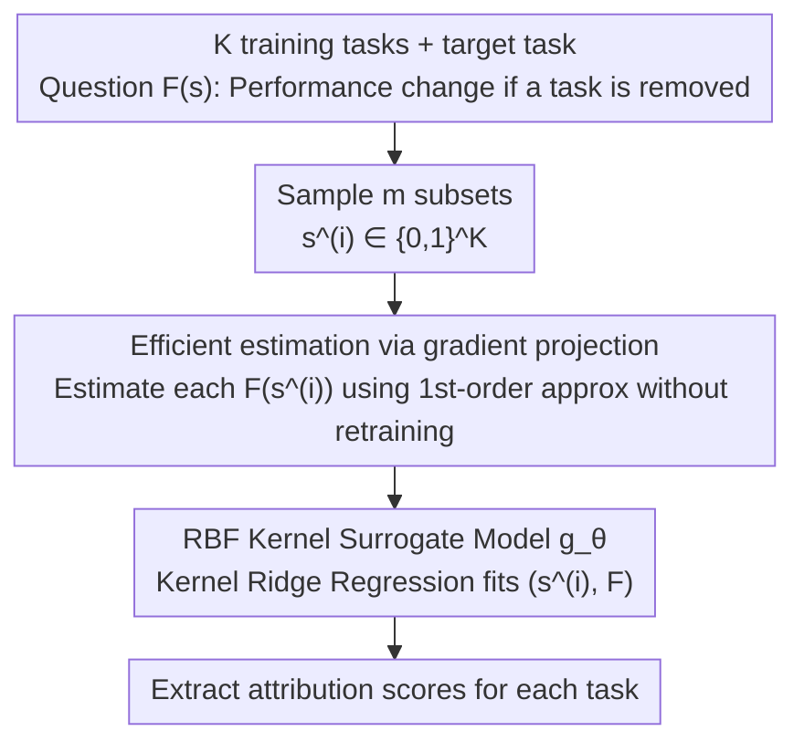

# Efficient Estimation of Kernel Surrogate Models for Task Attribution

**Conference**: ICLR 2026  
**arXiv**: [2602.03783](https://arxiv.org/abs/2602.03783)  
**Code**: [https://github.com/VirtuosoResearch/Kernel-surrogate-models](https://github.com/VirtuosoResearch/Kernel-surrogate-models)  
**Area**: Reinforcement Learning  
**Keywords**: task attribution, kernel surrogate model, influence function, data attribution, kernel ridge regression

## TL;DR
This work proposes Kernel Surrogate Models (KernelSM) for task attribution, utilizing RBF kernel ridge regression to capture non-linear interaction effects between tasks. Combined with an efficient estimation algorithm via gradient projection to avoid redundant training, it achieves a 25% correlation improvement over linear surrogate and influence function baselines in scenarios such as mathematical reasoning, in-context learning, and multi-objective RL.

## Background & Motivation

**Background**: Modern AI systems (e.g., LLMs) are often trained simultaneously on diverse tasks. Quantifying the impact of each training task on a target task (task attribution) is a central problem in interpretability. Existing methods include: Leave-One-Out (LOO) retraining (accurate but computationally infeasible), influence functions (requiring Hessian computation), and linear surrogate models (fitting a linear function via random subset sampling).

**Limitations of Prior Work**: Linear surrogate models can only capture first-order additive effects and fail to represent non-linear interactions—such as synergetic effects (where two tasks trained together perform better than the sum of their individual effects), antagonistic effects, or XOR-type interactions. These interactions are particularly significant among training samples near decision boundaries.

**Key Challenge**: Stronger surrogate models (such as kernel methods) require evaluating model performance $F(\mathbf{s})$ on a larger number of subsets, where each subset traditionally requires a full training run—making the computational cost comparable to LOO.

**Goal**: (1) Provide a unified analysis of the relationship between linear surrogates and influence functions; (2) Design a surrogate model capable of capturing non-linear interactions; (3) Enable efficient estimation while avoiding redundant training.

**Key Insight**: The authors first prove via a second-order Taylor expansion that linear surrogates $\approx$ influence functions (when second-order interactions are small), exposing the inherent limitations of linear surrogates. They then upgrade the surrogate model using RBF kernels and leverage a first-order gradient approximation to avoid repeated training.

**Core Idea**: Efficiently construct a kernel surrogate model using a first-order approximation via gradient projection to capture non-linear task interactions with a relative error of < 2%.

## Method

### Overall Architecture
The core question of task attribution is: how does the performance of a target task change if one of $K$ training tasks is removed? The most precise approach is to retrain the model for every subset and evaluate performance $F(\mathbf{s})$ (where $\mathbf{s} \in \{0,1\}^K$ is a binary indicator vector of participating tasks), but this is equivalent to LOO and computationally infeasible. This work proposes using a surrogate model $g_\theta$ to fit $F$: first sample $m$ subset vectors $\mathbf{s}^{(i)}$, rapidly estimate $F(\mathbf{s}^{(i)})$ for each subset **without retraining by using gradient approximations**, then feed these $(\mathbf{s}^{(i)}, F(\mathbf{s}^{(i)}))$ pairs into an RBF kernel ridge regression $g_\theta: \{0,1\}^K \to \mathbb{R}$. Finally, attribution scores for each task are derived from the fitted kernel model. The key is upgrading the surrogate from linear to kernel-based to capture non-linear interactions while maintaining computational costs similar to linear surrogates.

### Key Designs

**1. Unified Analysis of Linear Surrogates and Influence Functions**

To justify the need for kernels, the authors clarify the limitations of linear surrogates. They perform a second-order Taylor expansion of $F(\mathbf{s})$ at an operating point $\mathbf{s}^*$ and analyze the limit of regression coefficients using the delta method. Proposition 3.1 provides a bias bound between the regression coefficients $\hat{\beta}$ and the first-order gradient plus second-order corrections: $\|\hat{\beta} - \nabla_\mathbf{s} F(\mathbf{s}^*) - \text{correction term}\| \lesssim c_3 K^{3/2} p^{-1}$. This result links the two methods: when second-order interactions (norm of Hessian $\mathbf{H}_\mathbf{s}$) are small, linear surrogate coefficients converge to the first-order gradient, which is exactly what influence functions characterize. Conversely, if $\mathbf{H}_\mathbf{s}$ is non-negligible, both methods fail simultaneously as they are fundamentally first-order.

**2. RBF Kernel Surrogate Model (KernelSM)**

Given that the bottleneck is the first-order nature of prior methods, KernelSM replaces linear regression with kernel ridge regression:

$$g_\theta(\mathbf{s}) = \sum_i \theta_i\, k(\mathbf{s}^{(i)}, \mathbf{s}), \qquad k(\mathbf{s}^{(a)}, \mathbf{s}^{(b)}) = \exp(-\gamma \|\mathbf{s}^{(a)} - \mathbf{s}^{(b)}\|^2)$$

The coefficients have a closed-form solution $\theta = (\mathcal{K} + \lambda I)^{-1} \mathbf{F}$. The RBF kernel is chosen for two reasons: its universal approximation property in binary space $\{0,1\}^K$, which captures synergy, antagonism, and XOR interactions; and its geometric intuition, where the squared Euclidean distance on $\{0,1\}^K$ equals the Hamming distance. This defines a heat kernel where subsets differing by only a few tasks are expected to have similar performance, providing a sound inductive bias.

**3. Efficient Estimation via Gradient Projection**

The challenge lies in obtaining $m$ values of $F(\mathbf{s}^{(i)})$. This work avoids retraining by performing a first-order Taylor expansion of the model at the pre-trained weights $W_0$: $f_W(x) \approx f_{W_0}(x) + \langle \nabla f_{W_0}(x), W - W_0 \rangle$. For each subset $\mathbf{s}^{(i)}$, the projected gradients are treated as features to solve a multinomial logistic regression for the optimal weight perturbation $Z^*_{\mathbf{s}^{(i)}}$, which is substituted back into the expansion to yield the estimate $\hat{f}(x) = f_{W_0}(x) + \langle \nabla f_{W_0}(x), Z^*_{\mathbf{s}^{(i)}} \rangle$. This results in the gradient $\nabla f_{W_0}$ being computed only once at $W_0$, reducing subsequent subset estimations to CPU-based linear algebra. Gaussian random projections are used to map high-dimensional gradients to a lower-dimensional space, allowing the process to complete in seconds with a relative error $< 2\%$.

### Loss & Training
Kernel ridge regression objective: $\min_{g_\theta} \sum_{i=1}^m (F(\mathbf{s}^{(i)}) - g_\theta(\mathbf{s}^{(i)}))^2 + \lambda \|g_\theta\|^2_\mathcal{K}$

The regularization term $\lambda \|g_\theta\|^2_\mathcal{K}$ controls model complexity. Hyperparameters $\lambda$ (regularization strength) and $\gamma$ (RBF bandwidth) are selected via cross-validation.

## Key Experimental Results

### Main Results

| Method | CIFAR-10 Corr.↑ | Modular Arithmetic Corr.↑ | ICL Corr.↑ | Multi-obj RL Corr.↑ |
|------|--------------|-----------|---------|------------|
| Influence Function | ~0.74 | ~0.55 | ~0.72 | ~0.65 |
| Linear Surrogate | ~0.76 | ~0.58 | ~0.75 | ~0.68 |
| **KernelSM** | **~0.82** | **~0.80** | **~0.88** | **~0.73** |

KernelSM improves correlation by approximately 25% over linear baselines (compared against LOO ground truth). The largest gain (42%) is seen in modular arithmetic, where operations like XOR/division exhibit strong non-linear interactions.

### Ablation Study

| Kernel | CIFAR-10 Residual↓ | Modular Arithmetic Residual↓ |
|--------|-------------|-----------|
| Linear | 4.4±0.9 | 4.6±1.3 |
| **RBF** | **1.0±0.0** | **1.5±0.4** |

| Task | First-order Approx Relative Error |
|------|--------------|
| CIFAR-10 | 1.02±0.69% |
| Modular Arithmetic | 2.40±2.17% |
| ICL | 0.51±0.04% |
| Multi-obj RL | 0.43±0.73% |

### Key Findings
- **Ubiquity of Non-linear Interactions**: The residual error of the RBF kernel is 1/4 to 1/3 of the linear model, indicating that task interactions cannot be ignored.
- **Accurate First-order Gradient Approximation**: Across various tasks and model scales (including 34B LLMs), the relative error remains $< 2\%$.
- **Downstream Task Selection Benefits**: Using KernelSM for ICL example selection and task selection in multi-objective optimization reduces loss by 40% compared to linear methods.
- Linear surrogates and influence functions are indeed equivalent under first-order approximation (Pearson correlation 0.96-0.98).

## Highlights & Insights
- **Unified Theory**: Provides a rigorous proof via second-order Taylor expansion for the equivalence conditions of linear surrogates and influence functions, revealing their shared inability to capture task interactions.
- **Efficient Gradient Projection**: Bypasses the computational bottleneck of kernel methods using a first-order Taylor approximation combined with random projections, making the overhead comparable to linear models.
- **Geometric Intuition**: In the binary subset space $\{0,1\}^K$, the RBF kernel acts as a heat kernel based on Hamming distance, implying that similar training subsets should yield similar performance.

## Limitations & Future Work
- The first-order approximation is effective near $W_0$, but its error may increase significantly with large fine-tuning steps (e.g., full fine-tuning of large models).
- The expressivity of the kernel surrogate is limited by the number of samples $m$; scenarios with a very large number of tasks $K$ require more extensive subset sampling.
- Deep kernels or Neural Tangent Kernels (NTK) were not explored.
- The focus remains on task-level attribution; extension to sample-level data attribution was not explicitly tested.

## Related Work & Insights
- **vs DataModels (Ilyas et al. 2022)**: DataModels uses linear regression for data attribution; KernelSM serves as its kernelized generalization.
- **vs Influence Functions (Koh & Liang 2017)**: This work proves influence functions $\approx$ first-order approximations of linear surrogates, whereas KernelSM captures second-order effects.
- **vs TRAK (Park et al. 2023)**: TRAK also utilizes gradient features for data attribution but remains a linear model; KernelSM employs RBF kernels for non-linear modeling.

## Rating
- Novelty: ⭐⭐⭐⭐ The application of kernel methods to task attribution is theoretically grounded and the efficient estimation algorithm is a key contribution.
- Experimental Thoroughness: ⭐⭐⭐⭐⭐ Covers classification, modular arithmetic, ICL, and RL with comprehensive ablations.
- Writing Quality: ⭐⭐⭐⭐ Well-organized, though some proof details are highly condensed.
- Value: ⭐⭐⭐⭐ Provides a more powerful tool for task attribution with significant downstream application results.

<!-- RELATED:START -->

## Related Papers

- [\[ICLR 2026\] Pruning as a Cooperative Game: Surrogate-Assisted Layer Contribution Estimation for Large Language Models](remix_reinforcement_routing_for_mixtures_of_loras_in_llm_finetuning.md)
- [\[ICLR 2026\] One Model for All Tasks: Leveraging Efficient World Models in Multi-Task Planning](one_model_for_all_tasks_leveraging_efficient_world_models_in_multi-task_planning.md)
- [\[ICLR 2026\] Task Tokens: A Flexible Approach to Adapting Behavior Foundation Models](task_tokens_a_flexible_approach_to_adapting_behavior_foundation_models.md)
- [\[ICLR 2026\] Policy Newton Algorithm in Reproducing Kernel Hilbert Space](policy_newton_algorithm_in_reproducing_kernel_hilbert_space.md)
- [\[ICLR 2026\] Mixture-of-World Models: Scaling Multi-Task Reinforcement Learning with Modular Latent Dynamics](mixture-of-world_models_scaling_multi-task_reinforcement_learning_with_modular_l.md)

<!-- RELATED:END -->
