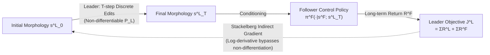

# Efficient Morphology-Control Co-Design via Stackelberg Proximal Policy Optimization

**Conference**: ICLR 2026  
**OpenReview**: [https://openreview.net/forum?id=sJ0vOOkclw](https://openreview.net/forum?id=sJ0vOOkclw)  
**Code**: [https://yanningdai.github.io/stackelberg-ppo-co-design](https://yanningdai.github.io/stackelberg-ppo-co-design)  
**Area**: reinforcement learning  
**Keywords**: morphology-control co-design, Stackelberg Game, implicit differentiation, PPO, bi-level optimization, embodied AI  

## TL;DR
The study reformulates the joint optimization of "robot morphology design + control policy" as a **Phase-Separated Stackelberg Game** (where morphology acts as the leader and control as the follower). It derives Stackelberg policy gradients capable of propagating through "non-differentiable morphology editing interfaces," encapsulated into Stackelberg PPO. This allows morphology updates to actively anticipate how control policies will adapt, resulting in stable training and an average performance improvement of 20.66% over the strongest baseline.

## Background & Motivation
- **Background**: Morphology-control co-design aims to simultaneously optimize an agent's physical structure (topology, geometry, joint layout, actuation limits) and its control policy. The two must be complementary—a rigid leg cannot walk without an appropriate gait, and no motion strategy can save a body lacking necessary joints. This is inherently a **bi-level structure**: the control must dynamically adapt to the morphology to realize its true performance.
- **Limitations of Prior Work**: While mainstream methods (e.g., Transform2Act, BodyGen) acknowledge this bi-level structure, they often **degenerate it into a single-level shared objective** for simplicity, treating the control policy as fixed when optimizing morphology. Consequently, morphology updates utilize only "direct gradients" and discard the term accounting for "how the control will re-adapt," leading to misalignment between morphology updates and optimal control responses, resulting in unstable training and low sample efficiency.
- **Key Challenge**: The morphology space is discrete and subject to combinatorial explosion; morphology editing (adding limbs/deleting joints) constitutes **non-differentiable discrete operations**. Propagating "control adaptation dynamics" back to morphology optimization requires passing through this non-differentiable interface—direct backpropagation (as used in Stackelberg MADDPG) is non-viable here.
- **Goal**: To enable the leader (morphology) to explicitly "anticipate" the follower's (control) best response during updates, without relying on derivatives of non-differentiable interfaces.
- **Core Idea**: **Game-theoretic reformulation**—co-design is modeled as a Phase-Separated Stackelberg Markov Game (leader edits morphology for $T$ steps, then the follower takes over control for the remaining horizon). The **log-derivative trick** is employed to bypass non-differentiable interfaces, deriving a Stackelberg surrogate gradient that can be estimated via sampling, further stabilized by PPO's likelihood-ratio clipping.

## Method

### Overall Architecture
The system is a two-stage, non-differentiable interface leader-follower game. The Leader (morphology policy $\pi^L_{\theta_L}$) uses $T$ steps of discrete editing actions to grow the final morphology $s^L_T$ from an initial structure $s^L_0$. The follower (control policy $\pi^F_{\theta_F}$) takes over conditioned on $s^L_T$, controlling the robot to complete tasks within the defined action/state space. Crucially, the leader's objective $J^L$ includes its own structural editing reward $R^L$ (material cost/design complexity) plus the follower's long-term returns. Thus, the leader gradient must include an indirect term for "improving oneself by influencing the follower." The core work is deriving and stably estimating this indirect term under the phase-separated, non-differentiable setting.

### Key Designs

**1. Asymmetric Objectives + Phase-Separated Stackelberg Modeling: Incorporating "Control Adaptation" into the Leader's Ledger.** Unlike the single-level shared objective $\max_{\theta_L,\theta_F} J_{\text{shared}}$ in existing works, this study sets **asymmetric objectives**: the leader's objective $J^L(\theta_L,\theta_F)=\mathbb{E}[\sum_{t=0}^{T-1}\gamma^t R^L + \sum_{t=T}^{\infty}\gamma^{t-T}R^F]$ is responsible for both structural editing and downstream control performance; the follower's objective $J^F$ focuses solely on maximizing long-term control returns under a fixed morphology. Interaction is defined as a **Phase-Separated SMG**—distinct from classical SMG where leader/follower alternate actions, here the leader acts for $T$ consecutive steps first, followed by the follower, coupled only through the final state $s^L_T$. The leader solves the standard Stackelberg bi-level objective $\max_{\theta_L} J^L(\theta_L, \theta_F^*(\theta_L))$, where the gradient $\nabla_{\theta_L}J^L = \underbrace{\nabla_{\theta_L}J^L}_{\text{Direct}} + \underbrace{(\nabla_{\theta_L}\theta_F^*)^\top \nabla_{\theta_F}J^L}_{\text{Indirect via follower}}$, representing the term omitted by prior methods.

**2. Deriving Sampleable Stackelberg Gradients via Log-derivative to Bypass Non-differentiable Interfaces.** The most difficult part of the indirect term is the cross-derivative $\nabla_{\theta_L}\nabla_{\theta_F}J^F$. Classical approaches require direct derivatives of leader actions, but here the non-differentiable morphology transition $P_L$ blocks backpropagation. Borrowing the **log-derivative (likelihood ratio) trick** from stochastic policy gradients, the authors construct a surrogate $L^F_{L,F}$ (Theorem 1). This expresses the cross-derivative as the expectation of importance-weighted advantage estimates depending only on sampled trajectories, completely bypassing the non-differentiability of $P_L$. The surrogate is proven locally equivalent to the true Stackelberg gradient near the behavior policy. Other first-order derivatives $\nabla_{\theta_L}J^L$ and $\nabla_{\theta_F}J^L$ (Proposition 1) are provided in similar likelihood-ratio + advantage function forms.

**3. Fisher-Approximated Hessian + Identity Regularization to Manage Instability.** The indirect gradient requires the inverse Hessian $(\nabla^2_{\theta_F}J^F)^{-1}$. However, advantage terms often make the raw Hessian **indefinite**, causing numerical instability during inversion. This study substitutes it with the **Fisher Information Matrix**—$F(\theta_F)=\nabla^2_{\theta_F}L^F_{KL}$, which is positive semi-definite and can be estimated via the KL divergence between new and old policies (similar to Natural Policy Gradient/TRPO). A small identity regularization $(\nabla^2_{\theta_F}L^F_{KL}+\lambda I)^{-1}$ is added, where $\lambda$ acts as an interpolator: $\lambda\to\infty$ degenerates to vanilla policy gradient (discarding the Stackelberg term), while $\lambda\to 0$ yields the pure Stackelberg gradient.

**4. PPO Likelihood-Ratio Clipping and Conjugate Gradient for Efficiency.** Since the surrogate is only locally equivalent to the true gradient, large policy updates can invalidate the approximation. The authors adapt **PPO's likelihood-ratio clipping** to the Stackelberg surrogate (emphasizing this is not simple reuse but grounded in the local approximation theory of the new surrogate). This constrains policy shifts and ensures stability. The final Stackelberg gradient $\nabla_{\theta_L}\hat{J}^L = \nabla_{\theta_L}\hat{L}^L_L - \nabla_{\theta_L}\nabla_{\theta_F}\hat{L}^F_{L,F}\,(\nabla^2_{\theta_F}\hat{L}^F_{KL}+\lambda I)^{-1}\nabla_{\theta_F}\hat{L}^L_F$ is computed using **Conjugate Gradient** (requiring only Hessian-vector products via the Pearlmutter method), avoiding the explicit construction of large matrices.

## Key Experimental Results

Environment: MuJoCo morphology-control co-design tasks, including flat-ground tasks (Crawler/Cheetah/Swimmer/Glider/Walker), complex terrain (TerrainCrosser), new step-climbing tasks (Stepper-Regular/Hard), and a contact-rich 3D manipulation task (Pusher). Morphology is a tree structure with constraints on depth, branching, and degrees of freedom. 7 random seeds per method. Baselines are implemented on top of BodyGen.

### Main Results

| Comparison Dimension | Result |
|---|---|
| Avg. Gain over strongest baseline | **+20.66%** |
| Avg. Gain in complex 3D / large design space tasks | **+32.02%** |
| vs. Evolutionary methods (ESS/NGE) | Significantly higher sample efficiency |
| vs. Vanilla gradients without Stackelberg (BodyGen) | Superior sample efficiency and final performance |

Baselines: ESS (Evolutionary Structure Search), NGE (Neural Graph Evolution), Transform2Act (Concurrent RL co-design), BodyGen (Primary baseline, Transformer + Graph-aware positional encoding).

### Ablation Study (on Stepper-Regular)

| Ablation Item | Setting | Key Conclusion |
|---|---|---|
| Regularization $\lambda$ | $\{0,0.5,1,5,10,\infty\}$ | Robust for $\lambda\in[0.5,10]$; performance drops at extremes $\lambda=0$ or $\infty$ (Regularization is necessary) |
| Hessian Calculation | Fisher Approx. vs. Analytical 2nd-order | Fisher ≈6000 vs. Analytical ≈2500; nearly double performance (PSD avoids numerical instability) |
| PPO Clipping $\epsilon$ | Sweep + No-clip | $\epsilon\le 0.4$ maintains stable low KL; removing clipping leads to KL explosion and crashes |

Leader horizon $T$ comparison (Stepper-Regular, Stackelberg PPO vs BodyGen):

| $T$ | Stackelberg PPO | BodyGen |
|---|---|---|
| 3 | 6188.99±681.06 | 3663.06±571.30 |
| 5 | 7215.20±449.02 | 4685.94±645.23 |
| 7 | **8260.74±148.58** | 6879.60±175.41 |
| 9 | 6739.51±631.35 | 3375.11±486.54 |
| 11 | 6874.34±604.42 | 3216.77±657.61 |

### Key Findings
- **Optimal $T \approx 7$**: Longer horizons allow richer morphology editing, but excessively large ones ($T=11$) become harder to optimize, showing slight degradation—though still outperforming $T=3$.
- Increasing $T$ **does not** lead to higher leader gradient variance compared to BodyGen, indicating Stackelberg updates are stable across a wide horizon range.
- The advantage is most pronounced in complex 3D tasks (+32%), where tight coordination between morphology and control is crucial.

## Highlights & Insights
- **Leveraging the bi-level nature of co-design in gradients**: While prior methods were bi-level in name but single-level in practice, this is the **first** application of implicit Stackelberg differentiation to morphology-control co-design under PPO.
- **Elegant bypass of non-differentiable interfaces**: Using the log-derivative to transform cross-derivatives into sampleable likelihood-ratio expectations avoids the dead-end of differentiating discrete morphology transitions.
- **Interpolation via $\lambda$**: A single scalar connects "pure Stackelberg anticipation" and "vanilla policy gradients," providing both theoretical explanation and a practical tuning knob.
- **Theory and Stability Guarantees**: Local equivalence of the surrogate is proven, while Fisher approximation, identity regularization, and PPO clipping ensure engineering feasibility (CG + Pearlmutter avoids large matrices).

## Limitations & Future Work
- **Sim-to-real gap**: Experiments are entirely within MuJoCo. Unmodeled hardware constraints and material dynamics make real-world deployment an open challenge.
- **Horizon sensitivity**: Performance declines if $T$ is too large, suggesting the leader's edit sequence length requires tuning; scalability to larger/variable topology spaces remains to be verified.
- **Hyperparameter complexity**: $\lambda, \epsilon, T$ all require tuning, and while they have robust ranges, the combined search cost is not fully discussed.
- **Simple reward design**: To ensure fair comparison, rewards emphasize forward velocity; it is unknown if Stackelberg anticipation remains robust under more complex/multi-objective tasks.

## Related Work & Insights
- **Morphology-Control Co-design Lineage**: Evolves from early evolutionary strategies (Sims 1994, Cheney 2018) treating co-design as discrete search, to works introducing structural priors (NGE, Dong 2023), and finally to RL methods treating structure generation as MDP sequence editing (Transform2Act, BodyGen). This paper identifies that even RL methods hit a "gradient wall" at discrete interfaces.
- **Stackelberg Games and RL**: Advances from static games to embedding leader-follower structures in sequential decision-making (Stackelberg DDPG/MADDPG). Prior implicit differentiation work focused on DDPG-style explicit action coupling + alternating updates; this work extends it to phase-separated, non-alternating PPO updates where actions are not directly coupled.
- **Inspiration**: Any bi-level problem involving "discrete upper-level decisions + continuous lower-level adaptation" (e.g., NAS + training, task allocation + scheduling) can benefit from this combination of log-derivative bypass, Fisher-stabilized Hessian inversion, and PPO clipping.

## Rating
- **Novelty**: ⭐⭐⭐⭐⭐ First rigorous formulation of phase-separated non-differentiable co-design as a Stackelberg game with sampleable implicit gradients.
- **Experimental Thoroughness**: ⭐⭐⭐⭐ Covers 9 tasks, 4 baselines, and 7 seeds; however, limited to simulation without real-robot verification.
- **Writing Quality**: ⭐⭐⭐⭐ Clear progression from motivation to derivation; however, high mathematical density may be challenging for readers unfamiliar with implicit differentiation.
- **Value**: ⭐⭐⭐⭐ Provides a theoretically grounded optimization framework for co-design with potential transferability to broader bi-level RL problems.

<!-- RELATED:START -->

## Related Papers

- [\[ICLR 2026\] TRACED: Transition-aware Regret Approximation with Co-learnability for Environment Design](traced_transition-aware_regret_approximation_with_co-learnability_for_environmen.md)
- [\[ICLR 2026\] Proximal Supervised Fine-Tuning](proximal_supervised_fine-tuning.md)
- [\[ICLR 2026\] Parameter-Efficient Reinforcement Learning using Prefix Optimization](parameter-efficient_reinforcement_learning_using_prefix_optimization.md)
- [\[ICLR 2026\] Regret-Guided Search Control for Efficient Learning in AlphaZero](regret-guided_search_control_for_efficient_learning_in_alphazero.md)
- [\[ICLR 2026\] Stackelberg Coupling of Online Representation Learning and Reinforcement Learning](stackelberg_coupling_of_online_representation_learning_and_reinforcement_learnin.md)

<!-- RELATED:END -->
