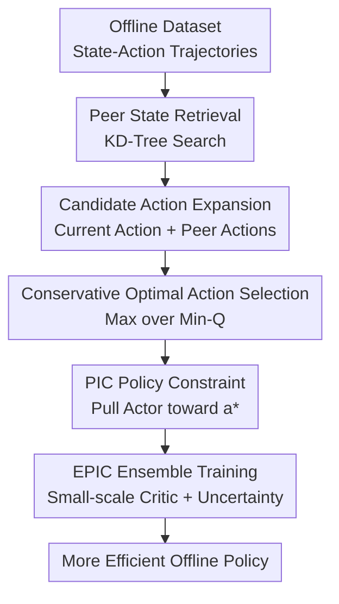

# Efficient Offline Reinforcement Learning via Peer-Influenced Constraint

**Conference**: ICLR2026  
**OpenReview**: [https://openreview.net/forum?id=bPWCIJyp1K](https://openreview.net/forum?id=bPWCIJyp1K)  
**Code**: To be confirmed  
**Area**: Offline Reinforcement Learning  
**Keywords**: Offline Reinforcement Learning, Behavior Constraint, Peer State, Uncertainty Estimation, Ensemble Critic

## TL;DR

This paper proposes Peer-Influenced Constraint (PIC): instead of treating only the action associated with the current state in the dataset as a conservative constraint, it borrows candidate actions from similar "peer states" and uses a critic to select superior in-distribution actions to guide the actor. Furthermore, it combines this with a small-scale ensemble critic to form EPIC, achieving higher average scores on D4RL MuJoCo, AntMaze, and Adroit while maintaining low training overhead.

## Background & Motivation

**Background**: Offline Reinforcement Learning (RL) aims to train policies using only a fixed dataset $D=\{(s,a,r,s')\}$ without further environment interaction. This setting is attractive for robotics, healthcare, and industrial control where real-world interaction is expensive or dangerous. However, it makes policy improvement fragile because once the actor selects an action not covered by the dataset, the critic is likely to provide an overestimation, and there is no online feedback to correct it.

**Limitations of Prior Work**: Mainstream methods follow two primary paths. Value regularization methods, such as SAC-N and EDAC, use the minimum of multiple critics or uncertainty penalties to suppress the $Q$-values of OOD actions. These are high-performing but computationally expensive, often requiring large ensembles. Policy regularization methods, such as TD3+BC, IQL, and AWAC, directly force the policy to stay close to the dataset actions. These are more efficient, but if the behavior policy in the dataset is suboptimal, excessively strong behavior cloning constraints will trap the actor in local optima.

**Key Challenge**: Offline RL requires the policy to "stay within the data distribution," but "staying near the single behavior action recorded for the current state" is not equivalent to "selecting a good action supported by the data." In continuous control tasks, similar states often share similar feasible actions and local dynamics. If only a strict one-to-one state-action constraint is used, the method wastes structural information across states in the dataset. If the constraint is completely relaxed, the model falls back into OOD overestimation.

**Goal**: The authors aim to address three specific issues: first, how to expand the set of safe actions available to the offline policy without training extra generative models or significantly increasing the number of critics; second, how to ensure this constraint avoids OOD while allowing the policy to escape suboptimal behavior; and third, how to combine this policy constraint with ensemble uncertainty estimation to achieve performance matching or exceeding large ensembles with fewer critics.

**Key Insight**: The observation is straightforward: the original behavior action for a state $s$ might not be optimal, but better actions may have occurred in its "peer states" (similar states). As long as these peer states are close enough, borrowing their corresponding actions still roughly remains within the data support. By using the current critic to conservatively screen these candidate actions, a superior constraint target can be found among "in-distribution actions."

**Core Idea**: Replace the "single behavior action of the current state" with "action candidates from similar states + conservative selection by the critic" as the offline policy constraint. This moves the actor toward high-value actions within the data support while maintaining the efficiency of actor-critic backbones like TD3 or EDAC.

## Method

### Overall Architecture

PIC is a plug-and-playable policy regularization module. Given a state $s$ in a minibatch, the method first retrieves $K$ similar peer states from the offline dataset. It then synthesizes a candidate action set $A'$ by combining the actions corresponding to these peer states with the existing action of the current state. The critic is used to score these candidates, selecting a conservatively optimal action $a^*$. Finally, the actor output $\pi_\phi(s)$ is pulled toward $a^*$, while the original RL actor loss continues to be optimized.

EPIC is the ensemble version of PIC. It incorporates PIC into an EDAC-style multi-critic framework: the actor still uses the minimum $Q$-value of the ensemble for conservative improvement, candidate action selection also uses $\min_i Q_{\theta_i}(s,a)$, and the critic side retains the EDAC ensemble similarity term to maintain diversity. The paper also identifies a "Coupling Effect" between PIC strength $\delta$ and ensemble size $N$: as PIC is moderately strengthened, the policy focuses more within the data support, making uncertainty penalties for OOD actions more effective, thus eliminating the constant need for a very large $N$ to suppress overestimation.

### Key Designs

**1. Peer State Retrieval: Expanding Behavior Constraints from One-to-One Actions to Local Data Neighborhoods**

The constraint term in TD3+BC essentially requires $\pi_\phi(s)$ to be close to the behavior action $a$ corresponding to the same $s$ in the dataset. This is stable when behavior data is near-optimal but becomes too conservative when action coverage is incomplete or behavior is suboptimal. The first step of PIC is to find $K$ peer states $\hat{s}_j$ for each state $s$ that are closest in the state space, explicitly excluding $s$ itself and previously selected neighbors: $\hat{s}_j=\arg\min_{\hat{s}\in D\setminus(D_{j-1}\cup\{s\})}\|s-\hat{s}\|$.

This design interprets "data support" as a local neighborhood rather than a single sample point. As long as the environment satisfies certain local smoothness, similar states often allow similar good actions. Therefore, including peer state actions in the candidate set increases action diversity while staying close to the data distribution. To avoid repeated full searches during training, a KD-Tree is built based on all dataset states before training, allowing queries with $O(|s|\log |D|)$ complexity. This is lower overhead than searching in a joint state-action space and reduces interference from action scaling.

**2. Conservative Optimal Action Selection: Finding Better Improvement Targets within In-Distribution Candidates**

Simply expanding candidate actions is insufficient, as peer actions may include both good and suboptimal actions. PIC applies a second layer of filtering to the candidate set $A'$: using the critic to estimate the value of each candidate action under the current state $s$, it selects $a^*=\arg\max_{a\in A'}\min_i Q_{\theta_i}(s,a)$. In PIC-TD3, two critics are typically used; in EPIC, the minimum of $N$ critics is used.

The key here is "limit candidates first, then perform value selection." If $Q(s,\pi_\phi(s))$ is maximized directly, the actor might exploit critic errors and move into OOD regions. If only behavior cloning is performed, it cannot exceed the recorded behavior action. PIC restricts the actor's target action to the vicinity of actions that actually appeared in the data, then lets the critic pick a high-value action from these candidates, effectively placing the policy improvement search within a "local in-distribution action menu." The final PIC distance is defined as $d_D^{PIC}(s)=\|\pi_\phi(s)-a^*\|$, which the actor minimizes.

**3. Coupling Effect and EPIC: Trading Moderate PIC Strength for Smaller Effective Ensembles**

The paper does not just add PIC to TD3; it systematically observes its relationship with uncertainty estimation. In ensemble methods, a larger $N$ makes $\min_i Q_i$ more pessimistic, thus punishing OOD actions, but at the cost of slower training and high memory/computation overhead. The authors found that when the PIC strength $\delta$ increases to a moderate range, policy actions stay more easily within the data support, while $Q_{min}$ on potential OOD candidates becomes more pessimistic, and $Q_{std}$ and $Q_{clip}=Q_{mean}-Q_{min}$ become higher. This suggests that PIC constraints and ensemble uncertainty are not independent but mutually reinforce OOD punishment.

EPIC is designed around this Coupling Effect. Its actor loss is $L_{EPIC}(\phi)=\beta L_1(\phi)+\delta\mathbb{E}_{s\sim B}[d_D^{PIC}(s)]$, where $L_1$ is the conservative actor loss based on the ensemble's minimum $Q$, and $\delta$ controls the peer constraint strength. The critic loss follows the EDAC style, adding an ensemble similarity term $ES$ to the TD error to encourage diversity. Consequently, EPIC does not rely on massive critic counts like SAC-N; instead, it achieves efficient offline policy learning through "in-distribution candidates + multi-critic conservative evaluation + moderate PIC strength."

### Loss & Training

The actor objective of PIC-TD3 consists of a TD3-style actor loss and the PIC distance: $L_{PT}(\phi)=\mathbb{E}_{s\sim B}[-\beta Q_{\theta_1}(s,a)]+\delta\mathbb{E}_{s\sim B}[d_D^{PIC}(s)]$, where $a=\pi_\phi(s)$, $\beta=\alpha |B|/\sum_{s_i,a_i}Q(s_i,a_i)$ mitigates the sensitivity of actor loss to $Q$ scale, and $\delta$ is the PIC constraint strength. Critics are updated via standard TD loss, and the actor is updated at a fixed frequency.

The actor objective of EPIC is $L_{EPIC}(\phi)=\beta L_1(\phi)+\delta\mathbb{E}_{s\sim B}[d_D^{PIC}(s)]$, where $L_1(\phi)=\mathbb{E}_{s\sim B}[-\min_i Q_{\theta_i}(s,\pi_\phi(s))]$. The candidate selection expands to $N$ critics: $a^*=\arg\max_{a\in A'}\min_{i=1,\ldots,N}Q_{\theta_i}(s,a)$. The critic update uses $L_{EPIC}(\theta_i)=\mathbb{E}[(y-Q_{\theta_i}(s,a))^2+ES]$, where $ES=\frac{\eta}{N-1}\sum_{i\ne j}\langle\nabla_a Q_{\theta_i}(s,a),\nabla_a Q_{\theta_j}(s,a)\rangle$.

In training configurations, the paper trains for 1 million steps on D4RL Gym-MuJoCo, AntMaze, and Adroit using Adam with a learning rate of $3\times10^{-4}$, batch size 256, hidden layers of 256, discount factor 0.99, and target update rate $5\times10^{-3}$. Effective ranges are $K=10$ or 20, $\delta\in[1,3]$, and $N$ between 5 and 20.

## Key Experimental Results

### Main Results

The paper evaluates primarily on three D4RL suites: Gym-MuJoCo (continuous control), AntMaze (sparse reward navigation), and Adroit (robotic hand manipulation).

| Benchmark Suite | Strongest Baselines | PIC-TD3 Avg | EPIC Avg | Key Conclusion |
| :--- | :--- | :--- | :--- | :--- |
| Gym-MuJoCo (18 tasks) | EDAC 85.2 / SAC-N 84.4 | 85.1 | 87.8 | EPIC is highest on average; PIC-TD3 approaches strong ensemble methods. |
| AntMaze (6 tasks) | SAC-BC-N 81.8 / MSG 80.6 | 75.6 | 82.9 | EPIC exceeds all reported baselines in sparse reward navigation. |
| Adroit (12 tasks) | IQL 53.5 / TD3+BC 49.9 | 53.8 | 62.5 | EPIC shows most significant improvement in high-dim hand tasks. |
| Overall Trend | Val-Reg is strong/expensive; BC is fast/conservative | Mid-High Perf, Low Cost | High Perf, Higher Efficiency | Peer action selection mitigates conflict between conservatism and OOD risk. |

Specifically, in Gym-MuJoCo, EPIC reaches 112.3 on hopper-medium-expert and 117.7 on walker2d-expert. In Adroit, pen-human improves from EDAC's 51.2 to 111.7, and pen-cloned from 68.2 to 94.6, indicating that peer constraints are particularly helpful for tasks with uneven data quality.

### Ablation Study

| Configuration / Factor | Observation | Explanation |
| :--- | :--- | :--- |
| Peer Number $K$ | Increasing $K$ from 2 to 10/20 usually improves performance; saturates after 20. | More peer states provide richer candidates, but too many may introduce critic selection error. |
| PIC Strength $\delta$ | Performance drops when $\delta < 1$ or $\delta > 4$; stable within $[1,3]$. | Insufficient constraint vs. suppressed policy improvement. |
| Ensemble size $N$ | Larger $N$ required without PIC; small ensembles succeed with moderate PIC. | Supports the proposed Coupling Effect. |
| State Distance Metric | EPIC results are similar with Raw / Norm / PCA / Embed. | Standard control tasks have clear state structures; PIC is not dependent on specific distance tricks. |

### Key Findings

- The average score of PIC-TD3 already matches or approaches ensemble methods like EDAC/SAC-N, proving that "cross-state reuse of in-distribution actions" is effective policy regularization on its own.
- EPIC's advantage stems from a combined effect: PIC pushes the policy toward data support, while the ensemble's minimum and diversity terms ensure conservative candidate selection, together reducing OOD overestimation.
- For offline-to-online fine-tuning, EPIC is competitive on AntMaze and Adroit, especially on Adroit cloned tasks, where the average improves from 28.9 to 53.2 after online tuning.

## Highlights & Insights

- The cleverness of PIC lies in redefining the "conservative constraint" target. It does not force the actor to stick to the current sample's behavior action but pulls it toward high-value actions in the local neighborhood, utilizing data structure better than traditional BC.
- The peer action constraint is designed as a plugin rather than a full algorithm rewrite. This allows PIC to be applied to TD3, SAC, IQL, and EDAC.
- The Coupling Effect is the most insightful part of the paper. While many offline RL works separate "policy constraint" and "uncertainty estimation," this paper demonstrates that constraint strength alters the policy action distribution, thereby changing the effectiveness of ensemble uncertainty.
- The use of KD-Tree is simple but engineering-critical, allowing the method to maintain training overhead close to simple policy constraint methods.

## Limitations & Future Work

- The primary limitation is the semantic quality of peer states. The method mainly uses Euclidean distance on raw states, which works for low/mid-dimensional tasks like MuJoCo but may fail in pixel inputs or high-dimensional multimodal data.
- Candidate actions are still limited by overall data coverage. If data is extremely sparse in a region, peer actions might be "geometrically close but decisionally irrelevant."
- Hyperparameters still require tuning. $\delta$, $K$, and $N$ have clear impacts, and while the paper provides empirical ranges, automated selection across tasks remains unsolved.
- Future work could place peer retrieval in learned representation spaces (e.g., contrastive or dynamics-aware embeddings) or adaptively adjust $\delta$ based on uncertainty or density.

## Related Work & Insights

- **vs TD3+BC**: TD3+BC pulls the actor toward the current sample's action, while PIC-TD3 uses the best candidate from peer actions, increasing improvement space while maintaining data-in constraints.
- **vs EDAC / SAC-N**: These rely heavily on ensemble pessimism for OOD suppression (expensive). EPIC uses PIC to return actions to the data support first, requiring fewer critics.
- **vs PRDC**: PRDC emphasizes state-action distance constraints which struggle with balancing state/action priorities. PIC finds peers in state space and selects via critic, decoupling retrieval from value judgment.
- **vs IQL / In-sample methods**: IQL avoids OOD evaluation and is stable but limited by advantage-weighted BC. PIC provides more active in-sample action expansion.

## Rating

- Novelty: ⭐⭐⭐⭐☆
- Experimental Thoroughness: ⭐⭐⭐⭐⭐
- Writing Quality: ⭐⭐⭐⭐☆
- Value: ⭐⭐⭐⭐☆

<!-- RELATED:START -->

## Related Papers

- [\[ICLR 2026\] OPRIDE: Efficient Offline Preference Reinforcement Learning via In-Dataset Exploration](opride_efficient_offline_preference-based_reinforcement_learning_via_in-dataset_.md)
- [\[ICLR 2026\] Adaptive Scaling of Policy Constraints for Offline Reinforcement Learning](adaptive_scaling_of_policy_constraints_for_offline_reinforcement_learning.md)
- [\[ICLR 2026\] Chain-of-Context Learning: Dynamic Constraint Understanding for Multi-Task VRPs](chain-of-context_learning_dynamic_constraint_understanding_for_multi-task_vrps.md)
- [\[ICLR 2026\] ADM-v2: Pursuing Full-Horizon Roll-out in Dynamics Models for Offline Policy Learning and Evaluation](adm-v2_pursuing_full-horizon_roll-out_in_dynamics_models_for_offline_policy_lear.md)
- [\[ICML 2026\] Safe Reinforcement Learning with Preference-Based Constraint Inference](../../ICML2026/reinforcement_learning/safe_reinforcement_learning_with_preference-based_constraint_inference.md)

<!-- RELATED:END -->
