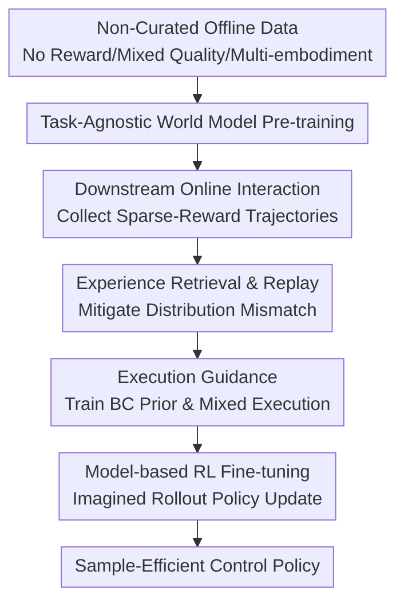

# Efficient Reinforcement Learning by Guiding World Models with Non-Curated Data

**Conference**: ICLR 2026  
**OpenReview**: [https://openreview.net/forum?id=oBXfPyi47m](https://openreview.net/forum?id=oBXfPyi47m)  
**Code**: https://github.com/zhaoyi11/ncrl  
**Area**: Reinforcement Learning / World Models  
**Keywords**: Non-curated offline data, World models, Sample-efficient RL, Offline-to-online RL, Exploration guidance

## TL;DR
NCRL first pre-trains a task-agnostic world model using reward-free, mixed-quality, multi-embodiment non-curated data, then guides exploration during online RL via retrieval-based experience replay and behavior cloning prior policies. This significantly mitigates the distribution mismatch between offline pre-training and online fine-tuning, achieving performance comparable to training from scratch with several times the sample budget across 72 visual-motor control tasks using only 150k interaction steps.

## Background & Motivation
**Background**: The most direct way to improve the sample efficiency of online reinforcement learning is to utilize existing offline data. Traditional offline RL or offline-to-online RL usually assumes that offline data is task-related, reward-labeled, or even high-quality demonstrations. Model-based methods aim to learn dynamics from offline trajectories and use world models for imagined rollouts to train actor-critics.

**Limitations of Prior Work**: In real-world robot or visual control scenarios, the most easily collected data is not "clean" but consists of vast amounts of interaction trajectories without rewards, with varying quality, and from different embodiments. Labeling this data with rewards is expensive, and treating it directly as offline RL data is inappropriate. Using it only to pre-train visual encoders wastes information on actions, dynamics, and state coverage. Merely pre-training a world model followed by online fine-tuning often yields no better results than training from scratch on difficult exploration tasks.

**Key Challenge**: The problem is not just that the world model is not pre-trained at a large enough scale, but the mismatch between the pre-training data distribution and the early online data distribution. In the early stages of online RL, the strategy is weak, and the collected state distribution is narrow and biased. If the world model only continues to update on these narrow distributions, it will forget the dynamics learned from offline data, and the initial states for imagined rollouts will only come from low-quality online buffers, making it difficult for policy training to encounter high-reward regions.

**Goal**: The authors aim to answer: how can non-curated offline data be effectively converted into sample efficiency gains for online RL without requiring reward labels, expert quality, or a single embodiment? This goal is split into three tasks: learning a transferable world model from messy data; avoiding forgetting due to distribution drift during downstream task fine-tuning; and using useful action priors from offline data to assist early exploration.

**Key Insight**: The observation is specific: non-curated data is valuable during pre-training but cannot be discarded during fine-tuning. Even without rewards, if trajectories similar to the current task's visual states can be retrieved, they can serve as anchors for world model fine-tuning, supplementary initial states for imagined rollouts, and training material for behavior cloning (BC) priors.

**Core Idea**: The core of NCRL is to "not only use non-curated data for pre-training world models but to continue using it for rehearsal and guided execution during online RL fine-tuning," thereby turning reward-free mixed-quality data into usable exploration and dynamics priors.

## Method

### Overall Architecture
NCRL is a two-stage model-based offline-to-online RL pipeline. The first stage trains a task-agnostic multi-embodiment world model from non-curated offline data $D_{off}$. The second stage enters specific downstream tasks, using a small amount of online interaction to obtain $D_{on}$, while retrieving task-relevant trajectories $D_{retrieved}$ from $D_{off}$. These trajectories are used simultaneously for world model rehearsal, initial state expansion for model rollouts, and behavior cloning prior policy training.

The world model employs the recurrent state space model (RSSM) commonly used in the Dreamer series, including a sequence model $f_\theta$, an encoder $q_\theta$, a dynamics predictor $p_\theta$, and a decoder $d_\theta$. To adapt to multi-embodiment data, the authors remove task-related losses, unify action dimensions of different embodiments using zero-padding, and scale the model to approximately 280M parameters. The fine-tuning phase follows DreamerV3-style latent imagination: sampling initial latent states from the replay buffer, rolling out the policy $\pi_\phi(a|s)$ and dynamics, and updating the actor-critic with $\lambda$-return.

### Key Designs
**1. Pre-training World Models with Non-Curated Data: Turning Reward-Free Multi-Embodiment Trajectories into Dynamics Priors**

This paper deliberately relaxes the assumptions on offline data: trajectories in $D_{off}$ have no rewards $r_t$, are of mixed quality, and come from multiple embodiments. Such data cannot be directly used for offline RL that depends on reward labels, but it contains dynamics information of "what transition occurs given certain observations and actions." Thus, NCRL first trains only observation reconstruction and latent dynamics without task rewards or task heads.

The latent update of RSSM is: history $h_t=f_\theta(h_{t-1}, z_{t-1}, a_{t-1})$ summarizes the past, the encoder produces the posterior latent $z_t \sim q_\theta(z_t|h_t,o_t)$, the dynamics predictor outputs the prior latent $\hat{z}_t \sim p_\theta(\hat{z}_t|h_t)$, and the decoder reconstructs the observation $\hat{o}_t \sim d_\theta(\hat{o}_t|h_t,z_t)$. The training objective consists of reconstruction, dynamics KL, and representation KL terms:

$$
L(\theta)=\mathbb{E}_{D_{off}}\left[\frac{1}{T}\sum_{t=1}^{T}\left(\beta_1L_{pred}+\beta_2L_{dyn}+\beta_3L_{rep}\right)\right].
$$

The key here is proving that a sufficiently large RSSM can learn useful visual-motor dynamics from reward-free, mixed-quality, multi-embodiment data, rather than proposing a new architecture.

**2. Experience Retrieval and Replay: Using Only Task-Relevant Offline Trajectories to Counter Online Distribution Drift**

A key diagnosis of the paper: naive world model fine-tuning fails because of the distribution mismatch between $D_{off}$ and early $D_{on}$. During early online training, the agent might move randomly near the starting point, leading to a narrow $p_0(s)$. If the world model only updates on this narrow data, it forgets the dynamics coverage from pre-training. Replaying all non-curated data is impractical due to its large scale and irrelevant tasks/embodiments.

NCRL retrieves trajectories from $D_{off}$ that are visually similar to the current task. Specifically, using the pre-trained encoder $e_\theta$, it compares the feature distance between initial observations $o_{on}$ in the online buffer and $o_{off}$ in the offline trajectories:

$$
D=\|e_\theta(o_{on})-e_\theta(o_{off})\|_2.
$$

$D_{retrieved}$ serves three roles: continuous rehearsal to prevent forgetting; supplementing the initial state distribution $p_0(s)$ for imagined rollouts; and training behavior cloning priors.

**3. Execution Guidance: Training Prior Policies to Assist Early Exploration in Reliable Regions**

NCRL trains a behavior cloning prior $\pi_{BC}$ on $D_{retrieved}$ and mixes it with the current RL policy $\pi_{RL}$ during environment sampling. Guidance is not used for the entire episode; instead, at the start of each episode, a schedule determines whether to enable guidance. If enabled, a start time $t_{bc}$ and duration $H$ are randomly sampled to execute $\pi_{BC}$, with $\pi_{RL}$ used for the remaining time. This helps the agent reach regions covered by the offline data where the world model is more confident.

**4. Model-based Online Fine-tuning: Rehearsal and Guidance Serving Imagined Policy Learning**

The final strategy is learned via model-based RL. While the reward model $r_\xi$ is learned only on $D_{on}$, the world model is updated using both $D_{on}$ and $D_{retrieved}$. The actor and critic are trained using imagined trajectories, with the critic fitting the $\lambda$-return and the actor maximizing return plus entropy.

### Loss & Training
The pre-training world model loss: $L_{pred}=-\ln d_\theta(o_t|z_t,h_t)$, $L_{dyn}=\max(1,KL(sg(q_\theta)\|p_\theta))$, $L_{rep}=\max(1,KL(q_\theta\|sg(p_\theta)))$.

In the fine-tuning phase, the critic predicts the $\lambda$-return distribution:

$$
V_t^\lambda=\hat{r}_t+\gamma\begin{cases}(1- \lambda)v_{t+1}^\lambda+\lambda V_{t+1}^\lambda,&t<H\\v_H^\lambda,&t=H.\end{cases}
$$

Hyperparameters: 200k pre-training steps, batch size 16, sequence length 64, 15k frames warm-up, offline data mix ratio 0.25, $\lambda=0.95$, imagine horizon 16. Execution guidance schedule is `linear(1,0,50000)` on DMControl and `linear(1,0,150000)` on Meta-World.

## Key Experimental Results

### Main Results
Experiments were conducted on 72 tasks across DMControl and Meta-World. Offline data consists of 10k trajectories from DMControl (5 embodiments) and 50k trajectories from Meta-World (50 tasks), totaling 10M state-action pairs without target task reward labels.

| Benchmark | Sample Budget | DreamerV3 | DrQ-v2 | NCRL | Conclusion |
|------|----------|-----------|--------|------|------|
| Meta-World (Mean Success) | 150k | 0.360 | 0.430 | 0.748 | NCRL matches DrQ-v2 at 1M using only 15% steps |
| Meta-World (Median Success) | 150k | 0.130 | 0.330 | 0.840 | Median improvement is more significant |
| DMControl (Mean Return) | 150k | 320.86 | 226.49 | 617.73 | NCRL exceeds baselines at 500k in most tasks |

### Ablation Study
| Configuration | Content Used | Finding |
|------|----------|----------------|
| DreamerV3 | From scratch | Almost zero progress on hard exploration manipulation tasks |
| +P | Pre-training only | Unstable on narrow distribution tasks (Meta-World) |
| +P+ER | + Experience rehearsal | Stable training; prevents forgetting dynamics |
| +P+ER+G | Full NCRL | Best performance; guidance helps enter high-value regions |

### Key Findings
- Naive pre-trained world models are not silver bullets. Distribution mismatch during online fine-tuning causes the model to "forget" dynamics.
- Retrieval-based rehearsal effectively selects task-relevant data to close the distribution gap without overwhelming the buffer.
- Execution guidance is most beneficial in the early stages, providing a directed "steering wheel" for exploration via BC priors, even if the offline data is not expert-level.

## Highlights & Insights
- NCRL addresses the bottleneck of offline-to-online RL at the early fine-tuning stage, rather than just the pre-training stage.
- Selective experience rehearsal via simple encoder feature retrieval strikes a balance between using vast non-curated data and maintaining task relevance.
- Guided execution is a more natural way to use reward-free data than synthetic reward labeling, avoiding potential biases.

## Limitations & Future Work
- The architecture is still RSSM/RNN-based; scaling to Transformers or diffusion models remains to be explored.
- The "non-curated" data is still in-domain (same simulator). Utilizing completely in-the-wild video data is an open challenge.
- Generalization to completely new embodiments or high-noise real-world hardware requires further verification.

## Related Work & Insights
- **vs DreamerV3**: Inherits the framework but adds pre-training and retrieval mechanisms to solve the early fine-tuning failure.
- **vs RLPD**: RLPD requires reward-labeled task-relevant data; NCRL works with uncurated, reward-free trajectories.
- **vs ExPLORe/UDS**: NCRL avoids the instability of reward labeling by using data for dynamics and action priors instead.

## Rating
- Novelty: ⭐⭐⭐⭐☆
- Experimental Thoroughness: ⭐⭐⭐⭐⭐
- Writing Quality: ⭐⭐⭐⭐☆
- Value: ⭐⭐⭐⭐⭐

<!-- RELATED:START -->

## Related Papers

- [\[ICLR 2026\] Object-Centric World Models from Few-Shot Annotations for Sample-Efficient Reinforcement Learning](object-centric_world_models_from_few-shot_annotations_for_sample-efficient_reinf.md)
- [\[ICLR 2026\] From Observations to Events: Event-Aware World Models for Reinforcement Learning](from_observations_to_events_event-aware_world_models_for_reinforcement_learning.md)
- [\[ICLR 2026\] Learning Massively Multitask World Models for Continuous Control](learning_massively_multitask_world_models_for_continuous_control.md)
- [\[ICLR 2026\] Mixture-of-World Models: Scaling Multi-Task Reinforcement Learning with Modular Latent Dynamics](mixture-of-world_models_scaling_multi-task_reinforcement_learning_with_modular_l.md)
- [\[ICLR 2026\] Learning to Be Uncertainty: Pre-training World Models with Horizon-Calibrated Uncertainty](learning_to_be_uncertain_pre-training_world_models_with_horizon-calibrated_uncer.md)

<!-- RELATED:END -->
## Related Papers

- [\[ICLR 2026\] Object-Centric World Models from Few-Shot Annotations for Sample-Efficient Reinforcement Learning](object-centric_world_models_from_few-shot_annotations_for_sample-efficient_reinf.md)
- [\[ICLR 2026\] From Observations to Events: Event-Aware World Models for Reinforcement Learning](from_observations_to_events_event-aware_world_models_for_reinforcement_learning.md)
- [\[ICLR 2026\] Learning Massively Multitask World Models for Continuous Control](learning_massively_multitask_world_models_for_continuous_control.md)
- [\[ICLR 2026\] Mixture-of-World Models: Scaling Multi-Task Reinforcement Learning with Modular Latent Dynamics](mixture-of-world_models_scaling_multi-task_reinforcement_learning_with_modular_l.md)
- [\[ICLR 2026\] Learning to Be Uncertain: Pre-training World Models with Horizon-Calibrated Uncertainty](learning_to_be_uncertain_pre-training_world_models_with_horizon-calibrated_uncer.md)

<!-- RELATED:END -->
