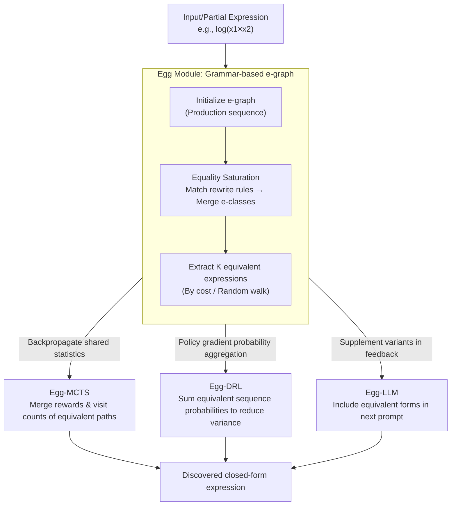

# EGG-SR: Embedding Symbolic Equivalence into Symbolic Regression via Equality Graph

**Conference**: ICLR 2026  
**arXiv**: [2511.05849](https://arxiv.org/abs/2511.05849)  
**Code**: [Project Page](https://nan-jiang-group.github.io/egg-sr)  
**Area**: Reinforcement Learning  
**Keywords**: Symbolic Regression, Symbolic Equivalence, Equality Graph, Monte Carlo Tree Search, Deep Reinforcement Learning

## TL;DR

Ours proposes the Egg-SR unified framework, which embeds symbolic equivalence into MCTS, DRL, and LLM methodologies via equality graphs (e-graph). This achieves subtree pruning, gradient variance reduction, and feedback prompt enhancement respectively. Theoretical proofs demonstrate that Egg-MCTS tightens regret bounds and Egg-DRL reduces gradient estimation variance. Experiments confirm consistent improvements in expression discovery accuracy.

## Background & Motivation

Symbolic Regression (SR) aims to discover closed-form physical laws from experimental data and is a crucial task for AI-driven scientific discovery. The search space grows exponentially with data dimensions, posing significant computational challenges.

A promising but under-explored direction is **symbolic equivalence**: many syntactically different expressions define the same function. For example:
- $\log(x_1^2 x_2^3)$
- $\log(x_1^2) + \log(x_2^3)$
- $2\log(x_1) + 3\log(x_2)$

These three are mathematically equivalent, but existing algorithms treat them as distinct outputs, leading to:

**Redundant Exploration**: MCTS searches equivalent subtrees independently, wasting computation.

**Slow Training**: DRL cannot utilize equivalent sequences to share reward signals, resulting in high gradient variance.

**Insufficient Feedback**: LLMs only see a single expression form, missing information from equivalent variants.

**Key Challenge**: How to represent symbolic equivalent expressions in a unified, scalable manner and embed them into modern learning frameworks? Explicitly enumerating equivalent variants is infeasible as their number grows exponentially with expression length.

## Method

### Overall Architecture

The core of Egg-SR is a reusable equivalence representation module **Egg** (grammar-based e-graph). It compresses an expression along with all its mathematically equivalent variants into a single e-graph, then connects to MCTS, DRL, and LLM via three interfaces. Each method invokes Egg at the most appropriate stage: MCTS shares statistics across equivalent paths during backpropagation, DRL aggregates probabilities of equivalent sequences when calculating policy gradients, and LLM supplements feedback prompts with equivalent variants. The same e-graph is reused across all three algorithms, forming a unified framework of "one equivalence representation + three embedding methods."

### Key Designs

**1. Egg Module: Compactly storing all equivalent expressions using e-graphs**

Directly enumerating equivalent variants of an expression explodes exponentially with length—for instance, $\log(x_1\times\cdots\times x_n)$ has $2^{n-1}$ equivalent forms. Egg first represents expressions using a Context-Free Grammar $\langle V, \Sigma, R, S\rangle$ ($V=\{A\}$ is the non-terminal set, $\Sigma$ are terminal symbols like variables and constants, $R$ are production rules), then packs them into an e-graph. An e-graph consists of equivalent classes (e-class), each containing a set of semantically equivalent e-nodes, with each e-node encoding an operation and referencing child e-classes. Since common sub-expressions are stored only once, structures are shared heavily among variants, compressing storage from exponential to compact. The construction process is called **Equality Saturation**: the e-graph is initialized with the production sequence of the input, then for each rewrite rule (e.g., $\log(ab)\leadsto\log(a)+\log(b)$), the left-hand pattern is matched, new e-nodes for the right-hand side are inserted, and both sides are merged into the same e-class. This iterates until no new relations are found or a limit is reached. Two extraction strategies are used: extracting the simplest form by cost, or sampling variants via random walk.

**2. Egg-MCTS: Merging search statistics for equivalent paths**

Standard MCTS follows "UCT Select → Expand → Simulate → Backpropagate," but it treats paths like $\log(x_1\times A)$ and $\log(x_1)+\log(A)$ as two independent subtrees, wasting budget. Egg-MCTS modifies only the backpropagation step: after converting the partial expression to an e-graph and saturating it, several equivalent sequences are sampled. The algorithm checks if these paths exist in the search tree and **simultaneously** updates their rewards and visit counts. This effectively redefines the visit count in UCT—$\mathtt{visits}(s)$ is no longer the count for a specific node, but the total visits to any representation within its e-class, similar to a transposition table in game search. Information learned on one path immediately benefits all equivalent siblings. Theoretically, this tightens the regret bound: letting $\kappa$ be the near-optimal branch factor of standard MCTS and $\kappa_\infty$ for Egg-MCTS, then $\kappa_\infty\le\kappa$. The regret bound is tightened from $\tilde{\mathcal{O}}(n^{-\frac{\log(1/\gamma)}{\log\kappa}})$ to $\tilde{\mathcal{O}}(n^{-\frac{\log(1/\gamma)}{\log\kappa_\infty}})$ (Theorem 3.1).

**3. Egg-DRL: Reducing gradient variance using sums of equivalent sequence probabilities**

DRL methods use sequence decoders to sample production sequences $\tau$, with the policy gradient estimator $g(\theta)\approx\frac{1}{N}\sum_{i=1}^N(\mathtt{reward}(\tau_i)-b)\nabla_\theta\log p_\theta(\tau_i)$. Because equivalent sequences are scored separately and contribute noise, variance is high and training is slow. Egg-DRL builds an e-graph for each sampled $\tau_i$ and samples $K-1$ equivalent sequences, using an equivalence-aware estimator:

$$g_\mathtt{egg}(\theta) \approx \frac{1}{N}\sum_{i=1}^N (\mathtt{reward}(\tau_i) - b') \nabla_\theta \log\left[\sum_{k=1}^K p_\theta(\tau_i^{(k)})\right]$$

The key is replacing single sequence probability with the sum of probabilities for equivalent sequences $\sum_{k=1}^K p_\theta(\tau_i^{(k)})$. Since these $K$ sequences define the same function and share the same reward, merging their probabilities acts as an averaging of intra-group variance, reducing gradient noise. This estimator is proven unbiased and satisfies $\mathbb{V}\mathrm{ar}[g_\mathtt{egg}(\theta)]\le\mathbb{V}\mathrm{ar}[g(\theta)]$ (Theorem 3.2).

**4. Egg-LLM: Feeding equivalent variants back into prompts**

LLM-based SR iterates via "Hypothesis Generation → Evaluation → Experience Management." However, LLMs only see the specific expression form they previously wrote, missing structural clues in equivalent forms. Egg-LLM parses Python expressions into symbolic forms, uses e-graphs to extract variants, and includes these variants in the feedback prompt. This allows the LLM to observe multiple ways to write the same function, providing richer signals for correcting predictions.

### A Complete Example

Consider $\log(x_1\times x_2)$: Egg initializes the e-graph with its sequence; applying $\log(ab)\leadsto\log(a)+\log(b)$ adds $\log(x_1)+\log(x_2)$ to the same e-class. Both share sub-structures $x_1$ and $x_2$. After saturation, both sequences are sampled. In MCTS, their statistics are merged during backpropagation; in DRL, their probabilities are summed to smooth gradients; in LLM, both forms enter the next prompt. The same e-graph is reused at the most critical step of each algorithm.

## Key Experimental Results

### Main Results: NMSE on Trigonometric Datasets

| Method | (2,1,1) Noiseless | (3,2,2) Noiseless | (4,4,6) Noiseless | (2,1,1) Noisy | (3,2,2) Noisy |
|------|--------------|--------------|--------------|--------------|--------------|
| MCTS | 0.006 | 0.033 | 0.144 | 0.015 | 0.007 |
| **Egg-MCTS** | **<1E-6** | **<1E-6** | **0.006** | **0.005** | **0.012** |
| DRL | 0.030 | 0.277 | 2.990 | 0.09 | 0.44 |
| **Egg-DRL** | **0.020** | **0.161** | **2.381** | **0.07** | **0.35** |

Egg-MCTS improves NMSE by several orders of magnitude (from 0.033 to <1E-6) in simple noiseless cases.

### Main Results: LLM Comparison on Scientific Benchmarks

| Method | Oscillation I IID | Oscillation II OOD | Bacterial OOD | Stress-Strain OOD |
|------|-----------------|-------------------|-------------|-----------------|
| LLM-SR (GPT3.5) | <1E-6 | 3.81E-5 | 0.0264 | 0.0516 |
| **Egg-LLM (GPT3.5)** | <1E-6 | **<1E-6** | **0.0198** | **0.0419** |
| LLM-SR (Mistral) | <1E-6 | 0.0291 | 0.0037 | 0.0946 |
| **Egg-LLM (Mistral)** | **<1E-6** | **0.0114** | **0.0107** | **0.0754** |

### Efficiency Analysis

**Space Efficiency**: For $\log(x_1 \times \cdots \times x_n)$, there are $2^{n-1}$ variants. Array-based storage grows exponentially, whereas e-graphs achieve significant compression via sub-expression sharing.

**Time Efficiency**: Overhead from the Egg module is negligible. Compared to coefficient fitting and parameter updates in DRL, e-graph construction and sampling time is minimal.

### Key Findings

- Egg consistently improves performance across MCTS, DRL, and LLM, validating framework versatility.
- Egg-MCTS maintains wider and deeper search trees, exploring larger and more diverse spaces.
- Gradient estimation variance for Egg-DRL decreases significantly during training.
- Trigonometric expressions benefit most due to rich equivalent variants (identities).

## Highlights & Insights

1. **Unified Framework**: One Egg module serves MCTS, DRL, and LLM with consistent interfaces.
2. **Dual Validation**: Theorems 3.1 and 3.2 prove tightened regret bounds and reduced variance, respectively, which is fully supported by experiments.
3. The core advantage of e-graphs is **structural sharing**, achieving exponential compression (over 100x memory advantage at $n=8$ variables).
4. Equivalence relations independent of bitmask operations (e.g., coefficient equivalence in SymNet) suggest interesting open problems.

## Limitations & Future Work

1. Rewrite rules are manually defined; currently covering log and trig identities, but more complex identities need extension.
2. Limited gain for expressions without rich equivalent variants (e.g., pure polynomials).
3. Currently supports only grammar-based representations; layer-based representations like SymNet require extension.
4. Optimal utilization of Egg during the inference phase (e.g., LLM) remains an open problem.
5. Termination conditions for e-graph saturation (max iterations) require tuning.

## Related Work & Insights

- E-graphs originate from program synthesis and compiler optimization; this work is the first to unify them into SR learning algorithms.
- Unlike Genetic Programming where e-graphs are used for deduplication, Egg-SR uses them for equivalence-aware learning.
- Shared equivalent paths in MCTS are similar to transposition tables in games but handle pattern matching for symbolic equivalence.
- The probability aggregation in DRL can be generalized to any sequence generation task with output equivalence.
- Egg-SR is orthogonal to other knowledge-guided SR constraints like symmetry or units in AI-Feynman.

## Rating

- Novelty: ⭐⭐⭐⭐⭐ (Unified framework + theoretical guarantees, first systematic embedding of symbolic equivalence)
- Experimental Thoroughness: ⭐⭐⭐⭐ (Covers MCTS/DRL/LLM, includes efficiency analysis)
- Writing Quality: ⭐⭐⭐⭐⭐ (Excellent visualizations, tight theory-experiment integration)
- Value: ⭐⭐⭐⭐ (Substantial advancement in SR, generalizable to other equivalence scenarios)

<!-- RELATED:START -->

## Related Papers

- [\[ICLR 2026\] A Hierarchical Circuit Symbolic Discovery Framework for Efficient Logic Optimization](a_hierarchical_circuit_symbolic_discovery_framework_for_efficient_logic_optimiza.md)
- [\[ICLR 2026\] Neural+Symbolic Approaches for Interpretable Actor-Critic Reinforcement Learning](neuralsymbolic_approaches_for_interpretable_actor-critic_reinforcement_learning.md)
- [\[ICLR 2026\] One Life to Learn: Inferring Symbolic World Models for Stochastic Environments from Unguided Exploration](one_life_to_learn_inferring_symbolic_world_models_for_stochastic_environments_fr.md)
- [\[ICLR 2026\] Graph-Theoretic Intrinsic Reward: Guiding RL with Effective Resistance](graph-theoretic_intrinsic_reward_guiding_rl_with_effective_resistance.md)
- [\[ICLR 2026\] GraphOmni: A Comprehensive and Extensible Benchmark Framework for Large Language Models on Graph-theoretic Tasks](graphomni_a_comprehensive_and_extensible_benchmark_framework_for_large_language_.md)

<!-- RELATED:END -->
