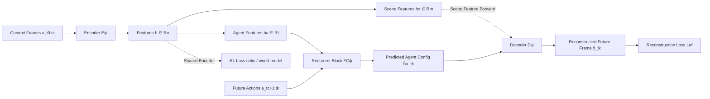

# Ego-Foresight: Self-supervised Learning of Agent-Aware Representations for Improved RL

**Conference**: ICLR 2026  
**OpenReview**: [https://openreview.net/forum?id=6itufi98Q3](https://openreview.net/forum?id=6itufi98Q3)  
**Code**: [https://mserranunes.github.io/ego-foresight](https://mserranunes.github.io/ego-foresight)  
**Area**: Reinforcement Learning / Self-supervised Representation Learning / Visual Control  
**Keywords**: Agent-environment disentanglement, motion prediction, self-supervised auxiliary tasks, sample efficiency, embodied adaptation  

## TL;DR
Inspired by human "motion prediction," Ego-Foresight utilizes the cue that "the agent's body configuration is predictable by future actions when it moves" to disentangle agent features from scene features **without any supervised masks**. Integrated as an auxiliary task into DrQ-v2 and TD-MPC2, it significantly enhances the sample efficiency and performance of visual RL.

## Background & Motivation
While deep reinforcement learning has progressed rapidly, the **amount of interaction experience required to learn an effective policy** remains a core bottleneck in both simulation and real-world environments. A proven strategy for acceleration is to "model the agent and the environment separately"—allowing the algorithm to concentrate representation capacity on learning self-control before processing external interactions. However, most existing works rely on a **supervision signal** provided in the form of agent masks (from simulator geometry IDs, fine-tuned segmentation models, or robot CAD models).

This introduces two pain points: first, deploying an additional segmentation system in real-world robot scenarios is **complex and difficult to obtain**; second, supervised masks **tie down the agent's body-schema**, making it unable to adapt when the agent picks up a tool or its morphology changes. The **Key Challenge** is that disentangling the agent requires knowing "which part is me," and obtaining this prior is precisely the most expensive and inflexible part of the process.

Human development suggests another path: infants build "self-representations" through motion without mask annotations, and these representations can slowly adapt during growth or rapidly expand when picking up tools. Based on this, this work proposes the **Core Idea—motion as the cue for disentanglement**: visual changes in the agent's body configuration **can be predicted from its future actions**, while the motion of external objects cannot; thus, the "visual part predictable by actions" defines the "self." The **Goal** of this paper is to utilize this self-supervised "self-awareness" as an auxiliary representation learning task to improve the sample efficiency of underlying RL algorithms and their adaptability to morphological changes without supervision.

## Method

### Overall Architecture
Ego-Foresight (EF) is a visual motion prediction model with an **encoder-recurrent predictor-decoder** structure: it encodes feature vectors from a few context frames, splits them into "scene features" and "agent features," uses a recurrent block with only agent features + future action sequences to predict future agent configurations, and uses a decoder to reconstruct future frames from the "original scene features + predicted agent features." Training is entirely self-supervised (using future ground-truth frames). By attaching this module to the visual encoder of an existing RL algorithm as an auxiliary loss term for joint optimization, DrQv2-EF and TD-MPC2-EF are obtained.

### Key Designs
**1. Motion-driven agent disentanglement: Letting the "predictable by actions" part emerge.** The encoder produces features $h^{t_c}=E_\psi(x_{t_0:t_c})$ from context frames, which are split into a scene part $h_s^{t_c}\in\mathbb{R}^m$ and an agent part $h_a^{t_c}\in\mathbb{R}^l$ ($l+m=n$). The recurrent block takes only the agent features and subsequent actions to recursively predict future agent configurations $\hat h_a^{t_{j+1}}=FC_\psi(\hat h_a^{t_j},a_{t_{j+1}})$, rolling forward to a randomly sampled time $t_k$ within the prediction horizon. For reconstruction, the **predicted future agent** and the **current scene features** are concatenated and sent to the decoder $\hat x_{t_k}=D_\psi(h_s^{t_c},\hat h_a^{t_k})$, minimizing $L_{ef}=\mathbb{E}\big[\|\hat x_{t_k}-x_{t_k}\|_2^2\big]$. Since the scene content is "fast-forwarded" directly from $t_c$, the reconstructed frame mirrors $x_{t_c}$ except for the agent configuration—this forces $\hat h_a^{t_k}$ to carry all information about "what the future agent looks like." The elegance of this design lies in not telling the model "which part is the robot," but only requiring that "any visual change predictable from future actions" be attributed to agent features. This naturally leaves a stationary door in the scene features (unpredictable from actions) while incorporating a hammer into agent features once it moves with the arm.

**2. Dimensional bottleneck + Scene fast-forward: Forcing the most predictable dynamics through capacity constraints.** A critical aspect is setting the agent feature dimension $l$ to a small fraction of $n$, creating an **information bottleneck**. With limited capacity, the recurrent block is forced to predict only the "most predictable dynamics"—the agent's own motion—rather than complex environment changes. Simultaneously, the operation of "fast-forwarding scene features $h_s$ from context frames to the reconstruction time $t_k$" further discourages the recurrent block from predicting full environment dynamics, compressing predictable information into $h_a$. Ablations show that an excessively large $l$ is harmful, as a soft bottleneck allows the recurrent block to attempt predicting other environment features, weakening disentanglement.

**3. Plug-and-play integration as an RL auxiliary task: Acting as a regularizer.** EF can be attached to any RL algorithm with a "visual encoder + replay buffer": the encoder is shared with the baseline, while the recurrent block and decoder are extra modules with gradients flowing back to the encoder. For DrQ-v2, the $L_{ef}$ is weighted with the critic loss $L(\phi,\psi,D)=L_{critic}(\phi,D)+\beta L_{ef}(\psi,D)$; for TD-MPC2, $L_{ef}$ is integrated into the world model objective $L(\theta,\psi,D)=L_{TDMPC}(\theta,D)+\beta L_{ef}(\psi,D)$. Since the policy networks in these algorithms are separated from the encoder's feature learning (the policy only receives low-dim features and gradients do not flow back to the encoder), the EF loss naturally acts as a **task-agnostic feature regularizer**: it forces the encoder to learn features "predictable for agent motion," thereby concentrating capacity on learning self-control early in training.

**4. Motor-babbling exploration pre-heating: Providing diverse actions for self-supervision.** During joint training with RL, the agent performs goal-oriented movements for rewards, which may result in insufficiently diverse actions to learn the visual-motion mapping. Therefore, an optional "motor-babbling" phase is added for a fixed number of steps at the start of training, where actions are sampled randomly at $\pm1$ to force exploratory motion. This allows agent feature prediction capabilities to be established early; after babbling, EF optimization continues, preserving the ability to adapt later (e.g., incorporating a tool into the body-schema when picked up). Ablations indicate babbling provides meaningful gains, though excessive duration can slow learning.

## Key Experimental Results
Testing was conducted on 16 tasks from Meta-World (half involving tools) and 10 tasks from DMC, totaling 26 visual control tasks. The **Efficiency Normalized Score (ENS)** was used to measure sample efficiency and performance: finding the number of steps for any baseline to reach 95% of its peak performance (averaged with 90% and 85% thresholds) and comparing algorithm performance at that step. 5 random seeds per task (3 seeds for TD-MPC2 on DMC as per official protocol).

### Main Results

| Extended Algorithm | Comparison Object | Result |
|---|---|---|
| DrQv2-EF | DrQ-v2 | **Improved in 21 out of 26 tasks**, often significantly reducing steps to solution and improving asymptotic performance; **no degradation in any task**. |
| DrQv2-EF | SEAR (Supervised Mask) | ENS and Rliable metrics **outperformed the supervised method** in both Meta-World and DMC. |
| DrQv2-EF | CURL (Contrastive SSL) | Outperformed CURL on both benchmarks. |
| DrQv2-EF | Dreamer-v3 (SOTA Model-based) | **Competitive** and comparable performance. |
| TD-MPC2-EF | TD-MPC2 | **Improved in 8 out of 10 tasks**, with 2 ties; ENS significantly improved. |

Notably, on **tasks requiring tools**, the performance gap between EF and baselines widened—because tools, once held, have their motion determined by the robot's actions and are naturally incorporated into the agent's representation.

### Ablation Study (DrQv2-EF, Meta-World Door Open)

| Hyperparameter | Findings |
|---|---|
| EF Loss weight $\beta$ | Functions as a regularizer; improves performance even without explicit reward optimization. |
| Prediction Horizon $H$ | Impact is inconsistent; short horizons still outperform DrQ-v2; $H=10/40$ are strong; default is $H=10$ (lower compute). |
| Agent feature dim $l$ | Larger is more harmful; soft bottlenecks allow predicting environment features, weakening disentanglement. |
| Motor-babbling steps | Provides meaningful gains, but excessive steps delay learning. |

### Key Findings
- Feature visualization (reconstructed frames scaled by gradient intensity) shows: early in training, $h_a$ and $h_s$ have similar influence; as training progresses, $h_s$ consistently encodes all changing scene parts (cabinets, table edges), while $h_a$ **specializes into agent information**.
- In the Door Open task, the door is reconstructed as a static scene (door movement has no fixed action correspondence), whereas in the Hammer task, the hammer is predicted (its movement depends on actions once picked up). This validates the "predictability = self" disentanglement criterion and demonstrates **adaptation to morphology changes**, which supervised methods cannot achieve.

## Highlights & Insights
- **Replacing "labels" with "predictability" for disentanglement** is the most elegant contribution: it transforms the question of "which part is me" from an artificial prior into a purely self-supervised question of "what can be predicted from my actions," removing mask dependency at the root.
- **Tool adaptation is a free byproduct**: Supervised methods fix the body-schema, but because EF defines the self via "predictability," tools are automatically incorporated into agent features when picked up—explaining the largest gains in tool-based tasks.
- **Algorithm-agnostic**: Validated on both model-free (DrQ-v2) and model-based (TD-MPC2) paradigms, emphasizing applicability to any "encoder + replay buffer" algorithm as a plug-and-play module.
- **Perspective as a regularizer**: The EF loss is task-agnostic but guides the encoder to learn "predictable for self-motion" features, steering the training to prioritize learning control before interaction.

## Limitations & Future Work
- **Simulation-only validation**: Verified on Meta-World and DMC (MuJoCo), lacking real-world robot validation (though removing masks is intended for real-world use).
- **Prediction divergence and blurring**: Long-horizon predictions can deviate from ground truth and produce blurred reconstructions, potentially limiting tasks dependent on long-range forecasting.
- **Dependency on babbling tuning**: The number of pre-heating steps requires tuning; if too long, it delays task learning. In tasks with specific reward structures, self-supervised motion diversity might still be insufficient.
- **Disentanglement quality depends on bottleneck dimension**: $l$ requires careful selection; too large breaks disentanglement, too small limits representation—there is no mechanism to adaptively determine bottleneck size.
- In some tasks, SEAR/CURL/Dreamer-v3 still outperform; the authors attribute this to varying reward functions across benchmarks where different algorithms excel.

## Related Work & Insights
- **Supervised modeling of agent/environment**: SEAR (Gmelin et al., 2023), Hu et al. (2022) (CAD models for zero-shot transfer), Mendonca et al. (2023) (ignoring robot change for exploration)—EF's contribution is removing the shared dependency on supervision.
- **Neuroscience/Developmental Robotics**: Motion prediction (Wolpert & Flanagan, 2001), self-inhibition (self-tickle phenomenon), contingency awareness (Watson, 1966), and "self-other distinction" (Zhang & Nagai, 2018; Lanillos et al., 2020) provide theoretical foundations for defining the self via motion.
- **Disentangled Representations**: Information-theoretic routes ($\beta$-VAE) vs. utilizing data structural biases—EF belongs to the latter, using the "action-vision causality" bias.
- **World Models and Visual RL**: Built upon DrQ-v2, TD-MPC2, and Dreamer-v3, suggesting that "self-supervised auxiliary tasks" are an additive, low-cost orthogonal direction for boosting sample efficiency.

## Rating
- **Novelty**: ⭐⭐⭐⭐ — The "predictable by action = self" criterion is simple yet profound, removing supervised mask requirements and enabling emergent tool adaptation.
- **Experimental Thoroughness**: ⭐⭐⭐⭐ — 26 tasks, two RL paradigms, comparison against supervised/SSL/SOTA baselines, rigorous Rliable statistics, and comprehensive ablations; deduction for lack of real-world validation.
- **Writing Quality**: ⭐⭐⭐⭐ — Clear progression from neuroscience motivation to implementation; visualizations of Door/Hammer tasks make disentanglement intuitive.
- **Value**: ⭐⭐⭐⭐ — A plug-and-play, algorithm-agnostic method for sample efficiency with strong potential for real-world robotics, especially in tool-use scenarios.

<!-- RELATED:START -->

## Related Papers

- [\[ICLR 2026\] Inter-Agent Relative Representations for Multi-Agent Option Discovery](inter-agent_relative_representations_for_multi-agent_option_discovery.md)
- [\[ICLR 2026\] REA-RL: Reflection-Aware Online Reinforcement Learning for Efficient Reasoning](rea-rl_reflection-aware_online_reinforcement_learning_for_efficient_reasoning.md)
- [\[ICLR 2026\] Self-Harmony: Learning to Harmonize Self-Supervision and Self-Play in Test-Time Reinforcement Learning](self-harmony_learning_to_harmonize_self-supervision_and_self-play_in_test-time_r.md)
- [\[ICLR 2026\] Proximal Supervised Fine-Tuning](proximal_supervised_fine-tuning.md)
- [\[ICLR 2026\] On-Policy RL Meets Off-Policy Experts: Harmonizing Supervised Fine-Tuning and Reinforcement Learning via Dynamic Weighting](on-policy_rl_meets_off-policy_experts_harmonizing_supervised_fine-tuning_and_rei.md)

<!-- RELATED:END -->
