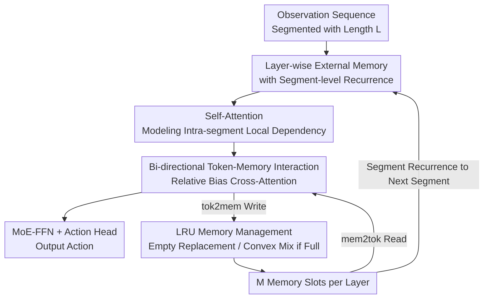

# ELMUR: External Layer Memory with Update/Rewrite for Long-Horizon RL Problems

**Conference**: ICLR2026  
**OpenReview**: [https://openreview.net/forum?id=bm3rbtEMFj](https://openreview.net/forum?id=bm3rbtEMFj)  
**Code**: https://elmur-paper.github.io/  
**Area**: Reinforcement Learning / Long-Horizon Memory / Decision Transformer  
**Keywords**: External Memory, Segment-level Recurrence, LRU, Partially Observable, Imitation Learning

## TL;DR
ELMUR equips **every layer** of a Transformer with a structured external memory. Through bi-directional cross-attention for reading/writing and LRU rules (replacement/convex combination) for maintenance, it achieves a bounded yet persistent memory. It extends the effective memory horizon to 100,000 times the attention window, achieving a 100% success rate on the million-step T-Maze and nearly doubling the success rate of strong baselines in sparse-reward visual robotic manipulation.

## Background & Motivation
**Background**: Real-world robots and control agents often operate in **partially observable** (POMDP) and **long-horizon** environments where critical cues (e.g., "salt has already been added") may appear thousands of steps before they influence a decision. Current decision models, whether RNNs or sequence models like Decision Transformers, primarily rely on a **fixed short observation window** for action prediction.

**Limitations of Prior Work**: Fixed windows lead to three specific issues: (i) extending the context directly via self-attention incurs quadratic complexity costs; (ii) once history is truncated, information outside the window is forgotten; (iii) task-relevant information is difficult to retain under sparse rewards and long horizons. Naive memory extensions (like Transformer-XL, which caches hidden states) fail in the face of scale and sparsity.

**Key Challenge**: A fundamental trade-off exists between "**extending memory horizon**" and "**bounded computation/storage**." Remembering more requires more storage and computation; faster computation requires truncating history, leading to forgetting. RNN-style "updating all memory at every step" continuously dilutes old information, making it hard to maintain long-distance cues stably.

**Goal**: To enable Imitation Learning (IL) / Offline RL policies with **efficient long-term memory**, allowing for correct decision-making in long-horizon, partially observable tasks without complexity exploding with sequence length.

**Key Insight**: Instead of treating memory as "longer context" or "cached activations," the authors implement it as an **explicit, layer-local, readable/writable external storage**. The trajectory is divided into short segments, and **segment-level recurrence** is used to pass this memory between segments, similar to an RNN.

**Core Idea**: Each layer of the Transformer is paired with a **memory track** parallel to the token track. Tokens and memory interact via bi-directional cross-attention. **LRU** (Least Recently Used) rules determine which memory slot to refresh—empty slots are replaced directly, while full slots undergo a convex combination with the least recently used slot, ensuring memory remains both bounded and persistent.

## Method

### Overall Architecture
ELMUR is a GPT-style Transformer decoder where **each layer is split into two coupled tracks**: the **Token Track** processes observations into actions, while the **Memory Track** maintains external memory across segments. The trajectory is divided into segments $S_i$ of length $L$ and processed sequentially. At the end of each segment, token hidden states update the memory of that layer, and the memory is passed (after being detached) to the next segment—this is "segment-level recurrence."

The data flow within a single layer is as follows: observations are encoded into tokens and processed by causal self-attention for intra-segment dependencies. Then, tokens **read** from memory via a **mem2tok** block using cross-attention. After an MoE-FFN, tokens pass through the layers. In parallel, memory is updated by **writing** from tokens via a **tok2mem** block. After an MoE-FFN, the **LRU** block refreshes the memory according to the "fill empty slots first, then convexly mix the least recently used" rule. Both reading and writing incorporate **relative biases** calculated from the difference between token timestamps and memory anchors to maintain temporal consistency across long horizons.

### Key Designs

**1. Layer-wise External Memory and Segment-level Recurrence: Decoupling Persistence from Computation**
Fixed windows either fail to scale due to quadratic complexity or fail to remember due to truncation. ELMUR detaches "long-term memory" from the attention window, creating an external memory $m \in \mathbb{R}^{M\times d}$ (with $M$ slots) held by each layer. The trajectory of length $T$ is split into $S=\lceil T/L\rceil$ segments and processed: $h^{(i)} = \text{TokenTrack}(S_i, \text{sg}(m^{i-1}))$, where $\text{sg}(\cdot)$ denotes a stop-gradient on the previous segment's memory. This treats the Transformer as an **RNN recurring across segments**: using attention within segments and memory transfer between them. Unlike Transformer-XL, which caches historical activations, ELMUR passes **explicit memory managed by read/write policies**, making the complexity dependent only on memory size $M$ rather than sequence length.

**2. Bi-directional Token-Memory Interaction (mem2tok / tok2mem): Reading and Writing**
Read-only memory cannot support long-horizon reasoning. ELMUR enables **bi-directional** interaction. The read path, mem2tok, treats memory as key/values and tokens as queries: $h_{\text{mem2tok}} = \text{AddNorm}(h_{sa} + \text{CrossAttention}(Q{=}h_{sa}, K,V{=}m))$. Using a non-causal mask allows the current prediction to retrieve distant historical events. The write path, tok2mem, reverses this, treating memory as queries and tokens as key/values: $m_{\text{tok2mem}} = \text{AddNorm}(m + \text{CrossAttention}(Q{=}m, K,V{=}h))$, allowing tokens to write salient information back to memory. Both FFNs use DeepSeek-MoE blocks to increase capacity without proportional computational increase (though ablations show standard MLPs maintain accuracy and are faster).

**3. Relative Bias: Temporal Consistency Across Segments**
When memory spans multiple segments, absolute position indices become ambiguous. ELMUR adds a learnable relative bias to cross-attention logits: $\text{Attn}(Q,K) = \frac{QK^\top}{\sqrt{d_h}} + B_{rel}$. $B_{rel}$ is derived from the offset $\Delta = \pm(t-p)$ between token position $t$ and memory anchor $p$ (the slot's last update time), clipped to $[-D_{max}{+}1, D_{max}{-}1]$ and mapped to a learnable embedding table $E$. The read path uses $E[t-p]$ and the write path uses $E[p-t]$, allowing different patterns to be learned: reading favors more recent memories, while writing favors slots aligned with the token time.

**4. LRU Memory Management (Replacement / Convex Combination): Managing Bounded Capacity**
Explicit memory must be bounded. ELMUR uses an **LRU block** to manage $M$ slots per layer. At initialization, slots are empty. While empty slots exist, new content **replaces** them ($\alpha=1$). Once full, the **least recently used** slot is updated via **convex combination**: $m^{i+1}_j = \lambda\, m^{i+1}_{new} + (1-\lambda)\, m^i_j$. $\lambda\in[0,1]$ controls the balance between overwriting and retention. The authors provide theoretical support: old content decays at $(1-\lambda)^k$ after $k$ overwrites, and the effective retention horizon $H(\epsilon)=M\cdot L\cdot\frac{\ln\epsilon}{\ln(1-\lambda)}$ grows **linearly** with slot count $M$ and segment length $L$.

### Loss & Training
Training is entirely **supervised** (Imitation Learning / Behavior Cloning). Mean Squared Error is used for continuous action spaces and Cross-Entropy for discrete spaces. Losses are applied to each processed segment, and gradients are backpropagated through the network. Memory is detached between segments to avoid computational and memory explosions from backpropagation through time.

## Key Experimental Results

### Main Results
Evaluation was conducted on three benchmarks testing memory under partial observability: synthetic T-Maze, MIKASA-Robo (RGB observations + continuous actions + sparse rewards), and 48 POPGym puzzles/control tasks.

| Benchmark | Metric | ELMUR | Prev. SOTA | Description |
|-----------|--------|-------|------------|-------------|
| T-Maze (1M steps) | Success Rate | **100%** | Decays with length | $L{=}10,S{=}3$, horizon ~100k times attention window |
| MIKASA-Robo RememberColor3 | Success Rate | **0.89±0.07** | 0.65±0.04 (RATE) | Visual color recall |
| MIKASA-Robo TakeItBack | Success Rate | **0.78±0.03** | 0.42±0.24 (RATE) | Delayed reversal manipulation |
| POPGym (48 tasks aggregated) | Return | **10.4** | 9.5 (RATE) | Puzzle subset 1.2 vs RATE 0.45 |

In MIKASA-Robo, ELMUR ranked first in 21 out of 23 tasks, with an overall success rate improvement of approximately **70%** over the previous SOTA.

### Ablation Study
Ablations on RememberColor3-v0 (Table 3):

| Configuration | Score | Description |
|---------------|-------|-------------|
| Full ELMUR | 1.00±0.00 | Layer-wise memory + Relative bias + LRU |
| Shared memory | 0.45±0.03 | Memory shared across layers → Significant drop |
| No rel. bias | 0.95±0.05 | Removing relative bias → Minor drop |
| No LRU | 0.43±0.22 | Removing LRU → Stale entries remain, significant drop |
| No rel. bias + No LRU | 0.22±0.11 | Both removed → Retrieval fails |
| MoE → MLP | 1.00±0.00 | Standard MLP maintains accuracy and is faster |

### Key Findings
- **Capacity and LRU are Dominant**: Success rate scales with slot count $M$. Performance is near-perfect when $M\ge N$ (required segments) but crashes if LRU is removed due to stale memory.
- **Convex Mix Coefficient $\lambda$**: Intermediate values ($\lambda\approx0.4$–$0.6$) can be unstable; larger initialization $\sigma$ helps.
- **Layer-local > Shared**: Shared memory performance drops to 0.45, validating the value of per-layer memory.
- **Efficiency**: On T-Maze, ELMUR (2.1M params) achieves 6.8±0.5 ms per step, which is faster than RATE (7.2) and DT (10.7) because complexity scales with memory size, not sequence length.

## Highlights & Insights
- The combination of **"layer-wise external memory + segment-level recurrence"** is highly effective: it detaches memory from the attention window, allowing the memory horizon and computational cost to be cleanly decoupled.
- **LRU borrows cache replacement logic from operating systems** for neural memory management. This ensures bounded capacity while allowing for gradual information decay rather than hard truncation, supported by theoretical bounds on horizon and stability.
- The **bi-directional cross-attention + reversed relative bias** design is transferable to any task requiring a model to read and write to a persistent state (e.g., long-term dialogue, RAG).
- **MoE is optional**: Ablations suggest the memory mechanism itself, rather than parameter scaling, drives performance.

## Limitations & Future Work
- **Pure Imitation/Offline Setting**: Comparison is limited to sequence models and offline RL; online RL and real-robot experiments (to account for latency and safety) are naturally excluded.
- **Expert Demo Dependency**: As an IL method, performance is bounded by the quality of demonstrations.
- **Hyperparameter Sensitivity**: Stability issues with intermediate $\lambda$ values and the requirement that $M \ge N$ necessitate capacity estimation before deployment.
- **Conservative Theory**: The linear horizon $H(\epsilon)$ is a lower bound; actual performance is often better, suggesting an explanatory gap between theory and practice.

## Related Work & Insights
- **vs Transformer-XL**: While both use segment-level recurrence, XL caches hidden state activations passively. ELMUR passes **explicit, LRU-managed** external memory, enabling much longer horizons.
- **vs Decision Transformer / RATE**: These are memory-augmented policies but are limited by fixed windows or weaker memory mechanisms. ELMUR's layer-wise memory nearly doubles success rates on MIKASA-Robo.
- **vs DMamba (SSM)**: SSMs use recurrent states, but the memory is an implicit continuous state. ELMUR uses discrete bounded slots with LRU for explicitly controllable capacity.
- **vs RNNs**: RNNs dilute old information by updating all units at every step. ELMUR refreshes only one slot per segment, **precisely retaining** others until replacement.

## Rating
- Novelty: ⭐⭐⭐⭐⭐ 
- Experimental Thoroughness: ⭐⭐⭐⭐ 
- Writing Quality: ⭐⭐⭐⭐⭐ 
- Value: ⭐⭐⭐⭐⭐ 

<!-- RELATED:START -->

## Related Papers

- [\[ICLR 2026\] Recurrent Action Transformer with Memory](recurrent_action_transformer_with_memory.md)
- [\[ICLR 2026\] Strict Subgoal Execution: Reliable Long-Horizon Planning in Hierarchical Reinforcement Learning](strict_subgoal_execution_reliable_long-horizon_planning_in_hierarchical_reinforc.md)
- [\[ICLR 2026\] RLVMR: Reinforcement Learning with Verifiable Meta-Reasoning Rewards for Robust Long-Horizon Agents](rlvmr_reinforcement_learning_with_verifiable_meta-reasoning_rewards_for_robust_l.md)
- [\[ICLR 2026\] RD-HRL: Generating Reliable Sub-Goals for Long-Horizon Sparse-Reward Tasks](rd-hrl_generating_reliable_sub-goals_for_long-horizon_sparse-reward_tasks.md)
- [\[ICML 2026\] Long-Horizon Model-Based Offline Reinforcement Learning Without Explicit Conservatism](../../ICML2026/reinforcement_learning/long-horizon_model-based_offline_reinforcement_learning_without_explicit_conserv.md)

<!-- RELATED:END -->
