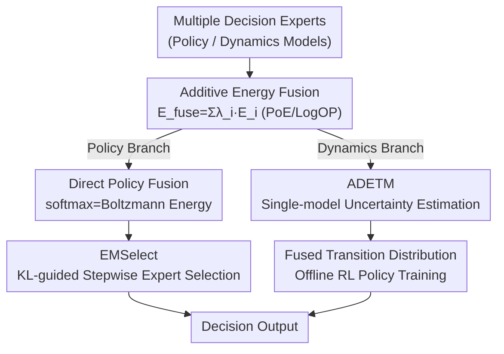

# EMFuse: Energy-based Model Fusion for Decision Making

**Conference**: ICLR2026  
**OpenReview**: [https://openreview.net/forum?id=6wDp8XRmNI](https://openreview.net/forum?id=6wDp8XRmNI)  
**Code**: https://github.com/LAMDA-RL/EMFuse  
**Area**: Reinforcement Learning / Decision Intelligence / Model Fusion  
**Keywords**: Energy-based Models, Model Fusion, Offline Reinforcement Learning, Product of Experts (PoE), Uncertainty Estimation

## TL;DR
EMFuse unifies "direct policy fusion" and "dynamics model fusion"—two seemingly distinct tasks—under the framework of Energy-based Models (EBM). Summing energies is equivalent to multiplying distributions (Product of Experts, PoE). This enables training-free fusion of multiple LLM experts during inference and utilizes a new ADETM architecture to bypass the exponential explosion in fusing dynamics ensembles. It achieves improvements of 0.34%–6.63% on discrete decision benchmarks and adds 2.3–7.4 normalized points on D4RL continuous control tasks.

## Background & Motivation
**Background**: Model fusion is a resource-efficient paradigm that combines existing pre-trained experts into a stronger system without training from scratch. Methods such as parameter-space averaging (Model Soup), weighted merging via aligned statistics (RegMean), and inference-time logit fusion (PackLLM) have performed well on general tasks.

**Limitations of Prior Work**: Most existing methods target general text tasks, with little research on fusion specifically for the "decision-making" domain. The behavior of decision agents is determined by two components: either a directly learned policy $\pi(a\mid s)$, or an induced policy derived from a learned dynamics model $p(s'\mid s,a)$. This creates two seemingly unrelated sub-problems: **direct policy fusion** (combining output distributions of multiple policies) and **dynamics model fusion** (combining multiple predictive understandings of the environment into a more reliable simulator). These have traditionally been researched separately, lacking a unified language.

**Key Challenge**: A more critical issue is the computational cost of dynamics fusion. Model-based offline RL (MBRL) typically trains an **entire ensemble** of models on the same data for robust uncertainty estimation. Fusing multiple ensembles across domains leads to a complexity that explodes exponentially—combining $n$ domains with $K$ ensemble members each results in a massive number of combinations.

**Goal**: (1) Identify a unified principle covering both policy and dynamics fusion; (2) Reduce the cost of uncertainty estimation in dynamics fusion from "one ensemble per domain" to "one model per domain" to avoid exponential explosion.

**Key Insight**: The authors observe that Energy-based Models possess an elegant property: **the linear summation of independent expert energies corresponds to the product of unnormalized densities**. Whether it is policy output or dynamics likelihood, both can be expressed as $p(y\mid x)=\exp(-E(x,y))/Z(x)$. Thus, "fusion" naturally becomes an energy summation $E_{\text{fuse}}=\sum_i \lambda_i E_i$.

**Core Idea**: Treat energy as the "universal currency" for fusion. Policy fusion and dynamics fusion are simply two instances of the same additive energy law applied to different $(x,y)$ pairs and different samplers.

## Method

### Overall Architecture
The skeleton of EMFuse is a single rule: given a set of expert energies $\{E_i(x,y)\}_{i=1}^n$, each defining a normalized conditional distribution $p_i(y\mid x)=\exp(-E_i)/Z_i$, fusion is performed using non-negative weights $\lambda_i$ where $\sum \lambda_i = 1$:

$$E_{\text{fuse}}(x,y)=\sum_{i=1}^{n}\lambda_i E_i(x,y),\qquad p_{\text{fuse}}(y\mid x)\propto\prod_{i=1}^{n}p_i(y\mid x)^{\lambda_i}.$$

This is precisely the **Log Opinion Pool** (LogOP, or geometric mixture) and the unique optimal solution for the weighted reverse KL projection $\arg\min_q\sum_i\lambda_i \mathrm{KL}(q\Vert p_i)$, equivalent to the **Product of Experts (PoE)** in probability space. This rule is application-agnostic; instantiating $E_i$ as different objects leads to two branches: setting $E_i$ as the negative log-probability of an LLM leads to direct policy fusion, while setting $E_i$ as the transition energy of an Energy-based Transition Model (ETM) leads to dynamics fusion. The policy branch derives a selection algorithm called EMSelect, while the dynamics branch utilizes a new architecture, ADETM, to provide ensemble-level uncertainty from a single model per domain.

### Key Designs

**1. Additive Energy Fusion: Unifying Policy and Dynamics Fusion via Energy Summation**

This is the foundation of the paper, addressing the lack of commonality between the two types of fusion. EBMs represent distributions via unnormalized energy $p_\theta(x)\propto\exp(-E_\theta(x))$. When combining independent experts, linear energy summation $\Leftrightarrow$ unnormalized density multiplication. The authors define fusion as $E_{\text{fuse}}=\sum_i\lambda_i E_i$, corresponding to $p_{\text{fuse}}\propto\prod_i p_i^{\lambda_i}$. This offers two advantages: **unification**—as long as experts can be written as $\exp(-E)/Z$ (policies, dynamics likelihoods, and behavior priors $E_{\beta}(s,a)=-\log\pi_\beta(a\mid s)$ all can), they are instances of this law; and **robustness**—from the LogOP perspective, fusion acts as a "conservative consensus / AND gate" between experts. If any expert assigns a very low probability to a token, that token is exponentially suppressed in the fused distribution, preventing a single misaligned expert from disrupting the overall decision.

**2. Direct Policy Fusion: LLM Softmax Outputs as Natural Boltzmann Energies**

This design applies the abstract law to LLMs, targeting training-free combination of multiple language policy experts. The key observation is that autoregressive models map context $x_{\le t}$ to logits $z_t$, and applying softmax with temperature $\tau$ yields the next-token distribution $p_\theta(y_t\mid x_{\le t})=\mathrm{softmax}(z_t/\tau)$, which **exactly equals** a Boltzmann distribution with energy $E_\theta(x_{\le t},y)=-z_t(y)/\tau$. Log-probabilities are simply energies (negative and with a normalization constant), which is the exact form needed for additive fusion. Consequently, fusion can be computed in log-space: $\ell_{\text{fuse}}=\sum_i\lambda_i\,\mathrm{logsoftmax}(z_i/\tau_i)$, followed by renormalization. This assumes experts share a vocabulary $V$ (same tokenizer or vocabulary mapping). An auxiliary benefit: scale distortion from vocabulary mapping results in a flatter (higher entropy) energy surface; in PoE, such flat distributions are automatically downweighted in favor of sharper, more confident native experts, effectively filtering mapping noise for free. Uniform weights are used by default.

**3. EMSelect: Stepwise Expert Selection Guided by the Fused Distribution**

While EMFuse provides a "conservative consensus," this consensus often remains **close** in KL divergence to the most contextually relevant expert. EMSelect uses the fused distribution as a reference to select the best expert at each decoding step. For two experts, a pairwise fusion $p_{i\oplus j}\propto p_i^\alpha p_j^{1-\alpha}$ (default $\alpha=\tfrac12$) is calculated, and the expert with the smaller KL divergence is chosen: $\text{select }i \iff \mathrm{KL}(p_{i\oplus j}\Vert p_i)\le\mathrm{KL}(p_{i\oplus j}\Vert p_j)$. Since the entropy terms in $\mathrm{KL}(p\Vert q)=\mathbb{E}_p[\log p-\log q]$ cancel out, the criterion simplifies to choosing the expert with the higher expected log-likelihood under the pairwise fusion: $\mathbb{E}_{p_{i\oplus j}}[\log p_i]\ge\mathbb{E}_{p_{i\oplus j}}[\log p_j]$. For $n$ experts, a lightweight "tournament" is run. The authors provide theoretical guarantees: the KL divergence between the sequence distribution induced by EMSelect and the EMFuse consensus is bounded by the sum of stepwise worst-case divergences $\Delta_t^{\max}$ (measured KL < 0.09 in practice). This means EMSelect is "tethered" to the conservative EMFuse geometry, allowing local utilization of sharper experts while constraining sequence-level deviation via consensus.

**4. ADETM: Ensemble-level Uncertainty from a Single Model**

The hurdle for dynamics fusion is the ensemble: traditional MBRL relies on ensembles for uncertainty, but fusing multiple ensembles leads to exponential explosion. The ADETM (Any-step Dynamics Energy-based Transition Model) approach obtains ensemble-like robust uncertainty using only **one model per domain**. It retains the energy backbone and training recipe of ETM (Contrastive/InfoNCE objective, Langevin sampling) but wraps it in two encoders: an MLP state encoder and a multi-head attention action encoder for fixed-length historical sequences (with valid-length masking), producing a joint embedding $[h_s\Vert h_a]$ to condition the transition energy $E_\theta(s,a_{t-k:t},s')$. Uncertainty is derived not from multiple models but from **stacked historical slices**: multiple valid historical slices are constructed from a FIFO queue of the $k$ most recent $(s, a)$ pairs, all predicting the same target step $\hat s_{t+1}^{(m)}$. The divergence between these predictions serves as the uncertainty score:

$$u_\theta(s_t,a_t)=\frac{1}{k}\sum_{m=1}^{k}\big\Vert \hat s_{t+1}^{(m)}-\bar s_{t+1}\big\Vert_2^2,\qquad \bar s_{t+1}=\frac{1}{k}\sum_{m=1}^{k}\hat s_{t+1}^{(m)}.$$

This "historical sensitivity divergence" behaves similarly to ensemble disagreement but requires only one ADETM. Thus, the rollout cost of EMFuse scales only with the **number of experts**, independent of ensemble size. The fused transition distribution $p_{\text{fuse}}(s'\mid s,a)$ and ADETM uncertainty are then used in an offline RL loop (training a policy via SAC on generated rollouts).

### Loss & Training
ADETM follows the ETM training procedure—optimizing transition energy via Contrastive/InfoNCE objectives, with Langevin sampling used for both training and diagnostics. For policy learning, SAC is trained on rollouts generated by ADETM. The policy fusion branch (LLM) is entirely training-free: after SFT is performed for experts individually, they are fused at inference via energy summation with default uniform weights $\lambda_i=1/n$.

## Key Experimental Results

### Main Results
LLMs from two families were used: Family L (Llama, to measure distribution fidelity) and Family Q (Qwen, for OpenCompass task accuracy); dynamics were tested on D4RL MuJoCo medium.

| Benchmark | Metric | EMFuse | EMSelect | Strongest Baseline |
|------|------|--------|----------|----------|
| OpenCompass Mix | Avg Accuracy | 63.49 | **64.80** | PackLLM 63.15 |
| OpenCompass Finance | Avg Accuracy | 89.21 | **90.39** | PackLLM 88.27 |
| D4RL MuJoCo (3-env avg) | IQM Norm. Return | **50.1** | — | Mixed Oracle 47.8 |

D4RL environment breakdown (5 seeds, IQM): Hopper 49.03 / Walker2d 59.53 / HalfCheetah 41.83, mean 50.1, surpassing RegMean 43.8, Soup 42.7, and slightly exceeding the Oracle baseline 47.8 trained on mixed data.

### Ablation Study

| Configuration | Key Metric | Description |
|------|---------|------|
| EMFuse (Fusion only) | Mix 63.49 / Finance 89.21 | Conservative consensus |
| + EMSelect | +1.31 / +1.18 | Stepwise selection further improves results |
| Entropy Adaptive Weights | Statistically Insignificant | Hence uniform weights are default |
| Laplace Smoothing | Negligible Gain | Prevents product collapse but offers minor benefit |

### Key Findings
- **Distribution Fidelity (RQ2)**: Token-level KL from each 1B domain expert to EMFuse is only ≈0.04–0.08, significantly smaller than the ≈0.20–0.59 to its 8B family model. This indicates fusion preserves in-domain token probabilities more faithfully than simply increasing capacity, validating the "small KL" premise for EMSelect.
- **Non-uniform Benefits of EMSelect**: Improvement is concentrated in Finance (FPB +2.07, LendingClub +1.42) and Medicine (MedQAM +2.68), while some math sets saw slight regressions (MGSMZ −2.40). The authors explain that local selection is most beneficial when "expert specialization is strong + calibration is similar."
- **ADETM Efficiency**: Reduces dynamics fusion cost from "ensemble size" to "number of experts," resulting in significantly fewer parameters, lower FLOPs, and reduced rollout latency.

## Highlights & Insights
- **The "Energy as Universal Currency" abstraction is elegant**: Conceptualizing policy fusion (discrete tokens) and dynamics fusion (continuous states) as instances of a single additive energy law is a powerful unification.
- **The softmax = Boltzmann energy equivalence is practical**: Any LLM experts sharing a vocabulary can be fused training-free in log-space with a single line of code. The PoE "AND gate" property inherently provides robustness against misaligned experts and vocabulary mapping noise.
- **ADETM replaces ensemble disagreement with "prediction divergence of stacked historical slices"**: This ingenious translation of "ensemble uncertainty" into "single-model temporal consistency" is transferable to any world model scenario where ensemble overhead is a concern.
- **Theoretical "Tethering" for EMSelect**: Using the KL chain rule to bound sequence deviations of stepwise selection within the consensus geometry provides a provable trade-off between "sharpness" and "stability."

## Limitations & Future Work
- **Heterogeneous Evaluation**: Family Q used Accuracy (OpenCompass) while Family L used Preference (AlpacaEval). The authors avoid cross-family absolute comparisons, analyzing each protocol independently.
- **KL Analysis Limited to Family L**: To ensure a shared tokenizer, distribution fidelity experiments were restricted to the Llama family; scaling this to other families is left for future work due to compute constraints.
- **High Variance in Offline RL**: Some environments (e.g., Walker2d) show wide confidence intervals; conclusions rely on aggregated IQM and single-task results should be interpreted cautiously.
- **EMSelect Generality**: Performance dropped on math sets, as the method assumes "strong expert specialization + similar calibration."
- **Baseline Scope**: Comparison is limited to training-free mergers (Soup/RegMean) and logit fusion (PackLLM); fusion methods requiring fine-tuning or additional data were not included.

## Related Work & Insights
- **vs Model Soup / RegMean**: While those methods perform averaging or alignment in parameter space, EMFuse performs PoE fusion in energy (output distribution) space. EMFuse is more robust on decision tasks and preserves in-domain distributions but requires shared support (vocabulary/state-action spaces).
- **vs PackLLM**: Both involve logit-space fusion at inference. PackLLM’s pairwise packing inspired the tournament design in EMSelect; EMFuse integrates this into a unified energy/PoE framework with KL-guided selection and theoretical bounds.
- **vs Classic PoE (Hinton 2002)**: EMFuse essentially brings the classic Product of Experts to decision scenarios, unifying policy and dynamics fusion under one law for the first time.
- **vs ADMPO (Lin et al. 2025)**: ADETM leverages the idea of "single-model uncertainty via variable-length input," but implements it on Energy-based Transition Models (ETM) using historical slice divergence for dynamics fusion.

## Rating
- Novelty: ⭐⭐⭐⭐⭐ Unifying policy and dynamics fusion via EBMs and additive energy is a clean perspective with strong derivatives (EMSelect/ADETM).
- Experimental Thoroughness: ⭐⭐⭐⭐ Validated across LLM and offline RL tracks, though limited by high variance in some environments and cross-family incomparability.
- Writing Quality: ⭐⭐⭐⭐ Clear framework and derivations, though some results and encoder details are relegated to the appendix.
- Value: ⭐⭐⭐⭐ Training-free fusion and skipping ensemble explosion provide significant practical value for model reuse in decision agents.

<!-- RELATED:START -->

## Related Papers

- [\[ICLR 2026\] Bayesian Ensemble for Sequential Decision-Making](bayesian_ensemble_for_sequential_decision-making.md)
- [\[ICLR 2026\] Ada-Diffuser: Latent-Aware Adaptive Diffusion for Decision-Making](ada-diffuser_latent-aware_adaptive_diffusion_for_decision-making.md)
- [\[ICLR 2026\] Information-based Value Iteration Networks for Decision Making Under Uncertainty](information-based_value_iteration_networks_for_decision_making_under_uncertainty.md)
- [\[ICLR 2026\] Offline Reinforcement Learning with Adaptive Feature Fusion](offline_reinforcement_learning_with_adaptive_feature_fusion.md)
- [\[NeurIPS 2025\] Structured Reinforcement Learning for Combinatorial Decision-Making](../../NeurIPS2025/reinforcement_learning/structured_reinforcement_learning_for_combinatorial_decision-making.md)

<!-- RELATED:END -->
