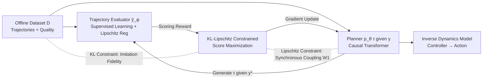

# Enhancing Generative Auto-bidding with Offline Reward Evaluation and Policy Search

**Conference**: ICLR 2026  
**OpenReview**: [https://openreview.net/forum?id=kMuQBgPIdg](https://openreview.net/forum?id=kMuQBgPIdg)  
**Code**: To be confirmed  
**Area**: Offline Reinforcement Learning / Generative Decision Making / Computational Advertising (Auto-bidding)  
**Keywords**: auto-bidding, generative planning, offline RL, trajectory evaluator, KL-Lipschitz constraint, score maximization  

## TL;DR
Ours proposes AIGB-Pearl, equipping "Generative Auto-bidding" (AIGB) with a trajectory evaluator as an offline reward signal. It utilizes a theoretically guaranteed **KL-Lipschitz constrained score-maximization** to enable the generative planner to safely explore high-quality trajectories beyond the offline dataset, thereby breaking the performance ceiling of pure imitation learning.

## Background & Motivation
**Background**: Auto-bidding models the advertiser's problem of maximizing exposure value under budget constraints as an offline sequential decision task (MDP, where states include time steps, cumulative spend ratios, and advertiser features; actions are bidding scaling factors). Due to safety concerns in online systems, learning is restricted to static historical datasets. Recent state-of-the-art (SOTA) paradigms include **AIGB (AI-Generated Bidding)**, which treats bidding as a trajectory generation task. It uses conditional generative models (e.g., the diffusion model DiffBid or Causal Transformer DT) to fit the "conditional trajectory distribution given trajectory quality $y$" $p_\theta(\tau|y)$. During inference, it generates high-quality trajectories by providing a target condition $y^*=(1+\epsilon)y_m$ slightly higher than the dataset optimum, then recovers actions using an inverse dynamics model. AIGB avoids TD bootstrapping, resulting in more stable training and performance exceeding traditional offline RL.

**Limitations of Prior Work**: AIGB is essentially **conditional behavior cloning (imitation)** of the offline dataset, lacking performance feedback to guide improvements in generation quality. Once the target condition reaches the extrapolation region ($y^*>y_m$, i.e., "better than the best seen trajectory"), the generation lacks a reliable basis. This can lead to degradation or the production of risky trajectories (e.g., overspending, poor pacing, or unspent budgets) without any theoretical guarantees.

**Key Challenge**: The intent is to add reward guidance to AIGB to explore superior trajectories beyond the dataset. However, (i) **AIGB lacks reward signals**, and generation quality is unknown during training; (ii) **no offline RL algorithms are specifically tailored for AIGB**. Directly maximizing an evaluator as a reward triggers the notorious OOD (Out-of-Distribution) problem, where the evaluator becomes unreliable outside the data support, potentially leading to financial losses in risk-sensitive advertising scenarios.

**Goal / Core Idea**: **Inject rewards into AIGB using a supervised trajectory evaluator and restrict "exploration" within a certified trust region where the evaluator is reliable.** Specifically, Ours theoretically analyzes the upper bound of the evaluator's bias to design a KL-Lipschitz constrained score-maximization objective with a sub-optimality bound. This is accompanied by a practical algorithm that ensures the Lipschitz regularity of the generative model using synchronous coupling techniques.

## Method

### Overall Architecture
AIGB-Pearl consists of two synergistic components: a **trajectory evaluator** $\hat{y}_\phi(\tau)$ that fits trajectory quality $y(\tau)=\sum_t \bar r_t$ via supervised learning on the offline dataset to score generated trajectories as rewards; and a **planner** $p_\theta(\tau|y)$ (Causal Transformer) that maximizes the score of generated trajectories $L(\theta)=\mathbb{E}_{\tau\sim p_\theta(\tau|y^*)}[\hat y_\phi(\tau)]$ while the evaluator is fixed. Crucially, this score-maximization is not unconstrained; it is dual-locked within the evaluator's reliable region by a KL constraint (maintaining imitation fidelity to offline data) and a Lipschitz constraint (limiting the sensitivity of generation to the condition).

### Key Designs

**1. Trajectory Evaluator: Extracting Missing Reward Signals.** Since AIGB lacks rewards, the first step of AIGB-Pearl is training an evaluator to estimate trajectory quality. It fits the ground truth by minimizing $\min_\phi \mathbb{E}_{\tau\sim D}[(\hat y_\phi(\tau)-y(\tau))^2]$. To ensure reliability during guided exploration, Ours (Theorem 1) proves that the true trajectory quality $y(\tau)$ is $\sqrt{T}R_m$-Lipschitz continuous with respect to the Frobenius norm ($R_m$ is the upper bound of single-exposure ROI, $T$ is steps). Thus, a Lipschitz penalty is added to the evaluator loss: $l_e(\phi)=\mathbb{E}_{\tau\sim D}[(\hat y_\phi(\tau)-y(\tau))^2]+\beta_1\mathbb{E}_{\tau_1,\tau_2}[\,|\hat y_\phi(\tau_1)-\hat y_\phi(\tau_2)|-\sqrt{T}R_m\|\tau_1-\tau_2\|_F\,]_+$. This prevents drastic numerical jumps in OOD regions, supporting more reliable extrapolation (enhanced by LLM embeddings and pairwise learning).

**2. KL-Lipschitz Constrained Score-maximization: Locking Exploration in the Certified Neighborhood.** Directly maximizing the evaluator score $L(\theta)$ can be misled by generalization errors. The core theory (Theorem 2) provides an upper bound on the bias between the planner score $L(\theta)$ and true performance $J(\theta)=\mathbb{E}_{\tau\sim p_\theta(\tau|y^*)}[y(\tau)]$, decomposed into three parts: evaluator training error $\delta_D$, **generation sensitivity** of the planner to condition $y$ (a 1-Wasserstein term), and **imitation error** of the planner on $D$ (another Wasserstein term). To control this bias, the latter two are constrained—the former by the planner's Lipschitz constant $\mathrm{Lip}_{W_1}(p_\theta)\le L_p$, and the latter by a KL divergence constraint $\mathbb{E}_{y\sim p_D}[D_{KL}(p_D(\tau|y)\,\|\,p_\theta(\tau|y))]\le \delta_K$. The unconstrained objective is rewritten as:

$$\max_\theta L(\theta)\quad \text{s.t.}\quad \mathbb{E}_{y}[D_{KL}(p_D(\tau|y)\|p_\theta(\tau|y))]\le\delta_K,\quad \mathrm{Lip}_{W_1}(p_\theta(\tau|y))\le L_p.$$

Intuitively (Remark 1), the KL constraint keeps the generation close to the offline dataset for conditional behavior cloning, while the Lipschitz constraint ensures that generation under $y^*$ stays within a radius $\epsilon L_p y_m$ of the dataset's optimal trajectories. Together, they bound exploration within the "D-neighborhood" where the evaluator remains accurate.

**3. Sub-optimality Bound: Theoretical Guarantees for Safe Exploration.** Ours further proves (Theorem 3) that the performance gap between the constrained solution $\hat\theta$ and the true optimum $\theta^*$ is explicitly bounded: $J(\theta^*)-J(\hat\theta)\le 2\delta_D+(1+2k)\sqrt{T}R_m(\sqrt{\delta_M}+\sqrt{\delta_K}+(1+\epsilon)y_m L_p)$, where $k$ measures the evaluator's violation of the Lipschitz constraint. This bound reveals a clear trade-off: smaller evaluator training error $\delta_D$, $k$ closer to 1, behavior cloning error $\delta_K$, and Lipschitz constant $L_p$ lead to a smaller sub-optimality gap. However, $L_p$ cannot be too small (otherwise it fails to clone $D$, increasing $\delta_K$), so Ours utilizes the theoretical lower bound of $L_p$ (the Lipschitz constant of the offline conditional distribution $p_D(\tau|y)$).

**4. Synchronous Coupling Wasserstein: Practical Lipschitz Constraints.** The planner loss $l_p(\theta)$ converts the constraints into three terms: the negative score $-L(\theta)$, the conditional behavior cloning term (KL), and the Lipschitz penalty. The challenge lies in calculating $W_1(p_\theta(\tau|y_1),p_\theta(\tau|y_2))$ exactly. Ours adopts an upper bound $\hat W_1$ from a specific coupling as a sufficient condition and utilizes **synchronous coupling**—where trajectories under conditions $y_1$ and $y_2$ share the same Gaussian noise sequence $\{\eta_1,\dots,\eta_T\}$. This aligns randomness and eliminates spurious variance, making the bound tighter: $\hat W_1(y_1,y_2;\theta)=\sum_t\|\mu_\theta(s^1_{1:t},y_1,t)-\mu_\theta(s^2_{1:t},y_2,t)\|$ (with fixed variance). This step transforms the theoretical Lipschitz requirement into a differentiable training penalty.

## Key Experimental Results

### Main Results
Simulation environment (30 advertisers, 4 budget levels, GMV metric, ∆ represents relative Gain over the strongest baseline):

| Budget | IQL | DT | DiffBid | **AIGB-Pearl** | ∆ |
|---|---|---|---|---|---|
| 1.5k | 456.80 | 477.39 | 480.76 | **502.98** | +4.62% |
| 2.0k | 486.56 | 507.30 | 511.17 | **521.84** | +2.09% |
| 2.5k | 518.27 | 527.88 | 531.29 | **545.03** | +2.59% |
| 3.0k | 549.19 | 550.66 | 556.32 | **574.17** | +3.21% |

Real-world A/B testing (Taobao, 6k advertisers, 19 days): Compared to DiffBid, GMV **+3.00%**, BuyCnt +2.20%, ROI +1.89%, while Cost fluctuation was only +1.10% (within the 2% tolerance band). For USCB, GMV increased by +3.43% and ROI by +4.24%.

### Ablation Study
Real-world A/B testing (6k advertisers, 8 days) removing constraints step-by-step:

| Variant | GMV ∆ | ROI ∆ |
|---|---|---|
| with KL (vs w/o KL) | +1.09% | +0.08% |
| with Lipschitz (vs w/o Lipschitz) | +1.81% | +1.05% |

The KL constraint contributes +1.1% GMV, and the Lipschitz constraint contributes +1.8% GMV; both are effective.

### Key Findings
- **Generalization**: On 4k new advertisers not included in the generative offline data, AIGB-Pearl still outperformed DiffBid by +3.32% GMV and DT by +3.08%, indicating that reward-guided exploration brings true generalization rather than just overfitting.
- **Net Gain from Planner**: Since AIGB-Pearl and DiffBid share the same inverse dynamics controller, all performance gains stem entirely from the planner's score-maximization training.
- **Visual Verification of Constraints**: Trajectories generated without KL+Lipschitz constraints exhibited pathological behaviors (overspending, reversed pacing, unspent budgets) and deviated from offline optimal trajectories, justifying the necessity of the constraints.
- **Business Impact**: On a platform like Taobao, a GMV increase of >2% is "highly significant," translating to millions of RMB in daily incremental revenue; the TargetROAS variant reached +5% GMV.

## Highlights & Insights
- **Suturing Generative Planning and Policy Optimization**: AIGB is stable but limited to imitation; offline RL offers optimization but suffers from TD instability. Ours takes the best of both by using "supervised evaluator as reward + constrained score-maximization," maintaining stability without bootstrapping while re-introducing performance-driven exploration.
- **Theoretical and Engineering Feedback Loop**: The logic flows from Lipschitzness of $y(\tau)$ (Thm 1) → Evaluator bias bound (Thm 2) → Sub-optimality bound (Thm 3) → Synchronous coupling implementation. Every constraint is theoretically justified rather than heuristically added. This is a rare example of "provably safe extrapolation" in auto-bidding.
- **Ingenuity of Synchronous Coupling**: Using shared noise to align the stochasticity of two conditional trajectories transforms the difficult-to-compute Wasserstein distance into a differentiable mean difference, which is the key trick for engineering the Lipschitz constraint.
- **Safety in Risk-Sensitive Scenarios**: Explicitly locking exploration within the "evaluator-reliable D-neighborhood" is more targeted than general conservative offline RL, specifically for the advertising domain where errors result in immediate financial loss.

## Limitations & Future Work
- **Dependency on Evaluator Quality**: The tightness of the entire theory depends on the evaluator training error $\delta_D$ and Lipschitz violation $k$. If the evaluator fits poorly for certain advertisers, safety guarantees relax. Remedies like LLM embeddings were used, but the failure boundaries require more discussion.
- **Hyperparameter Coupling**: $\epsilon, \delta_K, L_p, \beta_1, \beta_2, \beta_3$ are interdependent. The tuning cost and transferability to new platforms require further explanation.
- **Exploration Restricted by Offline Data**: The method is essentially "safe extrapolation within the D-neighborhood." Whether it can generalize to market structure changes (e.g., drastic shifts in bidding environments) not covered by offline data remains to be verified.
- **Synchronous Coupling as an Approximation**: Using $\hat W_1$ as a proxy for the Wasserstein upper bound is a sufficient condition but not exact. The constraint may be overly conservative.

## Related Work & Insights
- **AIGB / Generative Decision Making**: DiffBid (diffusion conditional generation) and Decision Transformer (DT, causal transformer behavior cloning) are direct predecessors. Ours upgrades them from "pure imitation" to "constrained optimization with rewards."
- **Offline RL**: BCQ/CQL/IQL (model-free) and MOPO/MORL (model-based) mitigate OOD issues through conservative policy search but suffer from TD bootstrapping instability. Ours provides an alternative "stable + optimizable" path by avoiding TD.
- **Broader Implications**: The combination of "supervised evaluator + KL-Lipschitz constrained score-maximization + synchronous coupling" is a relatively general recipe for the safe extrapolation of conditional generative models, potentially transferable to other risk-sensitive offline decision-making tasks (recommendation, operations research, robotics).

## Rating
- **Novelty**: ⭐⭐⭐⭐ Injecting evaluator rewards into AIGB and equipping the generative planner with KL-Lipschitz constrained exploration with sub-optimality bounds is a rare "provably safe" combination in auto-bidding.
- **Experimental Thoroughness**: ⭐⭐⭐⭐ Includes simulations, large-scale Taobao A/B tests (6k/4k advertisers, 19 days), generalization tests, and ablation studies. The business scale is convincing, though hyperparameter sensitivity analysis is relatively light.
- **Writing Quality**: ⭐⭐⭐⭐ Logical flow from limitations and contradictions to theory and algorithm. Theoretical parts are dense but well-supported by theorems and remarks.
- **Value**: ⭐⭐⭐⭐ Highly deployable in industry, with significant GMV gains on massive platforms. The paradigm is instructive for other offline generative decision tasks.

<!-- RELATED:START -->

## Related Papers

- [\[ICLR 2026\] GAS: Enhancing Reward-Cost Balance of Generative Model-assisted Offline Safe RL](gas_enhancing_reward-cost_balance_of_generative_model-assisted_offline_safe_rl.md)
- [\[ICML 2026\] DRIVE: Distributional and Retrieval-Augmented Bidding with Value Evaluation](../../ICML2026/reinforcement_learning/drive_distributional_and_retrieval-augmented_bidding_with_value_evaluation.md)
- [\[ICLR 2026\] Preference-based Policy Optimization from Sparse-reward Offline Dataset](preference-based_policy_optimization_from_sparse-reward_offline_dataset.md)
- [\[ICLR 2026\] BA-MCTS: Bayes Adaptive Monte Carlo Tree Search for Offline Model-based RL](bayes_adaptive_monte_carlo_tree_search_for_offline_model-based_reinforcement_lea.md)
- [\[ICLR 2026\] A Unifying View of Coverage in Linear Off-Policy Evaluation](a_unifying_view_of_coverage_in_linear_off-policy_evaluation.md)

<!-- RELATED:END -->
## Related Papers

- [\[ICLR 2026\] GAS: Enhancing Reward-Cost Balance of Generative Model-assisted Offline Safe RL](gas_enhancing_reward-cost_balance_of_generative_model-assisted_offline_safe_rl.md)
- [\[ICLR 2026\] Preference-based Policy Optimization from Sparse-reward Offline Dataset](preference-based_policy_optimization_from_sparse-reward_offline_dataset.md)
- [\[ICML 2026\] DRIVE: Distributional and Retrieval-Augmented Bidding with Value Evaluation](../../ICML2026/reinforcement_learning/drive_distributional_and_retrieval-augmented_bidding_with_value_evaluation.md)
- [\[ICLR 2026\] A Unifying View of Coverage in Linear Off-Policy Evaluation](a_unifying_view_of_coverage_in_linear_off-policy_evaluation.md)
- [\[ICLR 2026\] GRACE: Generative Representation Learning via Contrastive Policy Optimization](grace_generative_representation_learning_via_contrastive_policy_optimization.md)

<!-- RELATED:END -->
