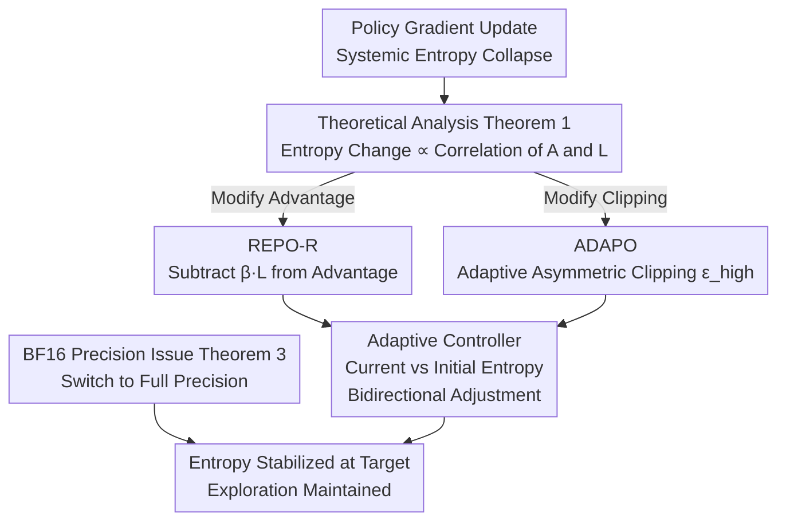

# Entropy-Preserving Reinforcement Learning (REPO / ADAPO)

**Conference**: ICLR 2026  
**arXiv**: [2603.11682](https://arxiv.org/abs/2603.11682)  
**Code**: None  
**Area**: Reinforcement Learning / LLM Training  
**Keywords**: Entropy Preservation, Policy Gradient, LLM Post-training, GRPO, Exploration  

## TL;DR
This paper reveals the theoretical root cause of systemic policy entropy collapse in policy gradient RL algorithms during LLM post-training (the positive correlation between advantage functions and log-probabilities). It proposes two complementary solutions: REPO (decorrelation by modifying the advantage function) and ADAPO (adaptive asymmetric clipping), achieving SOTA performance on interactive tool-use tasks.

## Background & Motivation

**Background**: Policy gradient algorithms such as GRPO, PPO, and RLOO are widely used for RL post-training to enhance LLM reasoning capabilities. DAPO introduced asymmetric clipping for implicit entropy preservation, while GSPO utilized sequence-level clipping.

**Limitations of Prior Work**: Policy gradient updates systematically collapse policy entropy—models concentrate probability on correct solutions they already assign high probability to, ignoring other equally correct but lower-probability solutions. Consequences include improved pass@1 but decreased pass@k, loss of exploration capability, and failure in sequential learning (inability to continue fine-tuning on new tasks).

**Key Challenge**: When a model is already "calibrated" to rewards (high-reward actions have high probabilities), policy gradient updates naturally sharpen the distribution and reduce entropy. This is an intrinsic property of policy gradients rather than a bug.

**Key Insight**: By theoretically characterizing the entropy change per update step, it was found to be proportional to the correlation between the advantage function and the log-probability. Entropy can be preserved by breaking this correlation.

**Core Idea**: Remove the correlation leading to entropy collapse by modifying the advantage function (subtracting a term proportional to the log-prob) while maintaining the direction of policy improvement.

## Method

### Overall Architecture
This paper addresses the question of "why policy gradient RL leads to progressively lower LLM policy entropy" and provides fixes compatible with existing algorithms. The approach follows theoretical analysis followed by engineering intervention: first, deriving an exact expression for entropy change after an update to identify the collapsing term; then designing two complementary control paths based on this root cause—one modifying the advantage function (REPO) and one modifying PPO clipping boundaries (ADAPO). Both utilize an adaptive controller to adjust intensity by comparing current entropy with initial entropy. Additionally, a neglected precision bias in BF16 computation was identified and corrected.

### Key Designs

**1. Theoretical Analysis (Theorem 1): Formulating Entropy Decline**

Entropy collapse has long been treated as an empirical phenomenon in policy gradients. This paper formalizes it: the entropy change after a single-step update satisfies

$$\Delta\mathcal{H} \propto -\mathbb{E}_{a \sim \pi}[A(\mathbf{s},a) \cdot L(\mathbf{s},a) \cdot \pi(a|\mathbf{s})]$$

where $L$ is the mean-centered log-probability. This implies that when advantage $A$ is positively correlated with $L$—meaning high-probability actions receive high rewards and the model is "calibrated"—the term is positive and $\Delta\mathcal{H}$ is negative, leading to inevitable entropy decline. This confirms entropy collapse as an inherent attribute. It also identifies a precise intervention target: breaking the correlation between $A$ and $L$.

**2. REPO-R (Rescale Variant): Direct Decorrelation in the Advantage Function**

Since entropy collapse stems from the positive correlation between $A$ and $L$, the most direct solution is to subtract this component from the advantage:

$$A_{\text{REPO}}(s,a) = A(s,a) - \beta \cdot L(s,a)$$

A practical variant, REPO-R, sets $\beta = \zeta \cdot |A|$. For positive and negative advantages, this becomes $A^+ = A(1 - \zeta\log\pi)$ and $A^- = A(1 + \zeta\log\pi)$. Rare but correct actions (very negative $\log\pi$) are extra-amplified, while rare but incorrect actions receive reduced penalties. This prevents the probability from prematurely concentrating on known good actions, preserving low-probability correct solutions. The intensity $\zeta$ is regulated by an adaptive controller that doubles $\zeta$ if current entropy is below the initial level and halves it otherwise.

**3. ADAPO (Adaptive Asymmetric Clipping): Entropy Control via Boundaries**

While REPO modifies advantages, ADAPO modifies PPO clipping. Theorem 2 proves that PPO clipping constrains entropy changes within the interval $[(1-\epsilon_{\text{low}})\mathcal{H}, (1+\epsilon_{\text{high}})\mathcal{H}]$. Consequently, the asymmetric clipping parameter $\epsilon_{\text{high}}$ becomes a tunable knob: it is increased to allow more entropy gain if entropy is too low and decreased if too high. Unlike DAPO, which uses fixed asymmetric clipping and can lead to uncontrolled entropy growth (up to +298% in experiments), ADAPO stabilizes it through bidirectional adjustment based on the target entropy.

**4. BF16 Precision Issue (Theorem 3): A Neglected Bias**

An counter-intuitive finding revealed that calculating the importance ratio $r = \pi_\theta / \pi_{\text{old}}$ in BF16 introduces an upward multiplicative bias. This acts as an additional asymmetric clipping in the direction of "entropy reduction," opposing the intent of entropy preservation methods like DAPO. A small numerical issue affecting few tokens is sufficient to skew training dynamics toward collapse. The fix is simply calculating log-probs in full precision.

### Loss & Training
REPO does not introduce new loss terms; it replaces the advantage function. It can be integrated into any policy gradient algorithm (GRPO, RLOO, DAPO) with zero extra memory overhead and remains compatible with Cut Cross-Entropy (CCE). Unlike explicit entropy rewards ($\beta\mathcal{H}$) which require materializing logits and are incompatible with CCE, REPO achieves equivalent effects via REINFORCE estimation more efficiently.

## Key Experimental Results

### Main Results
AppWorld (Interactive Tool Use) — Qwen-3-32B:

| Algorithm | Test Normal↑ | Test Challenge↑ | Entropy Change |
|-----------|--------------|-----------------|----------------|
| GRPO      | 0.67         | 0.46            | -57%           |
| DAPO      | 0.73         | 0.52            | +298% (Overshoot) |
| RLOO (FP16 Fix) | **0.79** | **0.71**    | -36%           |
| ADAPO     | 0.78         | 0.58            | +102%          |
| REPO-R    | 0.73         | 0.54            | +7%            |

AIME 2024/2025 (Mathematical Reasoning) — Qwen-3-8B: Minor differences (0.43-0.47) as the baseline models are already highly optimized for this domain.

### Ablation Study

| Finding | Explanation |
|---------|-------------|
| BF16→FP16 Fix | Qualitatively changes DAPO behavior (from entropy collapse to growth). |
| Cumulative Entropy Correlation | Final performance correlates with entropy during training—"the journey matters more than the destination." |
| Sequential Learning | GRPO-trained models (entropy collapsed) fail catastrophically on new tasks; REPO/DAPO models transfer successfully. |
| Explicit Entropy Reward vs REPO | Explicit $\beta\mathcal{H}$ requires logit materialization; REPO is more efficient and CCE-compatible. |

### Key Findings
- Strictly on-policy RLOO (after precision fix) is an exceptionally strong baseline, suggesting entropy collapse may be primarily driven by off-policy training.
- DAPO suffers from uncontrolled entropy growth (+298%) on large models; ADAPO resolves this via bidirectional control.
- Entropy preservation is highly beneficial for exploration-heavy tasks (AppWorld) but less so for heavily optimized domains (AIME).

## Highlights & Insights
- **Theory-Driven Improvement**: Theorem 1 provides a rigorous characterization of entropy collapse via A-L correlation, allowing REPO to intervene directly—a model for theory-guided practice.
- **Significance of BF16 Bias**: The discovery that precision issues in <0.1% of tokens can qualitatively alter training dynamics is a vital warning for all BF16-based RL training.
- **Sequential Learning Perspective**: Evaluation includes not just final performance on a single task, but the model's ability to retain capacity for learning subsequent tasks.

## Limitations & Future Work
- Limited improvement on AIME suggests diminishing returns in highly optimized domains.
- The adaptive controller uses heuristic doubling/halving without formal convergence guarantees.
- Experiments focused on LoRA; consistency with full parameter fine-tuning remains unverified.
- Assumptions regarding first-order Taylor approximation and score function orthogonality may hold less strictly in deep Transformers.

## Related Work & Insights
- **vs GRPO**: GRPO suffers from the most severe entropy collapse (-64% for 8B, -57% for 32B); REPO can be applied directly as a fix.
- **vs DAPO**: Fixed asymmetric clipping in DAPO lacks flexibility; ADAPO's adaptive regulation is more stable.
- **vs Explicit Entropy Reward**: REPO achieves equivalent effects with REINFORCE estimation at zero extra memory cost.

## Rating
- Novelty: ⭐⭐⭐⭐⭐ Comprehensive chain from root cause analysis to intervention and precision fixes.
- Experimental Thoroughness: ⭐⭐⭐⭐ Significant results on AppWorld; limited on AIME; lacks non-LoRA experiments.
- Writing Quality: ⭐⭐⭐⭐⭐ Rigorous theoretical derivation corresponds closely with experimental findings.
- Value: ⭐⭐⭐⭐⭐ Provides both theoretical foundations and practical tools for entropy management in LLM RL.

<!-- RELATED:START -->

## Related Papers

- [\[ACL 2026\] CE-GPPO: Coordinating Entropy via Gradient-Preserving Clipping Policy Optimization in Reinforcement Learning](../../ACL2026/reinforcement_learning/ce-gppo_coordinating_entropy_via_gradient-preserving_clipping_policy_optimizatio.md)
- [\[ICLR 2026\] AutoTool: Automatic Scaling of Tool-Use Capabilities in RL via Decoupled Entropy Constraints](autotool_automatic_scaling_of_tool-use_capabilities_in_rl_via_decoupled_entropy_.md)
- [\[ICLR 2026\] Exploration vs Exploitation: Rethinking RLVR through Clipping, Entropy, and Spurious Reward](exploration_vs_exploitation_rethinking_rlvr_through_clipping_entropy_and_spuriou.md)
- [\[ACL 2026\] Targeted Exploration via Unified Entropy Control for Reinforcement Learning](../../ACL2026/reinforcement_learning/targeted_exploration_via_unified_entropy_control_for_reinforcement_learning.md)
- [\[ICLR 2026\] Relative Entropy Pathwise Policy Optimization](relative_entropy_pathwise_policy_optimization.md)

<!-- RELATED:END -->
