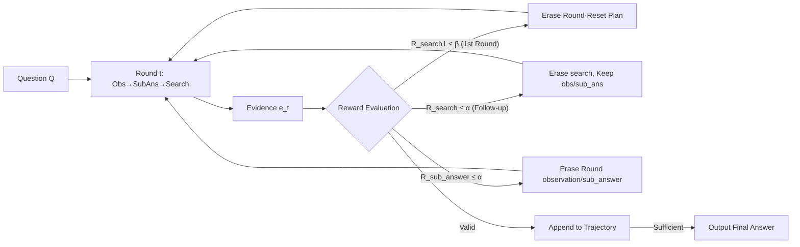

# Erase to Improve: Erasable Reinforcement Learning for Search-Augmented LLMs

**Conference**: ICLR 2026  
**OpenReview**: [https://openreview.net/forum?id=UpZHjUtcUM](https://openreview.net/forum?id=UpZHjUtcUM)  
**Code**: To be confirmed  
**Area**: reinforcement_learning  
**Keywords**: Search-augmented LLM, multi-hop reasoning, erasable RL, process rewards, self-correction

## TL;DR
This paper proposes **Erasable Reinforcement Learning (ERL)**. In the multi-hop reasoning trajectories of search-augmented LLMs, faulty sub-queries or sub-answers are identified through dense process rewards, then **erased in-place and regenerated**. This transforms fragile "one-error-ruins-all" trajectories into recoverable robust processes. The resulting ESearch model achieves new SOTA performance across four multi-hop QA benchmarks.

## Background & Motivation
**Background**: Retrieval-Augmented Generation (RAG) has evolved into autonomous research agents that integrate search and reasoning into iterative loops. Reinforcement Learning (RL) has become the core method for driving these search-augmented agents (e.g., Search-R1, StepSearch).

**Limitations of Prior Work**: Existing RL agents model the entire "search + reasoning" trajectory as a single MDP, optimized only with sparse terminal rewards (endpoint comparison of EM/F1). The paper empirically identifies three fatal failure modes: ① **Decomposition failure**—deviated sub-queries cause retrieval to fail completely; ② **Retrieval missing**—failure to retrieve key evidence even with reasonable sub-queries; ③ **Reasoning failure**—errors occur during evidence integration and accumulate along the reasoning chain.

**Key Challenge**: Monolithic trajectory optimization is inherently fragile—an error at any single step pollutes all subsequent states, causing a "domino effect" collapse. Performance degrades sharply as the reasoning chain lengthens (>10 steps). While humans pause, correct, and continue from the point of correction when encountering errors, existing systems lack such self-correction mechanisms.

**Goal**: To enable the agent to act like a human who can "erase a wrong word with an eraser without discarding the entire manuscript," precisely locating and rewriting erroneous segments in decomposition, retrieval, or reasoning steps.

**Core Idea**: Introducing ① dense step-wise process rewards (search reward + sub-answer reward + terminal reward) and ② an **erasure operator $E$** triggered by reward thresholds atop PPO training. The operator truncates the trajectory to the most recent correct state before initiating regeneration.

## Method

### Overall Architecture
ESearch models reasoning as $T$ structured rounds. Each round produces an interaction pair $\langle a_t, e_t\rangle$: starting with `<observation>` for context → `<sub_answer>` for intermediate conclusions → `<search>` to issue queries and fetch evidence, until the `<answer>` terminates the process. On top of PPO optimization, dense process rewards and erasure operators are overlaid: each round uses rewards to determine if an error occurred. If so, the corresponding action unit is erased based on the error type, the trajectory is reset to the truncated prefix $\tau_{0:t}$, and generation resumes from that point.

### Key Designs
**1. Structured Round-based Reasoning: Segmenting trajectories into localizable action units.** Instead of treating the entire trajectory as a single token sequence, it is explicitly split into ordered action units $\langle(o_t, r_t), q_t\rangle$, corresponding to `<observation>`, `<sub_answer>`, and `<search>` tags. This format forces the agent to alternate between "querying" and "reasoning," tightly coupling retrieval and generation. It also provides anchors for reward attribution and erasure at the action unit granularity. A mask $I(y_t)$ is used in the PPO objective to block gradients for environment-returned tokens.

**2. Dense Process Rewards: Providing supervisory signals for every step.** Addressing sparse terminal rewards, two intermediate rewards are introduced. **Search Reward** $R^{search}_t = G_t - P^t$: TF–IDF cosine similarity measures the coverage of the retrieved set against gold evidence. A coverage vector $m^t_i = \max\{m^{t-1}_i, c^t_i\}$ is maintained; the gain $G_t = \frac{1}{n}\sum_i \max\{c^t_i - m^{t-1}_i, 0\}$ only rewards **newly added** evidence coverage, subtracted by a redundancy penalty $P^t$ (ratio of documents already seen), encouraging new evidence retrieval and penalizing repetitive queries. **Sub-answer Reward** $R^{sub\_answer}_t = \frac{S_t}{\max\{m,1\}}$: F1 measures overlap between intermediate conclusions $r_t$ and gold sub-answers, rewarding only **actual improvements** $\delta^t_i = \max\{u^t_i - u^{t-1}_i, 0\}$ relative to historical bests. **Terminal Reward** $R^{answer} = \frac{1}{2}\text{EM} + \frac{1}{2}\text{F1}$. These rewards are aligned to `</search>`, `</observation>/</sub_answer>`, and `</answer>` tags via token-level attribution.

**3. Erasable Operator $E$: Surgical deletion and rebirth by error type.** Given two thresholds—$\alpha$ for local errors and $\beta$ for plan-level errors—three erasure types are defined:
- **Sub-answer Erasure**: If $R^{sub\_answer}_t \le \alpha$, the current `<observation>`, `<sub_answer>`, and all subsequent actions are erased, $s_{t+1} \leftarrow \tau_{0:t} \oplus \langle\text{None}\rangle = s_t$ (rolling back the round).
- **Subsequent Search Erasure**: If $R^{search}_t \le \alpha$ and $t>1$, only the current `<search>` query is erased while keeping correct obs/sub_answers, $s_t \leftarrow \tau_{0:t} \oplus \langle o_t, r_t\rangle$.
- **Initial Search/Plan Erasure**: If the first round $R^{search}_1 \le \beta$, the initial query is erased and the **entire trajectory is reset** $\tau \leftarrow \tau_{0:0} \oplus \langle\text{None}\rangle = s_0$.

By truncating the trajectory to $\tau_{0:t} \oplus E[a_t, e_t]$, errors do not pollute subsequent states, transforming fragile trajectories into resilient ones capable of graceful recovery.

### Loss & Training
Base optimization uses PPO (GAE for advantage $A_t$ estimation), maximizing rewards while using $\beta D_{KL}$ to constrain the policy from deviating too far from the reference model. The input $x$ contains both natural language and retrieval results, allowing the policy to learn integrated retrieval-reasoning that surpasses prompt-based methods.

## Key Experimental Results

### Main Results
On four multi-hop QA benchmarks († and ∗ indicate different retrieval/evaluation settings), using only EM/F1 (eschewing third-party LLM evaluations for reproducibility). The table below compares ESearch (3B/7B) with the strongest baselines (example from ∗ settings):

| Model Size | Dataset | Metric | ESearch | Prev. SOTA | Gain (Δ) |
|----------|--------|------|---------|-----------|---|
| 3B | HotpotQA∗ | EM | 0.513 | 0.394 (StepSearch) | +0.119 |
| 3B | 2Wiki∗ | F1 | 0.644 | 0.542 (StepSearch-base) | +0.102 |
| 3B | Bamboogle∗ | F1 | 0.813 | 0.656 (R-Search-PPO) | +0.157 |
| 7B | 2Wiki∗ | F1 | 0.730 | 0.638 (StepSearch-base) | +0.092 |
| 7B | Bamboogle† | EM | 0.534 | 0.467 (StepSearch-base) | +0.067 |

Overall, the 3B model gained an average of **+8.48% EM / +11.56% F1**, and the 7B model gained **+5.38% EM / +7.22% F1**, comprehensively outperforming Search-R1, ZeroSearch, R-Search, SSRL, and StepSearch.

### Ablation Study
Successive removal of the three erasure types on Qwen2.5-7B-Base (F1 on 2Wiki† / Bamboogle†):

| Configuration | 2Wiki† F1 | Bamboogle† F1 | Description |
|------|-----------|---------------|------|
| ERL (Full) | 0.513 | 0.656 | Erasures are complementary; best performance across all datasets |
| w/o ε-plan | 0.496 | 0.634 | Removing plan erasure; 2Wiki drops -2.05% F1; structured data most affected |
| w/o ε-search | 0.485 | 0.620 | Removing search erasure; Bamboogle drops -2.40% F1; retrieval-intensive tasks suffer |
| w/o ε-sub_answer | 0.463 | 0.592 | Removing sub-answer erasure; reasoning-intensive tasks degrade the most |

### Key Findings
- The three erasure mechanisms are **complementary and specialized**: plan erasure is critical for highly structured datasets (2Wiki) but cannot fix missing retrieval; search erasure is vital for retrieval-intensive tasks (Bamboogle) but cannot resolve global reasoning errors; sub-answer erasure is most beneficial for reasoning-intensive tasks, showing the largest overall degradation when removed.
- Dense process rewards + erasure suppress the "long-chain fragility" problem. Smaller models see larger gains (3B gain is significantly higher than 7B), suggesting that correction mechanisms are more valuable for backbones with weaker capabilities.

## Highlights & Insights
- **"Erase-and-Regenerate" is a novel paradigm**: Unlike methods that discard entire erroneous trajectories (rejection sampling) or rely solely on terminal rewards, ERL performs surgical local rollbacks within the trajectory. This preserves correct prefixes, leading to high reuse and signal efficiency.
- **Error classification drives the mapping of rewards and erasures**: The precise mapping of failure modes (decomposition/retrieval/reasoning) to three reward signals and three erasure operators results in a symmetrical, clear, and interpretable design.
- **Process rewards rely on non-parametric rules (TF–IDF/F1)**: They do not depend on additional reward models, making the approach engineering-lightweight and reproducible.

## Limitations & Future Work
- Process rewards depend on **gold evidence $D^\star$ and gold sub-answers $A^\star$**, requiring datasets with fine-grained annotations, which is difficult to apply directly to real open-domain tasks lacking intermediate supervision.
- Search rewards use TF–IDF cosine similarity to measure coverage, which may underestimate semantically rewritten or synonymous evidence; replacing this with dense retriever scores might improve stability.
- Thresholds $\alpha$ and $\beta$ are hyperparameters; the paper lacks a full discussion on their sensitivity and adaptive settings. Erase-and-regenerate may also increase rollout overhead during training.
- Evaluation is limited to four multi-hop QA tasks and has not been verified in more open "deep research" or complex tool-use scenarios.

## Related Work & Insights
- **vs Search-R1 / Single MDP Terminal Rewards**: This paper identifies "monolithic trajectories + sparse rewards" as the source of fragility and provides a direct remedy via local erasures.
- **vs StepSearch (Step-wise Rewards)**: StepSearch also introduces step-level rewards but only "adds rewards without deleting errors." ERL further introduces the erasure operator for within-trajectory rollback correction, comprehensively outperforming StepSearch in main experiments.
- **Inspiration**: The concept of "identifying errors → erasing → in-place regeneration" can be generalized to other agentic RL (tool use, coding agents) as a universal module to mitigate error accumulation in long-range tasks. The "max-improvement" design of process rewards is transferable to other RL tasks requiring the suppression of repetitive or reward-hacking behaviors.

## Rating
- Novelty: ⭐⭐⭐⭐ The "erase-and-regenerate" within-trajectory local correction and the symmetric design of three erasure types for three error modes is a novel paradigm.
- Experimental Thoroughness: ⭐⭐⭐⭐ Thorough evidence across four benchmarks, two model sizes, multiple baselines, and ablation of each erasure type, though limited to multi-hop QA and lacking threshold sensitivity analysis.
- Writing Quality: ⭐⭐⭐⭐ Clear progression from failure modes to MDP fragility, rewards, and erasure; good correspondence between formulas and illustrations.
- Value: ⭐⭐⭐⭐ Practical contribution to the robustness of search-augmented agents; ideas are transferable to general agentic RL.

<!-- RELATED:START -->

## Related Papers

- [\[ICLR 2026\] TIPS: Turn-Level Information-Potential Reward Shaping for Search-Augmented LLMs](tips_turn-level_information-potential_reward_shaping_for_search-augmented_llms.md)
- [\[ICLR 2026\] Leveraging Explanation to Improve Generalization of Meta Reinforcement Learning](leveraging_explanation_to_improve_generalization_of_meta_reinforcement_learning.md)
- [\[ICLR 2026\] TROLL: Trust Regions improve Reinforcement Learning for Large Language Models](troll_trust_regions_improve_reinforcement_learning_for_large_language_models.md)
- [\[ICLR 2026\] A$^2$Search: Ambiguity-Aware Question Answering with Reinforcement Learning](a2search_ambiguity-aware_question_answering_with_reinforcement_learning.md)
- [\[ICLR 2026\] References Improve LLM Alignment in Non-Verifiable Domains](references_improve_llm_alignment_in_non-verifiable_domains.md)

<!-- RELATED:END -->
