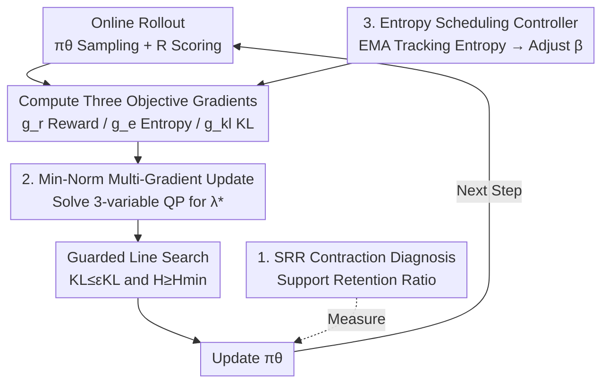

# Escaping Policy Contraction: Contraction-Aware PPO (CaPPO) for Stable Language Model Fine-Tuning

**Conference**: ICLR 2026  
**OpenReview**: [https://openreview.net/forum?id=vDlkJewkDu](https://openreview.net/forum?id=vDlkJewkDu)  
**Area**: Alignment RLHF / Reinforcement Learning  
**Keywords**: RLHF, PPO, Policy Contraction, Multi-objective Optimization, Entropy Scheduling  

## TL;DR
This paper points out that PPO in RLHF causes the policy "support set" to gradually contract (entropy collapse, increased repetition, and the zeroing out of probabilities for reasonable SFT answers). It proposes the Support Retention Ratio (SRR) to quantify this phenomenon and designs CaPPO—treating reward, entropy, and KL as equal objectives for minimum-norm multi-gradient updates, combined with an entropy scheduling controller. CaPPO significantly recovers diversity and SRR without dropping alignment win rates (increasing them by +2~4 points instead).

## Background & Motivation

**Background**: The mainstream alignment pipeline uses PPO for RLHF after SFT—first training a preference reward model, then using PPO for online policy optimization, while applying a KL penalty against the reference policy (SFT model) to stabilize training and suppress reward hacking. This formula is widely adopted for instruction following and dialogue systems.

**Limitations of Prior Work**: Practitioners frequently observe a side effect—reduced output diversity after online RL fine-tuning: per-token entropy decreases, repetition increases, and many candidate answers that were plausible under the SFT/reference model have nearly zero probability. Common diversity proxies (Self-BLEU, Distinct-n) provide signals but are sensitive to decoding strategies and noisy, failing to cleanly diagnose "how much of the support set is actually lost."

**Key Challenge**: Standard PPO treats reward maximization as the primary goal in its objective function, with entropy and KL regularization as secondary terms with fixed (or manually tuned) coefficients. This "scalarized weighting" is brittle: when the reward scale is large or critic estimates are noisy, entropy collapses rapidly, and the policy contracts to a small set of high-reward answers. Once entropy falls below a certain level, exploration fails, repetition rises, and probability mass concentrates abnormally—rewards appear to increase, but the distribution degrades. Controlling this collapse via static entropy coefficients or manual KL weights is unreliable and strongly dependent on the dataset, base model, and scale.

**Goal**: (1) Provide a decoding-independent direct metric for "policy contraction" that is comparable across prompts; (2) Design a PPO modification that systematically mitigates contraction without sacrificing alignment performance, avoiding manual coefficient tuning.

**Key Insight**: The authors elevate diversity/support retention from an "additional penalty term" to a "first-class training objective." Since reward, entropy, and KL are inherently conflicting multiple objectives, they should not be summed with fixed weights. Instead, an update direction should be sought at each step that does not damage any of the three (Pareto improvement).

**Core Idea**: Replace fragile scalarized weighting with minimum-norm multi-gradient descent (finding the combination direction with the minimum norm within the convex hull of the three objective gradients) and layer a feedback-based entropy scheduling controller to stabilize token entropy near target values—integrating "contraction prevention" into the optimization geometry of PPO.

## Method

### Overall Architecture

CaPPO is a drop-in replacement for PPO aimed at preventing support set contraction during online fine-tuning. Beyond the standard PPO clipped surrogate loss, it treats reward improvement, entropy maintenance, and KL constraints as **equal objectives**: at each step, it calculates the gradients for the three objectives, finds a minimum-norm convex combination as the actual update direction (approximating a Pareto improvement step), and uses a guarded line search to ensure reward progress while preventing excessive entropy loss or KL violations. In parallel, an entropy scheduling controller monitors token entropy and dynamically adjusts the entropy coefficient $\beta$ using proportional feedback: injecting exploration pressure during entropy collapse and relaxing it when entropy is sufficient. On the diagnostic side, SRR is used to quantify contraction and verify mitigation.

Let $\pi_{\text{ref}}$ be the SFT reference policy, $\pi_\theta$ the trainable policy, and $R(x,y)$ the preference model score. Sequence log-likelihoods are normalized by length.

### Key Designs

**1. SRR: A Direct Decoding-Independent Metric for "Policy Contraction"**

To fix a problem, one must measure it cleanly. The authors found that existing diversity metrics (Self-BLEU, Distinct-n) depend on decoding sampling and are noisy, failing to answer "how much support from the SFT distribution did the trained policy lose?" Therefore, they define the Support Retention Ratio (SRR): given a fixed threshold $\tau$, what proportion of SFT answers sampled from the reference policy still have a length-normalized log-likelihood higher than $\tau$ under the current policy:

$$\text{SRR}(\tau) = \mathbb{E}_x \Pr_{y\sim\pi_{\text{ref}}(\cdot|x)}\Big[\tfrac{1}{|y|}\log\pi_\theta(y\mid x) \ge \tau\Big]$$

The threshold $\tau$ is determined by a specific quantile of the reference policy, and length normalization makes prompts comparable. It measures "how many answers in the SFT set still have non-negligible probability under the new policy," independent of decoding heuristics. Combined with entropy/forward KL trajectories (where contraction is characterized by non-decreasing or increasing KL while entropy declines) and log-likelihood histograms of SFT answers (where PPO shows concentrated mass and a heavy left tail), these three diagnostic tools confirm the contraction phenomenon—Tables 1/2 show PPO causes entropy to drop from 3.88→3.42, KL to rise to ≈0.45, and SRR to stay at only 0.37~0.41.

**2. Minimum-Norm Multi-Gradient Update: Treating Reward/Entropy/KL as Pareto Equal Objectives**

This is the core of CaPPO, addressing the "brittle scalarized weighting" pain point. Three maximization objectives are defined: reward term $J_r=-L^{\text{PPO}}_{\text{reward}}$, entropy term $J_e=H(\pi_\theta)$, and KL term $J_{kl}=-\text{KL}(\pi_\theta\|\pi_{\text{ref}})$, with corresponding gradients $g_r, g_e, g_{kl}$. A Pareto stationary point is reached when the origin lies within the convex hull of the three gradients: $0\in\text{co}\{g_r, g_e, g_{kl}\}$. Instead of manual tuning, CaPPO finds the **convex combination with the minimum norm** within the gradient convex hull as the update direction at each step:

$$\min_{\lambda\in\Delta^3}\ \big\|\lambda_r g_r+\lambda_e g_e+\lambda_{kl}g_{kl}\big\|_2^2,\quad \hat g=\sum_i\lambda_i g_i,\quad \theta\leftarrow\theta+\eta\hat g$$

Since the three objectives have different scales, they are pre-conditioned using a diagonal metric $P^{-1/2}$ (such as Adam second moments or the Fisher diagonal of the reference policy) before solving. This three-objective problem reduces to a three-variable quadratic program (QP), solvable via a few steps of projected gradient or Frank-Wolfe. It is equivalent to a constrained perspective $\max_\theta J_r$ s.t. $\text{KL}\le\epsilon_{kl},\,H\ge\epsilon_e$, where Lagrange multipliers correspond to adaptive mixing weights; when gradients conflict, the lower bound of mixing weights is raised based on cosine similarity to suppress collapse. This ensures "reward progress does not come at the cost of entropy collapse or KL escaping control," and it is fully compatible with PPO's clipped surrogate.

**3. Entropy Scheduling Controller: A Feedback Loop to Stabilize Token Entropy**

While multi-gradient updates solve the "direction," exploration intensity still requires a stabilizer. The controller tracks length-normalized sequence entropy using EMA $\tilde H_t=(1-\alpha)\tilde H_{t-1}+\alpha H_t$, then pushes the entropy coefficient $\beta$ toward a time-varying target $H_{\text{target}}(t)$ using a clipped proportional update:

$$\beta_{t+1}=\text{clip}\big(\beta_{\min},\ \beta_t+\eta(H_{\text{target}}(t)-\tilde H_t),\ \beta_{\max}\big)$$

$H_{\text{target}}$ can be a fixed constant, scheduled decay (transitioning from exploration to exploitation), or adaptively set to the EMA of the reference policy's entropy plus a small offset to maintain support. When entropy collapses, this term increases exploration pressure; when entropy is sufficient, it relaxes, maintaining the entropy term's magnitude at ~5–20% of the initial surrogate level through clipping. Essentially a proportional-integral (PI) controller adjusting the error $H_{\text{target}}-H_t$ (with the integral term off by default), it stably tracks entropy without slowing down the multi-gradient updates. Ablations show that switching $\beta$ from fixed to adaptive alone increases SRR from 0.43 to 0.59.

### Loss & Training

The reward component follows the PPO clipped surrogate $L^{\text{PPO}}_{\text{reward}}=\mathbb{E}_t[\min(\rho_t A_t,\ \text{clip}(\rho_t,1-\epsilon,1+\epsilon)A_t)]$, where $\rho_t=\pi_\theta(a_t|s_t)/\pi_{\theta_{\text{old}}}(a_t|s_t)$, sequence rewards are flattened per token $r_t=R(x,y)/|y|$, and advantages are estimated via GAE. Each iteration: collect online rollouts and estimate entropy/KL → update entropy estimate via EMA and adjust $\beta$ → compute three pre-conditioned gradients → solve 3-variable QP for $\lambda^\star$ → take max step size $\eta$ s.t. $\text{KL}\le\varepsilon_{KL}$ and $H\ge H_{\min}$ → update $\theta$. Theoretically, this update is the minimum-norm element of the pre-conditioned gradient convex hull, converging to a Pareto stationary point under Lipschitz conditions.

## Key Experimental Results

Datasets: HH-RLHF, Summarize-from-Feedback, UltraFeedback; Base models: Qwen2-7B, Qwen2.5-14B, Mistral-7B-Instruct, Llama-3-8B-Instruct; Win rates benchmarked against SFT=50.0, mean ± std over 3 seeds.

### Main Results

| Dataset | Model | SFT | +PPO | +PPO+Entropy | CaPPO |
|--------|------|-----|------|--------------|-------|
| HH-RLHF | Qwen2-7B | 50.0 | 62.8 | 64.3 | **66.4** |
| HH-RLHF | Qwen2.5-14B | 50.0 | 65.1 | 66.8 | **69.0** |
| Summarize | Llama-3-8B | 50.0 | 58.1 | 59.5 | **62.0** |
| UltraFeedback | Qwen2.5-14B | 50.0 | 64.6 | 66.2 | **69.1** |

CaPPO outperforms PPO by 2~4 win rate points across all bases/datasets, and this consistency across Qwen/Llama/Mistral suggests that the benefits of mitigating contraction are universal rather than dependent on a specific training recipe.

### Comparison with More Baselines (Qwen2-7B, Macro Average over 3 datasets)

| Method | Win Rate | Self-BLEU↓ | Distinct-2↑ | SRR↑ |
|------|------|-----------|-------------|------|
| RRHF (off-policy) | 64.7 | 0.38 | 0.24 | **0.92** |
| PPO | 67.4 | 0.48 | 0.17 | 0.55 |
| VinePPO | 68.6 | 0.45 | 0.19 | 0.62 |
| GRPO | 71.0 | 0.37 | 0.24 | 0.70 |
| **CaPPO** | **71.2** | **0.33** | **0.27** | 0.82 |

Offline methods (DPO/IPO/ORPO/KTO/RRHF) maintain high SRR (up to 0.92) but have lower win rates (62~65%); online baselines (PPO/VinePPO/GRPO) have high win rates (67~71%) but SRR collapses to 0.46~0.62. CaPPO achieves the highest/joint-highest win rate + lowest redundancy + highest vocabulary diversity, pulling the support retention ratio back to 0.82.

### Ablation Study

| Configuration | Win Rate | Self-BLEU↓ | Distinct-2↑ | SRR↑ | Description |
|------|------|-----------|-------------|------|------|
| PPO (Fixed β) | 63.4 | 0.49 | 0.17 | 0.43 | Scalarized, static entropy coeff |
| PPO (Adaptive β) | 65.1 | 0.42 | 0.21 | 0.59 | Only entropy scheduling added |
| CaPPO (Full) | 67.8 | 0.35 | 0.27 | 0.74 | Multi-gradient + Controller |

Scalarization hyperparameter sweep experiments (Table 7) show: manually tuning $\lambda_H$ from 0→0.3 increases SRR by at most +0.16 and win rate by +0.8; whereas CaPPO’s Pareto multi-gradient update provides +0.32 SRR and +4.7 win rate in one step, with a comprehensively better SRR-win rate trade-off. Regarding robustness (Table 8), CaPPO shows lower seed variance (win rate std 0.8 vs PPO 1.4) when reward scaling or bootstrap horizons are changed.

### Key Findings
- **Both components are useful individually and stronger together**: Adding entropy scheduling alone (adaptive $\beta$) increases SRR from 0.43→0.59 and win rate by +1.7; layering multi-gradient Pareto updates further pushes SRR to 0.74 and win rate to 67.8. This shows "stabilizing entropy" and "replacing fragile scalarization" are complementary.
- **Support retention and alignment accuracy are not fundamentally at odds**: By elevating diversity to a first-class objective, CaPPO improves both SRR/Distinct-2 while matching or exceeding PPO win rates, debunking the implicit assumption that "win rate requires sacrificing diversity."
- **Controllable overhead**: CaPPO only adds two objective gradients + one 3-variable QP, achieving 92~94% of PPO throughput on 8×A100 with ~3.1% more peak VRAM; it is more efficient than GRPO (84~88% throughput, +6~7% VRAM).

## Highlights & Insights
- **SRR as a metric is valuable in itself**: It formalizes "policy contraction" from a vague "output becoming monotonous" into a decoding-independent, cross-prompt comparable scalar—effectively providing a clean thermometer for distribution degradation in RLHF. Such diagnostic metrics are often more reusable than the methods themselves.
- **Restating RLHF in the language of multi-objective optimization**: Reframing reward/entropy/KL from "main objective + two penalties" to "three equal objectives + min-norm multi-gradient" is a elegant perspective shift—it transforms the "coefficient tuning" alchemy into a deterministic solution of a three-variable QP at each step.
- **Transferable control-theory perspective on entropy scheduling**: The idea of using a PI controller to stabilize a statistic (token entropy here) on a target trajectory can be directly applied to other online training scenarios requiring stable exploration or temperature.

## Limitations & Future Work
- **Dependency on Reward Model fidelity**: The method still relies on the assumption of a trustworthy preference reward model; if the reward itself is biased, mitigating contraction will not correct the alignment direction.
- **SRR requires threshold selection**: Although addressed by length normalization + quantile rules, threshold selection remains a degree of freedom needing further refinement.
- **Small but non-zero additional computation**: Entropy control and multi-gradient mixing cause a 6~8% throughput loss, which remains a trade-off for large-scale training.
- **Theoretic convergence needs deepening**: The authors admit that the convergence/stability of Pareto updates under trust-region RL lacks rigorous analysis, which is a direction for future work; another direction is combining training-time CaPPO with inference-time diversity/inference controllers.

## Related Work & Insights
- **vs PPO / VinePPO / GRPO**: These online methods focus on reward/credit assignment, boosting win rates by reweighting probability mass to high-reward modes, but they narrow the reachable set (SRR 0.46~0.70). CaPPO explicitly incorporates "support retention" into the optimization objective, achieving SRR 0.82 at similar or higher win rates.
- **vs DPO / KTO / IPO / ORPO (Offline Preference Optimization)**: These operate offline and retain the SFT distribution well (SRR up to 0.92), but they do not directly control distribution shift during online training and often have lower win rates. CaPPO merges the strengths of both (high win rate + high support) within the online route.
- **vs Scalarized Weighted Entropy/KL Regularization**: Traditional approaches use fixed or manually tuned coefficients; sweep experiments prove their SRR-win rate trade-off is far inferior to Pareto multi-gradients. CaPPO’s core contribution is replacing this fragile scalarization with minimum-norm multi-gradients.

## Rating
- Novelty: ⭐⭐⭐⭐ Formalizing policy contraction as SRR + rewriting PPO from a multi-objective Pareto perspective is clear and practical.
- Experimental Thoroughness: ⭐⭐⭐⭐ 4 bases × 3 datasets + multiple baselines + ablation + robustness + throughput overhead; comprehensive coverage.
- Writing Quality: ⭐⭐⭐⭐ Diagnosis-Method-Verification logic is a closed loop; formulas and algorithms are clear.
- Value: ⭐⭐⭐⭐ Drop-in PPO compatibility, low overhead, simultaneously improves win rate and diversity; high engineering utility.

<!-- RELATED:START -->

## Related Papers

- [\[ICLR 2026\] Proximal Supervised Fine-Tuning](proximal_supervised_fine-tuning.md)
- [\[ICLR 2026\] On-Policy RL Meets Off-Policy Experts: Harmonizing Supervised Fine-Tuning and Reinforcement Learning via Dynamic Weighting](on-policy_rl_meets_off-policy_experts_harmonizing_supervised_fine-tuning_and_rei.md)
- [\[ICLR 2026\] Fine-tuning Behavioral Cloning Policies with Preference-Based Reinforcement Learning](fine-tuning_behavioral_cloning_policies_with_preferencebased_reinforcement_learn.md)
- [\[ICLR 2026\] SRFT: A Single-Stage Method with Supervised and Reinforcement Fine-Tuning for Reasoning](srft_a_single-stage_method_with_supervised_and_reinforcement_fine-tuning_for_rea.md)
- [\[ICLR 2026\] All Roads Lead to Likelihood: The Value of Reinforcement Learning in Fine-Tuning](all_roads_lead_to_likelihood_the_value_of_reinforcement_learning_in_fine-tuning.md)

<!-- RELATED:END -->
