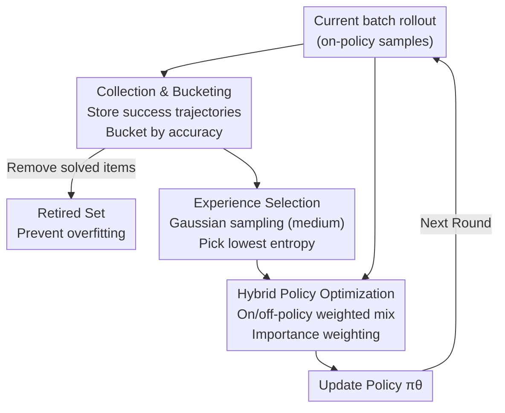

# ExGRPO: Learning to Reason from Experience

**Conference**: ICLR 2026  
**arXiv**: [2510.02245](https://arxiv.org/abs/2510.02245)  
**Code**: [GitHub](https://github.com/RanranZhang/ExGRPO)  
**Area**: LLM Reasoning / Reinforcement Learning  
**Keywords**: Experience Replay, RLVR, Reasoning RL, Experience Management, GRPO

## TL;DR
This paper presents the first systematic study on what types of reasoning experiences are most valuable for RLVR. It identifies that medium-difficulty problems combined with low-entropy trajectories are most effective. Based on this, the ExGRPO framework for experience management and hybrid policy optimization is proposed, achieving an average gain of +3.5 points in mathematical reasoning and +7.6 points in general reasoning.

## Background & Motivation

**Background**: RLVR (Reinforcement Learning with Verifiable Rewards) has become the core paradigm for enhancing LLM reasoning capabilities, with on-policy methods like GRPO being the mainstream. Large volumes of reasoning trajectories (experiences) are generated during training.

**Limitations of Prior Work**: Standard on-policy training discards rollout experiences after a single gradient update, leading to wasted computational resources and training instability. While experience replay is well-studied in traditional RL, the fundamental question of which experiences are most valuable in the context of LLM RLVR remains unexplored.

**Key Challenge**: Massive amounts of collected experiences are not equivalent—some problems are too simple (no learning signal), while others are too difficult (noisy). Some trajectories provide the right answer for the wrong reasons ("lucky guesses"). Discerning and utilizing high-value experiences is critical.

**Goal**: (1) Define what constitutes valuable reasoning experience. (2) Systematically manage and reuse these experiences.

**Key Insight**: Experience value is analyzed through problem difficulty and trajectory entropy. It is found that medium difficulty (25%-75% accuracy) provides the strongest optimization signals, and low-entropy trajectories correspond to higher-quality reasoning chains.

**Core Idea**: Manage experiences via difficulty bucketing, prioritizing the sampling of medium-difficulty and low-entropy trajectories for hybrid on-policy/off-policy optimization.

## Method

### Overall Architecture
ExGRPO addresses the inefficiency of standard on-policy RLVR, where rollouts are discarded after one use despite valuable successful trajectories. It implements a replay buffer atop GRPO to store successful historical trajectories and explicitly manages experience value through three steps: **collecting** and **bucketing** successful trajectories by problem difficulty, **selecting** low-entropy trajectories from medium-difficulty problems, and performing **hybrid optimization** mixing off-policy experience with on-policy samples. The updated policy generates the next batch of rollouts, creating a loop where new successful trajectories flow back into the buffer. The core principle is that signals should concentrate on the reliable reasoning of medium-difficulty tasks.

### Key Designs

**1. Experience Collection & Bucketing: Layering problems by accuracy to separate signal strengths**

Successful trajectories are collected into a buffer. Each problem $q^*$ is tagged with its recent accuracy $\text{Acc}(q^*) = k/K$ (k successes in K rollouts) and assigned to three buckets: Easy [75%, 100%), Medium (25%, 75%], and Hard (0, 25%]. Different difficulty levels provide varying gradient signals; simple items offer little signal, while hard ones are noisy. A "Retired Set" mechanism is introduced: once all rollouts for a problem are correct, it is removed from the buffer to prevent overfitting on mastered tasks.

**2. Experience Selection: Prioritizing problem difficulty and trajectory reliability**

Selection occurs in two stages. First, problems are sampled according to a Gaussian distribution centered at 0.5, $p \propto \mathcal{N}(\text{Acc}(q^*); \mu=0.5, \sigma=1)$, favoring medium-difficulty problems. Second, for a selected problem, the trajectory with the lowest entropy under the current policy is chosen: $o^* \leftarrow \arg\min_{o_i} H(o_i; \pi_\theta)$. Low entropy serves as a proxy for reliability, as high-entropy trajectories often represent "lucky guesses" with flawed reasoning. Replaying high-entropy trajectories can lead to a "snowball effect" of reinforced errors.

**3. Hybrid Policy Optimization: Joint training with distribution correction**

The objective weights current on-policy samples and historical experiences:

$$\mathcal{J}_{\text{ExGRPO}} = (1-\rho)\cdot\mathcal{J}_{\text{on}} + \rho\cdot\mathcal{J}_{\text{exp}}$$

The mixing ratio $\rho$ controls the proportion of experience samples. To correct for distribution shift in off-policy trajectories generated by previous policies, importance weights $w_t^*(\theta) = \frac{\pi_\theta(o_t^*|q^*)}{\pi_{\theta_{\text{past}}}(o_t^*|q^*)}$ are utilized to ensure unbiased gradient estimation. The hybrid approach maintains exploration capabilities that a pure replay might suppress.

### Loss & Training
- Based on Dr.GRPO: Removes length and standard deviation normalization.
- Hybrid ratio $\rho$ controls the experience sample weight.
- Off-policy samples form a hybrid advantage estimation group: 1 historical trajectory + K-1 new rollouts.

## Key Experimental Results

### Main Results
Gains across 5 backbone models (1.5B-8B) in mathematical and general reasoning:

| Model | Avg Math Gain | General Reasoning Gain | Note |
|------|------------|------------|------|
| Qwen2.5-Math-1.5B | +3-4 pts | +7-8 pts | Across all benchmarks |
| Qwen2.5-Math-7B | +3-4 pts | +7-8 pts | AIME/AMC etc. |
| Llama-3.1-8B | Stable Training | Significant Gain | Resolved on-policy collapse |
| LUFFY Model | Continuous Imp. | Continuous Imp. | Resolved on-policy collapse |

### Ablation Study

| Configuration | Math Metric | Note |
|------|---------|------|
| Full ExGRPO | Optimal | Complete solution |
| w/o Bucketing (Random) | Decrease | Medium difficulty priority is key |
| w/o Low entropy selection | Decrease | Low entropy indicates higher quality |
| w/o Importance weights | Decrease | Distribution shift requires correction |
| w/o Retired Set | Decrease | Overfitting on easy problems |

### Key Findings
- ExGRPO ensures stable training for both weak (Llama-3.1-8B) and strong (LUFFY) models where on-policy GRPO collapses.
- Medium-difficulty problems contribute the most; the Hard group contributes the least but provides complementary signals and should not be discarded entirely.
- The "snowball effect" of incorrect logic in "lucky guess" (high entropy) trajectories is amplified in replay; low-entropy selection effectively mitigates this.
- Experience replay reduces average training overhead by reusing historical rollouts, thus decreasing the number of required generations.

## Highlights & Insights
- **Systematic Experience Analysis**: Analyzes experience value in RLVR through problem difficulty and trajectory entropy for the first time, identifying the "Medium Difficulty + Low Entropy" principle.
- **Discovery of the "Snowball Effect"**: Identified that high-entropy trajectories with correct answers but wrong reasoning can pollute training. Instances of the model learning to "use code blocks for math" (degeneration) were attributed to high-entropy experiences.
- **Retired Set Design**: Simple but effective removal of fully solved problems from the buffer prevents overfitting and focuses resources on high-value learning signals.

## Limitations & Future Work
- Fixed difficulty thresholds (25%/75%) should ideally be dynamic as the model evolves.
- Entropy is an imperfect proxy; high entropy might occasionally be valuable for exploration.
- Results are primarily validated on mathematical reasoning; optimal experience traits for other domains like code reasoning may differ.
- Problem of "stale" experiences where historical trajectories may no longer be optimal after significant policy updates.

## Related Work & Insights
- **vs GRPO**: ExGRPO adds experience management to GRPO, yielding +3.5 math / +7.6 general reasoning gains.
- **vs ReMix/RePO**: While these perform experience replay, they ignore data quality. ExGRPO's bucketing and low-entropy selection are more refined.
- **vs LUFFY**: LUFFY mixes expert data with on-policy samples; ExGRPO uses the model's own history, requiring no external data.

## Rating
- Novelty: ⭐⭐⭐⭐ Fresh perspective on experience value and the snowball effect.
- Experimental Thoroughness: ⭐⭐⭐⭐⭐ Evaluated on 5 backbones, multiple benchmarks, and detailed ablations.
- Writing Quality: ⭐⭐⭐⭐ Clear motivation and convincing preliminary studies.
- Value: ⭐⭐⭐⭐⭐ Practical guidance for RLVR training with transferable insights.

<!-- RELATED:START -->

## Related Papers

- [\[ICLR 2026\] Learning to Reason Efficiently with Discounted Reinforcement Learning](learning_to_reason_efficiently_with_discounted_reinforcement_learning.md)
- [\[ICLR 2026\] Reliability-Adjusted Prioritized Experience Replay](reliability-adjusted_prioritized_experience_replay.md)
- [\[ICLR 2026\] Learning to Reason as Action Abstractions with Scalable Mid-Training RL](learning_to_reason_as_action_abstractions_with_scalable_mid-training_rl.md)
- [\[ICLR 2026\] R1-Code-Interpreter: LLMs Reason with Code via Supervised and Multi-stage Reinforcement Learning](r1-code-interpreter_llms_reason_with_code_via_supervised_and_multi-stage_reinfor.md)
- [\[ICML 2026\] Agent Learning via Early Experience](../../ICML2026/reinforcement_learning/agent_learning_via_early_experience.md)

<!-- RELATED:END -->
