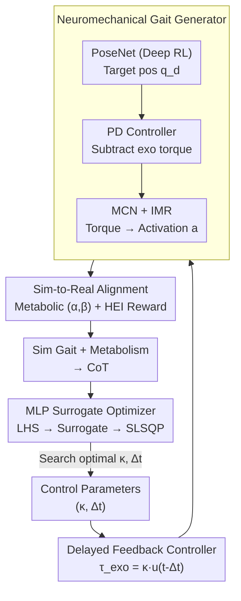

# Exo-Plore: Exploring Exoskeleton Control Space through Human-Aligned Simulation

**Conference**: ICLR2026  
**arXiv**: [2601.22550](https://arxiv.org/abs/2601.22550)  
**Code**: [Project Page](https://daebangstn.github.io/exo-plore/)  
**Area**: Reinforcement Learning  
**Keywords**: exoskeleton optimization, neuromechanical simulation, deep reinforcement learning, human-in-the-loop, surrogate optimization  

## TL;DR

Ours proposes the Exo-plore framework, which combines neuromechanical simulation with deep reinforcement learning to optimize hip exoskeleton control parameters without human trials, enabling generalization to pathological gait scenarios.

## Background & Motivation

Exoskeletons show great potential in enhancing human mobility, but providing appropriate assistance remains a challenge. Current state-of-the-art Human-in-the-Loop Optimization (HILO) requires participants to wear the exoskeleton and walk for hours to iteratively optimize control parameters. This creates a paradox: the populations most in need of assistance (e.g., those with mobility impairments) are the least able to endure such high-intensity optimization experiments.

Furthermore, the human body actively adapts to external forces from exoskeletons by altering gait patterns and muscle coordination, making predictions based on "fixed gait" assumptions inaccurate. Existing neuromechanical simulation methods either rely on tracking motion capture data to handle large observation/action spaces or depend on hand-designed bio-inspired controllers with limited generalization. A unified framework is lacking to simultaneously (i) fit observed human adaptation behaviors and (ii) predict responses under unobserved assistance conditions.

## Core Problem

How can human adaptive responses to exoskeleton assistance be accurately simulated without human trials to efficiently optimize control parameters? Specifically, how can this capability be extended to pathological gait scenarios to provide personalized assistance for individuals with mobility impairments?

## Method

### Overall Architecture

Exo-plore transfers the iterative process of human exoskeleton fitting into a simulator. The pipeline consists of two stages: the first is a **neuromechanical gait generator**, where a "virtual human" driven by Deep RL walks realistically under given exoskeleton assistance to output gait and metabolic responses; the second is an **exoskeleton optimizer** that searches for control parameters minimizing the Cost of Transport (CoT) based on the simulated data. The framework relies on the virtual human's ability to replicate observed adaptations and extrapolate to unseen conditions. This is achieved by compressing the assistance strategy into two parameters via delayed feedback control and aligning simulation behavior with human data using metabolic model tuning and loss-aversion rewards.

### Key Designs

**1. Delayed Feedback Exoskeleton Controller: Compressing strategies into two searchable parameters**

The first challenge in optimization is the high dimensionality of assistance strategies. Ours uses delayed feedback control for compression: the hip assistance torque is $\tau_{\text{exo}}(t) = \kappa \cdot u(t - \Delta t)$, where the control signal $u(t) = \sin(\theta_r) - \sin(\theta_l)$ is derived from the hip angle difference, $\kappa$ is the gain (equivalent stiffness), and $\Delta t$ is the time delay. This reduces the strategy to just two parameters $(\kappa, \Delta t)$, transforming the problem into a search for the minimum CoT in a 2D space, which aligns with hardware logic while keeping the search space manageable.

**2. Neuromechanical Gait Generator: Enabling active adaptation rather than rigid tracking**

To allow the virtual human to "wear" the exoskeleton and adjust gait naturally under unseen forces, the controller comprises three components: PoseNet (Deep RL) learns target PD joint positions $\mathbf{q}_d$; the PD Controller generates joint torques minus exoskeleton forces; and the Muscle Coordination Network (MCN) maps torques to muscle activations $\mathbf{a}$ via supervised learning. The total reward $r_{\text{total}} = w_{\text{gait}} r_{\text{gait}} + w_{\text{arm}} r_{\text{arm}} + w_{\text{energy}} r_{\text{energy}} + w_{\text{HEI}} r_{\text{HEI}}$ encourages target gait following, arm swing suppression, metabolic regularization, and human-exoskeleton interaction (HEI) modeling. An **Internal Muscle Regularizer (IMR)** is added to the MCN loss to maintain coordinated activation within anatomical muscle groups.

**3. Sim-to-Real Matching: Aligning simulations via metabolic tuning and loss-aversion rewards**

Two alignments ensure simulation credibility. First, the metabolic energy model is defined as $\frac{d}{dt}\text{MEE} = \sum_i m_i^\alpha a_i^\beta$. Algorithms 1 and 2 are used to search for exponents $(\alpha, \beta)$ that match the simulated Preferred Walking Speed (PWS) with human data, resulting in $(\alpha, \beta) = (1.5, 1.0)$. Second, the HEI reward, based on the **minimum resistance hypothesis**, incorporates a loss-aversion concept where "humans are more sensitive to losses than gains":

$$r_{\text{HEI}} = 1 + \frac{1}{\kappa} \sum_{k \in \{L,R\}} \min(0, P_k)$$

When the exoskeleton performs negative work on the human (resistance power $P_k < 0$), the reward drops below 1, forcing the policy to adjust kinematics to avoid resistance—replicating adaptation behaviors observed in real experiments that cannot be reproduced by rewarding positive assistance alone.

**4. MLP Surrogate Optimizer: Utilizing simulation data for a scalable surrogate network**

In the optimization phase, data shifts from expensive human trials to cheap simulation samples. Ours replaces Gaussian Processes with an MLP surrogate network to map control parameters to CoT, leveraging neural networks' data throughput advantages. Latin Hypercube Sampling (LHS) is used to avoid aliasing. The surrogate loss includes Huber Loss for outlier robustness, a gradient penalty for landscape smoothness, and L1/L2 regularization. Finally, SLSQP with trust-region optimization finds the optimal $(\kappa, \Delta t)$ on the fitted landscape.

## Key Experimental Results

### Unassisted Gait Validation
- Joint kinematics (ankle, knee, hip) qualitatively match human experiment data (Boo et al., 2025).
- Muscle activation patterns resemble human EMG signals without explicit constraints.
- Walking speed - CoT curves align with the trends in Browning et al. (2006), with accurate PWS prediction.

### Assisted Gait Validation
- Under $(\kappa, \Delta t) = (8\text{Nm}, 0.25\text{s})$, the scaling of assistance torque/power with walking speed matches Lim et al. (2019b).
- HEI reward vs No HEI: At 4 km/h, increasing delay from 0.05s to 0.25s results in a 1.88x increase in power in human data; the HEI reward yields 1.73x (correlation 0.83), while no HEI yields only 0.67x (correlation 0.69).
- The HEI reward scheme produces the metabolic reduction rates closest to human experiments.

### Control Parameter Optimization
- Healthy Group: Optimal delay $\Delta t$ decreases monotonically as walking speed increases.
- Pathological Gait: In 4 out of 5 pathological gaits (equinus, waddling, crouch, calcaneal), the optimal gain $\kappa$ shows a strong linear relationship with pathology severity.
- Foot drop failed to stabilize due to excessive gait variability from frequent toe-ground collisions.

## Highlights & Insights

- **Filling a Critical Gap**: This is the first work to unify neuromechanical simulation and Deep RL for both fitting and predicting exoskeleton assistance conditions, achieving "trial-free optimization."
- **Clever HEI Reward**: Applying loss aversion from behavioral economics to model human adaptation via a minimum resistance hypothesis is simple yet effective.
- **Rigorous Sim-to-Real**: Validations go beyond kinematics to include torque/power scaling, muscle activations, and ground reaction forces.
- **Pathological Generalization**: Demonstrates a linear relationship between pathology severity and optimal assistance, offering direct clinical value.
- **Practical Surrogate Strategy**: The combination of MLP + LHS + gradient penalty is more efficient and scalable than Gaussian Processes for data-rich simulation scenarios.

## Limitations & Future Work

- **Lack of Human Validation**: Optimized parameters have not yet been validated on real humans, particularly patients.
- **Simplified Reward Model**: The HEI reward is based on a single hypothesis and may not capture the full complexity of human adaptation.
- **Lack of Personalization**: Does not model individual-specific motor control characteristics.
- **Musculoskeletal Approximations**: Use of rigid tendons and simplified muscle models might miss individual physiological variations.
- **Foot Drop Failure**: Optimization failure in 1 of 5 pathological gaits highlights limitations in high-variability scenarios.
- **Simplified Foot Model**: Box-shaped rigid feet lead to higher predicted step frequencies at low speeds.

## Related Work & Insights

| Method | Features | Limitations |
|------|------|------|
| HILO (Zhang et al., 2017; Slade et al., 2024) | Iterative optimization via human trials | Hours of walking required; unsuitable for patients; <30 iterations |
| Luo et al. (2024) | Deep RL + Exoskeleton (Nature) | Relies on imitation, limiting adaptation to unseen conditions; lacks human data correlation validation |
| Generative GaitNet (Park et al., 2022) | Deep RL gait generation | Does not consider exoskeleton assistance or pathological gait |
| **Exo-plore (Ours)** | Unified fit+predict framework, HEI reward, surrogate optimization | Lacks human verification; simplified muscle models |

## Rating
- Novelty: 8/10 — First to use a sim-to-real aligned neuromechanical framework for exoskeleton optimization with a novel HEI reward.
- Experimental Thoroughness: 8/10 — Extensive multi-dimensional validation and ablations, though lacking real-world human trials.
- Writing Quality: 9/10 — Clear structure, detailed methodology, and standard algorithm pseudocode.
- Value: 8/10 — Significant for the exoskeleton field; pathological generalization holds clinical promise.

<!-- RELATED:START -->

## Related Papers

- [\[ICLR 2026\] Improving Human-AI Coordination through Online Adversarial Training and Generative Models](improving_human-ai_coordination_through_online_adversarial_training_and_generati.md)
- [\[ICLR 2026\] Accelerated Learning with Linear Temporal Logic using Differentiable Simulation](accelerated_learning_with_linear_temporal_logic_using_differentiable_simulation.md)
- [\[ICLR 2026\] Self-Aligned Reward: Towards Effective and Efficient Reasoners](self-aligned_reward_towards_effective_and_efficient_reasoners.md)
- [\[ICLR 2026\] Policy Newton Algorithm in Reproducing Kernel Hilbert Space](policy_newton_algorithm_in_reproducing_kernel_hilbert_space.md)
- [\[ICLR 2026\] MARS-Sep: Multimodal-Aligned Reinforced Sound Separation](mars-sep_multimodal-aligned_reinforced_sound_separation.md)

<!-- RELATED:END -->
