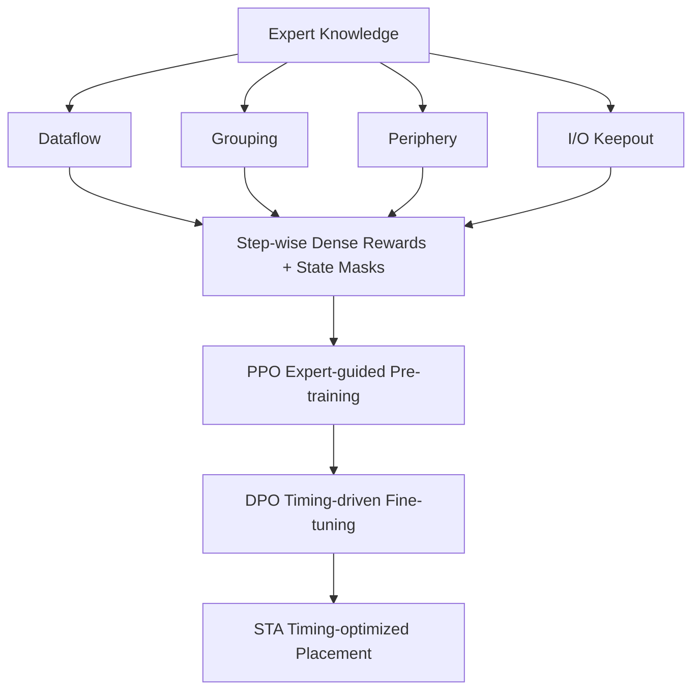

# Expertise Can Be Helpful for Reinforcement Learning-based Macro Placement

**Conference**: ICLR 2026  
**Code**: [lamda-bbo/EXPlace](https://github.com/lamda-bbo/EXPlace)  
**Area**: Reinforcement Learning / AI for EDA / Chip Macro Placement  
**Keywords**: Macro placement, Reinforcement Learning, EDA expert knowledge, Dataflow, Preference optimization, Timing optimization  

## TL;DR
EXPlace explicitly encodes four types of expert knowledge accumulated by chip layout engineers (dataflow, macro grouping, periphery bias, and I/O keepout) into dense rewards and state masks for RL. It then employs Direct Preference Optimization (DPO) to mimic the expert workflow of "iterative refinement based on backend PPA feedback" for timing fine-tuning. This allows RL-based placement to significantly outperform analytical, black-box, and RL peers on real sign-off metrics such as TNS/WNS for the first time.

## Background & Motivation
**Background**: Since AlphaChip was featured in Nature, Reinforcement Learning (RL) has modeled macro placement as a Markov Decision Process (MDP), placing one macro at each step. Due to its optimization efficiency and generalization potential, RL has become a prominent direction in automated EDA placement, with subsequent works improving state representations and dense rewards.

**Limitations of Prior Work**: Academic RL placement methods almost exclusively optimize "oversimplified proxy targets"—such as Half-Perimeter Wirelength (HPWL) and rectangular uniform wire density—while ignoring industrial engineering know-how and design rules proven over decades. Table 1 in the paper systematically compares mainstream methods regarding their coverage of four expert knowledge categories (dataflow, grouping, periphery bias, and I/O keepout) and timing metrics. It finds that existing methods either consider only a single expert rule (e.g., MaskRegulate only uses periphery constraints) or fail to model rules accurately due to black-box limitations. No existing method covers the full suite of industrial knowledge.

**Key Challenge**: There is a systemic gap between proxy targets and final PPA (Power, Performance, Area) metrics. Directly optimizing for accurate feedback like timing is ideal, but PPA evaluation (especially Static Timing Analysis, STA) is prohibitively expensive. Consequently, most methods overfit proxy targets and ignore backend feedback, resulting in layouts that differ vastly from human expert solutions and are difficult to integrate into real production flows.

**Goal**: To make RL placement truly applicable to industry while bridging the gap between automated and manual placement, eliminating the need for extensive subsequent manual refinement.

**Core Idea**: **Expert Knowledge Injection + Expert Workflow Mimicry**. On one hand, four types of mature placement experiences are decomposed into step-wise signals aligned with the placed layout and injected into RL rewards and states. On the other hand, DPO is used to simulate the expert process of "prototyping followed by iterative refinement based on backend timing feedback," implemented as a "pre-training + fine-tuning" pipeline. This echoes a broader AI for EDA paradigm: **integrating domain expertise into data-driven learning is beneficial** (consistent with the philosophy of abductive learning).

## Method

### Overall Architecture
EXPlace builds two layers atop a grid-based MDP placer like MaskPlace. First, it translates the four types of expert knowledge into "dense rewards + state masks" to pre-train a "rule-aware" policy using PPO. Second, it uses DPO to fine-tune this policy driven by timing, shifting the distribution toward trajectories with better timing. the key insight is that these four expert costs can be **decomposed incrementally**: when placing a macro, one only needs to aggregate the pairwise costs relative to already placed macros, providing a natural step-wise dense reward and a 2D mask over the canvas as a state feature.

### Key Designs

**1. Dataflow Guidance: Converting RTL information flow into direction-aware dense masks.** Dataflow represents connectivity signatures at the Register Transfer Level (RTL), reflecting the intensity and direction of information between functional blocks. Since data transfer mostly passes through combinational logic or flip-flops, dataflow paths naturally align with critical timing paths determining WNS/TNS. EXPlace extracts dataflow at the netlist level, removes combinational cells, and aggregates macro-to-macro paths into edge weights $w(i,j)=\sum_{p\in P_{i,j}}\frac{1}{2^{N(p)}}$ (longer paths with more flip-flop stages $N(p)$ contribute less). It then defines a dataflow-weighted Manhattan distance cost $\text{cost}_{df}=\sum_{i\in M}\sum_{j\in M} w(i,j)\cdot\lVert pos_i-pos_j\rVert_1$. This cost consists of independent pairwise terms; when placing the $t$-th macro, the dense reward is the cost increment relative to previously placed macros. An expected reward is calculated for each grid cell to form a dataflow mask $M^{df}_t$, serving as a state feature that guides the policy to place macros with strong dataflow closer together.

**2. Macro Grouping: Encouraging compact co-location based on hierarchical reuse.** Modern chips use hierarchical designs, often featuring many similar reused macros within the same level (e.g., a 4KB memory composed of four identical 1KB macros). They share footprints, have similar connectivity, and exchange data frequently. Experts typically group them to reduce wirelength, ensure regular tiling, and simplify clock tree balancing. EXPlace uses stricter grouping criteria than Hier-RTLMP—macros are grouped only if they "share >30 nets with the same cell cluster, have similar footprints, and belong to the same design hierarchy." If explicit hierarchy is missing, Louvain clustering is used to infer a proxy hierarchy. The grouping cost is the sum of bounding box areas $\text{cost}_g=\sum_{c_i\in C} w_i\cdot h_i$, which is also incrementally decomposable, yielding a grouping mask $M^g$ for the state.

**3. Periphery Bias and I/O Keepout: Maintaining routability with geometric masks.** Pushing macros to the periphery is a recognized best practice; since macros occupy low-level metal layers, placing them in the core area displaces standard cells and causes congestion, while also hindering analytical global placement convergence. The periphery cost is the sum of distances to the nearest boundary in x/y directions $\text{cost}_{peri}=\sum_{i\in M}(d^i_x+d^i_y)$, resulting in a periphery mask $M^{peri}$. I/O Keepout addresses a problem previously ignored by RL placers: I/O ports are at the periphery and need buffers for long interconnects, yet macros also tend to occupy the periphery, competing for resources. EXPlace reserves keepout regions around I/O ports and uses $\text{cost}_{IO}=\sum_{i\in M}\text{overlap}(i, \text{I/O regions})$ to penalize overlaps. All rewards are normalized negative costs, with periphery and grouping weighted higher to maintain flexibility. On OpenROAD, a constrained action space based on corner stitching is used to snap macros to corners or boundaries, further reinforcing regular arrangement.

**4. Expert Workflow Mimicry: Aligning proxy targets with real timing using DPO.** Experts build a high-quality prototype based on experience and then "evaluate-update" based on backend feedback—corresponding to "pre-training + fine-tuning." EXPlace uses PPO (with a dual-branch CNN policy) to pre-train a prototype policy on expert dense rewards. It then performs timing-driven fine-tuning: multiple trajectories are sampled in each round and split into preferred/rejected pairs $D$ based on STA results. The DPO loss $L_{DPO}=-\mathbb{E}_{(\tau_w,\tau_l)\sim D}\big[\log\sigma\big(\beta\log\frac{\pi_\theta(\tau_w)}{\pi_{ref}(\tau_w)}-\beta\log\frac{\pi_\theta(\tau_l)}{\pi_{ref}(\tau_l)}\big)\big]$ is used to increase the probability of superior trajectories and decrease inferior ones. Trajectory-level evaluation improves sample efficiency, and relying on qualitative signals mitigates the noise from the rugged STA landscape.

## Key Experimental Results

### Main Results
On eight cases from the ICCAD 2015 Contest, EXPlace (pre-training only, without timing fine-tuning to ensure fair comparison with RL peers) achieved the best average rank in five out of six metrics:

| Metric | DREAMPlace | MaskPlace | MaskRegulate | LaMPlace | EXPlace |
|------|-----------|-----------|--------------|----------|---------|
| rWL Avg Rank | 4.38 | 4.12 | 3.00 | 2.12 | **1.38** |
| WNS Avg Rank | 3.75 | 4.00 | 3.38 | 2.12 | **1.75** |
| TNS Avg Rank | 4.12 | 4.50 | 2.75 | 2.50 | **1.12** |
| NVP Avg Rank | 4.50 | 4.25 | 2.25 | 2.75 | **1.25** |

Compared to the runner-up for each metric, Ours improved rWL by 3.41%, NVP by 10.73%, WNS by 7.74%, and TNS by 32.53% on average. Specifically, the 32.53% TNS improvement over overall runner-up LaMPlace significantly reduces timing convergence pressure. It slightly trailed in rOverflowV because MaskRegulate focuses solely on periphery costs, packing macros extremely tightly to the boundaries.

On the OpenROAD benchmark (6 cases, full flow including CTS/Global/Detail Routing), EXPlace achieved the best average rank across **all metrics** (rWL, WNS, TNS, DRC, Power, Cell Area), outperforming DREAMPlace and Hier-RTLMP.

### Ablation Study
Removing expert components individually on three representative ICCAD 2015 cases (Table 6) shows that every component contributes positively, with the full EXPlace being optimal:

| Config | rWL Rank | WNS (superblue1) | TNS (superblue1) |
|------|---------|-------------------|-------------------|
| w/o Dataflow | 3.33 | -65.30 | -9.88 |
| Full EXPlace | Best | -58.6 | -8.63 |

Dataflow guidance and periphery bias have the most significant impact. Removing dataflow guidance severely degrades timing metrics (WNS/TNS), while removing periphery bias significantly worsens overflow and wirelength (rWL).

### Key Findings
- "Full-spectrum injection" of four types of expert knowledge is more systemic than using a single rule, validating the value of covering industrial know-how.
- The incrementally decomposable cost design is the technical lever to map high-level guidance into RL dense rewards.
- Timing-driven DPO fine-tuning is decoupled from pre-training, allowing for fair comparison with RL peers while pushing WNS/TNS lower when needed.

## Highlights & Insights
- **Modularizing Expert Knowledge**: Translating knowledge into "masks + dense rewards" makes them plug-and-play components for existing RL frameworks with low intrusion.
- **Incremental Decomposition as Core Methodology**: Pairwise/independent cost structures allow the total cost to equal the sum of step-wise rewards, which is the essence of densification and the elegance of the paper.
- **DPO Application**: Since STA evaluation is expensive and noisy, using trajectory-level preferences instead of absolute rewards successfully formalizes the "expert iterative refinement" behavior.
- **Addressing I/O Keepout**: Fills a gap in learning-based placers regarding the real-world problem of I/O congestion.

## Limitations & Future Work
- Reward weights for the four types of knowledge are set empirically; a self-adaptive or learnable weighting mechanism is currently missing.
- The constrained action space for corner stitching is only enabled on OpenROAD; the suitability for irregular designs remains to be verified.
- Grouping criteria include several hard thresholds, and robustness for designs without explicit hierarchy (relying on Louvain) has not been fully explored.
- Timing fine-tuning still depends on STA. Although DPO improves efficiency, the trade-off between evaluation cost and iteration count in production environments needs more study.

## Related Work & Insights
- **RL Placement Lineage**: EXPlace follows the lineage of AlphaChip, MaskPlace, and others, extending the "wiremask" concept to four categories of expert knowledge.
- **Expert Knowledge Integration**: Unlike IncreMacro or Hier-RTLMP which cover only subsets of rules, EXPlace provides a more complete unification within the RL framework.
- **Preference Optimization**: Migrating DPO from LLM alignment to layout fine-tuning is an interesting case of cross-domain transfer, offering inspiration for other optimization tasks with expensive evaluations.

## Rating
- **Novelty**: ⭐⭐⭐⭐ — While DPO and masks are not new, the systematic translation of four industrial rules into decomposable RL rewards and the mimicry of expert workflows are innovative.
- **Experimental Thoroughness**: ⭐⭐⭐⭐ — Comprehensive metrics and baselines across two major benchmarks; the 32.53% TNS Gain is highly convincing.
- **Writing Quality**: ⭐⭐⭐⭐ — Clear logic and direct comparisons.
- **Value**: ⭐⭐⭐⭐ — Addresses a real pain point in making RL placement industrially viable.

<!-- RELATED:START -->

## Related Papers

- [\[ICLR 2026\] Use the Online Network If You Can: Towards Fast and Stable Reinforcement Learning](use_the_online_network_if_you_can_towards_fast_and_stable_reinforcement_learning.md)
- [\[ICLR 2026\] How Far Can Unsupervised RLVR Scale LLM Training?](how_far_can_unsupervised_rlvr_scale_llm_training.md)
- [\[ICML 2026\] You Can Learn Tokenization End-to-End with Reinforcement Learning](../../ICML2026/reinforcement_learning/you_can_learn_tokenization_end-to-end_with_reinforcement_learning.md)
- [\[ICLR 2026\] Prosperity before Collapse: How Far Can Off-Policy RL Reach with Stale Data on LLMs?](prosperity_before_collapse_how_far_can_off-policy_rl_reach_with_stale_data_on_ll.md)
- [\[NeurIPS 2025\] When Can Model-Free Reinforcement Learning be Enough for Thinking?](../../NeurIPS2025/reinforcement_learning/when_can_model-free_reinforcement_learning_be_enough_for_thinking.md)

<!-- RELATED:END -->
