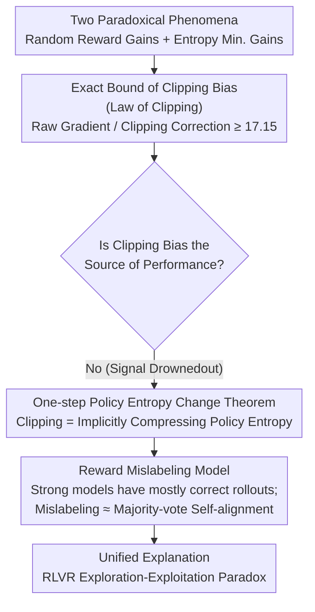

# Exploration vs Exploitation: Rethinking RLVR through Clipping, Entropy, and Spurious Reward

**Conference**: ICLR 2026  
**arXiv**: [2512.16912](https://arxiv.org/abs/2512.16912)  
**Code**: None  
**Area**: Reinforcement Learning  
**Keywords**: RLVR, Exploration-Exploitation Trade-off, Clipping Bias, Policy Entropy, Spurious Reward, GRPO

## TL;DR
Through theoretical derivation and cross-model experiments, it is demonstrated that the learning signal provided by clipping bias in RLVR is negligible ($\leq 1/17$). The effective mechanism is the implicit compression effect of clipping on policy entropy. A reward mislabeling model is proposed to explain how strong models benefit from random rewards.

## Background & Motivation
**Background**: Reinforcement Learning with Verifiable Rewards (RLVR) utilizes online policy optimization algorithms like GRPO to enhance the reasoning capabilities of LLMs using verifiable mathematical reasoning answers as binary rewards. Works such as DeepSeek-R1 have verified the effectiveness of this paradigm, with GRPO becoming the most popular variant due to its computational simplicity and memory efficiency.

**Counter-intuitive Phenomenon 1**: Shao et al. (2025) found that training a Qwen-Math model with completely random Bernoulli(1/2) rewards led to a significant increase in accuracy on MATH500. Since random rewards are entirely unrelated to the correct answer, why does performance improve? Traditional explanations (Wu et al. 2025) attribute this to data contamination—where Qwen-Math has many memorized/contaminated trajectories on MATH500.

**Counter-intuitive Phenomenon 2**: Multiple studies have found that minimizing policy entropy (suppressing exploration and making outputs more deterministic) actually improves RLVR performance. Agarwal et al. (2025) and Gao et al. (2025) even directly optimized the entropy objective to obtain gains without verifiable feedback. This contradicts the "exploration is beneficial" intuition in classical RL.

**Key Challenge**: Shao et al. attribute the gains from random rewards to PPO-style upper-clipping bias, arguing that clipping prioritizes amplifying tokens with high prior probabilities. Conversely, Oertell et al. (2025) argue these gains stem from algorithmic heuristics and evaluation artifacts, noting that random rewards even reduced performance in their experiments.

**Key Insight**: Both suppressing exploitation (random rewards) and suppressing exploration (entropy minimization) can improve reasoning performance—a seemingly self-contradictory observation. A unified theoretical framework is required to reconcile these.

**RLVR Specificity**: Unlike classical RL, rewards in RLVR are outcome-level and extremely sparse, provided only at the end of long rollouts. Exploration unfolds in the sequence space controlled by decoding temperature. Policy updates rely on ratio clipping and group-normalized advantages, making the process much more sensitive to importance ratios and relative rankings than to absolute reward values.

## Method

### Overall Architecture
Ours does not propose a new algorithm but uses a three-layer progressive theoretical analysis to dismantle and reassemble the two contradictory phenomena (random reward gains and entropy minimization gains) into a self-consistent explanation. It sequentially answers three questions: exactly how large is the clipping bias (Answer: negligible), what is clipping actually doing (Answer: implicitly compressing policy entropy), and why do random rewards still benefit strong models (Answer: mislabeling is essentially self-alignment for rollouts that are mostly correct). These three steps correspond to three theoretical results—the Law of Clipping, the One-step Policy Entropy Change Theorem, and the Reward Mislabeling Model—each building upon the previous, finally resolving the RLVR exploration-exploitation paradox.

### Key Designs

**1. Law of Clipping: Quantitatively Disproving the "Clipping Bias Hypothesis"**

Existing explanations attribute random reward gains to the bias signal from PPO-style upper-clipping. Ours first determines the strength of this signal. The clipping surrogate objective is decomposed into a raw term $N_t = r_t A$ and a clipping correction term $N_t^{\text{clip}}$. The total upper-clipping correction is defined as $C_{\text{tot}}^+ = \sum_t (\bar{r}_t - r_t) I_t^+ A$. The lower bound for the magnitude ratio between the raw gradient and the clipping correction $\mathbb{E}[|N_{\text{raw}}|] / \mathbb{E}[|C_{\text{tot}}^+|]$ is derived (Theorem 3.4). The derivation uses the log-ratio reparameterization from Lemma 2.2 and relies on the symmetry of the GRPO advantage function under random binary rewards (Lemma 2.4)—where $|A_i| \leq \sqrt{G} - 1/\sqrt{G}$ and all odd moments $\mathbb{E}[A_i^{2k-1}]=0$, causing cross-terms to cancel neatly. Substituting actual hyperparameters ($\eta=5\times10^{-7}$, $\epsilon=0.2$, $p_+=0.001$, $G=16$, $L=4096$) yields a ratio $\geq 17.15$ in Corollary 3.6. This indicates the clipping bias signal is submerged by the raw gradient by at least one order of magnitude and cannot be the source of performance gains.

**2. One-step Policy Entropy Change Theorem: Clipping as Implicit Entropy Compression**

If clipping does not work via bias signals, where is its real effect? Ours performs an exact second-order expansion of the softmax policy update $\pi_{\text{new}}(a|h) \propto \pi_{\text{old}}(a|h) \exp(\eta \tilde{A}(h,a))$. Without clipping, the expected one-step change in entropy is $\mathbb{E}[\mathcal{H}(\pi_{\text{new}}) - \mathcal{H}(\pi_{\text{old}})] = -c_G \Phi(\pi_{\text{old}}) \eta^2 + O(\eta^4)$, where $\Phi$ measures the skewness of the policy distribution: entropy decreases when skewness is low and may increase when skewness is high—explaining the observation that entropy rises to ~9.0 without clipping. With clipping (Theorem 4.3), an additional negative term appears in the expansion, ensuring entropy is systematically pushed down, thus "Clipping = Implicit Entropy Minimization." This also corrects the first-order approximation from Cui et al. (2025) $\Delta\mathcal{H} \approx -\text{Cov}(\log\pi, A)$: under random rewards, $\log\pi$ and $A$ are independent, making the covariance zero and predicting no entropy change, which contradicts measurements. Only the second-order term captures the real effect of clipping.

**3. Reward Mislabeling Model: Why Random Rewards Benefit Strong Models**

While clipping lowers entropy, low entropy alone does not guarantee gains (weak models may converge to low-entropy but incorrect policies). Ours divides $G$ rollouts into a correct set $\mathcal{C}$ ($n_c$ samples) and an incorrect set $\mathcal{I}$ ($n_i$ samples). Random rewards cause two types of labeling errors: rewarding incorrect rollouts (false positives) and missing rewards for correct rollouts (false negatives). To quantify the damage to the learning signal, the "Correct Response Advantage Loss" is defined as $\Delta(f,g) = \Sigma_{\mathcal{C}}^{\text{ideal}} - \Sigma_{\mathcal{C}}(f,g)$. We calculate $\mathbb{E}[| \Delta |] = n_c(G-n_c)/G$ and $\text{Var}(\Delta) = n_c(G-n_c)/(4G)$. Critically, both go to zero as $n_c \to G$. For strong models, most rollouts are already correct; mislabeling only affects a few incorrect samples, meaning expected loss and variance are both small, leading to more stable training and higher gains. In short, random rewards for strong models act as a majority-vote self-alignment rather than a task-related signal.

### Loss & Training
Experiments follow standard GRPO with Shao et al.'s hyperparameters: batch size 128, group size 16, temperature 1.0, clipping ratio 0.2, learning rate $5\times10^{-7}$, and KL coefficient 0, using the verl framework. Random rewards are sampled directly as $\mathbf{r}(x,y) \sim \text{Bernoulli}(1/2)$, independent of prompts and rollouts, to isolate the effects of clipping and entropy dynamics.

## Key Experimental Results

### Main Results: Effects of Random Reward Training

| Model | Baseline Accuracy | Acc. After Random Reward + Clip | Gain |
|------|----------|------------------|---------|
| Qwen2.5-Math-7B | ~53% | ~68% | +28% |
| R1-Distill-Llama-8B | ~65.6% | ~79% | +20% |
| QwQ-32B | High | Higher | Stable Gain |
| Qwen2.5-Math-1.5B | ~44% | ~46% | +4.5% |

### Ablation Study: Clipping and Entropy Dynamics

| Configuration | Policy Entropy Trend | MATH500 Performance | Explanation |
|------|-----------|-------------|------|
| No Clip + Random Reward | Increases to ~9.0 | Sometimes Improves | No implicit entropy compression, enhanced exploration |
| With Clip + Random Reward | Monotonically drops to ~7.5 | Often Improves | Clipping = Implicit entropy minimization |
| Clipping Rate (Qwen-7B) | <0.2% | — | Confirms clipping bias signal is negligible |
| AIME Hard Set + 7B Weak Model | Unstable | Random Walk | Weak models cannot benefit on difficult data |
| AIME Hard Set + 32B/8B Strong Model | Stable Decrease | Continuous Early Improvement | Strong models still benefit |

### Key Findings
- The clipping bias signal is submerged by the raw gradient signal (ratio $\geq 17.15$) and is not the cause of performance gains.
- Training without clipping carries a risk of gradient explosion: R1-Distill-Llama-8B performance crashed from 76.6% at step ~150.
- Gains from random rewards are not limited to potentially contaminated Qwen-Math models—Llama and QwQ families also benefit, disproving the "pure contamination hypothesis."
- Entropy minimization is a necessary but not sufficient condition: weak models may converge to low-entropy incorrect policies (exhibiting random walk behavior on difficult training sets).
- The higher the model's initial accuracy, the more stable the random reward training curve and the greater the gains—matching predictions from $\text{Var}(\Delta)$ in the mislabeling model.
- Clipping also serves a stabilization role in preventing gradient explosion (verified in experiments without clipping).

## Highlights & Insights
- Disproved the "Clipping Bias Hypothesis" with explicit quantitative bounds (Corollary 3.6), which can be verified with numerical examples.
- Established a deterministic link between clipping and policy entropy: clipping acts by compressing probability distributions in discrete space rather than providing direct signals via bias terms.
- The Reward Mislabeling Model elegantly reconciles two contradictory observations: random rewards work for strong models because the "mislabeling" effectively performs majority-vote self-alignment on a few incorrect rollouts.
- Proposed a new strategy direction of using spurious rewards to actively increase policy entropy—distinct from traditional regularization, it can be combined with real rewards.
- Methodologically, lifting the analysis of GRPO under random rewards from first-order to second-order is a key technical contribution.

## Limitations & Future Work
- Experiments primarily focused on the MATH500 validation set; extensions to coding and logical reasoning tasks are needed.
- The reward mislabeling model assumes a binary ORM and independent rollouts; analysis for continuous or Process Reward Models (PRM) is pending.
- Theoretical insights have not yet been converted into specific algorithmic improvements (e.g., designing better RLVR training strategies using entropy-clipping interactions).
- The assumption of a global lower bound $\pi_{\min}$ may be too conservative for actual LLMs (vocabulary >100K).
- Quantifying policy skewness $\Phi(\pi)$ depends on token-level distributions, which is computationally expensive at scale.

## Related Work & Insights
- The first-order entropy analysis by Cui et al. (2025) fails under random rewards (as noted in Remark 2.7); the second-order analysis in Ours is a necessary correction.
- Complementary to Agarwal et al. (2025) on direct entropy optimization: they provide practical solutions, while Ours provides the theoretical explanation—why entropy minimization works but not always.
- Shao et al. (2025) attribute gains to clipping bias—Ours quantitatively disproves this; Oertell et al. (2025) argue gains are artifacts—Ours proves gains are real and cross-model.
- Insight: The exploration-exploitation trade-off in RLVR differs fundamentally from classical RL—sparse outcome rewards + ratio clipping + group normalization make learning dynamics distinct from traditional MDPs.

## Rating
- Novelty: ⭐⭐⭐⭐⭐ Quantitatively disproves popular hypotheses, unifies contradictory observations.
- Experimental Thoroughness: ⭐⭐⭐⭐ Verified across model families (Qwen/Llama/QwQ) and scales (1.5B-32B), but task types are limited.
- Writing Quality: ⭐⭐⭐⭐⭐ Rigorous derivation, progressive delivery, clear diagrams.
- Value: ⭐⭐⭐⭐⭐ Provides a key piece for the theoretical foundation of RLVR.

<!-- RELATED:START -->

## Related Papers

- [\[ICLR 2026\] Token Hidden Reward: Steering Exploration-Exploitation in Group Relative Deep Reinforcement Learning](token_hidden_reward_steering_exploration-exploitation_in_group_relative_deep_rei.md)
- [\[ACL 2026\] Semantic-Space Exploration and Exploitation in RLVR for LLM Reasoning](../../ACL2026/reinforcement_learning/semantic-space_exploration_and_exploitation_in_rlvr_for_llm_reasoning.md)
- [\[ICLR 2026\] Controllable Exploration in Hybrid-Policy RLVR for Multi-Modal Reasoning](controllable_exploration_in_hybrid-policy_rlvr_for_multi-modal_reasoning.md)
- [\[ICLR 2026\] Generalization of RLVR Using Causal Reasoning as a Testbed](generalization_of_rlvr_using_causal_reasoning_as_a_testbed.md)
- [\[ACL 2026\] HEALing Entropy Collapse: Enhancing Exploration in Few-Shot RLVR via Hybrid-Domain Entropy Dynamics Alignment](../../ACL2026/reinforcement_learning/healing_entropy_collapse_enhancing_exploration_in_few-shot_rlvr_via_hybrid-domai.md)

<!-- RELATED:END -->
