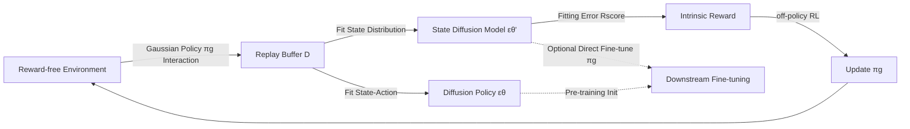

# Exploratory Diffusion Model for Unsupervised Reinforcement Learning

**Conference**: ICLR 2026  
**OpenReview**: [https://openreview.net/forum?id=k0Kb1ynFbt](https://openreview.net/forum?id=k0Kb1ynFbt)  
**Code**: [https://github.com/yingchengyang/ExDM](https://github.com/yingchengyang/ExDM)  
**Area**: Reinforcement Learning / Unsupervised Pre-training  
**Keywords**: Unsupervised Reinforcement Learning, Diffusion Models, Intrinsic Reward, State Entropy, Online Fine-tuning  

## TL;DR
ExDM introduces diffusion models to unsupervised reinforcement learning for the first time. It utilizes diffusion models to fit heterogeneous state distributions within the replay buffer, using "poorly fitted regions" as score-based intrinsic rewards to drive exploration. Additionally, it designs an efficient online fine-tuning algorithm for diffusion policies with convergence guarantees.

## Background & Motivation
**Background**: Unsupervised Reinforcement Learning (URL) aims to pre-train agents in reward-free environments to learn transferable skills or representations, enabling rapid adaptation to various downstream tasks. In the absence of external rewards, mainstream approaches guide exploration via intrinsic rewards, categorized into "exploration stream maximizing state entropy" and "skill discovery stream maximizing skill-state mutual information."

**Limitations of Prior Work**: Data collected during exploration is highly heterogeneous (policies constantly change and visit new states). However, existing methods often simplify pre-training policies to Gaussian or discrete skill policies for easier training and sampling. These simple policies fail to capture the multi-modal diverse behaviors in the replay buffer and limit the expressive power for downstream transfer.

**Key Challenge**: URL requires **strong modeling capabilities** at both the pre-training and fine-tuning stages—accurate estimation of heterogeneous state distributions is necessary to compute high-quality intrinsic rewards. However, more powerful models (like diffusion policies) suffer from multi-step sampling overhead, making online training both unstable and slow. This conflict between **"expressiveness vs. training efficiency"** is the core problem ExDM aims to solve. The paper also theoretically proves (Theorem 4.1) that even in discrete environments, the optimal policy for maximizing state entropy is unlikely to be a simple deterministic policy, fundamentally justifying the need for expressive policies in URL.

**Goal**: To eliminate modeling bottlenecks in both "intrinsic reward design" and "policy representation" using diffusion models, and to ensure that pre-trained diffusion components can stably transfer to downstream tasks within a limited interaction budget.

**Core Idea**: **"Fitting error as exploration signal"** — Instead of using the diffusion model solely as a generator, its fitting quality on the replay buffer is used to define intrinsic rewards: states with high fitting errors are considered insufficiently explored, and the agent is rewarded for visiting them. Simultaneously, **"Modeling and Acting Decouple"** is employed to remove expensive diffusion sampling from the interactive loop.

## Method

### Overall Architecture
ExDM consists of two stages: pre-training and fine-tuning. Pre-training stage: Two diffusion models $\epsilon_{\theta'}$ and $\epsilon_\theta$ are used to fit the state distribution and state-action distribution in the replay buffer, respectively. The score-based intrinsic reward $R_{\text{score}}$ is derived from the fitting error of the diffusion model. To prevent multi-step sampling of the diffusion policy from slowing down online interaction, a lightweight Gaussian behavior policy $\pi_g$ is used for actual exploration, which maximizes $R_{\text{score}}$ using an arbitrary off-policy algorithm. Fine-tuning stage: One can either fine-tune the Gaussian policy $\pi_g$ via DDPG (for fair comparison with baselines) or fine-tune a more expressive diffusion policy $\pi_d$. The latter is implemented through an alternating optimization + energy-guided distillation algorithm, supported by convergence and optimality guarantees (Theorem 4.2).

### Key Designs

**1. Score-based Intrinsic Reward: Diffusion fitting error as an exploration compass.** To maximize state entropy $H(d^\pi)$, it is natural to use $\log p_{\theta'}(s)$ to measure state frequency and use $-\log p_{\theta'}(s)$ as a reward to encourage visiting rare regions. Since the log-likelihood of diffusion models is not directly computable, the paper leverages its ELBO upper bound $-\log p_{\theta'}(s) \le \mathbb{E}_{\epsilon,t}[w_t\|\epsilon_{\theta'}(s_t|t)-\epsilon\|^2]+C$, defining the intrinsic reward as $R_{\text{score}}(s)=\mathbb{E}_{\epsilon,t}[\|\epsilon_{\theta'}(s|t)-\epsilon\|^2]$. This quantity is essentially the denoising error of the diffusion model for that state—well-fitted states have low error and low reward, while poorly fitted or unseen states have high error and high reward, naturally pushing the agent toward under-visited regions. Unlike methods relying on separate density networks or RND, this reward signal is directly tied to "how well the model has learned this part of the distribution" and adaptively updates with the buffer.

**2. Modeling and Acting Decouple: Diffusion for modeling, Gaussian for execution.** Directly using a diffusion policy for environment interaction requires 5~15 sampling steps, which is slow and unstable in online scenarios. ExDM decouples "what fits the distribution" from "what samples actions": the diffusion model is only updated on the offline buffer to provide $R_{\text{score}}$, while a Gaussian behavior policy $\pi_g$ interacts with the environment and collects data, maximizing $R_{\text{score}}$ via off-policy RL (Algorithm 1: Alternating between "sampling buffer data to update diffusion models + calculating intrinsic rewards + training $\pi_g$" and "interacting with the environment using $\pi_g$ to fill the buffer"). This maintains the modeling strength of diffusion while shielding the interaction loop from multi-step sampling overhead, making the training scalable.

**3. Efficient Online Fine-tuning of Diffusion Policy: Alternating optimization + Energy-guided distillation.** Given limited downstream fine-tuning steps, the objective is formulated as a KL-regularized form: $J_f(\pi)=\frac{1}{1-\gamma}\mathbb{E}_{s\sim d^\pi,a\sim\pi}[R(s,a)-\beta \log\frac{\pi(a|s)}{\pi_d(a|s)}]$. Since this surrogate reward depends on the policy itself, ExDM leverages soft RL to define a policy-coupled $Q^\pi$ and splits the solution into two alternating steps. The closed-form optimal policy is $\pi_n(a|s)\propto\pi_d(a|s)e^{Q_{n-1}(s,a)/\beta}$, and it is provable that the policy improves monotonically and converges to the optimum (Theorem 4.2). In implementation, the $Q$ function is updated via IQL (expectile regression to penalize out-of-distribution actions). The intractable partition function $Z(s)$ in $\pi_n$ is bypassed—sampling from $\pi_n$ is treated as energy-guided sampling of $\pi_d$. Contrastive Energy Prediction (CEP) learns the guidance term $f_{\phi_{n-1}}$, and finally, score distillation $\min_\psi\|\epsilon_\psi(a_t|s,t)-\epsilon_\theta(a_t|s,t)-f_{\phi_{n-1}}(s,a_t,t)\|^2$ distills the fine-tuned policy into a directly samppable diffusion network $\epsilon_\psi$.

## Key Experimental Results

### Main Results
Maze2d state coverage (ratio of 0.01×0.01 grid visits, mean of 10 seeds, higher is better):

| Method | Square-c | Square-d | Square-tree | Square-bottleneck | Square-large |
|------|----------|----------|-------------|-------------------|--------------|
| RE3 | 0.73 | 0.74 | 0.73 | 0.62 | 0.46 |
| MEPOL | 0.96 | 0.77 | 0.89 | 0.62 | 0.59 |
| CIC | 0.86 | 0.74 | 0.89 | 0.58 | 0.47 |
| CeSD | 0.67 | 0.46 | 0.37 | 0.46 | 0.40 |
| **ExDM** | **0.98** | **0.78** | **0.91** | **0.75** | **0.71** |

In the most complex Square-bottleneck / Square-large environments where baselines get stuck, ExDM explores nearly the entire maze, achieving a coverage rate up to 51% higher than the runner-up and reaching comparable performance in 37% of the time steps.

URLB Downstream Adaptation (Expert normalized score, 10 seeds, higher is better):

| Setting | Conclusion |
|------|------|
| (a) DDPG fine-tuning Gaussian policy vs. 12 URL baselines | ExDM significantly leads across mean/median/IQM/OG metrics. |
| (b) Cross-embodiment URLB vs. PEAC, etc. | ExDM substantially outperforms all baselines. |
| (c) Fine-tuning Diffusion policy vs. DQL/IDQL/QSM/DIPO | ExDM markedly outperforms existing online diffusion fine-tuning methods. |

### Ablation Study

| Ablation Item | Observation |
|--------|------|
| Pre-training steps (100k→2M) | ExDM consistently outperforms baselines starting from 500k steps, with continuous Gain as steps increase, verifying exploration quality benefits downstream tasks. |
| Q-learning style (IQL vs. In-support Softmax) | ExDM with IQL significantly outperforms ExDM w/o IQL, validating the effectiveness of expectile regression for penalizing OOD actions. |
| Diffusion sampling steps (2~20) | Performance is robust to sampling steps; few-step sampling is sufficient to maintain high scores. |
| Fine-tuning temperature $\beta$ (1/2.0, 1/3.0, 1/4.0) | Performance is stable across different $\beta$ values, which controls the proximity to the pre-trained policy. |

### Key Findings
- The fitting error of diffusion models is a more reliable exploration signal than RND or uncertainty, especially in complex mazes with many branches and dense decision points.
- While diffusion policy fine-tuning significantly exceeds existing diffusion baselines, it remains slightly lower than Gaussian policy fine-tuning. The authors attribute this to the limited interaction budget for fine-tuning—efficient online fine-tuning for diffusion remains an open direction.

## Highlights & Insights
- **Novel Perspective**: While diffusion models are almost always used as generators (pursuing sampling fidelity), ExDM takes the opposite approach by using denoising error as an "exploratory value" signal, which is an interesting repurposing of the model.
- **Theoretical/Engineering Balance**: Theorem 4.1 argues for the necessity of expressive policies in URL based on the complexity of state-entropy optimal policies; Theorem 4.2 provides convergence and optimality guarantees for diffusion policy fine-tuning.
- **Clean Decoupling**: The division of labor between modeling (diffusion: offline, slow but accurate) and acting (Gaussian: online, fast) bypasses the online bottleneck of multi-step sampling, offering a pragmatic paradigm for integrating diffusion models into online RL.

## Limitations & Future Work
- Diffusion policy fine-tuning performance still lags behind Gaussian fine-tuning; the efficiency of multi-step sampling for online adaptation is not yet fully resolved under tight interaction budgets.
- Evaluations were primarily on Maze2d and URLB continuous control with relatively low state/action dimensions (Maze is $\mathbb{R}^2$); scalability to high-dimensional pixel observations or complex robot tasks remains to be tested.
- The pipeline is relatively heavy, involving two diffusion models, a Gaussian policy, IQL, and CEP guidance, requiring careful hyperparameter tuning (e.g., $\beta$).

## Related Work & Insights
- **Exploration Intrinsic Rewards** (ICM/RND/RE3/MEPOL/LBS): ExDM's $R_{\text{score}}$ can be seen as an upgrade of the "novelty via model fitting error" concept from random networks/dynamics prediction to diffusion density estimation.
- **Diffusion Models in RL** (Diffusion Policy/Diffuser/DQL/IDQL): Previously used mostly for offline RL modeling of multi-modal behavior or planning; ExDM is the first to apply it to unsupervised exploration and provide a feasible online fine-tuning scheme.
- **Energy-Guided Sampling and Distillation** (CEP, score distillation): The approach of bypassing the partition function and distilling guidance terms into a samppable network is directly applicable to other works aiming to fine-tune diffusion policies online.

## Rating
- Novelty: ⭐⭐⭐⭐⭐ First to introduce diffusion to unsupervised RL; the "fitting error as reward" perspective and decoupling design are highly novel.
- Experimental Thoroughness: ⭐⭐⭐⭐ Maze2d + URLB (Single/Cross-embodiment) + Diffusion fine-tuning setups with 10+ baselines and 10 seeds; however, environment dimensions are low, lacking high-dimensional pixel tasks.
- Writing Quality: ⭐⭐⭐⭐ Clear chain from motivation to theory, method, and experiments; strong support from two theorems; method section is formula-dense, requiring background in diffusion and soft RL.
- Value: ⭐⭐⭐⭐ Provides a reproducible solution paradigm for the "expressive model vs. online efficiency" conflict in URL, offering insights for both exploration reward design and online diffusion fine-tuning.

<!-- RELATED:START -->

## Related Papers

- [\[ICLR 2026\] Revolutionizing Reinforcement Learning Framework for Diffusion Large Language Models](revolutionizing_reinforcement_learning_framework_for_diffusion_large_language_mo.md)
- [\[ICLR 2026\] MOBODY: Model-Based Off-Dynamics Offline Reinforcement Learning](mobody_model-based_off-dynamics_offline_reinforcement_learning.md)
- [\[ICLR 2026\] How Far Can Unsupervised RLVR Scale LLM Training?](how_far_can_unsupervised_rlvr_scale_llm_training.md)
- [\[ICLR 2026\] SUSD: Structured Unsupervised Skill Discovery through State Factorization](susd_structured_unsupervised_skill_discovery_through_state_factorization.md)
- [\[ICLR 2026\] One-Step Flow Q-Learning: Addressing the Diffusion Policy Bottleneck in Offline RL](one-step_flow_q-learning_addressing_the_diffusion_policy_bottleneck_in_offline_r.md)

<!-- RELATED:END -->
