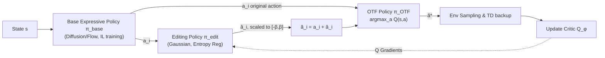

# EXPO: Stable Reinforcement Learning with Expressive Policies

**Conference**: ICLR 2026  
**OpenReview**: [https://openreview.net/forum?id=aFjSjkB6CV](https://openreview.net/forum?id=aFjSjkB6CV)  
**Code**: [github.com/pd-perry/EXPO](https://github.com/pd-perry/EXPO)  
**Area**: reinforcement learning  
**Keywords**: expressive policies, diffusion policy, online RL fine-tuning, Offline-to-Online, value maximization, action editing  

## TL;DR
EXPO bypasses the instability of backpropagating value gradients through diffusion/flow-matching chains by combining "imitation learning for the base expressive policy + lightweight Gaussian editing for Q-value maximization + on-the-fly selection of the highest-value action," achieving a 2-3x improvement in online RL fine-tuning sample efficiency.

The problem focus is specific: given an **offline dataset** and (optionally) a **pre-trained expressive policy**, how to continue improving it efficiently via online RL without being hindered by the gradient stability issues of the denoising chain.

## Background & Motivation
- **Background**: Significant progress has been made in robotics by training **expressive policies** (diffusion policy, flow-matching policy) via imitation learning on large datasets. However, imitation learning often falls short of the reliability required for real-world deployment; the natural next step is self-improvement fine-tuning using online RL.
- **Limitations of Prior Work**: Mainstream online RL (PPO, TD3, SAC) is designed for simple Gaussian policies and cannot effectively utilize pre-trained expressive policies. Expressive policies are parameterized by a **long denoising chain**; backpropagating gradients from action outputs to policy parameters for value maximization is extremely unstable and incurs computational costs that explode with the number of denoising steps.
- **Key Challenge**: Expressive policies have high representational capacity (modeling complex multi-modal behavior distributions), but **stable value maximization** is nearly impossible to implement directly. Existing works either distill multi-step diffusion into 1 or 2-step weak policies or insert value supervision at intermediate denoising steps, none of which truly solve stable value maximization during online fine-tuning.
- **Goal**: Design an efficient, stable, and **parameterization-agnostic** online RL fine-tuning method that can start from any pre-trained expressive policy.
- **Core Idea**: **[Bypassing direct optimization]** Instead of forcing the base expressive policy to maximize value, it is trained using stable imitation learning. Value maximization is delegated to an **on-the-fly (OTF) RL policy**—a lightweight Gaussian editing policy that performs local refinement on base actions, followed by a non-parametric selection of the highest-value action.

## Method

### Overall Architecture
EXPO maintains two policies: a **base expressive policy $\pi_{base}$** initialized from offline pre-training and continuously trained via online imitation learning objectives (never explicitly trained for value maximization), and a **lightweight Gaussian editing policy $\pi_{edit}$** trained with standard RL policy losses to edit base actions toward higher Q-values. Both are combined at runtime into an OTF policy $\pi_{OTF}$: candidates are sampled from both base and editing policies, and the one with the highest Q-value is selected. This optimal action is used for both environment sampling **and** target computation in TD backup.

### Key Designs

**1. Value Maximization and Exploration via Action Editing:** The base policy is trained only with imitation learning, keeping the distribution stable but preventing it from naturally shifting toward high-value regions. EXPO introduces a Gaussian editing policy $\pi_{edit}(\hat{a}\mid s,a)$ to refine actions sampled from the base policy as $\tilde{a}\leftarrow a+\hat{a}$ (Eq. 1). The editing policy is trained using standard entropy-regularized policy loss:

$$L(\pi_{edit})=-\mathbb{E}_{(s,a)\sim D,\hat{a}\sim\pi_{edit}}[Q_\phi(s,a+\hat{a})-\alpha\log\pi_{edit}(\hat{a}\mid s,a)]$$

This allows local Q-function hill-climbing while maintaining action diversity via entropy—crucial when the base policy distribution is narrow. To prevent the editor from pushing actions too far from the behavior distribution, $\hat{a}$ is scaled to $[-\beta, \beta]$, where $\beta$ can be small (e.g., 0.05, for refinement only) or large (e.g., 0.7, for exploration). This restricts the editing policy to a **simpler local optimization problem**, making it significantly smaller than the base policy while remaining efficient and stable to train.

**2. On-the-fly (OTF) Parameterization of RL Policy:** To leverage both the representational power of the base policy and the value maximization of the editor, EXPO constructs the policy on-the-fly rather than explicitly distilling it: $\pi_{OTF}(a\mid s,\pi_{base},\pi_{edit},\phi)=\arg\max_{a\in\bigcup_i\{a_i,\tilde{a}_i\}}Q_\phi(s,a)$. For $N$ base actions $a_i$ and their edited versions $\tilde{a}_i=a_i+\hat{a}_i$, the one with the highest Q-value is selected. This $\tilde{a}^*$ is **used simultaneously for sampling and TD backup targets**:

$$\min_\phi\mathbb{E}_{(s_t,a_t,s_{t+1})\sim D}[(r_t+\gamma Q_{\phi'}(s_{t+1},\tilde{a}^*_{t+1})-Q_\phi(s_t,a_t))^2],\quad \tilde{a}^*_{t+1}\sim\pi_{OTF}(\cdot\mid s_{t+1})$$

The advantage of OTF extraction is that Q-function updates are immediately reflected in behavior and TD targets, unlike standard policy extraction which requires slow parameter updates to align with the new Q-function. This is equivalent to performing standard Q-learning updates with an implicit policy rather than lagged SARSA.

**3. Entropy Backup for Data-Constrained Scenarios:** When the offline dataset is small or narrow, the agent requires more aggressive online exploration. EXPO treats the base + editing combination as an OTF policy and adds an entropy reward, changing the target to $y=r_t+\gamma[Q_{\phi'}(s_{t+1},\tilde{a}^*_{t+1})-\alpha\log\pi_{OTF}(\tilde{a}^*_{t+1}\mid s_{t+1})]$ (Eq. 4-5). Since expressive policies like diffusion lack closed-form entropy, the authors construct a soft-sampling distribution: sample $N$ base actions, edit them, and select with probability $\pi_{sampling}(a_i\mid s)=\frac{\exp\beta Q(s,a_i)}{\sum_k\exp\beta Q(s,a_k)}$, yielding a closed-form entropy for backup. Experiments show this significantly improves performance on small offline sets (even with <10% success in imitation data).

### Loss & Training
The base policy is instantiated using a diffusion policy (DDPM), with the objective being denoising error $\min_\psi\mathbb{E}\big[\lVert\epsilon-\epsilon_\psi(\sqrt{\bar\alpha_t}a+\sqrt{1-\bar\alpha_t}\epsilon,s,t)\rVert\big]$. The editing policy is trained as a Gaussian with entropy regularization using SAC-style updates. The overall framework is an off-policy, TD-based algorithm (including multi-step updates with UTD ratio $G$), generalizable to any expressive policy class.

## Key Experimental Results

### Setup
- **12 Continuous Control Tasks with Sparse Rewards**, covering 4 domains: D4RL Antmaze (medium/large navigation), D4RL Adroit (28-DoF dexterous hand), Robomimic (7-DoF Franka arm), MimicGen (Threading/Stack).
- Two settings: **Pure Online RL** (no pre-training) and **Offline-to-Online** (online fine-tuning after offline pre-training). In offline-to-online, EXPO **only pre-trains the base policy with imitation learning**, without pre-training the Q-network (differing from IDQL/Cal-QL/DAC), ensuring it can start from any pre-trained policy.

### Main Results

| Setting | Baselines | EXPO Results |
|------|----------|-----------|
| Online RL (Fig.3) | RLPD, IDQL, DIPO, QSM | Sample efficiency significantly exceeds best baselines in almost every task **without offline pre-training**; relocation-binary is the exception. |
| Offline→Online (Fig.4) | IDQL, Cal-QL, DAC, RLPD | Best overall sample efficiency and asymptotic performance; significant advantage in manipulation tasks; **zero performance drop** from pre-training to fine-tuning. |

Key Comparison: RLPD is fast but slow to explore optimal policies; IDQL is hindered by policy constraints; QSM is unstable due to action gradient matching; DAC collapses quickly during online transition. EXPO maintains the base policy close to the behavior distribution while using the editor for local expansion, minimizing distribution shift.

### Ablation Study

| Ablation Dimension | Approach | Conclusion |
|----------|----------|-----------|
| OTF Extraction in TD backup (Fig.5) | Max Q only for sampling; backup uses single sampled action (SARSA-like) | Performance and sample efficiency drop significantly in Can/Square; **using max Q actions for TD backup is critical**. |
| Action Editing (Fig.6) | Remove editor; sample only from base policy and pick max Q | Pen-binary fails (no exploration); Square degrades; **editing is indispensable for continuous refinement**. |
| Offline Data Quality/Scale (Fig.7) | Sub-sample Square demonstrations | Performance scales with data quality; however, **with entropy backup, near-perfect policies are learned even with <10% success demos**. |

## Highlights & Insights
- **"Bypassing" rather than "Confronting"**: The core insight is that the best way to achieve stable value maximization is **not to optimize the expressive policy directly** for value, but to outsource value maximization to a lightweight, local, and analytically tractable editing policy—an elegant decoupling.
- **On-the-fly (OTF) Policy Extraction**: Immediate reflection of Q-function changes in behavior and TD targets avoids parameter alignment lag, making updates closer to Q-learning than SARSA.
- **Parameterization Agnostic**: Unlike many works specific to diffusion or flow, EXPO makes no requirements on the base policy category, enabling fine-tuning from any pre-trained policy.
- **$\beta$-Constraint for Editing Distance**: A simple action amplitude clipping restricts editing to a local problem and provides an intuitive "refinement vs. exploration" knob.
- **Zero-drop Offline-to-Online Transition**: Distribution shift is naturally suppressed because the base policy stays near the behavior distribution while the editor only expands locally.
- **Engineering of Entropy Backup**: Providing a usable entropy term for diffusion policies via a soft-softmax sampling distribution is a practical patch for extremely narrow data scenarios.

## Limitations & Future Work
- **High TD Backup Computational Cost**: Sampling multiple candidates per batch to calculate Q-values is computationally expensive; speed improvements are left for future work.
- **Dependency on Reasonable Priors**: The method assumes the offline dataset or pre-trained policy provides sufficient signaling; performance degrades in zero-information scenarios (e.g., extremely narrow relocate-binary data) unless rescued by entropy backup.
- **Gaussian Editing Limitation**: Local refinement is limited by the Gaussian assumption and $[-\beta, \beta]$ clipping; long-range multi-modal jumps still rely on the base policy and candidate selection.
- **Sim-only Validation**: Experiments are confined to D4RL/Robomimic/MimicGen; real-world robot sample efficiency and multi-sampling overhead remain to be verified.

## Related Work & Insights
- **RL with Prior Data**: Works like RLPD/Cal-QL use offline data to accelerate online RL but mostly use Gaussian policies; EXPO brings expressive policy capacity to this paradigm.
- **RL for Expressive Policies**: IDQL (weighted BC + implicit sampling), DIPO/QSM (gradient-guided diffusion), and residual policies are competitors; EXPO differs by using an independent editor to leverage Q-gradients instead of backpropagating through the expressive policy.
- **Sample-based Value Maximization**: Shares roots with "sample and pick max Q" ideas but proves that using the max action for both TD backup and exploration is key for online efficiency.
- **Value Gradient Fine-tuning**: Others avoid long-chain backpropagation via distillation into 1/2-step policies; EXPO achieves stability by keeping the base policy fixed and adding an editor.

## Rating
- **Novelty**: ⭐⭐⭐⭐ — The combination of "IL-trained base + lightweight editor + OTF selection" is simple yet effective; the decoupling perspective is insightful.
- **Experimental Thoroughness**: ⭐⭐⭐⭐ — 12 tasks across 4 domains, both online and offline-to-online settings, and three key ablations; a numerical summary table would complement the learning curves.
- **Writing Quality**: ⭐⭐⭐⭐ — Clear motivation and core insights, complete algorithms and equations, and intuitive diagrams.
- **Value**: ⭐⭐⭐⭐ — Directly addresses the stability bottleneck in expressive policy fine-tuning; 2-3x sample efficiency and policy-agnosticism offer strong practical value for robot RL.

<!-- RELATED:START -->

## Related Papers

- [\[ICLR 2026\] Fine-tuning Behavioral Cloning Policies with Preference-Based Reinforcement Learning](fine-tuning_behavioral_cloning_policies_with_preferencebased_reinforcement_learn.md)
- [\[ICLR 2026\] GEPO: Group Expectation Policy Optimization for Stable Heterogeneous Reinforcement Learning](gepo_group_expectation_policy_optimization_for_stable_heterogeneous_reinforcemen.md)
- [\[ICLR 2026\] R1-Reward: Training Multimodal Reward Model Through Stable Reinforcement Learning](r1-reward_training_multimodal_reward_model_through_stable_reinforcement_learning.md)
- [\[ICLR 2026\] Use the Online Network If You Can: Towards Fast and Stable Reinforcement Learning](use_the_online_network_if_you_can_towards_fast_and_stable_reinforcement_learning.md)
- [\[ICML 2026\] Fast and Highly Expressive Policy Learning for Offline Reinforcement Learning via Bootstrapped Flow Q-Learning](../../ICML2026/reinforcement_learning/fast_and_highly_expressive_policy_learning_for_offline_reinforcement_learning_vi.md)

<!-- RELATED:END -->
