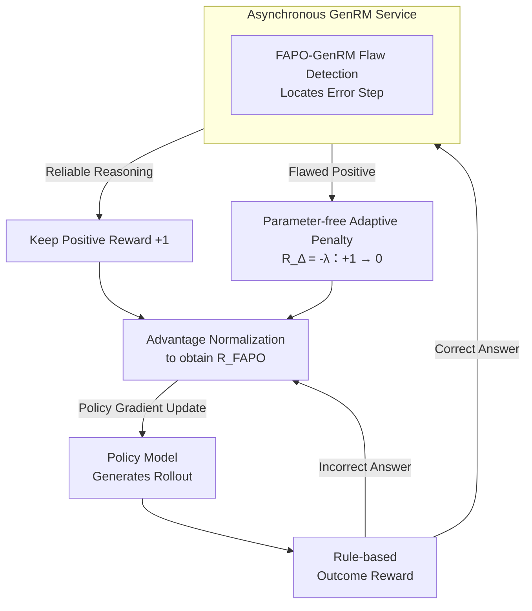

# FAPO: Flawed-Aware Policy Optimization for Efficient and Reliable Reasoning

**Conference**: ICLR2026  
**arXiv**: [2510.22543](https://arxiv.org/abs/2510.22543)  
**Code**: [fapo-rl.github.io](https://fapo-rl.github.io)  
**Area**: Reinforcement Learning  
**Keywords**: RLVR, flawed positives, reward shaping, generative reward model, process reward, GRPO

## TL;DR
Addressing the "flawed-positive rollout" problem (correct answer but flawed reasoning) in RLVR training, this paper proposes the FAPO algorithm. It utilizes a GenRM to detect flawed reasoning and implements a "first exploit, then suppress" natural learning trajectory through a parameter-free reward penalty mechanism, simultaneously improving result accuracy, process reliability, and training stability.

## Background & Motivation
Reinforcement Learning with Verifiable Rewards (RLVR) is currently a mainstream paradigm for enhancing LLM reasoning capabilities, where models optimize policies by exploring reasoning trajectories and using correct answers as positive signals. However, standard rule-based outcome rewards only check the final answer, failing to distinguish the quality of the reasoning process.

This leads to a severe issue: **flawed-positive rollouts**—instances where the model happens to arrive at the correct answer through unreliable means such as answer-guessing or jump-in-reasoning, yet receives the same positive reward as perfectly correct reasoning. These flawed reasoning patterns are continuously reinforced during training, ultimately limiting the model's performance ceiling.

The authors' analysis of models like Qwen2.5-Math-7B and Llama3.3-70B shows that flawed positives account for as much as 20%–40% of correct rollouts and persist throughout the RL training process (remaining at a near-constant 30% ratio).

## Core Problem
1.  **Dual nature of flawed positives**: In early training stages, when the model's capability is insufficient to generate entirely correct reasoning, flawed positives act as "stepping stones" for rapid capability growth; however, in later stages, they hinder the evolution toward genuine problem-solving abilities.
2.  **Detection of flawed positives**: Existing models either exhibit "over-criticism" (high recall but low precision) or possess too many parameters to be suitable for online RL use.
3.  **Balancing exploitation and suppression timing**: An adaptive mechanism is required to allow exploitation during the warm-up phase and gradual suppression during the refinement phase.

## Method

### Overall Architecture
FAPO integrates a lightweight Generative Reward Model (GenRM) into the standard RLVR training loop. Each rollout with a correct answer is first evaluated by the GenRM to determine if it is a flawed positive (correct answer, flawed reasoning). Based on this, a parameter-free penalty is applied to the original outcome reward. This allows the model to exploit these "flawed shortcuts" early on to gain capability while automatically driving their advantage values below zero in later stages to phase them out. The entire pipeline forms a closed loop: policy sampling → rule-based scoring → flaw detection for correct answers → reward correction → intra-group advantage normalization → policy gradient update.

### Key Designs

**1. FAPO-GenRM: Transforming Flawed-Positive Detection into a Learnable Localization Task**
Existing reward models often struggle with this task—either they are massive PRMs unsuitable for online use, or small models that "over-criticize," showing high recall but low precision by misidentifying normal reasoning as flawed. FAPO trains a GenRM on Qwen3-4B-Instruct using RL, splitting the reward into outcome and process terms: $R_{\text{FAPO-GenRM}} = R_{\text{Outcome}} + R_{\text{Process}}$. The outcome term gives $+1/-1$ for correct/incorrect predictions, while the process term activates only when a flawed positive is detected, calculated as $-|\hat{t}_\theta - t^*|/n$, where $\hat{t}_\theta$ is the predicted error step, $t^*$ is the ground-truth error step, and $n$ is the total number of steps. This process penalty forces the model to "point out exactly which step is wrong" rather than vaguely guessing if a flaw exists, reducing the penalty as localization accuracy increases. This also introduces a natural reward transition: early training is dominated by the $-1 \to 1$ gain of the outcome term, and once result determination saturates, the process term takes over, allowing the model to evolve from "judging correctness" to "finding faults." The training data, FAPO-Critic-85K, was created by sampling rollouts from 7B–70B LLaMA/Qwen models on DAPO-Math-17K and having Qwen3-32B label step-level error positions. Ultimately, this 4B detector outperformed its 32B teacher on FlawedPositiveBench and ProcessBench.

**2. Parameter-free Adaptive Penalty: Enabling "Exploit Then Suppress" Naturally**
Upon detecting a flawed positive, FAPO does not simply discard the sample. Instead, it adds a correction term to the original reward: $R_{\text{FAPO}}(o, a^* \mid \theta) = R_{\text{RLVR}}(o, a^*) + R_\Delta(o, a^* \mid \theta)$, where $R_\Delta = -\lambda$ if identified as a flawed positive, and $0$ otherwise. Setting the default $\lambda = 1$ perfectly reduces the flawed rollout reward from $+1$ to $0$. The reason $\lambda=1$ requires no tuning is based on the learning progress $\rho = \alpha/\beta$ (ratio of positive to negative samples). In the warm-up phase ($\rho < 1$), the 0-reward flawed positive still holds a positive advantage relative to the group baseline and is thus exploited. In the refinement phase ($\rho > 1$), the same 0-reward falls below the group average, resulting in a negative advantage and natural suppression. When $\rho > 3$, the advantage of positive samples is further scaled, making training more stable. Derived from majority-guided principles, $\lambda=1$ ensures the transition from exploitation to suppression occurs exactly at $\rho=1$, making the mechanism adaptive without extra hyperparameters.

**3. Asynchronous GenRM Service: Offloading Detection Costs**
The biggest risk of adding an evaluator in online RL is slowing down main training. FAPO deploys GenRM as an independent LLM service on the cluster, decoupled asynchronously from rollout inference and actor updates. Multiple workers and routers are used for load balancing, while overlong reward strategies and checkpoint selection keep the GenRM's token budget in check. Consequently, total training time increases by less than 20% despite introducing step-level flaw detection, making this quality constraint affordable for large-scale training.

## Key Experimental Results

### GenRM Detection Performance
- FAPO-GenRM-4B outperformed the teacher model Qwen3-32B on FlawedPositiveBench and ProcessBench.
- It showed significant improvements over the Qwen3-4B-Instruct baseline and strong baselines like Qwen2.5-Math-PRM-72B.
- Successfully addressed the "over-criticism" issue (achieving high precision along with high recall).

### Reasoning Performance (Qwen2.5-Math-7B + GRPO baseline)
- FAPO outperformed the baseline across almost all intermediate checkpoints on **AIME24 / AIME25 / GPQA-Diamond**.
- The proportion of flawed positives was significantly reduced (dropping substantially from approximately 30%).
- Training curves were smoother, with no significant performance degradation in later stages.
- Token budget did not increase (performance gains did not rely on longer responses).

### Ablation Study
- Stronger GenRM → Better final RL performance (detection accuracy is positively correlated with final performance).
- Self-correction analysis: FAPO naturally pivots to entirely correct rollouts in later stages, resulting in shorter responses and more efficient reasoning.
- Step-ratio reward (scoring based on the proportion of correct steps) leads to reward hacking—models output only high-confidence steps and skip uncertain ones.

## Highlights
1.  **Systematic analysis of flawed positives**: First to reveal their dual role as "early stepping stones and later obstacles," providing a new perspective on RLVR training.
2.  **Parameter-free adaptive mechanism**: $\lambda=1$ is theoretically derived, introducing no extra hyperparameters and allowing the optimization focus to shift naturally as training progresses.
3.  **Compact and efficient GenRM**: A 4B parameter model surpasses its 32B teacher and is asynchronously decoupled from RL training, adding less than 20% to training time.
4.  **Comprehensive validation**: Reports performance across all intermediate checkpoints and provides multi-dimensional ablations, manual verification, and reward hacking analysis, demonstrating training stability.

## Limitations & Future Work
1. GenRM introduces additional inference overhead; while currently under 20%, it may become a bottleneck in larger-scale systems.
2. FlawedPositiveBench is built upon ProcessBench and has limited evaluation coverage.
3. Experiments primarily focused on mathematical reasoning and general QA; more complex verifiable tasks like code generation have not been fully explored.
4. GenRM itself might be susceptible to reward hacking—while discussed, its long-term robustess requires further verification.
5. The asynchronous architecture is an engineering compromise; a fully synchronous solution might offer better system efficiency.

## Related Work & Insights

| Method | Reward Type | Handles Flawed Positives | Parameter-free | Features |
|------|----------|--------------------------|-----------|------|
| Standard RLVR | Binary Outcome | No | Yes | Simple but reinforces flawed reasoning |
| PRM (Discriminative) | Step-level Score | Indirectly | No | Dense rewards, prone to hacking |
| Step-ratio reward | Step Proportion | Indirectly | No | Leads to jump-in-reasoning |
| **FAPO** | Outcome + Penalty | **Direct Detection + Adaptive Penalty** | **Yes** | Natural learning trajectory, stable and efficient |

## Related Papers

- DeepSeek-V3/R1 Technical Reports (RLVR & GRPO frameworks)
- Math-Step: Learning to Reason by Stepping (Process-based rewards)
- Training Verifiers to Solve Math Word Problems (Outcome vs. Process rewards)

## Related Papers

- [\[ACL 2026\] d-TreeRPO: Towards More Reliable Policy Optimization for Diffusion Language Models](../../ACL2026/reinforcement_learning/d-treerpo_towards_more_reliable_policy_optimization_for_diffusion_language_model.md)
- [\[ICLR 2026\] Boosting Multi-Domain Reasoning of LLMs via Curvature-Guided Policy Optimization](boosting_multi-domain_reasoning_of_llms_via_curvature-guided_policy_optimization.md)
- [\[ICLR 2026\] REA-RL: Reflection-Aware Online Reinforcement Learning for Efficient Reasoning](rea-rl_reflection-aware_online_reinforcement_learning_for_efficient_reasoning.md)
- [\[ICLR 2026\] Single-stream Policy Optimization](single-stream_policy_optimization.md)
- [\[ICLR 2026\] DuPO: Enabling Reliable Self-Verification via Dual Preference Optimization](dupo_enabling_reliable_self-verification_via_dual_preference_optimization.md)

<!-- RELATED:END -->

<!-- RELATED:START -->

## Related Papers

- [\[ACL 2026\] d-TreeRPO: Towards More Reliable Policy Optimization for Diffusion Language Models](../../ACL2026/reinforcement_learning/d-treerpo_towards_more_reliable_policy_optimization_for_diffusion_language_model.md)
- [\[ICLR 2026\] Boosting Multi-Domain Reasoning of LLMs via Curvature-Guided Policy Optimization](boosting_multi-domain_reasoning_of_llms_via_curvature-guided_policy_optimization.md)
- [\[ICLR 2026\] REA-RL: Reflection-Aware Online Reinforcement Learning for Efficient Reasoning](rea-rl_reflection-aware_online_reinforcement_learning_for_efficient_reasoning.md)
- [\[ICLR 2026\] Sample More to Think Less: Group Filtered Policy Optimization for Concise Reasoning](sample_more_to_think_less_group_filtered_policy_optimization_for_concise_reasoni.md)
- [\[ICLR 2026\] Group Verification-based Policy Optimization for Interactive Coding Agents](group_verification-based_policy_optimization_for_interactive_coding_agents.md)

<!-- RELATED:END -->
