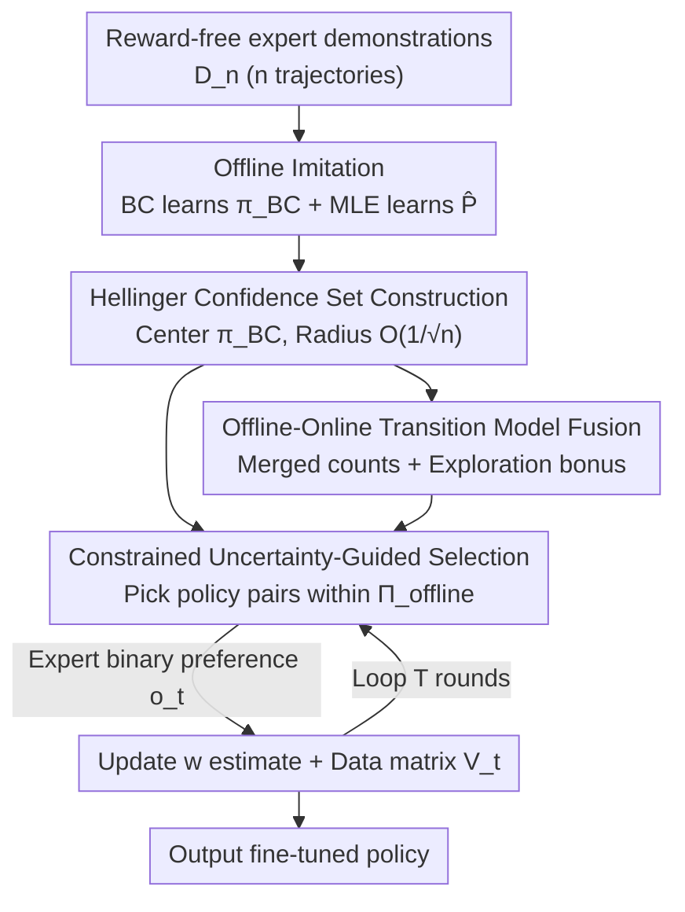

# Fine-tuning Behavioral Cloning Policies with Preference-Based Reinforcement Learning

**Conference**: ICLR 2026  
**OpenReview**: [https://openreview.net/forum?id=oIiQZfnSxP](https://openreview.net/forum?id=oIiQZfnSxP)  
**Code**: https://github.com/pfriedric/bridge  
**Area**: Reinforcement Learning / Preference Learning / Offline-to-Online  
**Keywords**: Behavioral Cloning, Preference Reinforcement Learning, Offline-to-Online, Regret Bound, Hellinger Confidence Sets

## TL;DR
This paper provides the first rigorous analysis for the "offline imitation + online preference fine-tuning" paradigm, which is widely used in RLHF and robotics but lacks theoretical support. It proposes the BRIDGE algorithm, which first constructs a Hellinger confidence ball in the trajectory distribution space with a radius shrinking at $O(1/\sqrt{n})$ using expert demonstrations, then constrains online preference exploration within this ball. It proves that the online regret bound tends to zero as the offline data volume $n$ increases and validates that the regret is lower than pure imitation or pure online preference RL on discrete and continuous MuJoCo control tasks.

## Background & Motivation
**Background**: A mainstream compromise for deploying RL in robotics, industry, and healthcare is to combine "offline imitation" with "online preference feedback." This involves using expert demonstrations for Behavioral Cloning (BC) to obtain a safe initial policy, followed by online fine-tuning using human binary comparisons of "which is better" between trajectory pairs. Examples include SFT+RLHF in ChatGPT, preference RL in Atari/MuJoCo by Christiano et al., and ranking-based fine-tuning for mechanical arms by Brown et al.

**Limitations of Prior Work**: While this paradigm has seen great practical success, the theory remains nearly blank. Existing theories analyze either imitation learning or preference RL in isolation, never combining them. Consequently, three fundamental questions remain unanswered: **How** exactly do offline demonstrations improve online preference learning? What is the **precise tradeoff** between offline data volume and the number of online queries? **When** does this combination provably outperform using either method alone?

**Key Challenge**: The setting here differs fundamentally from another popular line of "offline pre-training + online fine-tuning" hybrid RL work (e.g., Nair, Kostrikov), which assumes **access to true rewards** during the online phase. Existing theory (e.g., Xie et al.) suggests that for non-expert offline data, pre-training provides no statistical gain in such reward-aware settings. This paper operates in a **reward-free** setting: online interaction provides only preference comparisons, not numerical rewards. Thus, the question of whether offline data brings provable statistical advantages in a preference setting requires a new answer.

**Goal**: To formalize "offline imitation + online preference fine-tuning" as an analyzable problem, provide a rigorous bound that explicitly incorporates the offline data volume $n$ into the online regret, and design an algorithm that can practically leverage these theoretical benefits.

**Key Insight**: The true value of offline expert data is not just providing a good starting point, but rather **delimiting a small set in the policy space** that contains the expert policy with high probability, thereby significantly compressing the search space for online exploration. More data leads to a smaller set, saving online queries.

**Core Idea**: Construct a Hellinger confidence ball centered at the BC policy with a radius of $O(1/\sqrt{n})$, **constrain** online preference exploration within this ball, and exchange "offline search space contraction" for "reduced online regret."

## Method

### Overall Architecture
BRIDGE (Bounded Regret with Imitation Data and Guided Exploration) is a two-stage framework. The input is a **reward-free** expert demonstration dataset $D_n^H=\{\tau_i\}_{i\in[n]}$ ($n$ trajectories of length $H$ generated by the expert policy $\pi^*$ under true dynamics $P^*$), and the output is a fine-tuned policy.

The pipeline consists of three steps: ① **Offline Imitation**: Use BC on demonstrations to learn an initial policy $\pi_{BC}$ and use MLE to estimate the transition model $\hat P$. ② **Confidence Set Construction**: Draw a ball in the trajectory distribution space centered at $\pi_{BC}$ using the squared Hellinger distance. It is proven to contain $\pi^*$ with probability $1-\delta$, with a radius shrinking at $O(1/\sqrt n)$, yielding the offline policy confidence set $\Pi^{\text{offline}}_{1-\delta}$. ③ **Constrained Online Learning**: Perform preference RL **within** this ball. In each round, pick a pair of policies $(\pi^1_t, \pi^2_t)$ for expert comparison, receive binary preferences $o_t$ via the Bradley-Terry model, and update the estimate of preference weights $w^*$. Constraining within the ball prevents the agent from exploring unsafe or low-performance regions and compresses the per-step exploration variance from $O(B)$ to $O(B/\sqrt n)$, which is the mathematical entry point for offline data to reduce online regret.

Preferences are modeled via Bradley-Terry: given known trajectory embeddings $\phi:\mathcal T\to\mathbb R^d$, the comparison result follows $P(\tau^1\succ\tau^2)=\sigma(\langle\phi(\tau^1)-\phi(\tau^2),w^*\rangle)$, where $\langle\phi(\tau),w^*\rangle$ is the latent utility of the trajectory and $w^*$ is the unknown preference vector to be learned online. Regret is measured as pseudo-regret against the expert's optimal policy.

### Key Designs

**1. Hellinger Confidence Ball: Translating offline data volume into a contractible search space**

This step directly answers how offline data helps online learning. Instead of drawing a ball in the parameter space, the authors do so in the **trajectory distribution space** $\mathcal P(\mathcal T)$. First, use log-loss BC to find $\pi_{BC}$ ($\pi_{BC}=\arg\max_\pi\sum_i\sum_h\log\pi_h(a^i_h|s^i_h)$) and MLE for $\hat P$. Then, define the confidence set $\Pi^{\text{offline}}_{1-\delta}=\{\pi:\sqrt{H^2(P^\pi_{\hat P},P^{\pi_{BC}}_{\hat P})}\le \text{Radius}\}$. The key advantage of the Hellinger distance is its equivalence to the $L_2$ norm between square-root densities, making the confidence set an **Euclidean ball** in the density embedding space—characterized by a single scalar radius, geometrically intuitive, and analytically tractable. Theorem 4.2 gives the radius:

$$\text{Radius}=\frac{\alpha}{\sqrt n}+\frac{\beta}{\sqrt n}\left(1+\sqrt{H\left(1+\frac{2\alpha}{\gamma_{\min}\sqrt n}\right)}\right),$$

which overall shrinks at a rate of $O(1/\sqrt n)$. The difficulty lies in the fact that the original error bound depends on the unknown true dynamics $P^*$. The authors eliminate this dependency by bounding the **concentrability coefficient** $C(\pi_{BC},\pi^*)$. Lemma 4.3 proves $C(\pi_{BC},\pi^*)\le 1+\frac{2\sqrt R}{\gamma_{\min}}$. This requires a much weaker assumption than standard offline RL: the expert policy must have a minimum visitation probability $\gamma_{\min}>0$ (Assumption 3) only on the states and actions **it visits**, rather than requiring dataset coverage over all states/actions. A smaller $\gamma_{\min}$ implies a more "specialized" expert (sharp preferences), while a larger $\gamma_{\min}$ implies more uniform visitation.

**2. Constrained + Uncertainty-Guided Online Selection: Injecting offline radius into online regret**

This is the core of the "bridge." The online phase follows the GLM preference RL framework of Saha et al.: in each step, calculate the regularized MLE estimate $w_t^{MLE}$, then project it onto the feasible set to get $w_t^{proj}$ ($w^{proj}_t=\arg\min_{w}\|g_t(w)-g_t(w^{MLE}_t)\|_{V_t^{-1}}$). The data matrix $V_t=\kappa\lambda I_d+\sum_{\ell}(\phi(\tau^1_\ell)-\phi(\tau^2_\ell))^{\otimes2}$ serves two roles: it defines the confidence ellipsoid containing $w^*$ and guides exploration toward the direction of highest uncertainty via the Mahalanobis norm. The modification in BRIDGE is to **constrain** policy selection within $\Pi^{\text{offline}}_{1-\delta}$ (Algorithm 1, line 7), picking a pair that maximizes "preference uncertainty ($\|\cdot\|_{V_t^{-1}}$) + transition uncertainty (bonus $\hat B_t$)" within this ball.

Why does this reduce regret? Regret is essentially controlled by the cumulative exploration variance of the queried policy pairs $\text{tr}(\bar V_t)=\sum\|\phi(\pi^{t'}_1)-\phi(\pi^{t'}_2)\|_2^2$. Saha et al. only have a worst-case bound $\|\phi(\pi^1)-\phi(\pi^2)\|_2\le 2B$, where variance grows linearly with $T$. This paper proves that if $\pi^1,\pi^2\in\Pi^{\text{offline}}_{1-\delta}$, then:

$$\|\phi_{\hat P}(\pi^1)-\phi_{\hat P}(\pi^2)\|_2\le \frac{4\sqrt2 B}{\sqrt n},$$

meaning the offline sample size $n$ is **directly injected into the per-step online variance term**. This is the transmission chain through which the $O(1/\sqrt n)$ radius improves the final regret bound: Theorem 4.1 gives $R_T\le\tilde O\big(\sqrt T\sqrt{\log(1+T/n)}+\frac{\sqrt T}{\sqrt n\,\gamma_{\min}}\big)$. The $\sqrt T$ term is consistent with Saha et al., but there is an additional **inverse dependence on $n$**; as $n\to\infty$ (for a fixed $T$), the regret tends to zero.

**3. Offline-Online Transition Model Fusion: Transition estimation also benefits from offline data**

Preferences learn the reward, but policy embeddings $\phi_{\hat P}(\pi)=\mathbb E_{\tau\sim P^\pi_{\hat P}}[\phi(\tau)]$ depend on the transition model $\hat P$. Thus, uncertainty in dynamics estimation can degrade regret. The authors **pool** the offline and online data: initialize with offline MLE (count-based estimation for tabular cases), then update $\hat P_t(s'|s,a)=\frac{N_{\text{off}}(s',s,a)+N_t(s',s,a)}{N_{\text{off}}(s,a)+N_t(s,a)}$ in each step using merged counts. To accurately reflect this uncertainty, the exploration bonus also uses merged counts: $\hat B_t(\pi,\eta,\delta)=\mathbb E_{\tau\sim P^\pi_{\hat P_t}}\big[\sum_h\min(2\eta,4\eta\sqrt{U_h/(N_{\text{off}}(s_h,a_h)+N_t(s_h,a_h))})\big]$, encouraging exploration in regions where the merged model is still uncertain. This design ensures offline data not only shrinks the policy search space (Designs 1 and 2) but also improves the sample efficiency of the transition model, as the bonus decays faster with larger merged counts.

### Loss & Training
The offline stage involves two MLEs: the BC policy uses log loss $\pi_{BC}=\arg\max_\pi\sum_{i,h}\log\pi_h(a^i_h|s^i_h)$, and the transition model $\hat P=\arg\max_P\sum_{i,h}\log P(s^i_{h+1}|s^i_h,a^i_h)$. The online stage has no explicit loss function but iterates for $T$ rounds as per Algorithm 1: construct an adaptive online confidence set $\Pi_t\subseteq\Pi^{\text{offline}}_{1-\delta}$ (Lemma 4.5 guarantees $\pi^*\in\Pi_t$), pick policy pairs that maximize the exploration objective, sample trajectories, receive preferences, update $V_{t+1}$ and $\hat P_{t+1}$, and finally return the optimal policy in $\Pi_T$ using the final $w^{proj}_t$. Key hyperparameters include the confidence set radius and the regularization term $\lambda$.

## Key Experimental Results

### Main Results
On two discrete environments (StarMDP, Gridworld) and two continuous control environments (Reacher, Ant), using offline BC (Foster et al.) and online preference RL (PbRL, Saha et al.) as baselines (since original implementations were unavailable, the authors implemented them). The metric is cumulative regret (difference in expected reward between the current "best" policy and the expert policy).

| Environment | Type | Offline Demos ($n$) | Embedding | Conclusion |
|------|------|-----------|------|------|
| StarMDP | Discrete | 2 | identity-short | BRIDGE cumulative regret lower than BC and PbRL |
| Gridworld | Discrete | 10 | state-counts | Same as above |
| Reacher | Continuous | 20 | average state-action | Same (theory covers tabular; continuous is empirical expansion) |
| Ant | Continuous | 30 | average state-action | Same as above |

Results are averages across 20 random seeds with 95% confidence intervals. Figure 3 further shows that BRIDGE shrinks the policy search space $\Pi_t$ much faster than PbRL.

### Ablation Study
| Configuration | Key Finding | Description |
|------|---------|------|
| Confidence Set Radius | Too large/small is bad | Too large fails to constrain search; too small excludes $\pi^*$, violating theoretical guarantees (Lemma 4.5). |
| Offline Data Volume/Quality | More/Higher is better | More high-quality trajectories lead to a smaller ball and better performance; suboptimal data results in weaker contraction. |
| Embedding $\phi$ | Crucial | Both BRIDGE and baselines perform significantly better with embeddings aligned with true expert preferences. |
| Expert Concentrability $\gamma_{\min}$ | Consistent with theory | Smaller $\gamma_{\min}$ leads to worse performance, matching the $1/\gamma_{\min}$ dependence in the regret bound. |
| Feedback Noise | Slows convergence | Injecting noise into oracle preferences delays convergence and increases regret. |

### Key Findings
- The contribution of offline data is **quantifiable**: the $1/\sqrt n$ term in the regret bound allows one to weigh "obtaining an extra expert demonstration" against "performing one fewer online query"; as $n\to\infty$, online regret tends to zero.
- Performance follows a "Goldilocks" curve regarding the confidence set radius—there exists an intermediate radius that compresses the search without excluding $\pi^*$, reflecting the theoretical requirement for the radius to shrink as $O(1/\sqrt n)$ while still containing $\pi^*$.
- Embedding quality is an implicit prerequisite: preferences are assumed to be linear functions of embedding differences. When embeddings are misaligned, even correct constraints cannot ensure accurate learning (though it can work minimally, see Figure 6).

## Highlights & Insights
- **Turning "offline value" from intuition into a scalar radius**: By using Hellinger distance to make the confidence set an Euclidean ball in the density space, the entire contribution of offline data is compressed into a radius shrinking at $1/\sqrt n$, making the analysis tractable—a brilliant "geometric" approach to confidence sets.
- **Clear and reproducible regret transmission chain**: $n$ offline data points → radius $O(1/\sqrt n)$ → feature difference of any policy pair in the ball $\le 4\sqrt2B/\sqrt n$ → per-step online exploration variance is suppressed → regret bound gains a $1/\sqrt n$ factor. This chain turns "trading offline for online" into a provable equality.
- **Weak assumption $\gamma_{\min}>0$ is practical**: Only requiring the expert to have a minimum visitation probability on the states it actually visits, rather than requiring full dataset coverage, is much more relaxed than standard offline RL coverage assumptions and closer to the reality where "experts only follow their own path."
- **Transferability**: The idea of using offline data to circle a confidence set in the distribution space and then constraining online exploration can, in principle, be transferred to any "offline imitation + online interaction" setting (such as using SFT data to constrain RL exploration radius in RLHF).

## Limitations & Future Work
- **Theory only covers tabular cases**: Rigorous regret bounds are only established for finite state/action spaces and finite policy classes. Continuous control remains an empirical extension, requiring finite approximations of $\Pi$ to make the "filtering + optimization" steps (respectively $O(|\Pi^{\text{offline}}|^2)$ and $O(|\Pi_t|^2)$ in discrete cases) computable. Full continuous theory is left for future work.
- **Strong dependence on offline data quality and realizability**: Assumes the expert policy is realizable and offline data comes from the expert. If data is noisy or suboptimal, the BC ball center is biased, and the confidence set either has an excessively large radius or fails to contain $\pi^*$ (confirmed by suboptimal data ablations in Appendix A.1).
- **Linear preferences + known embeddings are hard prerequisites**: The embedding $\phi$ must be expressive enough for expert preferences. If the embedding is unknown, one must revert to naive embeddings, which degrades performance. The authors suggest **learning** embeddings from $D_n^H$ using self-supervised objectives in the future.
- **Critical Self-assessment**: The regret bound includes $1/\gamma_{\min}$, which becomes loose for extremely specialized experts ($\gamma_{\min}$ is small). Paradoxically, such experts are where offline data is most sparse, creating a tension between theory and reality.

## Related Work & Insights
- **vs Behavioral Cloning / DAgger**: BC (Pomerleau, Foster et al.) is not robust outside the demonstration manifold. DAgger achieves no-regret guarantees but requires the expert to be constantly available online for correction. BRIDGE inherits the simplicity of BC but replaces the "online expert" with less demanding **preference comparisons**.
- **vs Reward-aware Hybrid Offline-to-Online RL** (Nair, Kostrikov, Ball et al.): This line assumes real rewards are available online, and existing theory suggests non-expert offline data provides no statistical gain here (Xie et al.). BRIDGE is in a reward-free preference setting and proves that expert offline data provides **provable statistical advantages**, reaching complementary conclusions in a different setting.
- **vs Saha et al.’s Online Preference RL**: BRIDGE adopts their GLM framework and $\sqrt T$ regret but achieves an additional $1/\sqrt n$ offline dividend by constraining exploration within the offline confidence ball—effectively "adding offline guardrails" to the original framework.

## Rating
- Novelty: ⭐⭐⭐⭐⭐ First to provide a rigorous regret bound for the "offline imitation + online preference fine-tuning" reward-free paradigm, explicitly incorporating offline data volume.
- Experimental Thoroughness: ⭐⭐⭐⭐ Four environments (discrete/continuous) + five sets of ablations to verify theoretical dependencies, though scale is small and continuous parts lack theoretical backing.
- Writing Quality: ⭐⭐⭐⭐⭐ Progresses clearly from motivation to the regret transmission chain; clear comparison between theory and intuition.
- Value: ⭐⭐⭐⭐ Provides formalized guidance for "trading offline for online" in RLHF-style system designs; theoretical contributions are solid though limited by tabular assumptions.

<!-- RELATED:START -->

## Related Papers

- [\[ICLR 2026\] Proximal Supervised Fine-Tuning](proximal_supervised_fine-tuning.md)
- [\[ICLR 2026\] SRFT: A Single-Stage Method with Supervised and Reinforcement Fine-Tuning for Reasoning](srft_a_single-stage_method_with_supervised_and_reinforcement_fine-tuning_for_rea.md)
- [\[ICLR 2026\] All Roads Lead to Likelihood: The Value of Reinforcement Learning in Fine-Tuning](all_roads_lead_to_likelihood_the_value_of_reinforcement_learning_in_fine-tuning.md)
- [\[ICLR 2026\] On-Policy RL Meets Off-Policy Experts: Harmonizing Supervised Fine-Tuning and Reinforcement Learning via Dynamic Weighting](on-policy_rl_meets_off-policy_experts_harmonizing_supervised_fine-tuning_and_rei.md)
- [\[ICLR 2026\] Sparse but Critical: A Token-Level Analysis of Distributional Shifts in RLVR Fine-Tuning of LLMs](sparse_but_critical_a_token-level_analysis_of_distributional_shifts_in_rlvr_fine.md)

<!-- RELATED:END -->
