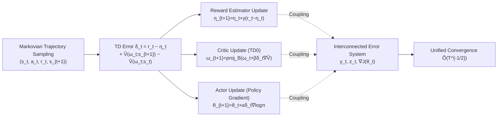

# Finite-Time Analysis of Actor-Critic Methods with Deep Neural Network Approximation

**Conference**: ICLR 2026  
**OpenReview**: [https://openreview.net/forum?id=V05qqNqBpY](https://openreview.net/forum?id=V05qqNqBpY)  
**Code**: To be confirmed  
**Area**: reinforcement_learning / Reinforcement Learning Theory  
**Keywords**: Actor-Critic, Finite-time analysis, Deep neural network approximation, Single-timescale, Time-average reward, Markovian sampling  

## TL;DR
This paper provides the **first** finite-time convergence analysis of the **single-timescale neural Actor-Critic** algorithm in continuous state-action spaces under the time-average reward setting. It proves that the reward, critic, and actor errors converge to a stationary point at a rate of $\tilde{O}(T^{-1/2})$, and the convergence rate **does not diverge with the network width $m$**.

## Background & Motivation
**Background**: Actor-Critic (AC) is the mainstay framework for modern deep reinforcement learning applications (quadrupedal/humanoid motion control, drone racing, etc., in continuous control). In practice, both the actor and critic are approximated using deep neural networks. However, the theoretical analysis of its finite-time convergence lags significantly behind practical applications.

**Limitations of Prior Work**: Existing theoretical analyses generally rely on overly simplified settings, primarily manifested in three aspects: (1) **Double-loop** methods run multiple critic update steps for each fixed actor, which facilitates decoupled analysis but leads to unrealistically high sample complexity; (2) **Two-timescale** methods set the actor step size much smaller than the critic (step size ratio $\lim_{t\to\infty}\alpha_t/\beta_t=0$), artificially slowing down the actor to approximate decoupling, which is rarely used in practice; (3) Existing work is mostly limited to **finite state-action spaces + linear approximation**. The only work considering neural networks, Tian et al. (2024), has two major flaws: it is still restricted to finite spaces (where linear approximation suffices, making the neural network perspective redundant) and the convergence rate is $\tilde{O}(T^{-0.5}+m^{-0.5})$, which includes a **constant term $m^{-0.5}$ that does not vanish with training**.

**Key Challenge**: Practice employs **single-timescale** updates (actor and critic update synchronously with a constant step size ratio $\alpha/\beta=c$). However, in this case, the actor and critic are strongly coupled, and the aforementioned decoupled analyses are too conservative to prove convergence. Furthermore, since the width $m$ is a fixed constant during training, theory should not exhibit a "convergence dependence on $m\to\infty$," which is a byproduct of analytical techniques (NTK theory also suggests that $m\to\infty$ causes the network to degenerate into a linear model, weakening its expressiveness).

**Goal**: To provide the first finite-time convergence guarantee for single-timescale neural AC under settings closest to practice—continuous state-action spaces, time-average reward, both actor and critic as deep networks, and both using Markovian sampling—while ensuring the convergence rate is **independent of $m$**.

**Core Idea**: **(1) Operator framework for continuous domains** — Introducing the distribution operator $D_\theta$ and the one-step transition operator $P_\theta$ to encapsulate error analysis on uncountable state spaces within a function inner product space; **(2) Analyzing coupled errors as an interconnected system** — Instead of conservative terms-by-term relaxation, the authors prove that the "mean-path" of the critic error decays, thereby stripping away the requirement for $m\to\infty$.

## Method

### Overall Architecture
The paper analyzes a standard, directly implementable single-timescale neural AC algorithm (Algorithm 1): sampling from a single Markovian trajectory, each step simultaneously updates three quantities—the reward estimator $\eta_t$ (exponential moving average to estimate the time-average reward $J(\theta)$), the critic parameters $\omega_t$ (semi-gradient TD(0) projected back to the neighborhood of the initial point), and the actor parameters $\theta_t$ (using TD error $\delta_t$ to approximate the advantage for policy gradient ascent). The true contribution lies not in the algorithm design but in the **analysis technique**: treating the propagation of reward error $y_t$, critic error $z_t$, and actor error $\nabla J(\theta_t)$ as a coupled dynamical system. Combined with neural network regularity lemmas and Markovian noise control lemmas, it is proven that all three converge synchronously at a rate of $\tilde O(T^{-1/2})$.

### Key Designs

**1. Operator Framework to Characterize Continuous State-Action Spaces:** In continuous domains, "taking the expectation over the state distribution" cannot be written as a matrix-vector product as in finite cases. This paper introduces two linear operators on the real-valued function class $\mathcal F=\{f:\mathcal S\to\mathbb R\}$: $(D_\theta f)(s):=\mu_\theta(s)f(s)$ weights the function by the stationary distribution $\mu_\theta$, and $(P_\theta f)(s):=\mathbb E_\theta[f(s_{t+1})\mid s_t=s]$ provides a one-step look-ahead. These are coupled with the function inner product $\langle f,g\rangle=\int_{\mathcal S} f(s)g(s)\,ds$ and the induced norm $\|f\|^2=\langle f,f\rangle$. This operator language ensures that concepts like the fixed point of the Bellman operator and weighted L2 norms of errors remain valid on uncountable domains, serving as the geometric scaffolding to move finite-time analysis from linear/discrete to continuous/neural settings. Based on this, the exploratory assumption is formulated as $\langle\hat V(\omega),D_\theta(I-P_\theta)\hat V(\omega)\rangle\ge\lambda_2\|\hat V(\omega)\|^2$—if exploration is insufficient such that a state subset satisfies $\mu_\theta(A)=0$, this inequality is violated, thereby grounding the abstract condition of "sufficient exploration" into a verifiable operator inequality.

**2. Single-Timescale Synchronous Updates + Projected Critic Constraints:** The algorithm maintains $\alpha, \beta, \gamma$ at constant ratios (rather than the ratio localized to zero as in two-timescale methods), and the actor and critic are updated in parallel every step, faithfully replicating practical usage. The critic follows semi-gradient TD(0): using $r_t-\eta_t+\hat V(\omega_t;s_{t+1})$ as the bootstrapping target for the unknown $V(s_t)$ to obtain the TD error $\delta_t:=r_t-\eta_t+\hat V(\omega_t;s_{t+1})-\hat V(\omega_t;s_t)$, and updating $\omega_{t+1}=\mathrm{proj}_{B_{\omega_0}}(\omega_t+\beta\delta_t\nabla\hat V(\omega_t;s_t))$. The projection $\mathrm{proj}_{B_{\omega_0}}$ constrains parameters within a ball of constant radius $u_\omega$ around the initial point $\omega_0$—leveraging the fact that **optimal solutions for over-parameterized networks lie in the initialization neighborhood**, ensuring parameter boundedness without excluding the optimal. The actor then uses $\delta_t$ to approximate the advantage function $\Delta_\theta=Q_\theta-V_\theta$, performing policy gradient ascent via $\theta_{t+1}=\theta_t+\alpha\delta_t\nabla_\theta\log \pi_{\theta_t}(a_t|s_t)$.

**3. Neural Network Regularity Lemmas + Critic Mean-Path Decay to Remove $m\to\infty$:** Neural network approximation introduces a "smoothness-induced error" compared to linear approximation, which is entangled with the critic error. Tian et al. (2024) bypassed this by conservatively using a constant upper bound for the critic error (the source of the $m^{-0.5}$ residue). This paper takes the opposite approach: first, it establishes a set of regularity properties for deep networks in Lemma 1 (boundedness and stability of network output and gradients under over-parameterization and Lipschitz/smooth activation assumptions). Based on these, it proves that the **mean-path of the critic error decays continuously** (mean-path update analysis in Eq. (26)), rather than being stuck at a constant. This step directly removes the prior requirement for "convergence depends on $m\to\infty$," allowing the convergence rate to return to a pure $\tilde O(T^{-1/2})$.

**4. Interconnected Error System + Fine-Grained Markovian Noise Control:** The primary difficulty lies in the strong coupling of reward error $y_t:=\eta_t-J(\theta_t)$, critic error $z_t:=\omega_t-\omega^*(\theta_t)$, and actor error $\nabla J(\theta_t)$, where the interaction between DNN approximation error and Markovian sampling noise is more complex than in linear or i.i.d. cases. This paper first derives implicit, coupled bounds for each error type, then treats their propagation as an interconnected dynamical system to be **solved as a whole**. For Markovian noise from a single trajectory, a mixing time $\tau_T:=\min\{i\ge0\mid\kappa\rho^{i-1}\le T^{-1/2}\}=O(\log T)$ is defined. Lemmas 7–10 develop sophisticated noise decomposition and bounding, ensuring Markovian noise is effectively controlled when $T\ge2\tau_T$. Finally, with step sizes $\alpha=c/\sqrt T, \beta=\gamma=1/\sqrt T$, the main Theorem 1 is obtained: the time-averaged values of all three errors converge at $O(\log^2 T/\sqrt T)+O(\epsilon_{\mathrm{app}})$, where $\epsilon_{\mathrm{app}}$ is the optimal critic approximation error and the $\log$ term stems from the mixing time (and would vanish under i.i.d. sampling).

## Key Experimental Results

### Main Results: MuJoCo Final Average Reward (5 seeds, mean±std)
Final average rewards for linear critic vs. neural critics with different widths/depths on 6 continuous control tasks:

| Configuration | Ant | HalfCheetah | Hopper | Humanoid | Swimmer | Walker2d |
|---|---|---|---|---|---|---|
| Linear | 797.1±66.0 | 299.2±61.9 | 61.4±25.2 | 186.9±14.7 | 35.9±4.7 | 810.9±290.6 |
| Width-64 | 1120.0±140.3 | 590.7±135.6 | 108.5±16.3 | 264.0±56.1 | 132.5±78.4 | 1215.3±192.6 |
| Width-128 | 1587.4±183.2 | 1425.8±161.7 | 533.8±64.7 | 291.1±63.9 | 220.5±41.8 | 1400.9±461.2 |
| Width-256 | 1245.2±126.7 | **2250.1±187.9** | 725.3±165.0 | 365.2±64.3 | **251.3±8.8** | 1390.9±324.9 |
| Width-512 | 949.2±75.4 | 1691.6±245.8 | **749.3±304.6** | 448.9±48.4 | 222.7±22.7 | 996.5±180.9 |

### Ablation Study: Network Depth Sweep (fixed width=128)

| Configuration | Ant | HalfCheetah | Hopper | Humanoid | Swimmer | Walker2d |
|---|---|---|---|---|---|---|
| Depth-1 | 961.2±8.0 | 1205.8±293.5 | 174.6±34.4 | 219.0±24.3 | 173.6±101.1 | 1118.4±39.5 |
| Depth-2 | 1587.4±183.2 | 1425.8±381.7 | 533.8±64.7 | 291.1±63.9 | 201.2±54.2 | 1400.9±461.2 |
| Depth-4 | **1824.9±147.0** | **2144.2±229.6** | 465.6±95.6 | 385.0±50.0 | 182.6±26.8 | 865.1±196.5 |
| Depth-8 | 1021.0±58.3 | 1699.2±285.4 | 210.8±68.2 | **546.4±63.7** | 230.9±57.7 | 1136.9±45.0 |

### Key Findings
- **Theoretical Convergence Rate Empirically Validated**: On Pendulum-v1, the log-log slope of $E_T=\frac{1}{T-\tau_T}\sum_{t=\tau_T}^{T-1}\mathbb E\|\nabla J(\theta_t)\|^2$ with respect to $T$ is **−0.51**, highly consistent with the theoretical value of −0.5 (showing clear linearity after about 250 warm-up steps).
- **Neural Critics Outperform Linear Critics Significantly**: Linear critics (with 6D RBF features) lag significantly across all tasks, and fail to approximate the true value function even on simple Pendulum, highlighting the necessity of analyzing neural AC—a feature distinguishing this work from all previous purely theoretical ones.
- **Capacity is Not "The Larger the Better"**: Width and depth show task-specific optima (e.g., HalfCheetah prefers width-256, Ant prefers depth-4, Humanoid prefers depth-8). Excessive width or depth leads to performance degradation, matching the intuition that over-parameterization can "linearity" the network under NTK perspective.

## Highlights & Insights
- **Truly Closing the Theory-Practice Gap**: As shown in Table 1, Ours is the only work that simultaneously addresses continuous state/action spaces, Markovian sampling for both sides, neural network function classes, and **provides experimental validation**. Previous works claiming to bridge the gap often couldn't even run Pendulum-v1 (limited by finite action spaces or requiring sampling from stationary distributions).
- **Removing $m^{-0.5}$ Pseudo-Dependence is a Core Technical Contribution**: Upgrading the critic error bound from a "constant upper bound" to "mean-path decay" ensures the convergence rate is not contaminated by network width, returning to $\tilde O(T^{-1/2})$ which reflects the algorithm's true behavior.
- **Universality of the Operator Framework**: The $D_\theta/P_\theta$ operators seamlessly extend the "weighted matrix" concepts from discrete MDP analysis to continuous domains, providing a reusable tool for future continuous control theory.

## Limitations & Future Work
- **Stationary Point Convergence + Dependence on $\epsilon_{\mathrm{app}}$**: In non-convex settings, only convergence to a stationary point can be proven, and the error contains an $O(\epsilon_{\mathrm{app}})$ term; this only vanishes if $\epsilon_{\mathrm{app}}=0$ (critic can perfectly approximate), which may not be small in real tasks.
- **Strong Assumptions**: The analysis requires a suite of assumptions: Lipschitz/smoothness of the optimal critic, network regularity, sufficient exploration, uniform ergodicity, etc. Verifying these in specific tasks is non-trivial.
- **Over-parameterization and Projection Constraints**: The analysis relies on the premise of "large constant width and optimal solutions within the initial neighborhood," which still differs from practice where width is finite and training often lacks explicit projection.
- **Outlook**: Extending the analysis to discounted rewards/finite-width non-asymptotic characterizations, upgrading stationary point convergence to global/sample complexity optimality, and covering more realistic network architectures and non-projected updates are natural next steps.

## Related Work & Insights
- **Single-Timescale AC Analysis Lineage**: Chen et al. (2021), Olshevsky & Gharesifard (2023), and Chen & Zhao (2024) provide $O(T^{-0.5})$ but are limited to linear/discrete/i.i.d. settings. Tian et al. (2024) introduced neural networks but were stuck with finite state spaces and $m^{-0.5}$ residues—this work completes the "last mile" of this trajectory.
- **Over-parameterization and NTK**: Techniques like projection to the initial neighborhood and approximate linearity of networks follow the over-parameterization analysis of Du et al. (2019), Jacot et al. (2018), and Liu et al. (2020). However, this paper avoids making the conclusion dependent on $m\to\infty$, instead using NTK's "width-induced degradation" as a counter-motivation.
- **Insights**: Analyzing multiple strongly coupled errors as an interconnected dynamical system and unifying discrete/continuous domains with operator language are transferable insights for the finite-time analysis of other "Actor-Critic-style double-layer coupled optimizations" (e.g., GANs, bilevel RL, constrained RL).

## Rating
- **Novelty**: ⭐⭐⭐⭐⭐ First finite-time analysis for single-timescale AC with continuous spaces + time-average rewards + double-sided Markovian sampling + DNNs, effectively eliminating the $m^{-0.5}$ pseudo-dependence of prior work.
- **Experimental Thoroughness**: ⭐⭐⭐⭐ Directly verifies the theoretical slope (−0.51 vs −0.5) on Pendulum and performs width/depth ablations on 6 MuJoCo tasks—rare and commendable for a theory paper, though the task scale and baselines remain light.
- **Writing Quality**: ⭐⭐⭐⭐ Table 1 provides a clear comparison of settings; the motivations (why remove $m$, why single-timescale is harder) are well-articulated; proof sketches assist in navigating heavy technical details.
- **Value**: ⭐⭐⭐⭐ Provides theoretical backing for widely used deep AC methods. The technical tools (operator framework, interconnected error systems, mean-path decay) are highly reusable for the RL theory community.

<!-- RELATED:START -->

## Related Papers

- [\[ICLR 2026\] Neural+Symbolic Approaches for Interpretable Actor-Critic Reinforcement Learning](neuralsymbolic_approaches_for_interpretable_actor-critic_reinforcement_learning.md)
- [\[ICLR 2026\] Flow Actor-Critic for Offline Reinforcement Learning (FAC)](flow_actor-critic_for_offline_reinforcement_learning.md)
- [\[ICLR 2026\] Chunking the Critic: A Transformer-based Soft Actor-Critic with N-Step Returns](chunking_the_critic_a_transformer-based_soft_actor-critic_with_n-step_returns.md)
- [\[ICLR 2026\] Simplicial Embeddings Improve Sample Efficiency in Actor-Critic Agents](simplicial_embeddings_improve_sample_efficiency_in_actorcritic_agents.md)
- [\[AAAI 2026\] Risk-Sensitive Exponential Actor Critic](../../AAAI2026/reinforcement_learning/risk-sensitive_exponential_actor_critic.md)

<!-- RELATED:END -->
