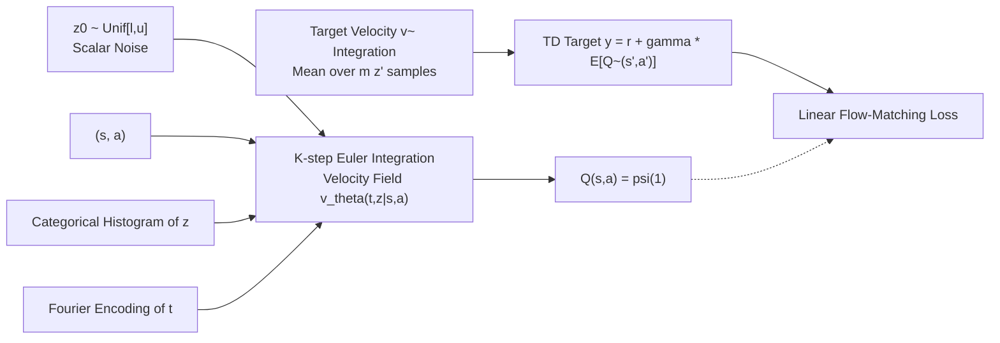

# floq: Training Critics via Flow-Matching for Scaling Compute in Value-Based RL

**Conference**: ICLR 2026  
**OpenReview**: [https://openreview.net/forum?id=m14YNdmPAh](https://openreview.net/forum?id=m14YNdmPAh)  
**Code**: [https://github.com/CMU-AIRe/floq](https://github.com/CMU-AIRe/floq)  
**Area**: reinforcement learning  
**Keywords**: offline reinforcement learning, value function, TD-learning, flow-matching, iterative computation, scaling compute  

## TL;DR
The Q-function is reframed from a "single network mapping to a scalar" to a "velocity field flowing toward a Q-value via multi-step numerical integration." By using flow-matching to introduce dense supervision into value learning, critic capacity can be scaled by increasing integration steps (rather than just depth or width), increasing success rates by approximately 1.8x on difficult offline RL tasks.

## Background & Motivation
**Background**: Modern generative models (next-token prediction in LMs, step-by-step denoising in diffusion/flow models) share a common recipe for success: constructing outputs iteratively and providing dense supervision at every intermediate step. This allows deep networks to stably fit complex functions and generalize well. In contrast, the Q-function in reinforcement learning is typically the opposite: standard TD-learning uses a monolithic network to map state-action pairs directly to a scalar without any iterative computation.

**Limitations of Prior Work**: The Q-function is inherently complex and difficult to fit precisely. TD-learning is notoriously difficult to scale with deep networks—increasing width and depth often leads to performance degradation rather than improvement, requiring various normalization and regularization tricks to achieve stability. This issue is more severe in offline RL, which learns from static datasets. Even using ResNet blocks for "iterative computation" yields limited gains because it lacks the key ingredient that makes Transformers or diffusion models effective: **supervision signals at every step**.

**Key Challenge**: To introduce "iterative computation + dense supervision" to value learning, a naive application of flow-matching (designed for multi-dimensional data distributions) to scalar Q-values will **collapse**. The network learns to ignore the intermediate interpolation variables and reverts to a standard monolithic Q-network. Additionally, the ever-changing TD target (bootstrapping) introduces non-stationarity challenges for flow-matching training.

**Goal**: Design a method to parameterize and train Q-functions using flow-matching, allowing critic capacity to be scaled at a fine-grained level via integration steps, and validate its effectiveness in both offline RL and online fine-tuning.

**Core Idea**: **Represent the Q-function with a velocity field**. The Q-value is viewed as the endpoint of integration starting from uniform noise along a state-action conditioned velocity field. The velocity field is trained with a flow-matching loss using Bellman bootstrapping targets, making the "number of integration steps $K$" a new, independent axis for scaling compute.

## Method

### Overall Architecture
floq (flow-matching Q-functions) does not output Q-values directly. Instead, it learns a time-dependent, state-action conditioned scalar velocity field $v_\theta(t, z \mid s, a)$. During inference, it starts from uniform noise $z_0 \sim \mathrm{Unif}[l,u]$ and performs $K$ steps of numerical integration using the Euler method; the endpoint is the Q-value sample $Q(s,a,z) := \psi_\theta(1, z\mid s,a)$. During training, a linear flow-matching loss fits the velocity field to the displacement from noise to the TD target. The TD target itself is obtained by integrating a moving-average target velocity field and averaging over multiple initial noise samples. To prevent flow collapse, two key designs are added: noise interval selection and categorical histogram representation of interpolation variables combined with Fourier time encoding.

### Key Designs

**1. Velocity field parameterized Q-function: Integration steps as a capacity knob.** floq moves a 1D latent variable $z\in\mathbb{R}$ from $\mathrm{Unif}[l,u]$ toward a Dirac-Delta distribution centered at the true Q-value via a velocity field integrated over $K$ steps: $\psi_\theta(j/K, z\mid s,a)=z+\frac{1}{K}\sum_{i=1}^{j} v_\theta\big(\tfrac{i}{K}, \psi_\theta(\tfrac{i-1}{K}, z\mid s,a)\mid s,a\big)$. While this appears similar to an ensemble (multiple network calls averaged), it is fundamentally different: each step $i$ depends on the output of step $i-1$, forming a **recursive serial iterative computation**, whereas ensembles are parallel and independent. Consequently, increasing $K$ is equivalent to increasing model "depth" and expanding Q-function capacity. Experiments show this scaling is more efficient than simply increasing ensemble size or stacking ResNet blocks.

**2. Bellman bootstrapping flow-matching loss: Handling non-stationary targets.** Flow-matching typically fits a fixed target distribution, but TD targets change constantly. floq introduces a target velocity field $\tilde v_\theta$ (an exponential moving average of the main field). It samples actions $a'\sim\pi(\cdot\mid s')$ for the next state, integrates the target flow to obtain multiple Q-samples, and averages them to get the bootstrapping target $y(s,a)=r(s,a)+\gamma\frac{1}{m}\sum_{j=1}^{m}\psi_{\tilde\theta}(1, z'_j\mid s',a')$. Then, an interpolation $z(t)=(1-t)\,z + t\,y(s,a)$ is constructed, and the velocity field is trained to match the displacement from noise to target: $L_{\mathrm{floq}}(\theta)=\mathbb{E}_{z,t}\big[\|v_\theta(t, z(t)\mid s,a) - (y(s,a)-z)\|_2^2\big]$. This reflects the logic of TD-flows and $\gamma$-models using bootstrapping for generative models.

**3. Noise interval selection to prevent collapse: Forcing "curved" flows for extra capacity.** The authors identify the root cause of `floq`'s effectiveness: only when the flow trajectory is **curved** must the velocity field utilize the interpolation variable $z(t)$ and time $t$ to predict specialized velocities, thereby utilizing the iterative computation as expanded capacity. If the trajectory is a straight line, predicting a constant velocity suffices, which reverts to a monolithic network. However, high curvature increases integration error, necessitating a "sweet spot." The key discovery is that rescaling initial noise does not change the target distribution but significantly changes trajectory curvature. Thus, $[l,u]$ is chosen heuristically: set $u=Q_{\max}$ (typically 0), and maximize the interval width $u-l$ (using $\kappa\times(Q_{\max}-Q_{\min})$, default $\kappa=0.1$) while maintaining stable convergence. If the width is too small, $z(t)$ varies too little for the network to learn; if it is too decoupled from the target range, the network merely predicts a large constant velocity.

**4. Input representation: Handling non-stationarity with categorical histograms and Fourier time encoding.** Standard TD non-stationarity occurs at the output (Q-values grow from zero, manageable via activation normalization), but in `floq`, it occurs at the **input**—the magnitude of $z(t)$ grows during training, leading to gradient and activation explosions. Borrowing from HL-Gauss encoding, Gaussian noise with standard deviation $\sigma$ is added to $z(t)$ before transforming it into a categorical histogram across $N$ bins. A larger $\sigma$ ensures roughly 80% of bins have non-zero mass initially, encouraging broader coverage. Time $t$ is fed to the velocity field via Fourier basis encoding to allow velocity predictions to vary meaningfully across steps. In practice, `floq` is built on FQL (reusing its flow-matching policy), and a $Q^{\mathrm{distill}}_\psi$ is distilled to approximate the integration result, avoiding the high cost of backpropagating through the integration chain during policy extraction.

## Key Experimental Results

### Main Results
On OGBench offline RL (50 tasks: 5 locomotion + 5 manipulation, 5 tasks each, 3 seeds), Success Rate (%):

| Environment (5 tasks each) | BC | ReBRAC | SORL | FQL(1M) | FQL(2M) | floq (Default) | floq (Best) |
|---|---|---|---|---|---|---|---|
| antmaze-large | 11 | 81 | 89 | 79 | 83 | 91 | 91 |
| antmaze-giant (Hard) | 0 | 26 | 9 | 22 | 27 | 36 | 51 |
| hmmaze-medium | 2 | 22 | 64 | 57 | 69 | 82 | 82 |
| hmaze-large (Hard) | 1 | 2 | 5 | 9 | 16 | 28 | 28 |
| cube-double (Hard) | 2 | 12 | 25 | 29 | 25 | 47 | 47 |
| puzzle-3x3 (Hard) | 2 | 21 | – | 30 | 29 | 37 | 37 |
| puzzle-4x4 (Hard) | 0 | 14 | – | 17 | 9 | 21 | 28 |
| **All Env Mean** | 3 | 31 | – | 46 | 47 | **56** | **59** |
| **Hard Env Mean** | 1 | 15 | – | 21 | 21 | **34** | **38** |

On hard environments, `floq` is approximately 1.8x better than FQL. On default task subsets, it improves over DSRL (20% vs 45%) by 2x and outperforms distributional RL baseline IQN.

### Ablation Study
Effect of integration steps $K$ on success rate (selected tasks):

| Integration Steps K | 1 | 2 | 4 | 8 | 16 |
|---|---|---|---|---|---|
| HM-Large Success Rate (%) | 0 | 14 | 24 | 52 | 56 |
| Antmaze-Giant Success Rate (%) | 0 | 11 | 55 | 70 | 86 |

Success rates increase monotonically with $K$, verifying that "integration steps = scalable capacity axis." Allocating equal compute to Q-network ensembles or ResNets yields worse results.

### Key Findings
- **Scalability is the core selling point**: Monolithic critics with similar or higher parameter counts/architectural complexity are outperformed by `floq`, with the performance gap primarily driven by "scaling along integration steps" rather than depth or width.
- **Online fine-tuning also benefits**: After 1M steps of offline pre-training followed by 2M steps of online fine-tuning, `floq` provides stronger initialization, faster adaptation, and higher final performance (especially on the hardest tasks like humanoidmaze, antmaze-giant, and antsoccer).
- Using IQM and performance profiles ($P(X>Y)$) following Agarwal et al., the confidence intervals for `floq` and FQL do not overlap.

## Highlights & Insights
- **Shifting the scaling axis from space to time**: Traditional critic scaling is limited to depth and width; `floq` provides a third path—increasing integration steps—allowing $K$ to be dynamically adjusted at inference time to trade compute for performance.
- **Precise diagnosis of collapse**: The authors explicitly link "straight trajectories = no extra capacity" and "curved trajectories = extra capacity," transforming an engineering heuristic into a controllable "curvature sweet spot" problem.
- **Clean controlled design**: By building on FQL and only modifying the critic, the performance gains are cleanly attributed to the flow-matching Q-function rather than policy-side modifications.

## Limitations & Future Work
- **Hyperparameter sensitivity**: Noise interval width $\kappa$, integration steps $K$, $\sigma$, and bin counts require tuning. While the default configuration is strong, there is still a gap compared to the "best" per-environment configuration (e.g., 36 vs 51 on antmaze-giant).
- **Increased training/inference costs**: Multi-step integration, multi-noise sampling for target flows, and critic distillation result in significantly higher computational overhead compared to monolithic networks.
- **Reliance on expected Q-targets**: While a stochastic Q-function is learned, it uses expected targets, not fully exploiting distributive information. Integration with true distributional RL remains an open direction.
- Limited to state-based OGBench tasks; scalability for pixel inputs and larger-scale online RL remains to be verified.

## Related Work & Insights
- While **generative models in RL** typically focus on the policy (diffusion/flow policies), this work focuses on the more expressive **Q-function**, serving as a complementary interaction with FQL's flow policy.
- Existing routes for **scaling Q-functions** (categorical loss, ResNet architectures, regularization, TD scaling laws) have lacked a clear recipe; `floq` identifies "dense intermediate supervision" as the missing key.
- **Scaling inference compute** (MCTS, MPC, etc.) has traditionally focused on planning; `floq` is the first to demonstrate that multi-step integration is a viable and effective path for scaling critic compute.
- Insight: Any supervised learning sub-module that "regresses a scalar in one shot" could potentially be rewritten as an "iterative flow with dense step supervision" to achieve better capacity utilization and scalability.

## Rating
- Novelty: ⭐⭐⭐⭐⭐ Introducing flow-matching to the critic and opening the "integration step" scaling axis is conceptually original.
- Experimental Thoroughness: ⭐⭐⭐⭐ 50 OGBench tasks, online fine-tuning, and rigorous statistics are comprehensive, though pixel/large-scale tasks are pending.
- Writing Quality: ⭐⭐⭐⭐⭐ Clear motivational analogies, thorough collapse diagnosis, and logical design progression make it highly readable.
- Value: ⭐⭐⭐⭐ A near 1.8x gain on difficult tasks and a scalable capacity knob are very attractive for offline RL, despite higher computational and tuning costs.

<!-- RELATED:START -->

## Related Papers

- [\[ICLR 2026\] Flow Matching Policy Gradients](flow_matching_policy_gradients.md)
- [\[ICLR 2026\] The Art of Scaling Reinforcement Learning Compute for LLMs](the_art_of_scaling_reinforcement_learning_compute_for_llms.md)
- [\[ICLR 2026\] Reinforcement Learning via Value Gradient Flow](reinforcement_learning_via_value_gradient_flow.md)
- [\[ICLR 2026\] transitive rl value learning via divide and conquer](transitive_rl_value_learning_via_divide_and_conquer.md)
- [\[ICLR 2026\] Bridging Successor Measure and Online Policy Learning with Flow Matching-Based Representations](bridging_successor_measure_and_online_policy_learning_with_flow_matching-based_r.md)

<!-- RELATED:END -->
