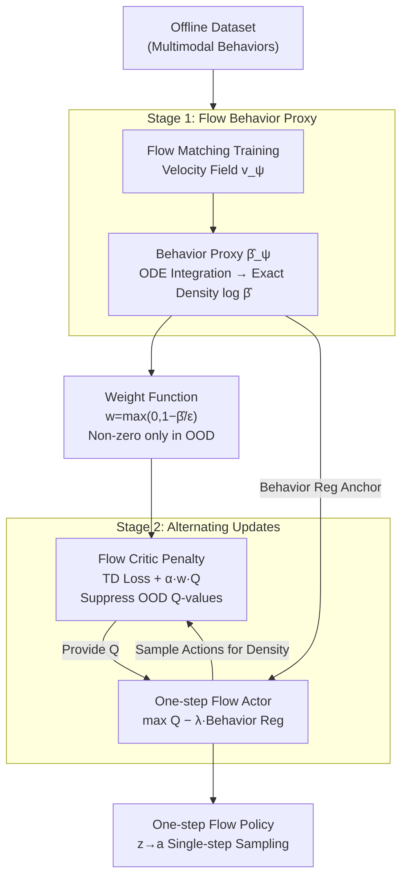

# Flow Actor-Critic for Offline Reinforcement Learning (FAC)

**Conference**: ICLR 2026  
**arXiv**: [2602.18015](https://arxiv.org/abs/2602.18015)  
**Code**: None  
**Area**: Reinforcement Learning  
**Keywords**: Offline RL, Flow Matching, Actor-Critic, OOD Detection, Continuous Normalizing Flow  

## TL;DR
FAC is the first to jointly utilize continuous normalizing flows to simultaneously construct expressive actor policies and a density-estimation-based critic penalty mechanism. by identifying OOD regions for selective conservative Q-value estimation, it significantly outperforms the previous best (43.6) with an average score of 60.3 across 55 OGBench tasks.

## Background & Motivation

**Background**: Offline RL datasets typically contain complex multimodal behavior distributions. Simple Gaussian policies lack expressivity, while diffusion-based policies, despite their expressivity, suffer from unstable policy optimization due to multi-step sampling.

**Limitations of Prior Work**: (a) The conservative penalty in CQL is global—treating all OOD actions equally, which leads to over-conservatism; (b) SVR uses importance sampling ratios to identify OOD regions, but these ratios explode when the behavior policy is poorly fitted by Gaussian models; (c) Existing methods lack synergy between actor design and critic penalties, as they are designed independently.

**Key Challenge**: How to precisely identify OOD regions for conservative estimation while maintaining policy expressivity?

**Key Insight**: Flow models can provide both highly expressive policies (actor) and precise density estimation (critic OOD penalty), killing two birds with one stone.

**Core Idea**: Use a single flow model to resolve both actor expressivity and critic OOD detection.

## Method

### Overall Architecture
FAC utilizes the same flow model to address two major challenges in offline RL: the actor requires sufficient expressivity to fit multimodal behaviors, and the critic must precisely identify OOD actions—those not present in the dataset—to apply conservative estimates. The framework consists of two stages: first, a flow matching objective is used to train a behavior proxy model $\hat{\beta}_\psi(a|s)$, which provides **exact** log-densities $\log\hat{\beta}_\psi(a|s)$ via ODE integration. Second, this density is used to construct a weight function that penalizes Q-values only in OOD regions, while a one-step flow network serves as the actor for policy optimization. Consequently, both actor expressivity and critic OOD detection emerge from the same density estimation.

### Key Designs

**1. Flow Behavior Proxy: Replacing VAE/Diffusion Approximations with Exact Density Estimation**

The effectiveness of OOD detection in offline RL depends on the accuracy of the behavior distribution estimate $\hat{\beta}(a|s)$. VAEs only provide an ELBO lower bound, and diffusion models provide only approximate densities; both can misclassify actions at the distribution boundaries. FAC adopts continuous normalizing flows to model the behavior distribution. The training objective is the flow matching loss $\min_\psi \mathbb{E}[\|v_\psi(\tilde{a}_u; s, u) - (a-z)\|^2]$, where the interpolant $\tilde{a}_u = (1-u)z + ua$ transitions linearly between noise $z$ and the real action $a$. The critical advantage of the flow model is its invertibility: integrating the learned velocity field via an ODE yields the **exact** log-density $\log\hat{\beta}_\psi(a|s)$, which is the foundation for the subsequent critic penalty.

**2. Flow Critic Penalty: Penalizing Only True OOD Regions While Remaining Unbiased In-Distribution**

Global conservative approaches like CQL treat all OOD actions equally, which often suppresses high-quality in-distribution actions, leading to over-conservatism. FAC constructs a weight function using the precise density from the previous step: $w^{\hat{\beta}}(s,a) = \max(0, 1 - \hat{\beta}(a|s)/\epsilon)$. In regions with data support ($\hat{\beta} \geq \epsilon$), the weight is zero, ensuring no intervention; the weight increases linearly only when actions fall into low-density OOD regions. The critic loss adds a term $\alpha \cdot \mathbb{E}_{a \sim \pi}[w \cdot Q(s,a)]$ to the standard TD loss to suppress these OOD Q-values. Proposition 1 in the paper guarantees the properties of this selective penalty: the Bellman operator remains unbiased in-distribution and only strongly suppresses Q-values in OOD regions, thereby avoiding the over-conservatism of CQL.

**3. One-Step Flow Actor: Using Single-step Mapping for Stable Policy Optimization**

While multi-step diffusion/flow policies are expressive, backpropagating gradients through an entire multi-step sampling chain during policy optimization is highly unstable. FAC simplifies the actor into a one-step flow—mapping noise $z$ directly to action $a$. The actor loss is $\max \mathbb{E}[Q(s,a)] - \lambda \cdot \|a_\theta(s,z) - a_\psi(s,z)\|^2$, which maximizes Q-values while pulling the policy toward the behavior proxy via behavior regularization. Single-step mapping ensures gradients pass through only one network layer, avoiding multi-step instability, while behavior regularization prevents the policy from deviating from the data support.

### Loss & Training
- **Stage 1**: Pre-train the behavior proxy $\hat{\beta}_\psi$ using the flow matching loss.
- **Stage 2**: Alternately update the critic (TD loss + flow density weighted penalty) and the actor (Q-value maximization + behavior regularization).

## Key Experimental Results

### Main Results
OGBench (55 tasks, the most challenging offline RL benchmark):

| Method | State-based Avg Score↑ | Category |
|------|---------------|---------|
| ReBRAC (Gaussian) | 31.0 | Gaussian Policy |
| FQL (Flow) | 43.6 | Flow Policy (Actor only) |
| **FAC** | **60.3** | Flow Policy (Actor+Critic) |

Highlights: puzzle-3x3-play 100.0 (vs FQL 29.6, +238%); antmaze-large 92.6 (vs FQL 78.6).

D4RL Antmaze (6 tasks): Average **90.5** (New SOTA, previous best FQL 83.5).

### Ablation Study

| Configuration | OGBench Avg↑ | Description |
|------|-------------|------|
| FAC Full | 60.3 | Actor Reg + Critic Penalty |
| Actor Reg Only (=FQL) | 43.6 | Lacks Critic Penalty |
| Critic Penalty Only | ~48 | Lacks Actor Reg |
| VAE Density Replacement | Significant Drop | Inaccurate density leads to failed OOD detection |

### Key Findings
- Flow-based density estimation significantly outperforms VAE/diffusion models for OOD detection (visualized in Fig. 1).
- Both Actor regularization and Critic penalties are essential; FAC's joint approach improves upon FQL (actor-only) by +16.7.
- One-step flow actors are more stable than multi-step flow policies (e.g., FAWAC, FBRAC).
- While Gaussian methods remain competitive on D4RL MuJoCo (after heavy tuning), they lag significantly on complex OGBench tasks.

## Highlights & Insights
- The **"one model, two purposes"** design is elegant: the flow model provides both an expressive policy and precise OOD density estimation, making it more efficient and self-consistent than independent designs.
- **Density-threshold penalties** (vs CQL's global penalty) represent a major improvement—remaining conservative only in true OOD regions while staying unbiased in-distribution, thus solving the over-conservatism problem.
- The massive 60.3 vs 43.6 improvement on OGBench suggests that in complex multimodal tasks, precise OOD handling is more critical than mere policy expressivity.

## Limitations & Future Work
- Two-stage training (pre-training the flow model before actor-critic) increases training complexity.
- Density evaluation requires numerical ODE integration (10-step Euler), introducing additional inference overhead.
- The choice of the threshold $\epsilon$ serves as an additional design hyperparameter.
- The performance gain on D4RL MuJoCo is less pronounced than on OGBench.

## Related Work & Insights
- **vs FQL**: FQL only uses flows for the actor; FAC uses them for critic penalties as well—yielding a +38% improvement on OGBench.
- **vs CQL**: CQL penalizes all OOD actions uniformly, leading to over-conservatism; FAC penalizes only true OOD regions via precise density estimation.
- **vs DiffQL/IDQL**: Multi-step sampling in diffusion policies leads to unstable policy optimization; FAC's one-step flow is more stable.

## Rating
- Novelty: ⭐⭐⭐⭐⭐ First to jointly utilize flow models for both actor and critic; conceptually simple but powerful.
- Experimental Thoroughness: ⭐⭐⭐⭐⭐ Compressive coverage across OGBench (55 tasks), D4RL (15 tasks), and pixel-based observations.
- Writing Quality: ⭐⭐⭐⭐ Clear motivation with concise theoretical guarantees (Proposition 1).
- Value: ⭐⭐⭐⭐⭐ Achieves a major breakthrough on the most challenging offline RL benchmarks.

<!-- RELATED:START -->

## Related Papers

- [\[ICLR 2026\] Neural+Symbolic Approaches for Interpretable Actor-Critic Reinforcement Learning](neuralsymbolic_approaches_for_interpretable_actor-critic_reinforcement_learning.md)
- [\[ICLR 2026\] Convergence of an actor-critic gradient flow for entropy regularised MDPs in general spaces](convergence_of_an_actor-critic_gradient_flow_for_entropy_regularised_mdps_in_gen.md)
- [\[ICLR 2026\] Chunking the Critic: A Transformer-based Soft Actor-Critic with N-Step Returns](chunking_the_critic_a_transformer-based_soft_actor-critic_with_n-step_returns.md)
- [\[ICLR 2026\] Finite-Time Analysis of Actor-Critic Methods with Deep Neural Network Approximation](finite-time_analysis_of_actor-critic_methods_with_deep_neural_network_approximat.md)
- [\[ICLR 2026\] Guided Flow Policy: Learning from High-Value Actions in Offline Reinforcement Learning](guided_flow_policy_learning_from_high-value_actions_in_offline_reinforcement_lea.md)

<!-- RELATED:END -->
