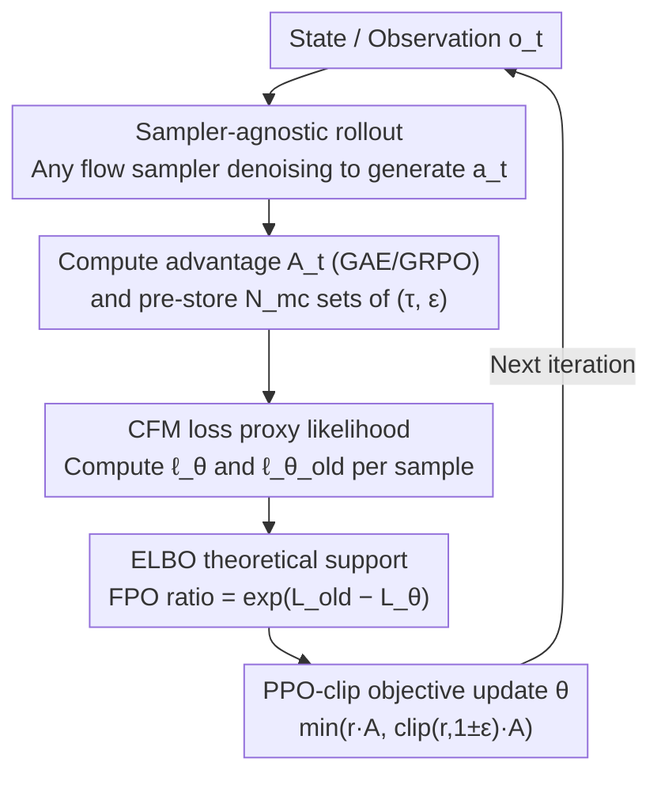

# Flow Matching Policy Gradients

**Conference**: ICLR 2026  
**OpenReview**: [https://openreview.net/forum?id=eoEmoKoQpJ](https://openreview.net/forum?id=eoEmoKoQpJ)  
**Code**: Open source promised by authors (TBC)  
**Area**: Reinforcement Learning / Diffusion Policy / Flow Matching  
**Keywords**: Flow Matching, Policy Gradient, PPO, Diffusion Policy, Multimodal Action Distribution

## TL;DR
This paper introduces **Flow Policy Optimization (FPO)**, which integrates the conditional flow matching loss directly into the PPO-clip framework. By using the "exponential of the difference between the old and new policy CFM losses" as a proxy for the likelihood ratio, FPO enables training diffusion/flow policies from scratch using pure on-policy gradients. This approach avoids calculating exact likelihoods of flow models and is decoupled from specific samplers, achieving performance that meets or exceeds Gaussian policies in continuous control and under-conditioned humanoid control tasks.

## Background & Motivation

**Background**: In continuous control reinforcement learning, the policy $\pi_\theta(a\mid o)$ is predominantly parameterized as a diagonal Gaussian distribution. This is because the log-likelihood $\log\pi_\theta(a\mid o)$ of a Gaussian has an analytical solution, which can be directly substituted into the likelihood ratio $r(\theta)=\pi_\theta/\pi_{\text{old}}$ for policy gradients and PPO. Meanwhile, diffusion models and flow matching have become dominant tools for modeling high-dimensional continuous distributions in images, videos, and robot actions, offering far greater expressive power than Gaussians.

**Limitations of Prior Work**: The primary obstacle to using these expressive generative policies in on-policy RL is that **the exact likelihood of flow models is nearly impossible to compute**. Accurate likelihood calculation requires divergence estimation for the velocity field, which is computationally prohibitive. Consequently, the standard PPO mechanism, which relies on exact likelihood ratios, fails.

**Key Challenge**: Existing diffusion RL methods (e.g., DDPO, DPPO, Flow-GRPO) take a "detour" by rewriting the denoising process as a Markov Decision Process (denoising MDP), treating each step in the sampling chain as a Gaussian policy step. This introduces three side effects: ① the horizon is multiplied by the number of denoising steps (typically 10–50), making credit assignment difficult; ② initial noise is treated as an environmental observation, artificially increasing the dimensionality of the learning problem; ③ this construction **can only use stochastic samplers**, losing the benefits of deterministic or high-order fast samplers.

**Goal**: The objective is a policy gradient algorithm that retains the expressiveness of flow models, can be "plugged-and-played" into standard PPO/actor-critic frameworks like Gaussian policies, and remains **completely agnostic to the sampling method used during training and inference**.

**Key Insight**: The authors leverage a neglected theoretical fact: the conditional flow matching (CFM) loss is exactly equal to the negative Evidence Lower Bound (ELBO), which in turn is a lower bound on the log-likelihood. Since PPO only needs to "increase the likelihood of high-advantage actions," why not use the easily computable CFM loss as a proxy for the intractable likelihood?

**Core Idea**: Replace the likelihood ratio in PPO with the exponential of the difference between the old policy's CFM loss and the new policy's CFM loss: $\hat r_{\text{FPO}}=\exp(\hat L_{\text{CFM},\theta_{\text{old}}}-\hat L_{\text{CFM},\theta})$. By using the denoising loss as a proxy for likelihood, policy optimization can be completed without calculating exact likelihoods or altering the sampler.

## Method

### Overall Architecture

The goal of FPO is identical to standard PPO—to maximize the advantage-weighted clipped surrogate objective $\min(\hat r\hat A,\ \mathrm{clip}(\hat r,1\pm\varepsilon)\hat A)$. The only modification is replacing the **intractable likelihood ratio $r(\theta)$ with a proxy ratio $\hat r_{\text{FPO}}$ calculated using the flow matching loss**. The pipeline differs from standard PPO in only three ways: replacing Gaussian sampling with flow sampling (multi-step denoising) during rollout, feeding the noisy action and noise step $\tau$ into the network, and replacing the likelihood ratio in the PPO loss with the FPO ratio.

A specific iteration proceeds as follows: First, run rollouts using **any** flow sampler to collect trajectories and compute advantages $\hat A_t$. For each state-action pair, pre-sample $N_{mc}$ sets of $(\tau_i, \epsilon_i)$ noise-time step pairs and store them. During the optimization epoch, use the same stored $(\tau_i, \epsilon_i)$ pairs to calculate per-sample CFM losses under both current parameters $\theta$ and frozen parameters $\theta_{\text{old}}$. The exponential of their difference yields $\hat r_{\text{FPO}}$, which is used in the PPO-clip loss for backpropagation. The value function is updated following standard PPO.

### Key Designs

**1. FPO Ratio: Replacing the Likelihood Ratio with the Exponential Difference of CFM Losses**

This is the core contribution. PPO requires the likelihood ratio $r(\theta)=\pi_\theta(a_t\mid o_t)/\pi_{\text{old}}(a_t\mid o_t)$, but $\pi_\theta$ for flow models is intractable. FPO constructs a proxy ratio instead:

$$\hat r_{\text{FPO}}(\theta)=\exp\!\big(\hat L_{\text{CFM},\theta_{\text{old}}}(a_t;o_t)-\hat L_{\text{CFM},\theta}(a_t;o_t)\big)$$

The per-sample CFM loss is the standard denoising reconstruction term $\ell_\theta(\tau_i,\epsilon_i)=\lVert\hat v_\theta(a_t^{\tau_i},\tau_i;o_t)-(a_t-\epsilon_i)\rVert_2^2$, where the noisy action $a_t^{\tau_i}=(1-\tau_i)a_t+\tau_i\epsilon_i$ is interpolated using an OT (Optimal Transport) scheduler. Intuitively, **decreasing the CFM loss of an action is geometrically equivalent to "pointing" the probability flow more towards that action**, making it more likely to be sampled under the policy. This is exactly the goal of policy gradients: directing the flow toward high-advantage actions. Since $\hat r_{\text{FPO}}$ is a drop-in replacement for the likelihood ratio, it is naturally compatible with advantage estimation methods like GAE and GRPO, as well as various flow/diffusion implementations predicting noise $\epsilon$ or clean actions $a_t$.

**2. ELBO Theoretical Support: Why CFM Loss Functions as Likelihood**

Beyond the intuition that "decreasing loss increases likelihood," the authors provide a rigorous theoretical basis. Flow models often use ELBO as a proxy for log-likelihood: $\mathrm{ELBO}_\theta(a_t\mid o_t)=\log\pi_\theta(a_t\mid o_t)-D_{\text{KL}}^\theta$. Prior work (Kingma & Gao, 2023) proved that weighted denoising loss (of which CFM is a special case) is exactly equal to the negative ELBO plus a constant independent of $\theta$: $L^w_\theta(a_t)=-\mathrm{ELBO}_\theta(a_t)+c$. Substituting this back into the FPO ratio yields:

$$r_{\text{FPO}}(\theta)=\underbrace{\frac{\pi_\theta(a_t\mid o_t)}{\pi_{\theta_{\text{old}}}(a_t\mid o_t)}}_{\text{True Likelihood Ratio}}\cdot\underbrace{\frac{\exp(D_{\text{KL}}^{\theta_{\text{old}}})}{\exp(D_{\text{KL}}^\theta)}}_{\text{Inverse KL Gap Correction}}$$

Thus, maximizing the FPO ratio achieves two goals simultaneously: increasing the true likelihood ratio (encouraging positive advantage actions) and tightening the KL gap (making the ELBO a closer approximation of the true log-likelihood). This demonstrates that FPO is not just a heuristic trick but an objective with clear variational inference meaning.

**3. Sampler-Agnostic Black-box Rollout: Breaking Free from the Denoising MDP**

This is the fundamental difference between FPO and methods like DDPO, DPPO, or Flow-GRPO. Those methods treat the denoising process as an MDP with Gaussian steps, leading to horizon expansion, initial noise entering observations, and restriction to stochastic samplers. FPO treats the **sampling process entirely as a black box**. Any sampler can be used during rollout (deterministic or stochastic, few or many steps, low or high order), because the calculation of the FPO ratio depends only on the final action $a_t$ and the re-sampled $(\tau, \epsilon)$, independent of the specific trajectory used to generate $a_t$. Training and inference can use different samplers, and the implementation requires no custom samplers or additional environment steps, allowing for "minimal changes to standard PPO." Correspondingly, the FPO ratio is estimated with $N_{mc}$ sets of Monte Carlo $(\tau, \epsilon)$, where $N_{mc}$ serves as a useful hyperparameter for learning efficiency. While single-sample estimation is an upper bound on the true ratio in expectation (upward bias) by Jensen’s inequality, the **gradient direction is proven unbiased** via the log-derivative trick. Thus, even $N_{mc}=1$ can train a policy that outperforms Gaussian PPO.

### Loss & Training

The final optimization uses the PPO-clip form (Algorithm 1): For each state-action pair, use stored $(\tau_i, \epsilon_i)$ to compute $\hat r_\theta=\exp\!\big(-\tfrac{1}{N_{mc}}\sum_i(\ell_\theta(\tau_i,\epsilon_i)-\ell_{\theta_{\text{old}}}(\tau_i,\epsilon_i))\big)$, then substitute into $L_{\text{FPO}}=\min(\hat r_\theta\hat A_t,\ \mathrm{clip}(\hat r_\theta,1\pm\varepsilon)\hat A_t)$. The implementation is based on Brax PPO with 60M environment steps, batch size 1024, 16 updates per batch, 3e-4 learning rate, and 10-step sampling. A key hyperparameter is $\varepsilon_{\text{clip}}=0.05$ (swept from 0.01–0.3; FPO prefers a smaller clipping threshold than Gaussian PPO).

## Key Experimental Results

Experiments cover three domains of increasing difficulty: a 25×25 sparse reward GridWorld (validating multimodality), 10 continuous control tasks in MuJoCo Playground, and high-dimensional SMPL Humanoid MoCap tracking in Isaac Gym (24 joints × 6 DOF).

### Main Results

Average evaluation reward comparison across 10 MuJoCo Playground tasks (5 seeds):

| Method | Avg. Reward | Note |
|------|---------|------|
| Gaussian PPO | 667.8 ± 66.0 | Tuned Gaussian baseline |
| Gaussian PPO† (Default) | 577.2 ± 74.4 | Using default Playground config |
| DPPO (denoising MDP) | 652.5 ± 83.7 | Diffusion policy on-policy baseline |
| **FPO‡** | **759.3 ± 45.3** | 8 sets of $(\tau,\epsilon)$, $\epsilon$-MSE, $\varepsilon_{\text{clip}}=0.05$ |

FPO achieved the highest reward in 8 out of 10 tasks, overall outperforming Gaussian PPO and DPPO.

### Ablation Study

| Configuration | Avg. Reward | Note |
|------|---------|------|
| FPO (Full 8 pairs) | 759.3 ± 45.3 | Full model |
| FPO, 4 $(\tau,\epsilon)$ pairs | 731.2 ± 58.2 | Reduced MC samples; slight drop |
| FPO, 1 $(\tau,\epsilon)$ pair | 691.6 ± 50.3 | Single pair still beats Gaussian PPO |
| FPO, $u$-MSE | 664.6 ± 48.5 | Using $u$-CFM instead of $\epsilon$-CFM; significantly worse |
| FPO, $\varepsilon_{\text{clip}}=0.1$ | 623.3 ± 76.3 | Clipping threshold too large |
| FPO, $\varepsilon_{\text{clip}}=0.2$ | 526.4 ± 76.8 | Over-clipping; collapse |

Humanoid control (different target conditions, FPO vs. Gaussian PPO):

| Method | Condition | Success Rate↑ | Survival Duration↑ | MPJPE↓ |
|------|---------|--------|----------|--------|
| Gaussian PPO | All Joints | 98.7% | 200.46 | 31.62 |
| FPO | All Joints | 96.4% | 198.00 | 41.98 |
| Gaussian PPO | Root+Hands | 46.5% | 142.50 | 97.65 |
| **Ours (FPO)** | Root+Hands | **70.6%** | **171.32** | **62.91** |
| Gaussian PPO | Root | 29.8% | 114.06 | 123.70 |
| **Ours (FPO)** | Root | **54.3%** | **152.90** | **73.55** |

### Key Findings
- **Number of $(\tau,\epsilon)$ samples is important but not fatal**: Higher sample counts increase reward, but even $N_{mc}=1$ outperforms Gaussian PPO. This validates the theoretical analysis that gradient direction is unbiased—multiple samples simply reduce variance.
- **$\epsilon$-CFM is superior to $u$-CFM**: Converting velocity estimation to $\epsilon$ noise before calculating CFM loss works better than direct velocity loss (759.3 vs. 664.6). The authors speculate this is because the scale of $\epsilon$ is invariant to action scale, leading to better hyperparameter generalization for $\varepsilon_{\text{clip}}$.
- **Under-conditioned scenarios are FPO's strength**: While FPO is comparable to Gaussian PPO with all joints specified, it significantly outperforms it when only root or root+hands are given. Gaussian policies fail to maintain stable locomotion under sparse targets, whereas flow policies use their expressiveness to "imagine" physically plausible missing joint movements in a single-stage training—a task previously requiring teacher-student distillation.
- **Multimodality**: In GridWorld saddle-point states, FPO evolves an initial Gaussian into a bimodal distribution, allowed trajectories from the same starting point to reach different goals; Gaussian policies remain deterministic, converging to the nearest goal.

## Highlights & Insights
- **Using "Loss" as "Likelihood"**: The most striking insight is bypassing the biggest hurdle in flow-based RL (exact likelihood/divergence estimation) by using the denoising loss difference as a likelihood ratio proxy, backed by the ELBO=−CFM loss derivation.
- **Sampler Decoupling**: The FPO ratio depends only on final actions and re-sampled $(\tau,\epsilon)$, regardless of the generation path. This allows the use of any deterministic or high-order sampler, making it more elegant and efficient than denoising-MDP methods.
- **"Unbiased Gradient, Biased Estimate" Insight**: The analysis showing that $N_{mc}=1$ yields a biased ratio estimate but an unbiased gradient direction provides a theoretical safety net for saving computation in Monte Carlo policy gradients.
- **Engineering Value of Drop-in Replacement**: Upgrading a Gaussian policy to a diffusion policy requires only three small changes (adding noise/time steps to input, changing sampling, and swapping the ratio), making it highly suitable for fine-tuning large-scale diffusion policies like VLAs.

## Limitations & Future Work
- **Author Acknowledgments**: Sim-to-real validation is pending. Fine-tuning large pre-trained diffusion policies (e.g., VLA models) is a clear future direction, as is incorporating single-step flow methods like mean-flow for efficiency.
- **Computational Overhead**: Compared to single Gaussian likelihood calculations, FPO requires $N_{mc}$ forward CFM loss passes (up to 8 sets × 2 policies) per sample, plus multi-step denoising during rollout. The paper does not provide wall-clock comparisons.
- **No Advantage in Fully Specified Conditions**: On full-joint humanoid tasks, FPO slightly trails Gaussian PPO in MPJPE (41.98 vs. 31.62), suggesting that the expressiveness dividend of flow policies is primarily realized in under-conditioned or multimodal scenarios.
- **Hyperparameter Sensitivity**: Rewards nearly halved as $\varepsilon_{\text{clip}}$ increased from 0.05 to 0.2 (759→526), indicating that the robustness of the clipping threshold requires more systematic research.

## Related Work & Insights
- **vs. DPPO / DDPO / Flow-GRPO (Denoising MDP type)**: These methods treat the denoising chain as an MDP with Gaussian steps, causing horizon inflation and requiring stochastic samplers. FPO treats sampling as a black box and embeds CFM loss into the PPO ratio, making it simpler, lower-dimensional, and sampler-agnostic. FPO (759.3) > DPPO (652.5) on MuJoCo.
- **vs. Gaussian PPO**: This work is a drop-in upgrade. Within the same PPO framework, it replaces diagonal Gaussians with flow policies and likelihood ratios with FPO ratios. It offers higher expressiveness and excels in multimodal/under-conditioned scenarios while remaining competitive in standard tasks.
- **vs. Q-score matching (Psenka et al., 2023)**: These are off-policy diffusion routes; FPO focuses on on-policy RL, which aligns with current mainstream post-training paradigms like RLHF.
- **vs. DeepMimic / PHC sparse target control**: Previous works relied on "teacher-distillation" or extra encoders for sparse target humanoid control. FPO achieves higher success rates via single-stage training from scratch, simplifying the pipeline.

## Rating
- Novelty: ⭐⭐⭐⭐⭐ Seamlessly integrates flow policies into PPO via CFM loss differences with rigorous ELBO support.
- Experimental Thoroughness: ⭐⭐⭐⭐ Solid coverage across GridWorld, MuJoCo, and high-dimensional Humanoid; strong ablations, though lacks sim-to-real and wall-clock data.
- Writing Quality: ⭐⭐⭐⭐⭐ Clear theoretical derivation, logical progression, and good balance of pseudo-code and intuition.
- Value: ⭐⭐⭐⭐⭐ Provides a simple, universal solution for combining expressive generative policies with on-policy RL, with direct prospects for VLA fine-tuning.

<!-- RELATED:START -->

## Related Papers

- [\[ICLR 2026\] Bridging Successor Measure and Online Policy Learning with Flow Matching-Based Representations](bridging_successor_measure_and_online_policy_learning_with_flow_matching-based_r.md)
- [\[ICLR 2026\] Does “Do Differentiable Simulators Give Better Policy Gradients?” Give Better Policy Gradients?](does_do_differentiable_simulators_give_better_policy_gradients_give_better_polic.md)
- [\[ICML 2026\] MoMa QL: Accelerating Diffusion/Flow Matching Policies for Offline and Offline-to-Online RL via Moment Matching](../../ICML2026/reinforcement_learning/moment_matching_q-learning.md)
- [\[ICLR 2026\] Q-Learning with Adjoint Matching](q-learning_with_adjoint_matching.md)
- [\[ICLR 2026\] floq: Training Critics via Flow-Matching for Scaling Compute in Value-Based RL](floq_training_critics_via_flow-matching_for_scaling_compute_in_value-based_rl.md)

<!-- RELATED:END -->
